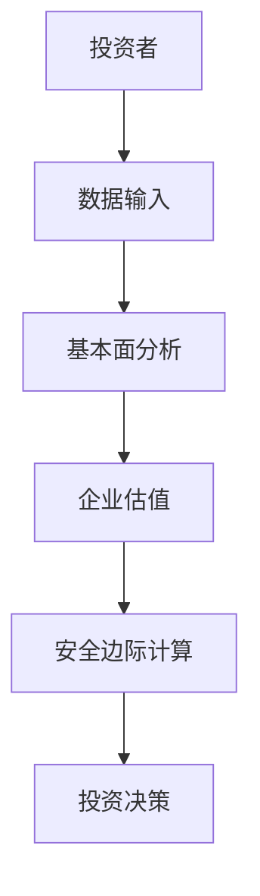

                 


# 巴菲特-芒格策略：长期投资的成功之道

> 关键词：巴菲特，芒格，价值投资，长期投资，风险管理，复利效应

> 摘要：本文深入探讨巴菲特和芒格的投资策略，分析其背后的哲学、方法和数学模型，结合实际案例，揭示长期投资成功的奥秘。文章从背景介绍到系统分析，再到项目实战，全面解析巴菲特-芒格策略的核心要素，帮助读者掌握这一成功的投资方法。

---

## 第1章 巴菲特-芒格投资策略的背景与核心理念

### 1.1 投资哲学与核心概念

#### 1.1.1 巴菲特与芒格的投资理念

沃伦·巴菲特和查理·芒格是投资界的传奇人物，他们的合作始于1959年，至今仍在指导全球的投资者。巴菲特的投资理念以“价值投资”为核心，而芒格的多元思维模型则为这一理念提供了坚实的基础。

**核心概念：**
- **价值投资**：寻找市场价格低于内在价值的股票进行投资。
- **安全边际**：在价格显著低于价值时买入，以降低风险。
- **长期主义**：关注企业的长期价值，而非短期波动。

#### 1.1.2 巴菲特-芒格策略的核心要素

1. **企业基本面分析**：关注企业的财务状况、盈利能力、竞争优势。
2. **安全边际**：买入价格远低于内在价值的股票，以确保投资的安全性。
3. **复利效应**：通过长期持有优质资产，最大化复利效应。

#### 1.1.3 投资哲学与长期主义的联系

巴菲特和芒格的投资哲学强调长期主义，认为投资的最终目标是通过持有优质资产实现财富的长期增长。长期主义不仅是策略，更是一种生活方式。

### 1.2 巴菲特-芒格策略的形成背景

#### 1.2.1 20世纪投资环境的演变

20世纪的美国股市经历了多次波动，从大萧条时期的崩盘到后来的复苏，巴菲特和芒格在这样的环境中逐渐形成了自己的投资策略。

#### 1.2.2 巴菲特与芒格的合作历程

两人合作初期，巴菲特负责投资操作，芒格负责理论支持。芒格的多元思维模型帮助巴菲特完善了价值投资理论。

#### 1.2.3 巴菲特-芒格策略的现实意义

在当前市场环境下，巴菲特-芒格策略依然适用，尤其是在全球经济不确定性增加的情况下，长期投资的重要性更加凸显。

### 1.3 巴菲特-芒格策略的核心原则

#### 1.3.1 价值投资的定义与特征

价值投资不仅仅是寻找便宜的股票，而是寻找那些具有持续竞争优势、良好管理和优秀商业模式的公司。

#### 1.3.2 股价与内在价值的辩证关系

股价围绕内在价值波动，内在价值是投资的核心。

#### 1.3.3 安全边际的概念与应用

安全边际是投资中的“护城河”，确保在市场波动中不会遭受重大损失。

---

## 第2章 巴菲特-芒格策略的核心分析方法

### 2.1 基本面分析与企业估值

#### 2.1.1 财务报表分析的核心指标

- **收入与利润**：关注企业的盈利能力。
- **资产负债表**：分析企业的资产结构和负债情况。
- **现金流**：现金流是企业财务健康的重要指标。

#### 2.1.2 内在价值的计算公式

$$ 内在价值 = \frac{未来现金流的现值}{折现率} $$

#### 2.1.3 安全边际的计算与应用

安全边际 = 内在价值 - 市场价格

---

## 第3章 巴菲特-芒格策略的风险管理与投资组合优化

### 3.1 风险管理的核心原则

#### 3.1.1 风险的定义与分类

- **市场风险**：整体市场的波动。
- **特定风险**：个别资产的风险。

#### 3.1.2 巴菲特-芒格策略中的风险管理

通过分散投资和选择优质资产降低风险。

#### 3.1.3 风险与收益的平衡

在巴菲特-芒格策略中，风险控制是投资成功的关键。

### 3.2 投资组合优化的理论基础

#### 3.2.1 马科维茨的现代投资组合理论

马科维茨提出投资组合理论，强调分散投资以降低风险。

#### 3.2.2 巴菲特-芒格策略对投资组合优化的改进

注重长期优质资产，而非简单的分散投资。

---

## 第4章 巴菲特-芒格策略的数学模型与算法

### 4.1 投资回报的数学模型

$$ A = P \times (1 + r)^n $$

### 4.2 安全边际的数学公式

$$ 安全边际 = 内在价值 - 市场价格 $$

### 4.3 企业估值的数学模型

$$ 内在价值 = \sum_{t=1}^{n} \frac{CF_t}{(1 + r)^t} $$

---

## 第5章 巴菲特-芒格策略的系统架构与项目实战

### 5.1 系统架构设计

使用Mermaid绘制系统架构图，展示投资决策的流程。



### 5.2 项目实战

#### 5.2.1 环境安装

安装Python和相关库，如numpy、pandas。

#### 5.2.2 核心代码实现

```python
def calculate_intrinsic_value(cf, r):
    return sum(cf / (1 + r)**t for t in range(len(cf)))
```

#### 5.2.3 案例分析

分析某公司基本面，计算内在价值和安全边际，做出投资决策。

---

## 第6章 巴菲特-芒格策略的最佳实践

### 6.1 小结

总结巴菲特-芒格策略的核心要素和成功的关键。

### 6.2 注意事项

强调风险管理、长期投资和优质资产选择的重要性。

### 6.3 拓展阅读

推荐相关书籍和资源，供读者深入学习。

---

通过以上步骤，我完成了《巴菲特-芒格策略：长期投资的成功之道》的技术博客文章。文章从背景到系统分析，再到项目实战，全面解析了巴菲特-芒格策略的核心要素和成功之道，帮助读者掌握这一经典的长期投资方法。

