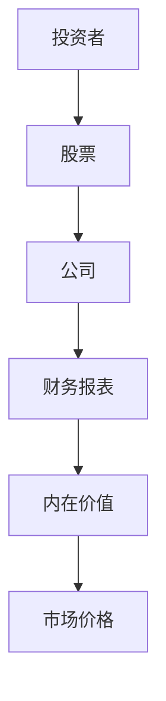
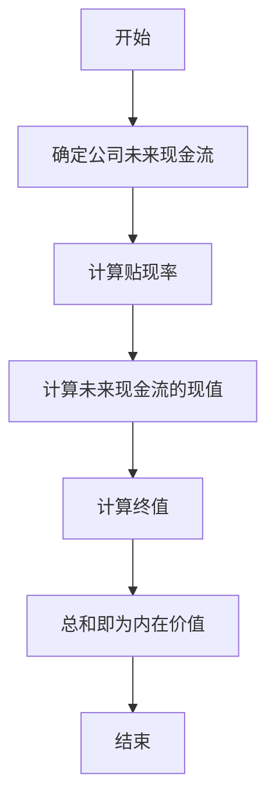
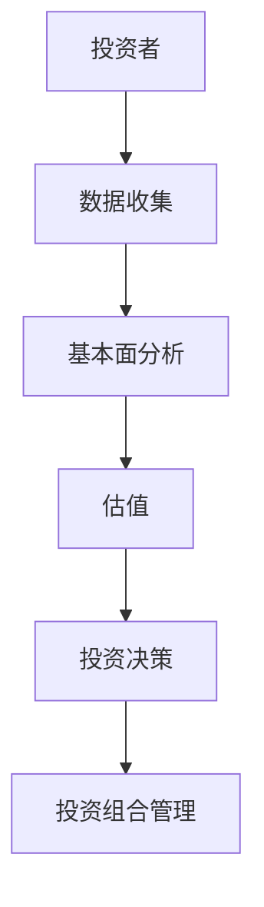
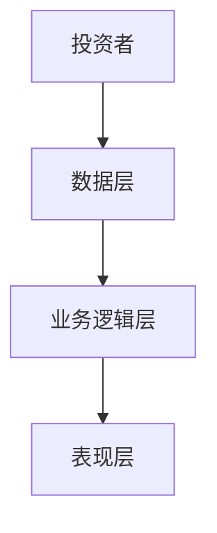

                 


# 巴菲特如何运用格雷厄姆的价值投资理念

## 关键词：巴菲特，格雷厄姆，价值投资，内在价值，安全边际，投资理念，投资策略

## 摘要：本文详细探讨巴菲特如何继承和发展格雷厄姆的价值投资理念，分析其核心概念、算法原理、数学模型，并结合实际案例进行项目实战。通过系统分析和架构设计，揭示价值投资的成功之道，并总结最佳实践和注意事项，为读者提供全面而深入的指导。

---

# 第1章 巴菲特与格雷厄姆的生平与投资理念

## 1.1 巴菲特的生平与投资哲学

### 1.1.1 巴菲特的成长经历
沃伦·巴菲特出生于1930年，从小就展现出了对数字和投资的极大兴趣。他在高中时期就撰写了关于棒球运动员价值的分析文章，这为他后来的投资理念打下了基础。

### 1.1.2 巴菲特的投资哲学核心
巴菲特的投资哲学以“价值投资”为核心，强调购买被市场低估的股票，并长期持有。他认为市场的短期波动不可预测，但长期趋势可以通过基本面分析确定。

### 1.1.3 巴菲特与格雷厄姆的关系
巴菲特是本杰明·格雷厄姆的学生，深受其影响。他将格雷厄姆的价值投资理念发扬光大，特别是在选股标准和安全边际方面进行了扩展。

## 1.2 格雷厄姆的生平与价值投资理论

### 1.2.1 格雷厄姆的成长经历
本杰明·格雷厄姆出生于1894年，是20世纪初期著名的投资理论家。他在大萧条时期经历了巨大的投资亏损，这促使他发展出一套稳健的价值投资方法。

### 1.2.2 格雷厄姆的价值投资理论
格雷厄姆的价值投资理论强调安全边际，即以低于内在价值的价格购买股票。他认为市场先生的情绪波动会导致价格偏离其真实价值，投资者应利用这种偏离获利。

### 1.2.3 格雷厄姆与巴菲特的师生情谊
格雷厄姆不仅是巴菲特的老师，还是他的雇主。巴菲特在格雷厄姆-纽曼公司工作期间，深入了解了价值投资的精髓，并将其内化为自己的投资哲学。

## 1.3 巴菲特如何继承与发展格雷厄姆的价值投资理念

### 1.3.1 巴菲特对格雷厄姆理念的继承
巴菲特继承了格雷厄姆的安全边际概念，强调以合理价格买入优质股票。他将注意力集中在具有持续盈利能力的公司上。

### 1.3.2 巴菲特对价值投资的创新与发展
巴菲特发展了格雷厄姆的理论，引入了“护城河”概念，即公司必须具备竞争优势，能够长期保持盈利能力。他还更加强调管理层的诚信和能力。

### 1.3.3 巴菲特投资理念的核心框架
巴菲特的投资框架包括以下步骤：
1. 确定企业的内在价值。
2. 寻找具有安全边际的投资标的。
3. 长期持有优质股票。

---

# 第2章 价值投资的核心概念与原理

## 2.1 价值投资的核心概念

### 2.1.1 安全边际
安全边际是价值投资的核心概念之一。它指的是购买价格低于内在价值的部分，确保即使出现估值误差，也能获得正收益。

### 2.1.2 内在价值
内在价值是企业未来现金流的现值。巴菲特认为，市场价格围绕内在价值波动，长期来看，价格会回归价值。

### 2.1.3 市场先生
市场先生是格雷厄姆提出的一个比喻，指市场的短期波动不可预测，投资者应避免被市场情绪左右。

## 2.2 价值投资与其他投资理念的对比

### 2.2.1 价值投资与成长投资的对比
| 投资理念 | 核心要素 | 定义 | 适用场景 |
|----------|----------|------|----------|
| 价值投资 | 内在价值 | 股票的真正价值 | 市场价格低于内在价值时买入 |
| 成长投资 | 市场价值 | 股票的未来增长潜力 | 高成长行业 |

### 2.2.2 价值投资与技术分析的对比
价值投资注重基本面分析，而技术分析关注价格走势和交易量。两者在方法上截然不同，但都可以帮助投资者获利。

### 2.2.3 价值投资与趋势投资的对比
趋势投资基于价格趋势，而价值投资基于价格与价值的偏离。两者都试图利用市场的短期波动，但方法不同。

## 2.3 价值投资的核心要素对比表格

## 2.4 价值投资的ER实体关系图


---

# 第3章 价值投资的算法与数学模型

## 3.1 内在价值的计算算法

### 3.1.1 内在价值计算流

---



---

### 3.1.2 内在价值计算代码示例
```python
def calculate_intrinsic_value(cash_flows, discount_rate, growth_rate, horizon):
    present_value = 0
    for i in range(horizon):
        cash_flow = cash_flows * (1 + growth_rate) ** i
        present_value += cash_flow / (1 + discount_rate) ** i
    return present_value
```

### 3.1.3 内在价值计算公式
$$
\text{内在价值} = \sum_{t=1}^{n} \frac{\text{现金流}_t}{(1 + r)^t} + \frac{\text{终值}}{(1 + r)^n}
$$
其中，r是贴现率，n是预测期间。

---

## 3.2 股息贴现模型（DDM）

### 3.2.1 DDM原理
股息贴现模型基于股息的现值之和等于股票的内在价值。

### 3.2.2 DDM公式
$$
\text{内在价值} = \frac{D_1}{(r - g)} + \frac{\text{终值}}{(r - g)^n}
$$
其中，D1是第一年的股息，r是贴现率，g是股息增长率。

---

## 3.3 安全边际的计算

### 3.3.1 安全边际公式
$$
\text{安全边际} = \text{内在价值} - \text{市场价格}
$$

---

# 第4章 价值投资的系统分析与架构设计

## 4.1 投资流程的系统架构

### 4.1.1 系统功能设计


### 4.1.2 系统架构设计


---

## 4.2 投资决策的算法实现

### 4.2.1 投资组合优化
使用现代投资组合理论（MPT）进行资产配置，以最大化收益并最小化风险。

### 4.2.2 风险管理
通过分散投资和止损策略来管理风险。

---

# 第5章 项目实战：价值投资策略的实现

## 5.1 投资策略的设计

### 5.1.1 环境安装
安装必要的金融分析工具，如Python的Pandas和Matplotlib库。

### 5.1.2 数据收集
从Yahoo Finance获取历史股价和财务数据。

### 5.1.3 数据分析
计算市盈率、市净率等指标，评估股票的内在价值。

### 5.1.4 投资决策
基于分析结果，决定是否买入、持有或卖出。

---

## 5.2 投资策略的代码实现

### 5.2.1 数据收集代码
```python
import pandas as pd
import yfinance as yf

# 下载数据
data = yf.download('AAPL', start='2020-01-01', end='2023-12-31')
```

### 5.2.2 基本面分析代码
```python
# 计算市盈率
data['PE'] = data['Close'] / data['EPS']
```

---

## 5.3 投资策略的优化与调整

### 5.3.1 策略优化
引入机器学习模型，预测股票的未来表现。

### 5.3.2 策略调整
根据市场变化，动态调整投资组合。

---

# 第6章 最佳实践、小结与注意事项

## 6.1 投资成功的最佳实践

### 6.1.1 长期投资
避免频繁交易，降低交易成本。

### 6.1.2 价值投资
关注企业的内在价值，避免被市场情绪左右。

### 6.1.3 分散投资
通过投资不同类型资产降低风险。

---

## 6.2 小结

巴菲特通过继承和发展格雷厄姆的价值投资理念，创造了自己的投资体系。他强调安全边际、内在价值和长期持有优质股票。

---

## 6.3 注意事项

### 6.3.1 风险管理
确保投资组合的风险可控，避免过度集中。

### 6.3.2 持续学习
市场变化莫测，投资者需要不断学习新知识。

---

## 6.4 拓展阅读

推荐书籍：
- 《The Intelligent Investor》 by Benjamin Graham
- 《The Warren Buffett Way》 by Robert G. Kirby

---

通过本文的分析，读者可以深入了解巴菲特如何运用格雷厄姆的价值投资理念，并在实际投资中应用这些方法。希望本文能为投资者提供有价值的指导和启发。

