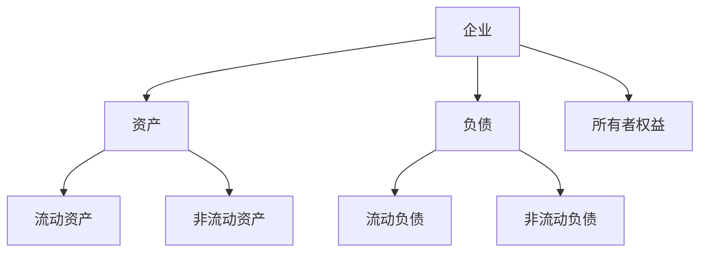
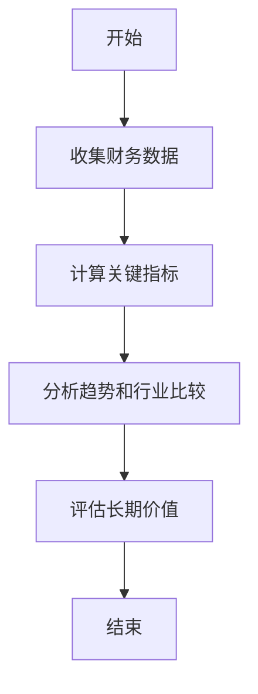
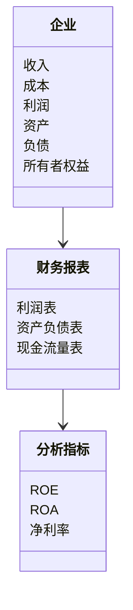
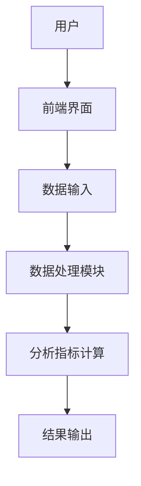
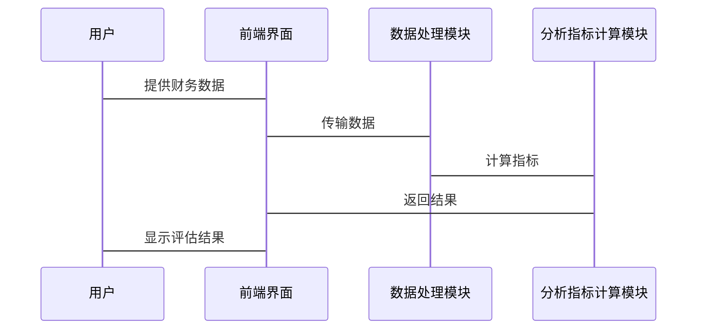

                 


# 巴菲特的'看穿'式分析：理解企业真实盈利能力

## 关键词：巴菲特，投资分析，盈利能力，财务分析，价值投资，ROE，ROA，企业评估

## 摘要：本文深入探讨巴菲特的“看穿”式分析方法，揭示其如何通过核心财务指标评估企业的真实盈利能力。从背景介绍、核心概念、算法原理到系统分析和项目实战，全面解析巴菲特的投资理念，帮助读者掌握企业内在价值的评估方法，从而做出明智的投资决策。

---

# 第一部分：巴菲特投资理念的背景与核心思想

## 第1章：巴菲特投资理念的背景

### 1.1 巴菲特投资理念的起源

#### 1.1.1 价值投资的定义与历史
价值投资是一种以低于公平价值的价格买入优质股票的投资策略，其核心在于寻找市场先生的错误定价。该理念由本杰明·格雷厄姆提出，强调安全边际和内在价值的计算。

#### 1.1.2 巴菲特对价值投资的贡献
巴菲特师承格雷厄姆，但发展了自己的投资策略，特别注重企业的长期竞争优势和管理层质量，提出了“护城河”概念，即企业在行业中的长期竞争优势。

#### 1.1.3 巴菲特投资理念的核心原则
1. **长期投资**：关注企业的长期盈利能力，而非短期市场波动。
2. **安全边际**：以低于内在价值的价格买入股票，降低投资风险。
3. **竞争优势**：寻找具有强大护城河的企业，确保长期稳定的收益。

### 1.2 巴菲特“看穿”式分析的背景

#### 1.2.1 传统财务分析的局限性
传统财务分析往往关注于短期财务数据，如季度利润和每股收益（EPS），而忽视了企业的长期盈利能力和发展潜力。这种分析方法容易被市场短期波动所迷惑，无法准确评估企业的内在价值。

#### 1.2.2 巴菲特分析方法的创新
巴菲特提出了一种更为全面的分析方法，通过深入研究企业的财务报表、行业地位和管理层质量，评估其长期盈利能力。这种方法被称为“看穿”式分析，旨在透过表面的财务数据，发现企业的真正价值。

#### 1.2.3 巴菲特分析方法的应用场景
适用于长期价值投资者，尤其是那些希望识别具有强大竞争优势和稳定盈利的企业。该方法特别适合分析那些在稳定行业中的龙头企业，如公用事业、消费品和金融服务业。

### 1.3 巴菲特分析方法的核心思想

#### 1.3.1 企业内在价值的定义
内在价值是企业未来现金流的现值，反映了企业在正常经营条件下的合理价格。计算内在价值的关键在于预测未来现金流和确定合适的折现率。

#### 1.3.2 盈利能力的衡量标准
巴菲特认为，衡量企业盈利能力的关键指标包括净资产收益率（ROE）、资产回报率（ROA）和股东权益回报率（ROE）。这些指标能够反映出企业在利用资产创造利润方面的效率。

#### 1.3.3 长期投资与股东价值创造
长期投资的核心在于寻找那些能够持续创造股东价值的企业。巴菲特强调，企业应具备稳定的盈利能力和强大的竞争优势，才能为股东创造长期价值。

## 第2章：巴菲特“看穿”式分析的核心概念与联系

### 2.1 核心概念原理

#### 2.1.1 企业内在价值的计算公式
$$
\text{内在价值} = \sum_{t=1}^{\infty} \frac{\text{现金流}_t}{(1 + r)^t}
$$
其中，r是折现率，现金流_t是第t年的现金流。

#### 2.1.2 盈利能力的多维度分析
盈利能力分析需要考虑企业的净利率、ROE、ROA等指标，以及这些指标背后的原因和趋势。

#### 2.1.3 财务报表分析的关键指标
关键指标包括：
- 净利润：企业税后利润，反映盈利能力。
- 营业收入：企业销售收入，反映市场地位。
- 资产负债率：企业财务健康状况的重要指标。

### 2.2 核心概念属性特征对比表格

| 指标 | 定义 | 重要性 | 计算公式 |
|------|------|--------|----------|
| ROE | 净利润 / 平均净资产 | 高 | $$\text{ROE} = \frac{\text{净利润}}{\text{平均净资产}}$$ |
| ROA | 净利润 / 平均资产总额 | 中 | $$\text{ROA} = \frac{\text{净利润}}{\text{平均资产总额}}$$ |
| 净利率 | 净利润 / 营业收入 | 高 | $$\text{净利率} = \frac{\text{净利润}}{\text{营业收入}}$$ |

### 2.3 ER实体关系图架构



---

## 第3章：巴菲特“看穿”式分析的算法原理

### 3.1 算法原理概述

#### 3.1.1 盈利能力分析的基本流程
1. 收集企业的财务数据，包括利润表、资产负债表和现金流量表。
2. 计算关键指标，如ROE、ROA和净利率。
3. 分析这些指标的趋势和行业比较，判断企业的盈利能力。
4. 结合企业的竞争优势和管理层质量，评估其长期价值。

#### 3.1.2 关键指标的计算方法
ROE的计算公式为：
$$
\text{ROE} = \frac{\text{净利润}}{\text{平均净资产}}
$$
ROA的计算公式为：
$$
\text{ROA} = \frac{\text{净利润}}{\text{平均资产总额}}
$$
净利率的计算公式为：
$$
\text{净利率} = \frac{\text{净利润}}{\text{营业收入}}
$$

#### 3.1.3 分析结果的判断标准
- ROE应高于行业平均水平，且稳定增长。
- 净利率应保持稳定，且高于竞争对手。
- 资产负债率应合理，避免过高。

### 3.2 算法流程图



### 3.3 核心指标计算公式

#### 净资产收益率（ROE）
$$
\text{ROE} = \frac{\text{净利润}}{\text{平均净资产}}
$$

#### 资产回报率（ROA）
$$
\text{ROA} = \frac{\text{净利润}}{\text{平均资产总额}}
$$

#### 股东权益回报率（ROE）
$$
\text{ROE} = \frac{\text{净利润}}{\text{股东权益}}
$$

---

## 第4章：系统分析与架构设计方案

### 4.1 问题场景介绍
假设我们想要评估一家企业的盈利能力，我们需要分析其财务报表，计算关键指标，并结合行业趋势和企业竞争优势进行综合判断。

### 4.2 项目介绍
本项目旨在开发一个基于巴菲特“看穿”式分析的企业盈利能力评估系统，帮助投资者快速识别具有长期盈利能力的企业。

### 4.3 系统功能设计

#### 4.3.1 领域模型


#### 4.3.2 系统架构设计


### 4.4 系统接口设计
系统接口包括数据输入接口和结果输出接口。数据输入接口接收企业的财务数据，结果输出接口提供分析指标和评估结果。

### 4.5 系统交互设计


---

## 第5章：项目实战

### 5.1 环境安装
需要安装Python和相关库，如Pandas、NumPy和Matplotlib。

### 5.2 核心实现源代码

#### 5.2.1 数据获取
```python
import pandas as pd

# 假设我们有一个企业的财务数据CSV文件
data = pd.read_csv('financial_data.csv')
```

#### 5.2.2 指标计算
```python
# 计算ROE
net_profit = data['净利润'].iloc[-1]
average_equity = (data['所有者权益'].iloc[-1] + data['所有者权益'].iloc[-2]) / 2
roe = net_profit / average_equity

# 计算ROA
net_asset = data['资产'].iloc[-1]
average_asset = (data['资产'].iloc[-1] + data['资产'].iloc[-2]) / 2
roa = net_asset / average_asset
```

#### 5.2.3 结果分析
```python
print(f"ROE: {roe:.2f}%")
print(f"ROA: {roa:.2f}%")
```

### 5.3 案例分析
以苹果公司为例，分析其2020年和2021年的财务数据，计算ROE和ROA，评估其盈利能力。

---

## 第6章：总结与展望

### 6.1 最佳实践 tips
- 选择具有稳定ROE和ROA的企业。
- 结合行业趋势和企业竞争优势进行综合判断。

### 6.2 小结
巴菲特的“看穿”式分析方法通过深入研究企业的财务数据和行业地位，帮助投资者识别具有长期盈利能力的企业。

### 6.3 注意事项
- 数据来源必须可靠。
- 分析时要考虑企业的管理层质量和竞争优势。
- 长期投资需要耐心和信心。

### 6.4 拓展阅读
- 《巴菲特致股东的信》
- 《投资中最简单的事》

---

# 结语

通过本文的详细讲解，读者可以掌握巴菲特的“看穿”式分析方法，理解企业真实盈利能力的评估过程，并将其应用于实际投资中。这种方法不仅适用于个人投资者，也适合企业管理人员和财务分析师。希望本文能为您的投资决策提供有价值的参考。

