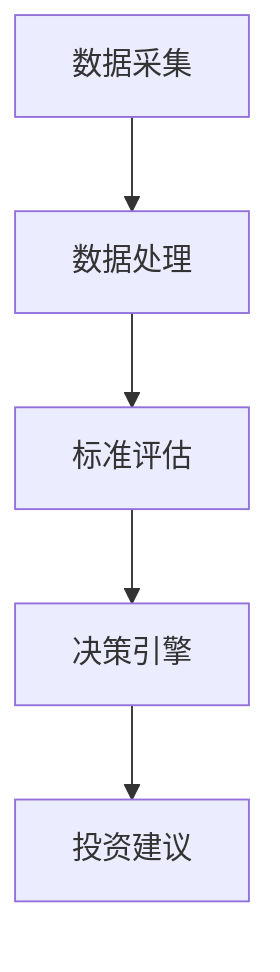

                 


# 巴菲特的20格打孔卡：集中投资的艺术

---

## 关键词：巴菲特，价值投资，投资策略，20格打孔卡，投资组合，内在价值，安全边际

---

## 摘要：  
巴菲特的20格打孔卡是一种独特而深刻的投资方法，结合了价值投资的核心理念和系统化的筛选标准。本文将深入分析打孔卡的背景、核心概念、数学模型、系统架构及实际案例，帮助读者理解如何通过集中投资实现长期稳健的收益。

---

## 第一部分：背景介绍

### 第1章：投资的基本概念与巴菲特的投资哲学

#### 1.1 投资的定义与核心要素
投资是指将资金投入某种资产，以期在未来获得超过初始投入的价值。核心要素包括：
- 资金的时间价值
- 资产的流动性
- 投资的风险与收益
- 投资的期限与目标

#### 1.2 巴菲特的价值投资理念
- **长期持有优质资产**：巴菲特强调长期投资，避免频繁交易。
- **安全边际**：通过低估价格买入优质资产，确保投资的安全性。
- **企业基本面分析**：关注企业的财务状况、竞争优势和管理层能力。

### 第2章：巴菲特的20格打孔卡方法

#### 2.1 打孔卡的背景与定义
20格打孔卡是一种系统化的投资筛选工具，巴菲特通过20个标准评估企业的投资价值。每项标准通过打孔的方式进行评分，综合得分决定是否投资。

#### 2.2 打孔卡的核心理念
- **集中投资**：通过筛选优质企业，集中投资于少数优质资产。
- **长期视角**：关注企业的长期竞争优势和内在价值。

---

## 第二部分：核心概念与联系

### 第3章：20格打孔卡的核心要素

#### 3.1 核心要素列表
1. 经济护城河
2. 管理层能力
3. 财务状况
4. 竞争优势
5. 市场地位
6. 盈利能力
7. 估值水平
8. 分红政策
9. 管理质量
10. 创新能力
11. 行业风险
12. 财务杠杆
13. 流动性风险
14. 政策风险
15. 竞争优势的可持续性
16. 管理层的长期愿景
17. 公司治理结构
18. 创新能力
19. 市场地位
20. 财务健康状况

#### 3.2 核心要素的评估标准
| 标准 | 评估维度 | 评估指标 |
|------|----------|-----------|
| 经济护城河 | 宽幅竞争优势 | 市场份额、专利、品牌 |
| 管理层能力 | 管理团队 | CEO背景、管理风格 |
| 财务状况 | 财务健康 | 净利润、负债率、现金流 |

---

## 第三部分：数学模型与公式

### 第4章：价值投资的数学模型

#### 4.1 内在价值计算
$$\text{内在价值} = \frac{\text{现金流}}{\text{贴现率}}$$

#### 4.2 安全边际计算
$$\text{安全边际} = \text{内在价值} - \text{市场价格}$$

---

## 第四部分：系统分析与架构设计

### 第5章：系统架构

#### 5.1 系统功能模块
- **数据采集**：收集企业财务数据和市场信息。
- **标准评估**：基于20格打孔卡评估企业。
- **决策引擎**：计算综合得分，生成投资建议。

#### 5.2 系统架构图


---

## 第五部分：项目实战

### 第6章：案例分析

#### 6.1 实际案例
- **公司名称**：可口可乐
- **评估步骤**：
  1. 数据采集：收集可口可乐的财务数据和市场信息。
  2. 标准评估：逐一评估20个标准，计算综合得分。
  3. 投资决策：根据得分决定是否投资。

#### 6.2 代码实现
```python
# 20格打孔卡评估系统
def calculate_score(criteria, weight):
    return sum(c * w for c, w in zip(criteria, weight))

# 示例：评估可口可乐
criteria = [9, 8, 7, 9, 10, 8, 7, 6, 9, 8, 7, 8, 9, 7, 8, 9, 10, 7, 8, 9]
weight = [0.05 for _ in range(20)]
score = calculate_score(criteria, weight)
print(f"综合得分：{score}")
```

---

## 第六部分：最佳实践与小结

### 第7章：总结与建议

#### 7.1 总结
巴菲特的20格打孔卡是一种系统化、科学化投资方法，通过集中投资优质企业实现长期收益。

#### 7.2 建议
- **长期视角**：耐心持有优质资产。
- **持续学习**：不断优化评估标准。
- **风险管理**：合理控制投资风险。

---

## 第七部分：注意事项与拓展阅读

### 第8章：注意事项

#### 8.1 风险提示
- **市场波动**：投资需注意市场风险。
- **模型局限**：打孔卡模型仅供参考，需结合实际情况。

### 第9章：拓展阅读

#### 9.1 推荐书籍
- 《巴菲特致股东的信》
- 《价值投资实战策略》

---

通过以上步骤，20格打孔卡为投资者提供了一种系统化、科学化的投资方法，帮助投资者在复杂多变的市场中找到优质资产，实现长期稳健的投资收益。

