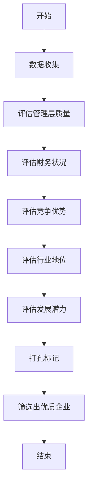
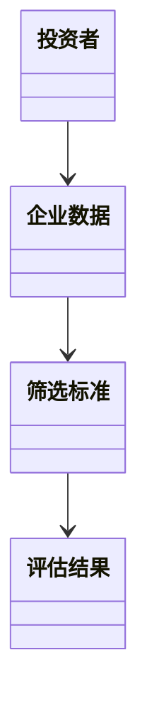
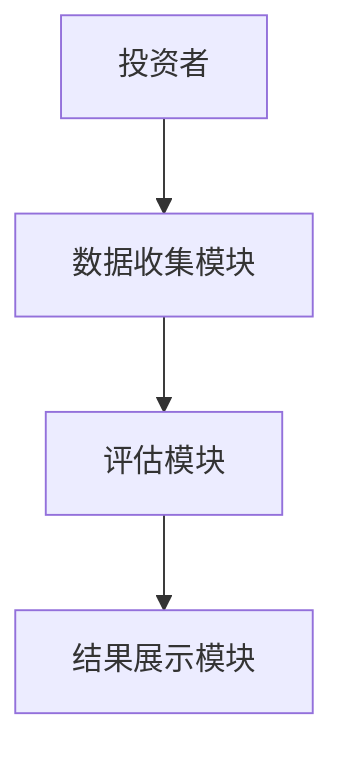
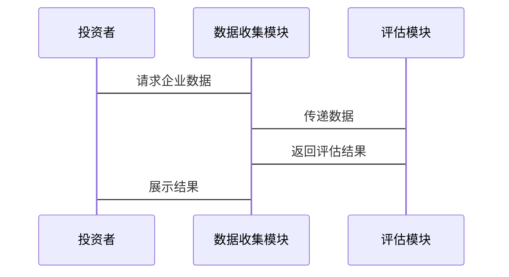

                 


# 巴菲特的20格打孔卡：集中投资策略

**关键词**：巴菲特，投资策略，20格打孔卡，价值投资，财务分析，风险管理

**摘要**：本文详细介绍了巴菲特的20格打孔卡投资策略，从基本概念到实际应用，结合逻辑推理和数据分析，帮助读者理解如何通过集中投资实现财富增值。

---

## 第一部分：投资基础知识

### 第1章：投资的基本概念

#### 1.1 投资的基本定义
投资是将资源（如资金）投入到某个项目或企业，以期获得未来收益的行为。投资的核心在于资产的配置和风险的控制。

#### 1.2 投资的分类与特点
投资可以分为股票、债券、房地产等多种形式，每种投资都有其特点和风险。股票投资具有较高的风险和回报潜力，而债券则相对保守。

#### 1.3 投资的基本原则
- 分散投资：避免将所有资金投入单一资产。
- 长期视角：投资不是短期交易，而是长期价值的积累。
- 风险控制：评估并控制投资中的潜在风险。

### 第2章：巴菲特的投资理念

#### 2.1 巴菲特的投资哲学
巴菲特强调价值投资，即购买具有持续竞争优势、良好管理层和稳定财务状况的企业股票。

#### 2.2 巴菲特的价值投资理论
价值投资的核心在于寻找市场价格低于内在价值的股票。巴菲特定义了五项筛选标准：管理层质量、财务状况、竞争优势、行业地位和发展潜力。

#### 2.3 巴菲特的成功案例分析
通过分析可口可乐和美国运通等案例，展示巴菲特如何通过长期持有优质企业实现财富增长。

---

## 第二部分：20格打孔卡的核心概念

### 第3章：20格打孔卡的结构与原理

#### 3.1 20格打孔卡的定义
20格打孔卡是巴菲特设计的筛选工具，用于评估企业的各项指标，确保投资标的符合长期价值投资的标准。

#### 3.2 20格打孔卡的核心要素
- 管理层质量：诚实、有能力。
- 财务状况：ROE高、负债低。
- 企业竞争优势：护城河明显。
- 行业地位：龙头地位。
- 发展潜力：增长空间大。

#### 3.3 20格打孔卡的使用方法
通过打孔标记企业是否符合各项标准，最终筛选出少数优质企业。

### 第4章：20格打孔卡的详细分析

#### 4.1 管理层质量评估
评估管理层的诚信和能力，确保企业长期健康发展。

#### 4.2 财务状况分析
分析ROE、毛利率等指标，确保企业财务健康。

#### 4.3 企业竞争优势分析
识别企业的护城河，如专利、品牌和成本优势。

#### 4.4 行业地位评估
选择行业龙头，确保企业在行业中的主导地位。

#### 4.5 发展潜力评估
评估企业的增长空间和市场前景。

---

## 第三部分：20格打孔卡的算法与数学模型

### 第5章：20格打孔卡的筛选算法

#### 5.1 筛选算法的定义
通过多维度指标筛选出符合投资标准的企业。

#### 5.2 筛选算法的步骤
1. 数据收集：收集目标企业的各项数据。
2. 标准评估：逐一评估各项指标。
3. 打孔标记：符合标准打孔，最终筛选出优质企业。

#### 5.3 筛选算法的流程图（Mermaid）



### 第6章：数学模型与公式

#### 6.1 常用财务指标公式
- ROE（净资产收益率）：
  $$ROE = \frac{净利润}{平均股东权益}$$
- 毛利率：
  $$毛利率 = \frac{（营业收入 - 营业成本）}{营业收入} \times 100\%$$

#### 6.2 财务指标的权重分配
根据重要性分配权重，ROE和毛利率占比较高。

#### 6.3 数学模型的实际应用
通过公式计算企业财务指标，评估是否符合筛选标准。

---

## 第四部分：系统分析与架构设计

### 第7章：系统功能设计

#### 7.1 问题场景介绍
设计一个系统，帮助投资者快速筛选出优质企业。

#### 7.2 系统功能模块划分
- 数据收集模块：收集企业数据。
- 筛选评估模块：评估各项指标。
- 结果展示模块：展示筛选结果。

#### 7.3 领域模型类图（Mermaid）



### 第8章：系统架构设计

#### 8.1 系统架构图（Mermaid）



#### 8.2 系统接口设计
- 数据接口：获取企业数据。
- 评估接口：返回筛选结果。

#### 8.3 系统交互（Mermaid）



---

## 第五部分：项目实战

### 第9章：项目实战分析

#### 9.1 环境安装
安装必要的工具和库，如Python、Pandas等。

#### 9.2 核心实现代码

```python
import pandas as pd

def calculate_roe(net_profit, avg_equity):
    return net_profit / avg_equity

data = pd.read_csv('企业数据.csv')
data['ROE'] = calculate_roe(data['净利润'], data['平均股东权益'])
data['毛利率'] = (data['营业收入'] - data['营业成本']) / data['营业收入'] * 100
# 筛选条件：ROE > 15%，毛利率 > 20%
筛选结果 = data[(data['ROE'] > 15) & (data['毛利率'] > 20)]
print(筛选结果)
```

#### 9.3 数据分析与可视化

```python
import matplotlib.pyplot as plt

筛选结果['行业'] = data['行业']
行业分布 = 筛选结果['行业'].value_counts()
plt.bar(行业分布.index, 行业分布.values)
plt.title('行业分布')
plt.show()
```

#### 9.4 实际案例分析
以具体企业为例，展示如何应用20格打孔卡进行筛选。

#### 9.5 项目小结
总结项目成果，分析存在的问题和改进空间。

---

## 第六部分：总结与建议

### 第10章：总结与建议

#### 10.1 小结
20格打孔卡是一种有效的投资工具，帮助投资者筛选出优质企业，实现长期价值投资。

#### 10.2 注意事项
- 定期更新数据，及时调整投资组合。
- 风险控制，避免过度集中。

#### 10.3 拓展阅读
建议阅读巴菲特的书籍，深入学习价值投资理论。

---

通过以上步骤，20格打孔卡的应用将帮助投资者更系统地进行投资决策，实现财富的长期增长。

