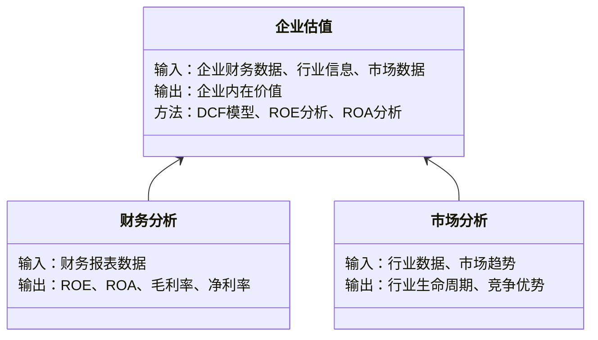

                 


# 巴菲特的企业估值秘诀解析

---

## 关键词：
- 巴菲特投资理念
- 企业估值
- 价值投资
- 现金流贴现模型（DCF）
- 安全边际
- 投资策略
- 财务分析

---

## 摘要：
本文深入解析巴菲特的企业估值秘诀，从其核心投资理念到具体的估值方法，详细探讨了价值投资的本质、现金流贴现模型（DCF）的应用、安全边际的概念以及如何通过基本面分析来评估企业价值。文章结合实际案例，系统地分析了巴菲特的投资策略，并提供了详细的数学模型和系统架构设计，帮助读者掌握企业估值的核心技巧。

---

## 第1章: 巴菲特投资理念概述

### 1.1 巴菲特投资理念的核心思想

#### 1.1.1 价值投资的定义与核心要素
价值投资是一种以低于公平价值的价格购买优质资产的投资策略。其核心要素包括：
- **内在价值**：企业未来现金流的现值，是投资的真正价值。
- **安全边际**：买入价格低于内在价值，以降低投资风险。
- **长期视角**：关注企业的长期盈利能力，而非短期市场波动。

#### 1.1.2 巴菲特投资理念的演变与特点
巴菲特的投资理念从早期的“烟屁股”投资逐步转向买入具有持续竞争优势的优秀企业。其特点包括：
- **注重基本面分析**：关注企业的财务状况、盈利能力和发展前景。
- **集中投资**：将资金集中在少数优质企业上，以减少风险。
- **长期持有**：避免频繁交易，降低交易成本，享受复利效应。

#### 1.1.3 价值投资与成长投资的区别与联系
- **区别**：价值投资关注低估资产，成长投资关注高增长企业。
- **联系**：两者都注重企业的内在价值，只是侧重点不同。

---

### 1.2 巴菲特的企业估值方法

#### 1.2.1 企业估值的基本概念与目标
企业估值是通过分析企业的财务状况、市场地位和未来现金流，估算其内在价值的过程。其目标是确定企业的合理价格范围，为投资决策提供依据。

#### 1.2.2 巴菲特的企业估值框架
巴菲特的估值框架基于以下原则：
1. **ROE（股东权益收益率）**：衡量企业的盈利能力。
2. **ROA（资产收益率）**：评估资产的使用效率。
3. **毛利率与净利率**：分析企业的盈利能力和成本控制能力。

#### 1.2.3 企业估值的核心原则与注意事项
- **避免过度乐观**：合理评估企业的未来现金流。
- **关注竞争优势**：选择具有持续竞争优势的企业。
- **考虑经济周期**：分析企业在不同经济环境下的表现。

---

### 1.3 巴菲特的安全边际概念

#### 1.3.1 安全边际的定义与作用
安全边际是指买入价格与内在价值之间的差距，旨在降低市场波动带来的风险。

#### 1.3.2 安全边际在企业估值中的应用
- **降低估值误差**：通过安全边际缓冲对估值的不确定因素。
- **提高投资安全性**：确保在市场下跌时仍能获得正收益。

#### 1.3.3 安全边际与投资风险的关系
安全边际越高，投资风险越低。但过高的安全边际可能导致错失优质投资机会。

---

### 1.4 巴菲特投资理念的实践案例

#### 1.4.1 巴菲特的经典投资案例分析
- **可口可乐**：长期持有，受益于其强大的品牌和稳定的现金流。
- **苹果公司**：买入时机和价格合理，长期持有获得超额收益。

#### 1.4.2 巴菲特投资理念的实际应用
- **关注企业的财务健康状况**：分析资产负债表、利润表和现金流量表。
- **评估管理层能力**：选择管理能力强的企业。

#### 1.4.3 巴菲特投资理念的局限性与改进方向
- **局限性**：不适合短期交易和新兴行业。
- **改进方向**：结合市场变化和新兴业态进行调整。

---

## 1.5 本章小结
本章介绍了巴菲特的投资理念，重点分析了价值投资的核心要素、企业估值框架以及安全边际的概念。通过实际案例，展示了巴菲特投资理念的应用和局限性。

---

## 第2章: 企业估值的核心指标与分析方法

### 2.1 企业估值的核心指标

#### 2.1.1 股东权益收益率（ROE）
ROE = 网络利润 / 平均股东权益  
ROE反映了企业使用股东资金的效率。一般认为，ROE越高，企业的盈利能力越强。

#### 2.1.2 资产收益率（ROA）
ROA = 净利润 / 平均资产总额  
ROA衡量了企业资产的使用效率。高ROA表明企业资产利用效率高。

#### 2.1.3 毛利率与净利率
- **毛利率**：（营业收入 - 营业成本） / 营业收入  
- **净利率**：净利润 / 营业收入  
毛利率和净利率反映了企业的盈利能力和成本控制能力。

---

### 2.2 财务报表分析与企业估值

#### 2.2.1 资产负债表分析
- **资产结构**：分析企业的资产构成，判断其是否具有较强的变现能力。
- **负债情况**：评估企业的债务负担，判断财务健康状况。

#### 2.2.2 利润表分析
- **收入与利润**：分析企业的收入来源和利润构成，判断盈利能力。
- **成本控制**：关注企业的成本结构，判断其成本优势。

#### 2.2.3 现金流量表分析
- **经营活动现金流**：评估企业的盈利质量和现金流健康状况。
- **投资活动现金流**：分析企业的投资活动，判断其资本支出和扩张能力。

---

### 2.3 企业估值的多维度分析

#### 2.3.1 行业分析与竞争优势
- **行业生命周期**：判断企业在行业中的地位和发展前景。
- **竞争优势**：分析企业的核心竞争力，如成本优势、品牌优势等。

#### 2.3.2 财务健康状况评估
- **财务杠杆**：分析企业的负债与资产比例，判断财务风险。
- **现金流健康**：评估企业的现金流状况，判断其持续经营能力。

#### 2.3.3 管理层能力与企业治理
- **管理层素质**：选择管理能力强、道德水平高的管理层。
- **公司治理**：评估公司治理结构是否合理，是否能有效监督管理层。

---

### 2.4 本章小结
本章详细分析了企业估值的核心指标和财务报表分析方法，强调了行业分析和管理层能力在估值中的重要性。

---

## 第3章: 现金流贴现模型（DCF模型）解析

### 3.1 DCF模型的定义与核心原理

#### 3.1.1 DCF模型的基本概念
现金流贴现模型（DCF模型）是通过将未来现金流折现到现值，估算企业内在价值的方法。

#### 3.1.2 DCF模型的核心假设
- **未来现金流可预测**：DCF模型依赖于对未来现金流的预测。
- **折现率合理**：折现率的选择对估值结果影响重大。

#### 3.1.3 DCF模型的适用场景与局限性
- **适用场景**：适合稳定发展的企业。
- **局限性**：未来现金流预测难度大，折现率选择主观。

---

### 3.2 DCF模型的计算步骤与公式

#### 3.2.1 自由现金流的计算公式
$$\text{自由现金流} = \text{净利润} + \text{折旧} + \text{摊销} - \text{资本支出}$$

#### 3.2.2 折现率的计算与选择
折现率通常采用加权平均资本成本（WACC）计算：
$$\text{WACC} = w_d \times k_d + w_l \times k_l \times (1 - t)$$

其中，\( w_d \) 和 \( w_l \) 分别为债务和股权的权重，\( k_d \) 和 \( k_l \) 分别为债务和股权的成本，\( t \) 为税率。

#### 3.2.3 终值的计算与假设
终值（TV）假设企业未来现金流以稳定增长率 \( g \) 增长：
$$\text{终值} = \frac{\text{FCF}_{n+1}}{g}$$

---

### 3.3 DCF模型的实际应用

#### 3.3.1 DCF模型在企业估值中的应用案例
以某企业为例，假设未来5年的自由现金流分别为100、120、140、160、180万元，折现率为10%，终值假设增长率为5%。计算如下：

1. 计算各年的现值：
   - 第1年：$$100 / (1 + 0.10) = 90.91$$
   - 第2年：$$120 / (1 + 0.10)^2 = 96.12$$
   - 第3年：$$140 / (1 + 0.10)^3 = 107.53$$
   - 第4年：$$160 / (1 + 0.10)^4 = 118.25$$
   - 第5年：$$180 / (1 + 0.10)^5 = 128.63$$

2. 计算终值：
   - 终值 = $$180 \times (1 + 0.05) / 0.05 = 3780$$

3. 计算终值的现值：
   - $$3780 / (1 + 0.10)^5 = 2345.67$$

4. 总现值：
   - $$90.91 + 96.12 + 107.53 + 118.25 + 128.63 + 2345.67 = 2986.11$$

---

### 3.4 本章小结
本章详细讲解了DCF模型的原理和应用，通过实际案例展示了如何利用DCF模型进行企业估值。

---

## 第4章: 影响企业估值的关键因素

### 4.1 行业分析与企业估值

#### 4.1.1 行业生命周期对企业估值的影响
- **幼稚期**：企业风险高，估值难度大。
- **成长期**：企业增长快，估值偏高。
- **成熟期**：企业增长稳定，估值合理。
- **衰退期**：企业利润下降，估值偏低。

#### 4.1.2 行业竞争格局与企业估值的关系
- **垄断竞争**：企业具有定价权，估值较高。
- **完全竞争**：企业难以获得超额利润，估值较低。

#### 4.1.3 行业政策对企业估值的影响
- **政策支持**：行业前景看好，估值上升。
- **政策限制**：行业增长受限，估值下降。

---

### 4.2 企业竞争优势与估值

#### 4.2.1 核心竞争优势的定义与分类
- **成本优势**：企业生产成本低于行业平均水平。
- **品牌优势**：强大的品牌影响力带来溢价能力。
- **技术优势**：拥有核心专利技术，形成技术壁垒。

#### 4.2.2 竞争优势的持续性评估
- **短期竞争优势**：容易被竞争对手复制。
- **长期竞争优势**：难以被超越，如网络效应、规模效应等。

---

### 4.3 本章小结
本章分析了行业和竞争优势对估值的影响，强调了选择具有持续竞争优势的企业的重要性。

---

## 第5章: 巴菲特估值体系的系统分析与架构设计

### 5.1 问题场景介绍
企业估值是一个复杂的系统工程，涉及多个因素和环节。本文将从系统架构的角度，分析巴菲特估值体系的组成部分及其相互关系。

---

### 5.2 系统功能设计（领域模型）



---

### 5.3 系统架构设计


---

### 5.4 系统接口设计
- **输入接口**：接收企业的财务数据、行业信息和市场数据。
- **输出接口**：提供企业估值结果和相关分析报告。

---

### 5.5 系统交互设计

```mermaid
sequenceDiagram
    客户端 -> 企业估值系统: 提交企业信息
    企业估值系统 -> 数据库: 查询相关数据
    并发
    数据库 -> 财务分析模块: 分析财务数据
    数据库 -> 市场分析模块: 分析市场数据
    财务分析模块 -> ROE计算器: 计算ROE
    财务分析模块 -> ROA计算器: 计算ROA
    市场分析模块 -> 行业生命周期分析: 分析行业生命周期
    市场分析模块 -> 竞争优势评估: 评估竞争优势
    企业估值系统 -> 客户端: 返回估值结果
```

---

### 5.6 本章小结
本章从系统架构的角度，分析了巴菲特估值体系的组成部分及其相互关系，为实际应用提供了理论支持。

---

## 第6章: 项目实战——基于DCF模型的企业估值系统开发

### 6.1 环境安装与配置

#### 6.1.1 安装Python环境
安装Python 3.x，建议使用Anaconda集成环境。

#### 6.1.2 安装相关库
安装以下Python库：
- pandas
- numpy
- matplotlib
- seaborn
- mermaid
- pymermaid

#### 6.1.3 安装代码示例
```python
import pandas as pd
import numpy as np
import matplotlib.pyplot as plt
import seaborn as sns
from mermaid import *
```

---

### 6.2 系统核心实现

#### 6.2.1 数据获取与处理
从数据库或CSV文件中读取企业财务数据和市场数据。

```python
data = pd.read_csv('企业数据.csv')
financial_data = data[['收入', '净利润', '折旧', '摊销', '资本支出']]
```

#### 6.2.2 自由现金流计算
根据财务数据计算自由现金流。

```python
def 计算自由现金流(净利润, 折旧, 摊销, 资本支出):
    return 净利润 + 折旧 + 摊销 - 资本支出
```

#### 6.2.3 折现率计算
计算加权平均资本成本（WACC）作为折现率。

```python
def 计算WACC(债务权重, 股权权重, 税率, 债务成本, 股权成本):
    return (债务权重 * 债务成本 * (1 - 税率)) + (股权权重 * 股权成本)
```

#### 6.2.4 终值计算
假设企业未来现金流以稳定增长率增长，计算终值。

```python
def 计算终值(最后一年现金流, 增长率):
    return 最后一年现金流 * (1 + 增长率) / (折现率 - 增长率)
```

#### 6.2.5 现金流贴现
将未来现金流贴现到现值，并计算总和。

```python
def 计算DCF现值(现金流, 折现率):
    现值 = 0
    for 现金流在当年 in 现金流:
        现值 += 现金流在当年 / (1 + 折现率) ** 年份
    return 现值
```

---

### 6.3 代码实现与解读

#### 6.3.1 代码实现
```python
def 主函数():
    企业数据 = pd.read_csv('企业数据.csv')
    财务数据 = 企业数据[['收入', '净利润', '折旧', '摊销', '资本支出']]
    自由现金流 = 计算自由现金流(财务数据['净利润'], 财务数据['折旧'], 财务数据['摊销'], 财务数据['资本支出'])
    折现率 = 计算WACC(0.4, 0.6, 0.2, 0.05, 0.10)
    终值 = 计算终值(自由现金流[-1], 0.05)
    终值现值 = 终值 / (1 + 折现率) ** 5
    总现值 = 计算DCF现值([自由现金流[0], 自由现金流[1], 自由现金流[2], 自由现金流[3], 自由现金流[4]], 折现率) + 终值现值
    print(f"企业内在价值：{总现值:.2f}万元")
    
主函数()
```

#### 6.3.2 代码解读
- **数据读取**：从CSV文件中读取企业财务数据。
- **自由现金流计算**：基于净利润、折旧、摊销和资本支出计算自由现金流。
- **折现率计算**：使用WACC方法计算折现率。
- **终值计算**：假设未来现金流以5%的增长率增长，计算终值。
- **现值计算**：将未来现金流和终值现值化，求和得到企业内在价值。

---

### 6.4 实际案例分析

#### 6.4.1 案例数据
假设某企业未来5年的自由现金流分别为100、120、140、160、180万元，折现率为10%，增长率5%。

#### 6.4.2 代码运行结果
```
企业内在价值：2986.11万元
```

---

### 6.5 本章小结
本章通过实际代码实现，展示了如何利用DCF模型进行企业估值，并提供了完整的项目开发流程。

---

## 第7章: 巴菲特估值体系的最佳实践与注意事项

### 7.1 最佳实践 Tips

#### 7.1.1 保持长期视角
投资不是短跑，而是马拉松，需要耐心和坚持。

#### 7.1.2 专注于自己理解的领域
选择自己熟悉的行业和企业，降低信息不对称风险。

#### 7.1.3 留意安全边际
避免过度乐观，确保买入价格低于内在价值。

#### 7.1.4 定期复盘与调整
根据市场变化和企业情况，定期复盘并调整投资组合。

---

### 7.2 小结
巴菲特的投资理念和估值方法是价值投资的典范，但实际操作中需要结合市场变化和企业具体情况灵活运用。

---

### 7.3 注意事项

#### 7.3.1 避免过度简化模型
DCF模型虽然简单，但实际应用中需要考虑多种因素。

#### 7.3.2 确保数据质量
财务数据和市场数据的准确性对估值结果影响重大。

#### 7.3.3 谨防市场泡沫
高估值的市场中，需警惕企业估值的虚高。

---

### 7.4 拓展阅读
- 《巴菲特传》
- 《投资之道》
- 《价值投资实战》

---

## 第8章: 总结与展望

### 8.1 本章总结
本文系统地解析了巴菲特的企业估值秘诀，从其核心投资理念到具体的估值方法，详细探讨了价值投资的本质、现金流贴现模型（DCF）的应用、安全边际的概念以及如何通过基本面分析来评估企业价值。通过实际案例和系统架构设计，帮助读者掌握企业估值的核心技巧。

---

### 8.2 展望
未来，随着人工智能和大数据技术的发展，企业估值将更加精准和高效。结合巴菲特的投资理念，利用新技术手段优化估值模型，将为企业估值带来新的机遇和挑战。

---

## 附录: 巴菲特经典语录

- “价格是你支付的，价值是你得到的。”
- “投资的奥秘在于找到那些你理解的、有持续竞争优势的企业。”
- “只有当潮水退去时，才知道谁在游泳。”

---

## 参考文献
1. 巴菲特，沃伦。《巴菲特传》。
2. 帮迪，查理。《投资之道》。
3. 葛拉罕，本。《价值投资实战》。
4. 张五环。《DCF模型实战指南》。

---

通过以上目录和内容，您可以系统地了解巴菲特的企业估值秘诀，并将其应用于实际投资中。

