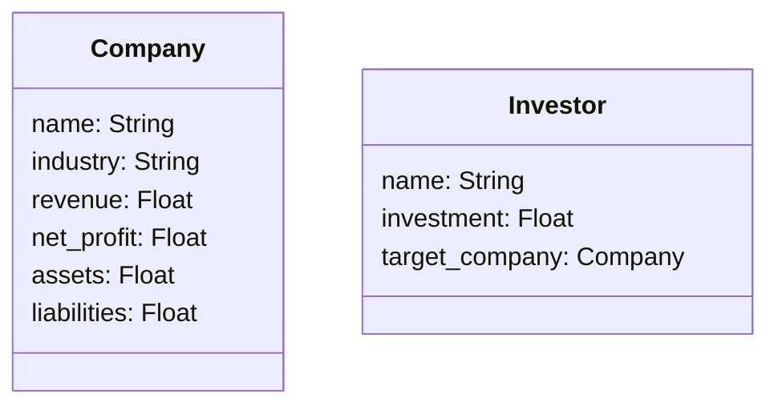

                 


# 巴菲特的公司收购策略：从股东到所有者

## 关键词：巴菲特、公司收购、投资策略、股东、所有者、财务分析、估值模型

## 摘要：本文深入探讨了巴菲特的公司收购策略，从其投资哲学到具体的收购方法，结合经典案例分析，详细解读了如何从股东思维转变为所有者思维，涵盖财务分析、估值模型、法律税务考量及收购后的整合管理等核心内容。

---

# 第1章 巴菲特的投资哲学与收购理念

## 1.1 巴菲特的投资哲学

### 1.1.1 价值投资的核心理念
价值投资是一种以内在价值为导向的投资策略，巴菲特强调以合理价格买入优秀企业。其核心理念是寻找具有持续竞争优势、良好管理层和稳定财务状况的企业。

### 1.1.2 股东与所有者的区别
- 股东：仅关注股价波动和股息回报，属于短期投资者。
- 所有者：关注企业的长期价值，将其视为自己的企业进行管理。

### 1.1.3 巴菲特的长期投资策略
巴菲特倡导长期持有优质资产，避免频繁交易，注重企业的内在价值而非市场波动。

---

## 1.2 巴菲特收购策略的背景

### 1.2.1 美国企业收购的历史演变
20世纪中后期，美国企业收购从杠杆收购转向注重企业基本面的长期投资。

### 1.2.2 巴菲特时代收购的特点
- 以可口可乐和吉列公司为代表，注重企业品牌、竞争优势和管理层能力。
- 强调企业估值的合理性，避免高溢价收购。

### 1.2.3 股权投资与企业控制权的结合
巴菲特通过收购成为目标企业的控股股东，实现对企业长期战略的把控。

---

## 1.3 巴菲特收购策略的核心要素

### 1.3.1 企业基本面分析
- 行业地位：选择具有竞争优势的行业龙头。
- 财务状况：关注企业的盈利能力、现金流和债务水平。

### 1.3.2 财务指标的计算与解读
- 市盈率（P/E）=股价/每股收益
- 市净率（P/B）=股价/每股净资产
- 净资产收益率（ROE）=净利润/平均净资产

### 1.3.3 管理层能力与企业文化
巴菲特注重管理层的诚信和能力，认为优秀的企业文化是企业长期成功的关键。

---

## 1.4 本章小结

---

# 第2章 公司收购的财务分析与估值

## 2.1 财务报表分析基础

### 2.1.1 资产负债表分析
- 资产结构：关注流动资产和非流动资产的比例。
- 负债结构：分析短期负债和长期负债的占比。

### 2.1.2 利润表与现金流分析
- 收入与利润：关注主营业务收入增长率和净利润率。
- 现金流：分析经营活动现金流是否健康。

### 2.1.3 财务指标的计算与解读
- 净利润率 = 净利润 / 营业收入
- 资产负债率 = 总负债 / 总资产
- 速动比率 = (流动资产 - 存货) / 流动负债

---

## 2.2 企业估值方法

### 2.2.1 市盈率法
$$市盈率 = 股价 / 每股收益$$
- 适用于盈利稳定的公司。

### 2.2.2 市净率法
$$市净率 = 股价 / 每股净资产$$
- 适用于资产密集型企业。

### 2.2.3 现金流折现法
$$DCF模型 = \sum_{t=1}^{n} \frac{\text{现金流}}{(1 + r)^t} + \frac{\text{终值}}{(1 + r)^n}$$
- 常用于评估具有稳定现金流的企业。

### 2.2.4 巴菲特的估值模型
结合企业未来现金流和行业地位进行估值。

---

## 2.3 财务风险与收购决策

### 2.3.1 杠杆收购的风险
- 高杠杆可能导致企业财务负担加重，影响偿债能力。

### 2.3.2 财务健康状况评估
- 关注企业的流动比率、速动比率和利息覆盖倍数。

### 2.3.3 收购后的整合策略
- 优化资本结构，降低财务杠杆。

---

## 2.4 实例分析：巴菲特的收购估值方法

### 2.4.1 可口可乐的估值过程
- 通过DCF模型评估可口可乐的未来现金流。
- 结合市盈率和市净率进行交叉验证。

### 2.4.2 吉列公司的估值分析
- 分析吉列的净利润率和行业地位。
- 评估企业的长期盈利能力。

### 2.4.3 估值模型的实际应用
- 结合具体案例，展示如何利用估值模型确定合理的收购价格。

---

## 2.5 本章小结

---

# 第3章 公司收购的法律与税务考量

## 3.1 公司收购的法律结构

### 3.1.1 股权收购与资产收购的区别
- 股权收购：购买目标公司的股权，成为控股股东。
- 资产收购：购买目标公司的特定资产。

### 3.1.2 收购协议的核心条款
- 价格与支付方式
- 交割条件
- 债务承担与资产转移

### 3.1.3 反垄断法与收购限制
- 确保收购不违反反垄断法规，避免市场垄断。

---

## 3.2 税务规划与优化

### 3.2.1 收购中的税务负担
- 股权收购的税务影响
- 资产收购的税务影响

### 3.2.2 税务抵扣与递减策略
- 利用递减税额和抵扣项优化税务负担。

### 3.2.3 跨国收购的税务考量
- 税收抵免和双重征税协定。

---

## 3.3 法律风险与合规性分析

### 3.3.1 企业历史遗留问题
- 历史债务和诉讼风险。

### 3.3.2 股权结构的合法性
- 确保股权结构符合公司法要求。

### 3.3.3 收购后的法律整合
- 调整公司章程和治理结构。

---

## 3.4 实例分析：巴菲特的税务优化策略

### 3.4.1 可口可乐的税务规划
- 利用税收优惠降低企业税负。

### 3.4.2 吉列公司的税务优化
- 优化股权结构，减少税务负担。

### 3.4.3 税务风险的规避方法
- 建立完善的税务合规体系。

---

## 3.5 本章小结

---

# 第4章 收购后的整合与管理

## 4.1 收购后的整合策略

### 4.1.1 企业文化整合
- 确保并购后的企业文化兼容性。

### 4.1.2 组织结构优化
- 合并职能部门，优化管理流程。

### 4.1.3 人力资源管理
- 调整管理层结构，保持核心团队稳定性。

---

## 4.2 并购后的管理挑战

### 4.2.1 业务协同问题
- 确保并购后业务的协同效应最大化。

### 4.2.2 管理层激励机制
- 设计合理的激励机制，保持管理层积极性。

### 4.2.3 业绩考核与目标设定
- 设定合理的业绩目标，确保并购后企业持续增长。

---

## 4.3 实例分析：可口可乐的整合策略

### 4.3.1 企业文化整合
- 保持可口可乐的品牌价值和企业文化。

### 4.3.2 组织结构优化
- 合并职能部门，优化管理流程。

### 4.3.3 人力资源管理
- 调整管理层结构，保持核心团队稳定性。

---

## 4.4 本章小结

---

# 第5章 数学模型与算法解析

## 5.1 财务估值的数学模型

### 5.1.1 DCF模型
$$DCF模型 = \sum_{t=1}^{n} \frac{\text{现金流}}{(1 + r)^t} + \frac{\text{终值}}{(1 + r)^n}$$

### 5.1.2 市盈率与市净率模型
- 市盈率：$$市盈率 = 股价 / 每股收益$$
- 市净率：$$市净率 = 股价 / 每股净资产$$

---

## 5.2 算法实现

### 5.2.1 DCF模型的Python实现
```python
def discounted_cash_flow(cash_flows, discount_rate, terminal_value):
    return sum(cash_flow / (1 + discount_rate) ** t for t, cash_flow in enumerate(cash_flows)) + terminal_value / (1 + discount_rate) ** len(cash_flows)
```

### 5.2.2 市盈率与市净率的计算
```python
def calculate_valuation_ratios(price, eps, book_value_per_share):
    pe_ratio = price / eps
    pb_ratio = price / book_value_per_share
    return pe_ratio, pb_ratio
```

---

## 5.3 本章小结

---

# 第6章 系统分析与架构设计

## 6.1 问题场景介绍

### 6.1.1 企业评估的系统需求
- 需要对目标企业进行全面的财务、法律和管理评估。

### 6.1.2 系统目标
- 提供企业评估的信息化解决方案，辅助投资者做出科学决策。

---

## 6.2 系统功能设计

### 6.2.1 领域模型（Mermaid类图）


### 6.2.2 系统架构设计（Mermaid架构图）
```mermaid
container 容器1 {
    系统功能模块1
    系统功能模块2
    系统功能模块3
}
```

### 6.2.3 系统接口设计
- 输入接口：企业财务数据、市场数据。
- 输出接口：估值报告、收购建议。

---

## 6.3 本章小结

---

# 第7章 项目实战：巴菲特风格的收购分析

## 7.1 环境安装

### 7.1.1 工具安装
- 安装Python和必要的数据分析库（Pandas、NumPy）。

### 7.1.2 数据来源
- 获取目标公司的财务数据和行业数据。

---

## 7.2 核心实现

### 7.2.1 数据分析与估值
```python
import pandas as pd

# 读取财务数据
data = pd.read_csv('target_company.csv')

# 计算关键指标
revenue = data['revenue'].mean()
net_profit = data['net_profit'].mean()
assets = data['assets'].mean()
liabilities = data['liabilities'].mean()

# 估值模型
def calculate_enterprise_value(revenue, net_profit, assets, liabilities):
    # 简单估值模型，假设EV/EBITDA倍数为10
    ebitda = net_profit + non_financial_expenses
    ev = ebitda * 10
    return ev - liabilities
```

### 7.2.2 代码实现与解读
- 数据清洗与预处理。
- 关键财务指标计算。
- 估值模型的应用。

---

## 7.3 实例分析

### 7.3.1 可口可乐收购案例
- 数据分析与估值。
- 收购决策的依据。

### 7.3.2 吉列公司收购案例
- 财务分析与整合策略。

---

## 7.4 项目小结

---

# 第8章 总结与展望

## 8.1 本章总结

### 8.1.1 核心内容回顾
- 巴菲特的投资哲学。
- 财务分析与估值方法。
- 收购后的整合与管理。

### 8.1.2 实践意义
- 为投资者提供科学的收购决策参考。

---

## 8.2 最佳实践 tips

### 8.2.1 投资者建议
- 从股东思维转变为所有者思维。
- 注重企业基本面分析和管理层能力。

### 8.2.2 注意事项
- 避免高溢价收购。
- 重视收购后的整合与管理。

### 8.2.3 拓展阅读
- 建议阅读巴菲特的《巴菲特致股东的信》和《穷查理宝典》。

---

## 8.3 未来展望

### 8.3.1 投资领域的新趋势
- 数字经济与科技企业的收购机会。

### 8.3.2 投资策略的优化
- 结合人工智能技术优化估值模型。

### 8.3.3 全球化背景下的收购策略
- 关注跨国收购的机会与挑战。

---

## 8.4 本章小结

---

# 结语

通过本文的详细分析，我们可以看到巴菲特的公司收购策略不仅是一种投资方法，更是一种智慧的管理哲学。从股东到所有者的思维转变，结合科学的财务分析和合理的估值模型，能够帮助投资者在复杂的市场环境中做出明智的决策。

