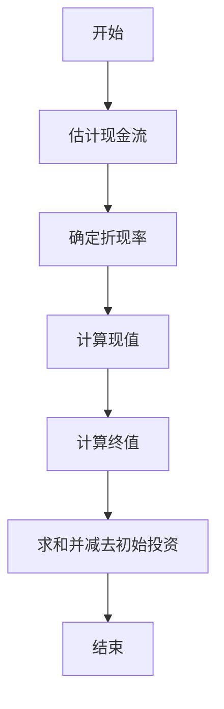
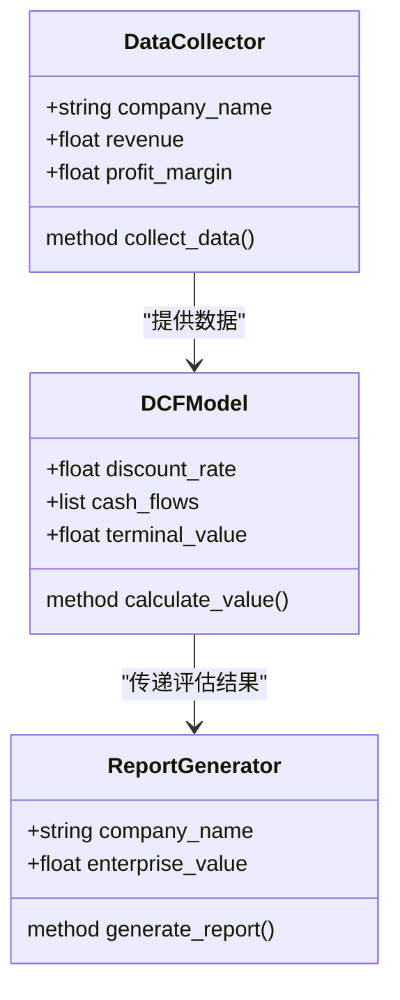
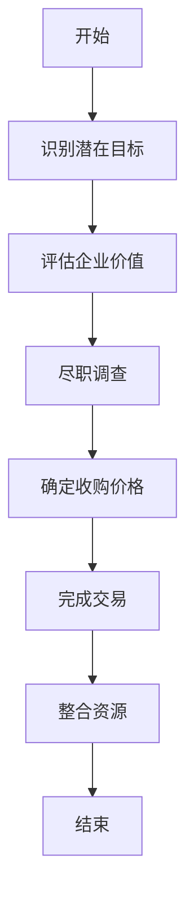

                 


# 巴菲特的公司收购策略：全资控股的魅力

## 关键词：巴菲特，公司收购，全资控股，价值投资，企业并购，投资策略

## 摘要：本文深入探讨巴菲特的公司收购策略，特别是全资控股的魅力。通过分析巴菲特的投资哲学、收购标准、评估方法和实际案例，揭示其成功的秘诀。文章结合技术语言，从背景介绍、核心概念、算法原理、系统架构到项目实战，全面解析巴菲特的收购策略，帮助读者理解并应用这些策略。

---

## 第1章: 引言

### 1.1 巴菲特的投资哲学
巴菲特的投资哲学以价值投资为核心，强调寻找具有持续竞争优势的企业，并以合理的价格买入并长期持有。他的成功在于对企业的深刻理解、对市场的敬畏以及对风险的严格控制。

### 1.2 公司收购的魅力
全资控股意味着完全拥有目标公司，能够在收购后进行战略调整、整合资源，最大化企业价值。这种策略不仅稳固了企业的控制权，还为长期增值提供了保障。

---

## 第2章: 核心概念与联系

### 2.1 巴菲特的收购标准
- **核心概念：** 巴菲特的收购标准包括企业财务状况、竞争优势、管理层能力和合理的价格。他注重企业的盈利能力、现金流和资产负债表的健康。

#### 表2-1：巴菲特的收购标准对比

| 标准               | 描述                                   |
|--------------------|----------------------------------------|
| 盈利能力           | 净利润稳定增长，ROE高                 |
| 现金流             | 自由现金流充裕                       |
| 负债情况           | 低负债，财务风险小                   |
| 竞争优势           | 具备独特的竞争优势                   |
| 管理层             | 管理层诚信、能力强                   |

#### 图2-1：核心概念的ER实体关系图
```mermaid
erDiagram
    company {
        key id
        string name
        float market_value
        float book_value
        string industry
    }
    management {
        key id
        string name
        float experience
        boolean integrity
    }
    competition {
        key id
        string name
        float market_share
        boolean unique_advantage
    }
    company --> management : "Managed by"
    company --> competition : "Competes with"
```

---

## 第3章: 算法原理讲解

### 3.1 企业价值评估的数学模型
巴菲特常用Discounted Cash Flow (DCF)模型评估企业价值。模型公式：
$$
\text{企业价值} = \sum_{t=1}^{n} \frac{\text{现金流}}{(1 + r)^t} + \frac{\text{终值}}{(1 + r)^n}
$$
其中，$r$为折现率，$n$为预测年限。

#### 图3-1：DCF模型流程图


#### 代码实现
```python
def calculate_enterprise_value(cash_flows, discount_rate, terminal_value):
    present_value = 0
    for t, cf in enumerate(cash_flows):
        present_value += cf / (1 + discount_rate)**t
    total_value = present_value + terminal_value / (1 + discount_rate)**len(cash_flows)
    return total_value

cash_flows = [100, 150, 200]
discount_rate = 0.1
terminal_value = 500

print(calculate_enterprise_value(cash_flows, discount_rate, terminal_value))
```

---

## 第4章: 系统分析与架构设计

### 4.1 项目目标
开发一个基于巴菲特收购策略的企业评估系统，帮助投资者识别具有长期竞争优势的企业。

#### 图4-1：系统架构图


### 4.2 功能模块
- 数据采集：收集企业财务数据和行业信息。
- 评估模型：应用DCF模型评估企业价值。
- 竞争优势分析：识别企业的竞争优势。
- 报告生成：输出收购建议和风险分析。

#### 图4-2：功能模块类图


---

## 第5章: 项目实战

### 5.1 案例分析：可口可乐的收购

#### 图5-1：收购流程图


### 5.2 代码实现
```python
def evaluate_coca_cola():
    revenue = 40000  # 单位：万美元
    profit_margin = 0.2
    growth_rate = 0.05
    discount_rate = 0.1
    years = 5
    cash_flows = [revenue * (1 + growth_rate)**t * profit_margin for t in range(years)]
    terminal_value = cash_flows[-1] * (1 + growth_rate) / (discount_rate - growth_rate)
    enterprise_value = sum(cf / (1 + discount_rate)**t for t, cf in enumerate(cash_flows)) + terminal_value / (1 + discount_rate)**years
    return enterprise_value

print(evaluate_coca_cola())
```

---

## 第6章: 总结与最佳实践

### 6.1 总结
巴菲特的全资控股策略成功的关键在于对企业基本面的深入分析和对长期价值的追求。通过合理的估值模型和严格的风险控制，他实现了长期的资本增值。

### 6.2 最佳实践
1. **深入研究企业**：了解企业的财务状况、竞争优势和管理层能力。
2. **合理估值**：使用DCF等模型进行科学估值。
3. **分散风险**：避免过度集中投资，降低市场波动带来的影响。
4. **长期持有**：耐心持有优质企业，享受复利效应。

---

通过本文的分析，读者可以深入了解巴菲特的公司收购策略，并将其应用于实际投资中。

