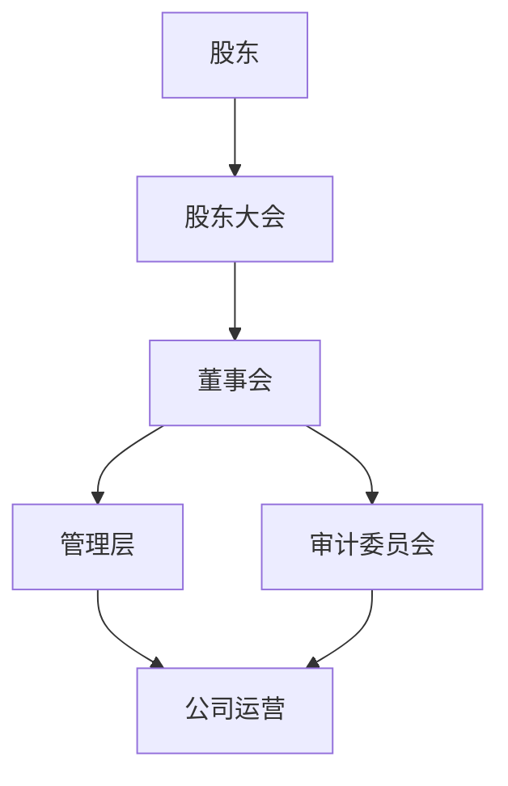

                 


# 巴菲特的公司治理观点

**关键词**：巴菲特，公司治理，价值投资，安全边际，长期投资，复利效应，系统架构

**摘要**：本文探讨了巴菲特的公司治理观点，分析其投资理念对公司治理的影响，结合技术方法进行详细分析。通过案例和系统架构，展示如何应用这些观点实现企业价值最大化。

---

## 第1章 巴菲特投资理念与公司治理背景

### 1.1 巴菲特的背景与投资哲学

#### 1.1.1 巴菲特的生平简介
沃伦·巴菲特（Warren Buffett），1934年出生于美国，是全球著名投资家、慈善家。他通过长期价值投资，积累了巨额财富，被誉为“股神”。

#### 1.1.2 巴菲特的投资哲学
巴菲特的投资哲学以价值投资为核心，强调寻找具有持续竞争优势的企业，注重企业的内在价值。他倡导长期投资，避免短期波动。

#### 1.1.3 巴菲特与公司治理的关系
巴菲特不仅是一位投资者，也是公司治理的倡导者。他关注企业治理结构，认为良好的治理是企业长期成功的关键。

### 1.2 公司治理的核心概念

#### 1.2.1 公司治理的定义
公司治理指通过董事会和管理层确保公司有效运作，实现股东价值最大化的管理过程。

#### 1.2.2 公司治理的主体与客体
主体包括股东、董事会、管理层，客体是公司及其利益相关者。

#### 1.2.3 公司治理的目标与边界
目标是实现股东价值最大化，边界涉及公司内部和外部利益相关者。

### 1.3 巴菲特公司治理观点的背景

#### 1.3.1 现代公司治理的挑战
现代公司治理面临复杂性，包括代理问题、利益冲突和短期主义。

#### 1.3.2 巴菲特观点的提出背景
巴菲特的观点在20世纪末提出，针对当时公司治理中的短期主义和代理问题。

#### 1.3.3 巴菲特观点的现实意义
强调长期投资和股东价值，为现代公司治理提供了新视角。

---

## 第2章 巴菲特投资理念的核心要素

### 2.1 价值投资的定义与特点

#### 2.1.1 价值投资的定义
价值投资是通过分析企业的内在价值，寻找低于内在价值的股票进行投资。

#### 2.1.2 价值投资的核心要素
- **内在价值**：企业未来现金流的现值。
- **安全边际**：市场价格与内在价值的差距。
- **长期视角**：关注企业的长期盈利能力。

#### 2.1.3 价值投资与其它投资方法的对比
价值投资强调基本面分析，与技术分析和短期交易不同。

### 2.2 安全边际的概念与计算

#### 2.2.1 安全边际的定义
安全边际是市场价格低于内在价值的部分，确保投资的安全性。

#### 2.2.2 安全边际的计算公式
$$ 安全边际 = 价值 - 市场价格 $$

#### 2.2.3 安全边际的重要性
安全边际提供缓冲，降低投资风险。

### 2.3 长期投资与复利效应

#### 2.3.1 长期投资的定义
长期投资指持有股票数年，关注企业的长期增长。

#### 2.3.2 复利效应的数学模型
$$ A = P(1 + r)^n $$
其中，A是终值，P是本金，r是年增长率，n是年数。

#### 2.3.3 复利效应的实际应用
通过长期持有优质股票，复利效应带来财富增长。

---

## 第3章 巴菲特公司治理的核心原理

### 3.1 股东价值最大化

#### 3.1.1 股东价值最大化的定义
通过有效治理，实现股东价值的最大化。

#### 3.1.2 股东价值与公司治理的关系
良好的治理结构能提升股东价值。

#### 3.1.3 股东价值最大化的实现路径
优化资本结构，提升盈利能力，加强风险管理。

### 3.2 董事会的结构与作用

#### 3.2.1 董事会的定义与角色
董事会是公司治理的核心，负责监督和指导管理层。

#### 3.2.2 董事会的结构优化
独立性、专业性和多样性是董事会结构优化的关键。

#### 3.2.3 董事会的作用
监督管理层，制定战略，确保公司合规运营。

### 3.3 管理层激励机制

#### 3.3.1 激励机制的定义
通过股权、奖金等方式激励管理层追求长期价值。

#### 3.3.2 激励机制的类型
股票期权、限制性股票、绩效奖金等。

#### 3.3.3 激励机制的设计原则
与公司绩效挂钩，长期导向，公平合理。

---

## 第4章 巴菲特公司治理观点的实践应用

### 4.1 投资决策中的公司治理考量

#### 4.1.1 股东权益保护
评估公司是否保护股东权益，避免代理问题。

#### 4.1.2 管理层诚信与能力
考察管理层的诚信和能力，确保其致力于股东价值。

#### 4.1.3 公司治理结构的透明度
公司治理结构是否透明，便于投资者评估。

### 4.2 案例分析

#### 4.2.1 可口可乐的案例
巴菲特投资可口可乐，看重其强大的品牌和稳定的现金流。

#### 4.2.2 苹果的案例
巴菲特的苹果投资，反映了对管理层能力和公司治理的认可。

### 4.3 案例分析的启示

#### 4.3.1 良好的公司治理是投资的关键
公司治理良好的企业更受巴菲特青睐。

#### 4.3.2 长期投资与公司治理的相互促进
良好的治理结构促进长期投资，长期投资支持公司治理。

---

## 第5章 巴菲特公司治理观点的系统架构

### 5.1 系统架构设计

#### 5.1.1 系统功能模块
- 股东价值评估模块
- 董事会结构分析模块
- 管理层激励模块
- 风险管理模块

#### 5.1.2 系统架构图


### 5.2 系统功能设计

#### 5.2.1 股东价值评估
使用DCF模型评估企业内在价值。

#### 5.2.2 董事会结构分析
评估董事会独立性和专业性。

#### 5.2.3 管理层激励
设计激励机制，确保管理层与股东利益一致。

### 5.3 系统接口设计

#### 5.3.1 股东大会接口
收集股东意见，监督董事会决策。

#### 5.3.2 董事会决策接口
接收管理层报告，制定公司战略。

#### 5.3.3 审计委员会接口
监督财务报告，确保合规性。

### 5.4 系统交互设计

#### 5.4.1 股东大会与董事会交互
股东大会向董事会提出建议，董事会决策并反馈。

#### 5.4.2 董事会与管理层交互
董事会监督管理层，提供指导，管理层执行决策。

---

## 第6章 巴菲特公司治理观点的项目实战

### 6.1 环境配置

#### 6.1.1 技术环境
使用Python进行数据分析，利用Pandas、NumPy等库。

#### 6.1.2 开发工具
Jupyter Notebook，Visual Studio Code。

#### 6.1.3 数据来源
股票数据来自Yahoo Finance，公司治理数据来自公开报告。

### 6.2 核心实现

#### 6.2.1 股东价值评估代码
```python
import pandas as pd
import numpy as np

def calculate_intrinsic_value(revenue, growth_rate, discount_rate):
    # 简单DCF模型
    terminal_value = revenue * (1 + growth_rate) / (discount_rate - growth_rate)
    present_value = terminal_value / (1 + discount_rate)
    return present_value
```

#### 6.2.2 安全边际计算代码
```python
def calculate_margin_of_safety(intrinsic_value, market_price):
    return intrinsic_value - market_price
```

### 6.3 案例分析

#### 6.3.1 可口可乐案例
使用DCF模型评估可口可乐的内在价值，计算安全边际。

#### 6.3.2 苹果案例
分析苹果的公司治理结构，评估管理层激励机制。

### 6.4 项目小结

#### 6.4.1 项目总结
通过项目实战，掌握巴菲特投资理念在实际中的应用。

#### 6.4.2 实践中的注意事项
确保数据准确，模型合理，避免过度简化。

---

## 第7章 巴菲特公司治理观点的总结与展望

### 7.1 小结

#### 7.1.1 核心观点回顾
巴菲特的公司治理观点强调股东价值最大化，注重长期投资和良好治理结构。

#### 7.1.2 技术应用总结
通过系统架构和项目实战，展示了如何将巴菲特观点应用于实际投资决策。

### 7.2 注意事项

#### 7.2.1 投资风险
市场波动和公司特定风险需谨慎考虑。

#### 7.2.2 模型局限性
DCF模型假设合理性，数据准确性影响结果。

### 7.3 拓展阅读

#### 7.3.1 进一步学习方向
研究更多投资模型，如PEG指标，阅读巴菲特的著作。

#### 7.3.2 现实中的挑战
应对复杂市场环境，需动态调整投资策略。

---

## 第8章 巴菲特公司治理观点的未来展望

### 8.1 未来投资趋势

#### 8.1.1 数字化转型的影响
企业数字化转型将影响其长期价值。

#### 8.1.2 ESG投资的兴起
环境、社会和治理因素在投资中的重要性增加。

### 8.2 技术发展

#### 8.2.1 AI在投资中的应用
人工智能辅助投资决策，提升分析效率。

#### 8.2.2 大数据分析在公司治理中的作用
大数据分析帮助识别公司治理问题，优化投资策略。

### 8.3 投资者教育

#### 8.3.1 提高投资者素养
加强投资者教育，推广长期投资理念。

#### 8.3.2 传播巴菲特观点
通过书籍、讲座等形式，传播巴菲特的公司治理观点。

---

**结语**：巴菲特的公司治理观点为投资提供了深刻的指导。通过系统的分析和实践，投资者可以更好地应用这些观点，实现长期财富增长。未来，随着技术的发展，这些观点将得到更广泛的应用和发展。

