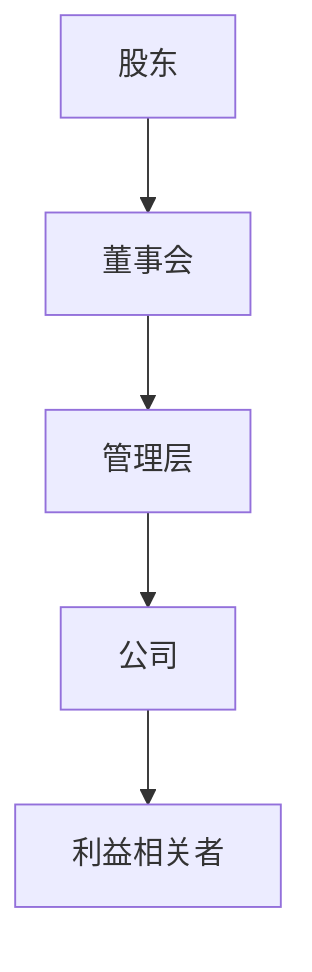
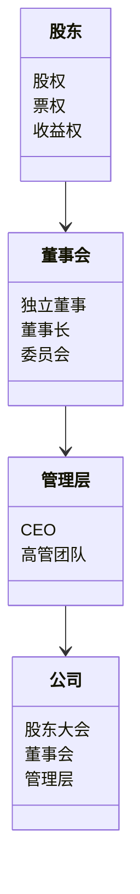
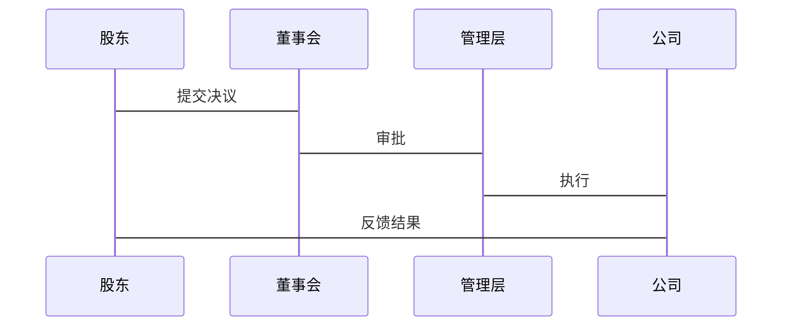

                 


# 巴菲特的公司治理观点：股东利益至上的实践

## 关键词
- 巴菲特
- 公司治理
- 股东利益
- 投资哲学
- 案例分析

## 摘要
本文探讨巴菲特的公司治理观点，特别是他强调的股东利益至上的原则。通过分析其投资哲学、治理策略和实际案例，文章揭示了如何在公司治理中实现股东价值最大化，并提供可操作的建议。

---

# 第一部分：背景介绍

## 第1章：巴菲特的生平与投资哲学

### 1.1 巴菲特的生平简介

#### 1.1.1 早年经历与投资起步
沃伦·巴菲特于1934年8月31日出生于美国内布拉斯州奥马哈市。他在童年时期展现出对数字和投资的浓厚兴趣，12岁时购买了第一份股票。巴菲特在内布拉斯大学和哥伦比亚商学院的学习为他后来的投资理念奠定了基础。

#### 1.1.2 投资理念的形成与发展
巴菲特的投资理念深受本杰明·格雷厄姆的影响，强调价值投资和长期持有。他逐渐发展出一套独特的方法，注重公司的基本面分析和管理层的诚信。

#### 1.1.3 巴菲特的投资哲学核心
巴菲特的核心投资哲学是寻找具有持续竞争优势、良好管理和合理估值的公司。他认为，长期投资和价值投资是实现财富增长的关键。

### 1.2 投资哲学与公司治理

#### 1.2.1 股东价值最大化的原则
巴菲特认为，公司治理的首要目标是为股东创造最大价值。他强调管理层应当以股东利益为核心，避免过度扩张和盲目投资。

#### 1.2.2 长期投资与价值投资的结合
巴菲特的价值投资理念与长期持有策略相结合，使他成为公司治理中的典范。他注重公司内在价值，而非短期市场波动。

#### 1.2.3 股东利益至上的治理观
巴菲特的公司治理观强调股东利益至上，认为管理层应当以股东的长期利益为出发点，确保公司稳健发展。

---

# 第二部分：核心概念与联系

## 第2章：股东利益至上的原则

### 2.1 核心概念解析

#### 2.1.1 股东利益至上的定义
股东利益至上是指在公司治理中，管理层决策优先考虑股东的长期利益，确保公司价值最大化。

#### 2.1.2 公司治理的核心要素
公司治理的核心要素包括董事会结构、管理层激励、股东权利和透明度。

#### 2.1.3 股东与管理层的关系
股东与管理层的关系是公司治理的关键，管理层应当代表股东利益，而股东则提供资本支持。

### 2.2 核心概念对比分析

#### 2.2.1 股东利益与公司利益的平衡
平衡股东与公司利益是公司治理的难点。通过适当的激励机制和透明度，可以实现双方利益的协调。

#### 2.2.2 不同治理原则的对比表格
| 治理原则 | 重点 | 优点 | 缺点 |
|----------|------|------|------|
| 股东至上 | 股东利益 | 确保股东价值最大化 | 可能忽视其他利益相关者 |
| 管理层至上 | 管理效率 | 提高管理灵活性 | 可能导致短期行为 |
| 利益相关者平衡 | 平衡各方利益 | 促进长期发展 | 复杂性高，决策难度大 |

#### 2.2.3 实体关系图的 Mermaid 流程图



---

# 第三部分：巴菲特的公司治理策略

## 第3章：巴菲特的治理策略

### 3.1 投资策略与公司治理

#### 3.1.1 价值投资与公司治理的关系
价值投资强调公司内在价值，与公司治理密切相关。巴菲特通过分析公司治理结构，评估其投资价值。

#### 3.1.2 选择优秀企业的标准
巴菲特选择的企业具有良好的治理结构、强大的财务状况和优秀的管理层。

#### 3.1.3 投资决策中的治理因素
治理因素在巴菲特的投资决策中占据重要地位，包括董事会结构、管理层激励和公司透明度。

### 3.2 董事会治理

#### 3.2.1 董事会的结构与职责
巴菲特的董事会结构注重独立董事的作用，确保董事会的独立性和有效性。

#### 3.2.2 董事的选拔与激励
董事选拔注重经验和能力，激励机制结合股票期权，确保董事与公司利益一致。

#### 3.2.3 董事会的独立性与有效性
独立董事会可以避免利益冲突，确保董事会决策的客观性和公正性。

### 3.3 管理层激励机制

#### 3.3.1 激励机制的设计原则
激励机制设计应注重长期性、合理性和公平性，确保管理层与股东利益一致。

#### 3.3.2 股权激励的作用与风险
股权激励可以提高管理层积极性，但需注意过度激励可能引发道德风险。

#### 3.3.3 激励与公司绩效的结合
将激励机制与公司绩效挂钩，确保管理层行为与股东利益一致。

---

# 第四部分：案例分析

## 第4章：巴菲特的经典投资案例

### 4.1 伯克希尔 Hathaway的治理实践

#### 4.1.1 公司治理结构
伯克希尔 Hathaway的治理结构包括独立董事会、强大的管理层和透明的信息披露。

#### 4.1.2 股权结构与股东权利
公司股权结构分散，股东权利得到充分保障，确保股东在公司治理中的话语权。

#### 4.1.3 管理层激励与公司绩效
公司采用长期激励机制，确保管理层与股东利益一致，促进公司长期发展。

---

# 第五部分：系统分析与架构设计

## 第5章：系统分析与架构设计方案

### 5.1 问题场景介绍
公司治理中的股东利益最大化需要解决的问题包括如何平衡各方利益、确保决策透明和提高治理效率。

### 5.2 项目介绍
本项目旨在设计一个高效的公司治理架构，确保股东利益最大化。

### 5.3 系统功能设计（领域模型 Mermaid 类图）



### 5.4 系统架构设计 Mermaid 架构图


### 5.5 系统接口设计
公司治理系统需要接口来处理股东投票、董事会决议和管理层激励。

### 5.6 系统交互 Mermaid 序列图



---

# 第六部分：项目实战

## 第6章：项目实战

### 6.1 环境安装
需要安装公司治理系统所需的相关软件和工具，确保环境配置正确。

### 6.2 系统核心实现源代码
以下是公司治理系统的核心代码示例：

```python
class Shareholder:
    def __init__(self, name, equity):
        self.name = name
        self.equity = equity

class Board:
    def __init__(self, members):
        self.members = members

class Management:
    def __init__(self, ceo):
        self.ceo = ceo

class Company:
    def __init__(self, name, board, management):
        self.name = name
        self.board = board
        self.management = management

    def股东大会(self):
        # 实现股东大会逻辑
        pass
```

### 6.3 代码应用解读与分析
上述代码定义了股东、董事会和管理层的结构，展示了公司治理的基本框架。股东大会方法需要进一步实现具体的股东大会流程。

### 6.4 实际案例分析和详细讲解剖析
通过分析伯克希尔 Hathaway的治理结构，我们可以看到如何将上述代码应用于实际，确保股东利益最大化。

### 6.5 项目小结
本项目通过实际案例展示了如何在公司治理中实现股东利益最大化，强调了系统设计和实际应用的重要性。

---

# 第七部分：最佳实践

## 第7章：最佳实践

### 7.1 Tips
- 定期审查公司治理结构，确保其有效性。
- 采用透明的沟通机制，增强股东信任。
- 结合公司实际情况，灵活调整治理策略。

### 7.2 小结
巴菲特的公司治理观点强调股东利益至上，通过合理的治理结构和激励机制，确保公司长期发展和股东价值最大化。

### 7.3 注意事项
- 避免过度关注短期利益，注重长期发展。
- 保持董事会独立性，确保决策的客观性。
- 定期评估治理效果，及时调整策略。

### 7.4 拓展阅读
建议阅读巴菲特的《投资之道》和相关的公司治理文献，深入理解其治理哲学。

---

# 附录

## 附录 A：巴菲特的经典语录
以下是巴菲特的经典语录摘录，供读者参考：

- “价格是你支付的，价值是你得到的。”
- “只有当潮水退去，才知道谁在裸泳。”

## 附录 B：相关法规
公司治理涉及的法规包括《公司法》和《证券法》，确保公司治理的合法性和透明度。

## 附录 C：扩展阅读
推荐的扩展阅读材料包括《巴菲特传》和《价值投资入门》。

---

# 结语

通过本文的分析，我们可以看到巴菲特的公司治理观点对现代企业具有重要的指导意义。股东利益至上不仅是投资理念的核心，也是公司治理的关键。希望本文能为读者在公司治理实践中提供有价值的参考。

--- 

**全文完**

