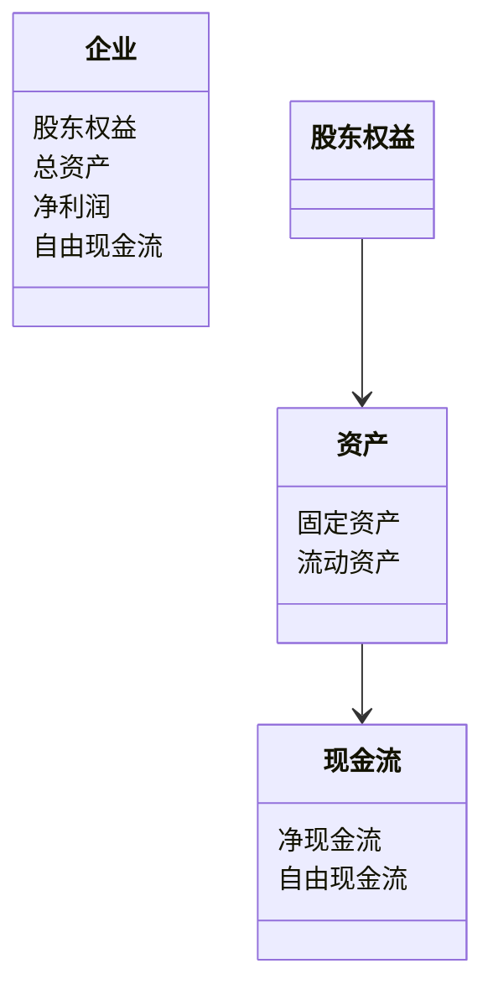
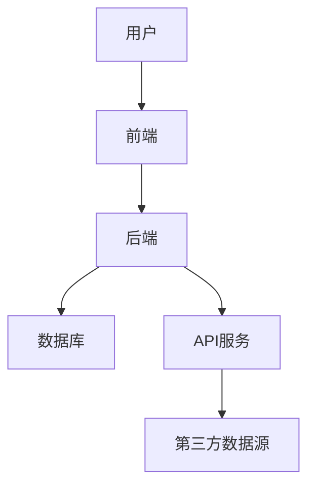

                 


```markdown
# 巴菲特的公用事业投资策略：稳定现金流的魅力

## 关键词
巴菲特，价值投资，现金流，公用事业，投资策略，ROE，ROA

## 摘要
本文深入探讨了巴菲特的公用事业投资策略，重点分析了稳定现金流在投资中的重要性。通过介绍巴菲特的价值投资理念、公用事业行业的特点、选股标准以及定量分析方法，结合实际案例，展示了如何通过分析财务指标和现金流来评估公用事业企业的投资价值。

## 第一部分: 巴菲特投资理念概述

## 第1章: 巴菲特投资策略的核心理念

### 1.1 价值投资的定义与核心原则
价值投资是一种以内在价值为基础的投资策略，强调以低于内在价值的价格购买优质资产。巴菲特继承并发展了这一理念，强调长期持有和关注企业的基本面。

#### 1.1.1 价值投资的起源与发展
价值投资起源于20世纪20年代，由本杰明·格雷厄姆提出，强调安全边际和内在价值。巴菲特师从格雷厄姆，进一步发展了这一理论，强调企业质量、管理层能力和财务健康。

#### 1.1.2 巴菲特的价值投资理念
巴菲特的价值投资理念包括以下几点：
1. **长期投资**：长期持有优质资产，避免频繁交易。
2. **安全边际**：以低于内在价值的价格买入，确保安全空间。
3. **企业质量**：选择具备强大竞争优势、稳定现金流和良好治理的企业。

#### 1.1.3 稳定现金流在投资中的重要性
现金流是企业健康的核心指标，稳定的现金流意味着企业具备持续盈利和偿债能力，能够在经济低迷时期维持运营。

## 第2章: 公用事业行业的特点与投资价值

### 2.1 公用事业行业的定义与商业模式
公用事业行业包括电力、水务、天然气等基础设施，通常由政府特许经营，市场需求稳定，具备防御性。

#### 2.1.1 公用事业行业的基本特征
1. **垄断性**：政府通常授予特许经营权，市场准入壁垒高。
2. **需求稳定**：基本需求刚性，受经济周期影响较小。
3. **高固定成本**：固定资产投入大，运营成本相对固定。

#### 2.1.2 公用事业企业的盈利模式
1. **定价机制**：政府监管价格，确保合理回报。
2. **规模经济**：通过扩大规模降低成本，提高效率。

#### 2.1.3 公用事业行业的周期性分析
公用事业行业受经济周期影响较小，具备防御性，适合长期投资。

### 2.2 公用事业行业的财务特征

#### 2.2.1 公用事业企业的财务指标分析
1. **ROE（股东权益收益率）**：衡量企业盈利能力。
2. **ROA（营业利润率）**：衡量资产使用效率。

#### 2.2.2 现金流在公用事业企业中的重要性
现金流是公用事业企业的生命线，稳定的现金流确保企业能够偿还债务、投资运营和分配股利。

#### 2.2.3 公用事业行业的风险与收益平衡
公用事业行业的风险较低，但收益相对稳定，适合追求稳定收益的投资者。

## 第三部分: 巴菲特选股标准与分析框架

## 第3章: 巴菲特选股的核心标准

### 3.1 股东权益收益率（ROE）分析
ROE是衡量企业盈利能力的重要指标，巴菲特通常选择ROE较高的企业。

#### 3.1.1 ROE的定义与计算公式
ROE = 净利润 / 股东权益

#### 3.1.2 ROE在公用事业企业中的应用
以某公用事业企业为例，计算其ROE，并分析其是否具备投资价值。

### 3.2 营业利润率（ROA）分析
ROA是衡量资产使用效率的重要指标，巴菲特通常选择ROA较高的企业。

#### 3.2.1 ROA的定义与计算公式
ROA = 净利润 / 总资产

#### 3.2.2 ROA在公用事业企业中的应用
以某公用事业企业为例，计算其ROA，并分析其是否具备投资价值。

### 3.3 现金流分析
现金流是评估企业财务健康的重要指标，巴菲特通常选择现金流稳定的企业。

#### 3.3.1 自由现金流的定义与计算公式
自由现金流 = 净利润 - 投资支出

#### 3.3.2 现金流在公用事业企业中的应用
以某公用事业企业为例，分析其自由现金流，并评估其投资价值。

## 第4章: 巴菲特的选股标准与实际案例

### 4.1 巴菲特选股的核心要素
1. **高ROE**：确保企业盈利能力强。
2. **高ROA**：确保资产使用效率高。
3. **稳定现金流**：确保企业财务健康。
4. **优秀管理层**：确保企业战略实施到位。

### 4.2 实际案例分析
以巴菲特投资的某公用事业企业为例，分析其ROE、ROA和现金流，并评估其投资价值。

## 第五部分: 定量分析与财务建模

## 第5章: 定量分析与财务建模

### 5.1 财务指标分析
通过分析ROE、ROA、现金流等财务指标，评估企业的投资价值。

#### 5.1.1 ROE分析
计算企业的ROE，并与行业平均水平对比，评估其盈利能力。

#### 5.1.2 ROA分析
计算企业的ROA，并与行业平均水平对比，评估其资产使用效率。

#### 5.1.3 现金流分析
计算企业的自由现金流，并评估其财务健康状况。

### 5.2 财务建模与企业估值

#### 5.2.1 DCF模型
使用现金流折现模型（DCF）对企业进行估值，确定其内在价值。

#### 5.2.2 WACC计算
计算加权平均资本成本（WACC），作为折现率。

#### 5.2.3 企业价值计算
通过DCF模型计算企业的整体价值，并与市场价对比，确定其安全边际。

## 第六部分: 系统分析与架构设计

## 第6章: 系统分析与架构设计

### 6.1 问题场景介绍
分析公用事业企业的财务状况，评估其投资价值。

### 6.2 系统功能设计
设计一个系统，用于分析公用事业企业的财务指标和现金流。

#### 6.2.1 领域模型
绘制领域模型类图，展示企业、资产、现金流等核心概念。



### 6.3 系统架构设计
设计一个系统架构，用于分析公用事业企业的财务指标和现金流。



### 6.4 系统接口设计
定义系统接口，用于数据输入、处理和输出。

### 6.5 系统交互设计
绘制系统交互序列图，展示用户与系统之间的交互过程。

## 第七部分: 项目实战

## 第7章: 项目实战

### 7.1 环境安装
安装必要的软件和工具，如Python、Pandas、Matplotlib等。

### 7.2 核心实现

#### 7.2.1 数据收集
从公开数据源获取公用事业企业的财务数据。

#### 7.2.2 数据处理
使用Pandas进行数据清洗和转换。

#### 7.2.3 财务分析
计算ROE、ROA和自由现金流，评估企业投资价值。

#### 7.2.4 可视化
使用Matplotlib绘制财务指标的图表，展示分析结果。

#### 7.2.5 投资决策
基于分析结果，做出投资决策。

### 7.3 代码实现

#### 7.3.1 数据处理代码
```python
import pandas as pd

# 从CSV文件中读取数据
df = pd.read_csv('financial_data.csv')

# 数据清洗
df.dropna(inplace=True)
df['净利润'] = df['营业收入'] - df['营业成本']

# 计算ROE
df['ROE'] = df['净利润'] / df['股东权益']
```

#### 7.3.2 可视化代码
```python
import matplotlib.pyplot as plt

plt.figure(figsize=(10, 6))
plt.plot(df['ROE'], label='ROE')
plt.plot(df['ROA'], label='ROA')
plt.xlabel('年份')
plt.ylabel('比率')
plt.legend()
plt.show()
```

### 7.4 案例分析
以某公用事业企业为例，展示如何应用上述方法进行投资分析。

### 7.5 分析结果解读
解释分析结果，评估企业的投资价值，并做出投资决策。

## 第八部分: 总结与展望

## 第8章: 总结与展望

### 8.1 研究总结
总结本文的主要内容，重申巴菲特的公用事业投资策略的核心思想。

### 8.2 未来展望
展望未来，探讨公用事业行业的投资机会和挑战，以及如何进一步优化投资策略。

## 第九部分: 最佳实践

## 第9章: 最佳实践

### 9.1 投资策略 tips
提供一些实用的投资建议，帮助读者更好地应用巴菲特的投资策略。

### 9.2 风险提示
提醒读者投资有风险，需谨慎决策。

### 9.3 持续学习
建议读者持续关注行业动态和企业基本面，提升自己的投资能力。

## 结语
本文通过深入分析巴菲特的公用事业投资策略，结合定量分析和财务建模，为投资者提供了实用的投资方法和工具。希望读者能够通过本文的学习，更好地理解和应用巴菲特的投资理念，实现稳健的投资收益。
```

