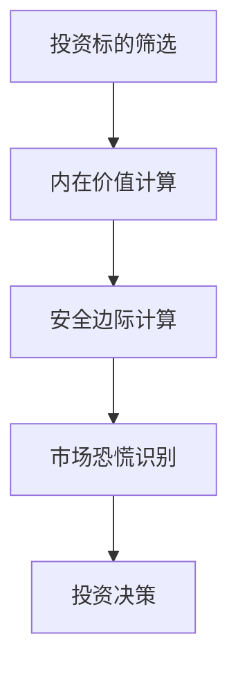

                 


# 巴菲特的反周期投资方法：在恐慌中买入

> 关键词：巴菲特，反周期投资，价值投资，安全边际，内在价值，恐慌买入，长期投资

> 摘要：本文深入探讨了巴菲特的反周期投资方法，特别是在市场恐慌时期的买入策略。通过分析巴菲特的投资理念、安全边际原则、内在价值计算以及长期投资视角，结合数学模型和系统架构，详细讲解了如何在经济周期波动中识别投资机会。文章还通过实际案例分析和代码实现，展示了如何应用巴菲特的方法进行投资决策。

---

## 第一部分: 巴菲特投资理念与反周期投资的背景

### 第1章: 巴菲特投资理念的核心思想

#### 1.1 巴菲特的价值投资哲学
- 1.1.1 价值投资的定义与核心思想
- 1.1.2 巴菲特的价值投资原则
  - 市场先生的概念
  - 股价与价值的分离
- 1.1.3 巴菲特的长期投资理念

#### 1.2 安全边际的概念
- 1.2.1 安全边际的定义
- 1.2.2 安全边际在投资中的作用
- 1.2.3 如何计算安全边际

#### 1.3 巴菲特对市场的长期看法
- 1.3.1 市场波动与长期趋势
- 1.3.2 长期投资与短期波动的平衡
- 1.3.3 巴菲特对市场的预测与实际案例

### 第2章: 反周期投资的背景与环境

#### 2.1 经济周期的基本概念
- 2.1.1 经济周期的定义与阶段
- 2.1.2 经济周期对投资的影响
- 2.1.3 不同周期阶段的投资策略

#### 2.2 巴菲特反周期投资的背景
- 2.2.1 美国经济历史中的反周期投资机会
- 2.2.2 巴菲特在恐慌中的买入策略
- 2.2.3 巴菲特反周期投资的经典案例

#### 2.3 市场恐慌与投资机会
- 2.3.1 市场恐慌的定义与表现
- 2.3.2 如何识别市场的恐慌情绪
- 2.3.3 市场恐慌中的买入机会

---

## 第二部分: 巴菲特反周期投资的核心策略

### 第3章: 巴菲特的买入策略

#### 3.1 在恐慌中的买入机会
- 3.1.1 市场恐慌与资产价格低估的关系
- 3.1.2 如何利用市场恐慌寻找投资机会
- 3.1.3 市场恐慌中的买入策略

#### 3.2 安全边际原则的应用
- 3.2.1 安全边际与资产价格的关系
- 3.2.2 如何通过安全边际筛选投资标的
- 3.2.3 安全边际在不同周期阶段的应用

#### 3.3 长期投资视角下的反周期投资
- 3.3.1 长期投资与短期波动的平衡
- 3.3.2 如何在长期视角下识别反周期投资机会
- 3.3.3 巴菲特的长期投资案例分析

---

## 第三部分: 巴菲特反周期投资的数学模型与分析

### 第4章: 巴菲特投资模型的数学表达

#### 4.1 内在价值的计算公式
- 4.1.1 内在价值的定义
- 4.1.2 内在价值的计算公式
$$ \text{内在价值} = \frac{\text{未来现金流的现值}}{\text{折现率}} $$

#### 4.2 安全边际的数学计算
- 4.2.1 安全边际的定义
- 4.2.2 安全边际的计算公式
$$ \text{安全边际} = \text{内在价值} \times \text{安全系数} $$

#### 4.3 投资决策模型
- 4.3.1 投资决策的逻辑步骤
- 4.3.2 投资决策的数学表达
$$ \text{买入机会} = \text{市场价格} < \text{内在价值} \times \text{安全系数} $$

---

## 第四部分: 巴菲特反周期投资的系统架构与实现

### 第5章: 巴菲特投资系统的架构设计

#### 5.1 系统功能设计
- 5.1.1 投资标的筛选模块
- 5.1.2 内在价值计算模块
- 5.1.3 安全边际计算模块
- 5.1.4 市场恐慌识别模块

#### 5.2 系统架构设计


#### 5.3 系统接口设计
- 5.3.1 数据输入接口
- 5.3.2 数据处理接口
- 5.3.3 数据输出接口

#### 5.4 系统交互流程
```mermaid
sequenceDiagram
    actor 投资者
    participant 系统
    操作：选择投资标的
    投资者 -> 系统：输入投资标的
    系统 -> 投资者：返回内在价值
    系统 -> 投资者：返回安全边际
    投资者 -> 系统：判断市场价格与安全边际
    系统 -> 投资者：返回投资决策
```

---

## 第五部分: 巴菲特反周期投资的项目实战与经验总结

### 第6章: 项目实战

#### 6.1 环境安装与数据准备
- 6.1.1 投资分析工具的安装
- 6.1.2 数据来源与数据准备

#### 6.2 系统核心实现源代码
- 6.2.1 内在价值计算函数
- 6.2.2 安全边际计算函数
- 6.2.3 市场恐慌识别函数

#### 6.3 实际案例分析
- 6.3.1 经典案例分析
- 6.3.2 案例中的买入机会识别
- 6.3.3 案例中的投资决策过程

#### 6.4 投资经验总结
- 6.4.1 投资中的常见问题
- 6.4.2 解决问题的策略与方法
- 6.4.3 投资中的注意事项

---

## 第六部分: 总结与展望

### 第7章: 总结与展望

#### 7.1 本章总结
- 7.1.1 巴菲特反周期投资的核心思想
- 7.1.2 投资策略的系统化实现
- 7.1.3 投资中的关键原则与注意事项

#### 7.2 未来展望
- 7.2.1 反周期投资的未来趋势
- 7.2.2 投资策略的创新与优化
- 7.2.3 巴菲特投资理念的持续影响

---

通过以上目录结构，我们可以看到文章从巴菲特的投资理念、反周期投资的核心策略、数学模型与分析、系统架构与实现、项目实战与经验总结，以及总结与展望等多个方面进行了全面而深入的探讨。这种结构不仅能够帮助读者系统地理解巴菲特的反周期投资方法，还能通过实际案例和代码实现，帮助读者更好地将理论应用于实践。

