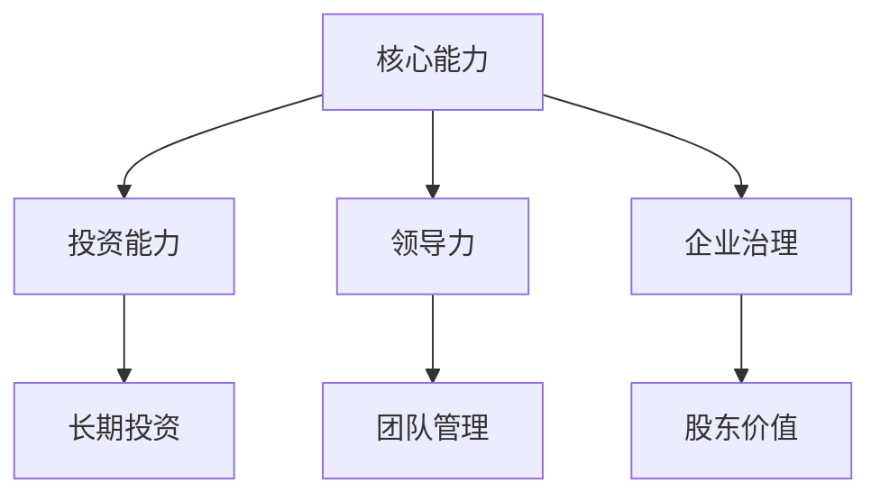
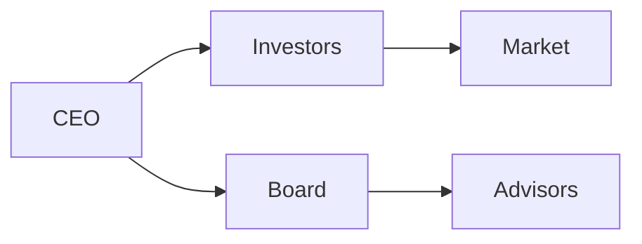

                 

# 巴菲特的后继者：谁将接棒伯克希尔哈撒韦

## 关键词：巴菲特，伯克希尔哈撒韦，接班人，领导力，价值投资

## 摘要： 
本文深入分析伯克希尔哈撒韦可能的接班人，探讨领导力、投资理念和企业治理的重要性，评估潜在候选人，并总结接班人的关键特质和挑战。

---

# 文章正文

## 第一部分：背景介绍

### 第1章：巴菲特与伯克希尔哈撒韦的成就

#### 1.1 巴菲特的生平与投资理念
沃伦·巴菲特，生于1930年，是全球著名投资者，倡导价值投资。他的成功基于对企业的深入分析和长期投资策略。

#### 1.2 伯克希尔哈撒韦的核心业务
伯克希尔通过保险业务、投资和收购多元化发展，成为市值数千亿美元的企业。

#### 1.3 接班人的必要性与挑战
巴菲特年事已高，寻找合适的接班人对伯克希尔的持续成功至关重要。接班人需具备投资能力、领导力和企业治理经验。

---

## 第二部分：接班人的核心标准

### 第2章：能力与影响力分析

#### 2.1 接班人的核心能力
- **投资能力**：深刻理解价值投资，能管理复杂投资组合。
- **领导力**：能激励团队，处理复杂局面。
- **企业治理**：确保股东利益，维护公司文化。

#### 2.2 现有管理团队的评估
- **查理·芒格**：作为副董事长，影响投资决策，但年龄较大。
- **阿吉特·贾因**：管理保险业务，能力强，但缺乏独立接班的声誉。

#### 2.3 潜在外部候选人分析
- **潜在外部接班人的特点**：投资经验丰富，具备领导力。
- **他们的投资理念与巴菲特的契合度**：需认同价值投资，长期视角。

---

## 第三部分：巴菲特的遗产与交接班的影响

### 第3章：巴菲特遗产的传承

#### 3.1 巴菲特投资理念的延续
- 价值投资：寻找低估企业，长期持有。
- 风险控制：分散投资，避免重大风险。

#### 3.2 交接班对伯克希尔的影响
- 股东反应：接班人需维护股东信任。
- 企业文化：保持长期稳定，避免短期波动。

#### 3.3 对投资界的影响
- 价值投资的未来：伯克希尔模式将继续影响投资界。
- 投资者的期望：寻找具备巴菲特特质的接班人。

---

## 第四部分：潜在候选人分析

### 第4章：芒格的角色与影响

#### 4.1 查理·芒格的贡献
- 投资决策：与巴菲特互补，提供多元视角。
- 领导力：在团队中起到关键作用。

#### 4.2 芒格的局限性
- 年龄因素：77岁，可能无法长期担任。
- 专业领域：主要影响投资决策，非全面管理。

### 第5章：阿吉特·贾因的潜力

#### 5.1 贾因的管理能力
- 保险业务：成功扩展，经验丰富。
- 投资决策：参与重要决策，表现稳健。

#### 5.2 贾因的挑战
- 投资组合：需证明能管理巴菲特的投资。
- 股东信任：需提升个人声誉和影响力。

---

## 第五部分：交接班的挑战与风险

### 第6章：管理风格与文化传承

#### 6.1 管理风格的影响
- 接班人需平衡集中与分散决策。
- 维护企业文化：员工信任和客户忠诚。

#### 6.2 股东期望的挑战
- 股东对业绩和领导力的高期望。
- 管理层需透明沟通，保持信任。

#### 6.3 团队协作的重要性
- 接班人需与现有团队协作。
- 鼓励多元化思维，避免僵化。

---

## 第六部分：最佳实践与领导力培养

### 第7章：领导力培养的关键

#### 7.1 长期培养的重要性
- 接班人需长期积累经验。
- 在实践中提升投资和管理能力。

#### 7.2 多元化领导团队
- 分散决策权，避免过度依赖单一领导人。
- 鼓励团队协作，提升整体能力。

#### 7.3 透明沟通与信任建设
- 管理层需定期与股东沟通。
- 透明决策过程，增强信任。

---

## 结论

### 第8章：总结与未来展望

#### 8.1 关键总结
- 接班人需具备投资能力、领导力和企业治理经验。
- 芒格和贾因是潜在人选，但需克服各自挑战。

#### 8.2 未来展望
- 伯克希尔的成功依赖接班人的能力。
- 投资者需耐心等待合适人选，保持信任。

---

## 附录

### A. 接班人评估模型

### B. 领导力结构

---

通过系统分析和评估，伯克希尔的接班人需具备投资能力、领导力和企业治理经验。芒格和贾因是主要候选人，但需克服各自挑战。未来，伯克希尔的成功依赖接班人的能力，投资者需保持耐心和信任。

