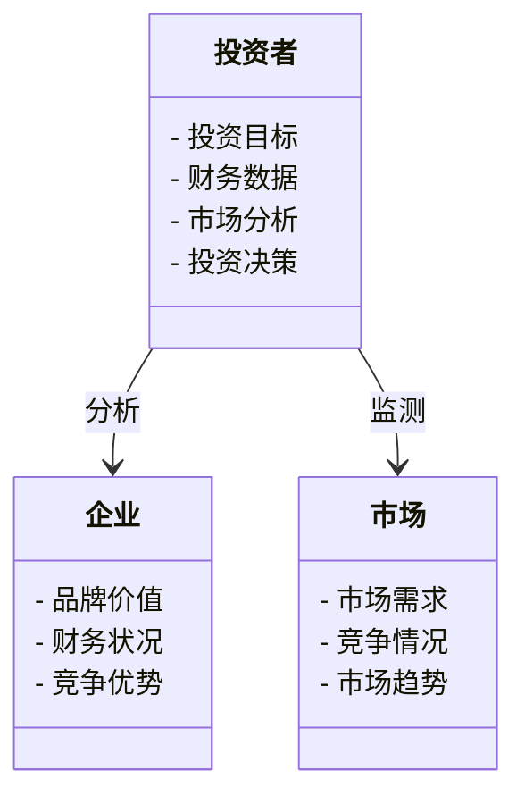
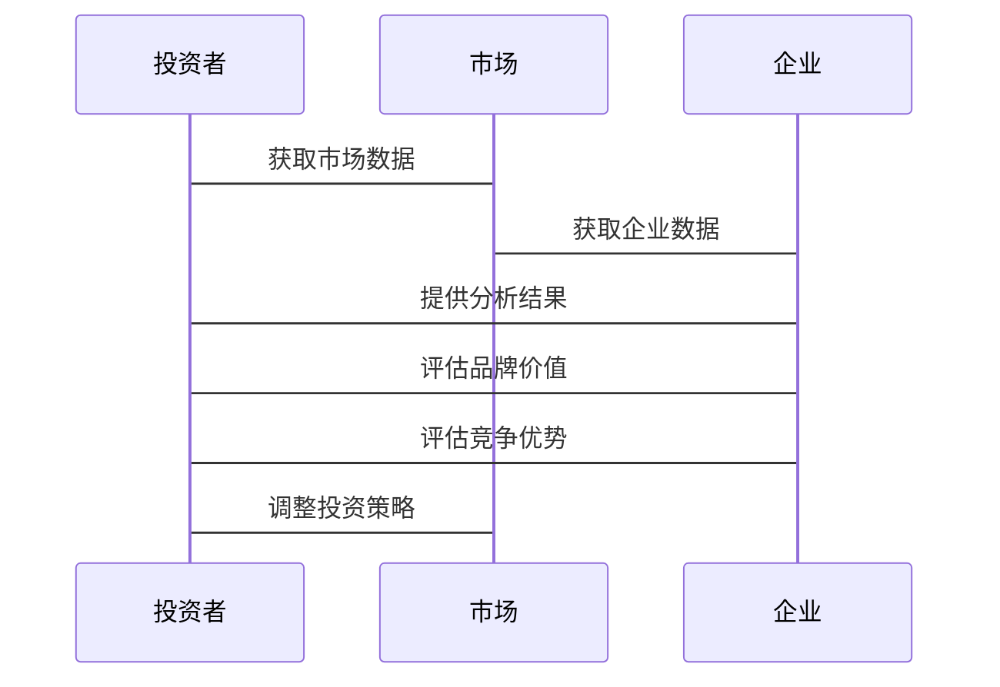

                 


# 巴菲特的品牌价值投资理念

## 关键词
巴菲特，价值投资，品牌价值，企业内在价值，财务分析，竞争优势

## 摘要
本文深入探讨巴菲特的品牌价值投资理念，分析其核心思想、评估方法及成功案例。通过详细讲解品牌价值的定义、评估方法、企业内在价值的计算、财务报表分析和竞争优势评估，结合实际案例，帮助读者理解如何运用巴菲特的投资策略实现稳健投资。

---

# 第一部分: 巴菲特的品牌价值投资理念基础

## 第1章: 巴菲特投资理念概述

### 1.1 巴菲特投资理念的核心要素

#### 1.1.1 价值投资的定义与核心要素
- **价值投资**：寻找市场价格低于内在价值的股票进行投资。
- **核心要素**：
  1. 企业内在价值
  2. 品牌价值
  3. 财务健康状况
  4. 可持续竞争优势

#### 1.1.2 巴菲特的价值投资哲学
- **长期投资**：关注企业的长期盈利能力。
- **安全边际**：买入价格低于内在价值，确保安全边际。
- **企业质量**：选择具有强大品牌价值和竞争优势的企业。

#### 1.1.3 品牌价值在投资中的重要性
- **品牌价值**：品牌价值高的企业具有更强的市场地位和盈利能力。
- **品牌忠诚度**：高品牌忠诚度意味着稳定的市场需求。

### 1.2 巴菲特投资理念的背景与演变

#### 1.2.1 价值投资的起源与发展
- 价值投资起源于20世纪，由本杰明·格雷厄姆提出。
- 巴菲特师从格雷厄姆，发展并完善了价值投资理论。

#### 1.2.2 巴菲特投资理念的独特性
- **长期视角**：关注企业的长期价值。
- **品牌驱动**：强调品牌价值对企业价值的影响。

#### 1.2.3 巴菲特投资理念的演变过程
- 从早期的烟堆理论到后来的品牌价值分析。
- 不断优化投资策略，适应市场变化。

---

## 第2章: 品牌价值的定义与评估方法

### 2.1 品牌价值的核心概念

#### 2.1.1 品牌价值的定义
- 品牌价值：品牌在市场上的影响力和盈利能力的量化表现。

#### 2.1.2 品牌价值的构成要素
- 品牌知名度
- 品牌忠诚度
- 品牌形象
- 品牌创新力

#### 2.1.3 品牌价值与企业价值的关系
- 品牌价值是企业价值的重要组成部分。
- 高品牌价值企业具有更强的市场竞争力和盈利能力。

### 2.2 品牌价值的评估方法

#### 2.2.1 品牌价值的定量评估方法
- 市场占有率
- 净资产收益率(ROE)
- 毛利率
- 市盈率

#### 2.2.2 品牌价值的定性评估方法
- 品牌影响力分析
- 竞争优势分析
- 市场地位分析

#### 2.2.3 品牌价值评估的综合应用
- 综合定量和定性方法，全面评估品牌价值。

---

# 第二部分: 巴菲特品牌价值投资的核心分析方法

## 第3章: 企业内在价值的评估

### 3.1 企业内在价值的定义与计算

#### 3.1.1 企业内在价值的定义
- 内在价值：企业未来现金流的现值。

#### 3.1.2 企业内在价值的计算公式
$$
\text{内在价值} = \sum_{t=1}^{n} \frac{\text{现金流}_t}{(1+r)^t}
$$
其中，$r$为折现率，$n$为永续期数。

#### 3.1.3 企业内在价值的评估步骤
1. 预测未来现金流。
2. 确定合适的折现率。
3. 计算未来现金流的现值。
4. 比较市场价格与内在价值。

### 3.2 财务报表分析方法

#### 3.2.1 资产负债表分析
- 关注资产质量、负债结构和股东权益。

#### 3.2.2 利润表分析
- 分析收入、成本和利润情况。

#### 3.2.3 现金流量表分析
- 评估企业现金流的健康状况。

---

## 第4章: 企业竞争优势分析

### 4.1 企业竞争优势的定义与分类

#### 4.1.1 企业竞争优势的定义
- 竞争优势：企业在市场上胜过竞争对手的独特优势。

#### 4.1.2 企业竞争优势的分类
- 成本优势
- 品牌优势
- 技术优势
- 资源优势

### 4.2 可持续竞争优势的评估方法

#### 4.2.1 可持续竞争优势的定义
- 可持续竞争优势：企业长期保持竞争优势的能力。

#### 4.2.2 可持续竞争优势的评估指标
- 市场占有率
- 净资产收益率
- 创新能力
- 品牌影响力

---

# 第三部分: 巴菲特品牌价值投资的系统分析与架构设计方案

## 第5章: 系统分析与架构设计

### 5.1 问题场景介绍
- 投资者如何通过品牌价值评估选择优质企业。

### 5.2 系统功能设计

#### 5.2.1 领域模型Mermaid类图


### 5.3 系统架构设计Mermaid架构图


### 5.4 系统接口设计和交互Mermaid序列图


---

# 第四部分: 项目实战

## 第6章: 项目实战与案例分析

### 6.1 投资环境搭建

#### 6.1.1 环境安装
- 安装必要的金融分析工具和编程环境。

### 6.2 系统核心实现源代码

#### 6.2.1 品牌价值评估代码
```python
def brand_value_assessment(company_data):
    # 输入：company_data 包含财务数据和市场数据
    # 输出：品牌价值评估结果
    brand_value = company_data['revenue'] * company_data['net_profit_margin'] * company_data['market_share']
    return brand_value
```

#### 6.2.2 企业内在价值计算代码
```python
def calculate_intrinsic_value(cash_flows, discount_rate):
    # 输入：cash_flows 是未来现金流列表，discount_rate是折现率
    # 输出：内在价值
    intrinsic_value = 0
    for t in range(len(cash_flows)):
        cash_flow = cash_flows[t]
        discounted_cash_flow = cash_flow / (1 + discount_rate) ** t
        intrinsic_value += discounted_cash_flow
    return intrinsic_value
```

### 6.3 实际案例分析

#### 6.3.1 可口可乐案例分析
- 品牌价值：高品牌忠诚度和强大的市场地位。
- 投资策略：长期持有，享受品牌价值增长。

#### 6.3.2 苹果公司案例分析
- 品牌价值：创新能力和高品牌忠诚度。
- 投资策略：关注技术创新和市场扩展。

### 6.4 代码应用解读与分析
- 通过代码计算企业的品牌价值和内在价值，辅助投资决策。

### 6.5 项目小结
- 成功案例展示了巴菲特品牌价值投资理念的实际应用。
- 代码工具提高了分析效率和准确性。

---

# 第五部分: 最佳实践与总结

## 第7章: 最佳实践与总结

### 7.1 投资策略 tips
- 长期投资，避免短期波动。
- 选择具有强大品牌价值和竞争优势的企业。
- 定期评估投资组合，调整策略。

### 7.2 小结
- 巴菲特的品牌价值投资理念强调长期稳健投资。
- 通过系统分析和实战案例，投资者可以有效应用这一理念。

### 7.3 注意事项
- 风险提示：市场波动和企业基本面变化可能影响投资结果。
- 投资者需具备基本的财务分析能力。

### 7.4 拓展阅读
- 《巴菲特传》：了解巴菲特的投资哲学。
- 《价值投资入门》：学习基本的财务分析方法。

---

通过本文的系统分析和实战案例，读者可以深入理解巴菲特的品牌价值投资理念，并将其应用到实际投资中，实现稳健的投资回报。

