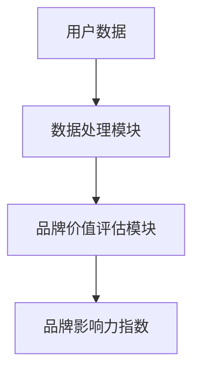
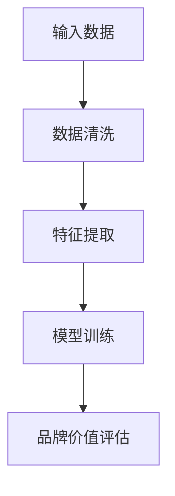

                 


# 巴菲特的品牌价值理论：在数字经济中的新解读

---

## 关键词
- 巴菲特
- 品牌价值理论
- 数字经济
- 用户资产
- 数据资产
- 品牌影响力指数
- 数字化品牌价值

---

## 摘要
在数字经济时代，传统的品牌价值评估方法正在面临新的挑战和变革。本文基于巴菲特的品牌价值理论，深入探讨了数字经济环境下品牌价值的内涵、评估方法和系统架构。通过引入用户资产和数据资产的概念，提出了数字化品牌价值评估模型，并结合实际案例分析了该模型的应用。文章还详细讲解了品牌影响力指数的计算方法，并通过Mermaid流程图和Python代码展示了系统的实现过程。最后，本文总结了数字经济时代品牌价值评估的关键点和未来发展趋势。

---

## 第1章: 巴菲特品牌价值理论的核心概念

### 1.1 品牌价值的传统定义与内涵
#### 1.1.1 品牌价值的定义
品牌价值是企业在市场中通过品牌资产、品牌忠诚度和品牌认知度等多方面因素所创造的经济价值。传统上，品牌价值被视为企业整体价值的重要组成部分，通常通过财务指标和市场表现来衡量。

#### 1.1.2 品牌价值的核心要素
品牌价值的核心要素包括品牌知名度、品牌忠诚度、品牌认知度和品牌联想等。这些要素共同构成了品牌的市场影响力和消费者认知基础。

#### 1.1.3 巴菲特对品牌价值的独到见解
巴菲特认为，品牌价值是企业长期竞争优势的重要来源。他特别强调品牌忠诚度的重要性，认为具有强大品牌忠诚度的企业能够在市场中获得持续的竞争优势。

### 1.2 巴菲特投资理论中的品牌价值
#### 1.2.1 巴菲特投资理念概述
巴菲特的投资理念以“价值投资”为核心，注重企业的基本面分析和长期竞争优势。他认为，品牌价值是企业在长期市场中保持竞争优势的关键因素之一。

#### 1.2.2 品牌价值在巴菲特选股中的重要性
在巴菲特的选股标准中，品牌价值是关键考量因素之一。他倾向于投资那些具有强大品牌价值和长期竞争优势的企业。

#### 1.2.3 巴菲特对品牌忠诚度的重视
巴菲特认为，品牌忠诚度是品牌价值的核心驱动力。具有高品牌忠诚度的企业能够在市场中获得稳定的客户群体和持续的收入来源。

### 1.3 数字经济时代的品牌价值新特征
#### 1.3.1 数字经济对品牌价值的影响
数字经济时代，品牌价值的评估需要考虑更多的数字化因素，如用户资产、数据资产和品牌影响力指数等。

#### 1.3.2 数字化品牌资产的定义与衡量
数字化品牌资产包括用户数据、在线品牌声誉、社交媒体影响力和数字内容资产等。这些资产在品牌价值评估中起着越来越重要的作用。

#### 1.3.3 数字经济时代品牌价值的核心变化
在数字经济时代，品牌价值的评估更加注重动态性和多维度性。品牌影响力指数和用户资产价值成为品牌价值的重要组成部分。

---

## 第2章: 巴菲特品牌价值理论的分析框架

### 2.1 品牌价值的传统分析方法
#### 2.1.1 品牌价值的财务指标分析
传统的品牌价值分析方法主要通过财务指标，如销售收入、净利润和品牌溢价等来评估品牌价值。

#### 2.1.2 品牌价值的市场表现分析
品牌价值的市场表现分析包括品牌在市场中的占有率、竞争对手的分析和市场趋势的预测等。

#### 2.1.3 品牌价值的竞争对手分析
通过分析竞争对手的品牌策略和市场表现，可以更好地评估自身品牌的价值和竞争优势。

### 2.2 数字经济时代的品牌价值分析新维度
#### 2.2.1 用户资产的量化
用户资产的量化是数字经济时代品牌价值评估的重要部分。通过分析用户的数量、用户生命周期价值和用户忠诚度等指标，可以更好地评估用户资产的价值。

#### 2.2.2 数据资产的评估
数据资产是数字经济时代品牌价值的重要组成部分。通过对用户数据的分析和利用，可以为企业创造更多的价值。

#### 2.2.3 数字品牌影响力指数
数字品牌影响力指数是衡量品牌在数字平台上的影响力的重要指标，包括品牌在社交媒体上的提及量、情感指数和品牌认知度等。

### 2.3 巴菲特品牌价值分析框架的数字化扩展
#### 2.3.1 数字化品牌价值评估模型
数字化品牌价值评估模型将传统品牌价值评估方法与数字经济时代的新增量因素结合起来，形成更加全面的评估体系。

#### 2.3.2 数字化品牌资产的动态评估
数字化品牌资产的动态评估通过实时数据和算法模型，对品牌资产的变化进行持续监测和评估。

#### 2.3.3 数字化品牌价值的多维度分析
在数字经济时代，品牌价值的评估需要从多个维度进行，包括用户资产、数据资产、品牌影响力指数和市场表现等。

---

## 第3章: 巴菲特品牌价值理论的数学模型与公式

### 3.1 品牌价值的传统评估模型
#### 3.1.1 品牌价值的公式表示
$$ \text{品牌价值} = \text{销售收入} \times \text{品牌溢价} $$

### 3.2 数字经济时代的品牌价值扩展模型
#### 3.2.1 数字化品牌价值的公式表示
$$ \text{数字化品牌价值} = \text{传统品牌价值} + \text{数字资产价值} $$

### 3.3 数字资产价值的评估公式
#### 3.3.1 用户数据价值的计算
$$ \text{用户数据价值} = \text{用户数量} \times \text{用户生命周期价值} $$

### 3.4 品牌影响力指数的计算公式
#### 3.4.1 品牌影响力指数的定义
$$ \text{品牌影响力指数} = \frac{\text{品牌提及量} \times \text{情感指数}}{\text{行业平均值}} $$

---

## 第4章: 巴菲特品牌价值理论的系统架构与设计

### 4.1 数字经济时代品牌价值评估的系统架构
#### 4.1.1 系统功能模块划分
- 数据采集模块
- 数据处理模块
- 品牌价值评估模块
- 品牌影响力指数计算模块

#### 4.1.2 系统数据流图


### 4.2 数字化品牌价值评估的算法流程图


### 4.3 品牌价值评估算法的Python代码实现
```python
import pandas as pd
from sklearn.metrics import accuracy_score

# 数据清洗
def data_cleaning(data):
    data.dropna(inplace=True)
    return data

# 特征提取
def feature_extraction(data):
    features = data[['用户数量', '用户生命周期价值', '品牌提及量', '情感指数']]
    return features

# 模型训练
def model_training(features, target):
    from sklearn.tree import DecisionTreeClassifier
    model = DecisionTreeClassifier()
    model.fit(features, target)
    return model

# 品牌价值评估
def brand_value_assessment(data):
    cleaned_data = data_cleaning(data)
    features = feature_extraction(cleaned_data)
    target = cleaned_data['品牌价值']
    model = model_training(features, target)
    predictions = model.predict(features)
    accuracy = accuracy_score(target, predictions)
    return accuracy

# 主程序
if __name__ == "__main__":
    data = pd.read_csv('brand_data.csv')
    accuracy = brand_value_assessment(data)
    print(f"品牌价值评估准确率: {accuracy}")
```

---

## 第5章: 巴菲特品牌价值理论的数字资产价值分析

### 5.1 数字资产价值的定义与分类
数字资产包括用户数据、在线内容资产、品牌声誉资产和数字渠道资产等。这些资产在品牌价值评估中起着重要作用。

### 5.2 用户数据资产的价值评估
#### 5.2.1 用户数据的收集与分析
通过收集用户的在线行为数据、购买数据和反馈数据，可以更好地评估用户数据的价值。

#### 5.2.2 用户生命周期价值的计算
用户生命周期价值（CLV）是预测用户在其生命周期内为企业带来的总价值。计算公式如下：
$$ \text{CLV} = \text{平均收入} \times \text{平均生命周期长度} \times \text{利润率} $$

### 5.3 数据资产的市场价值评估
数据资产的市场价值可以通过数据的交易价格、数据的质量和数据的使用效果等因素来评估。

---

## 第6章: 巴菲特品牌价值理论的实际案例分析

### 6.1 案例背景介绍
以某知名互联网公司为例，分析其品牌价值在数字经济时代的变化。

### 6.2 数据采集与分析
通过收集用户数据和市场数据，分析品牌价值的变化趋势。

### 6.3 品牌价值评估模型的应用
利用前面提出的数字化品牌价值评估模型，对该公司进行品牌价值评估。

### 6.4 品牌影响力指数的计算
根据品牌提及量和情感指数，计算该公司的品牌影响力指数。

---

## 第7章: 巴菲特品牌价值理论的总结与展望

### 7.1 总结
总结本文的主要内容，包括品牌价值的传统定义、数字经济时代的新特征、品牌价值评估模型和系统架构设计等。

### 7.2 未来展望
展望未来，随着数字经济的不断发展，品牌价值评估将更加注重动态性和多维度性。未来的研究可以进一步探索人工智能和大数据技术在品牌价值评估中的应用。

---

## 参考文献
1. 巴菲特《巴菲特选股之道》
2. 数字经济相关研究文献
3. 品牌价值评估的最新研究成果

---

## 附录
### 附录A: 品牌价值评估工具
- 数据采集工具：Python的pandas库
- 数据分析工具：Python的scikit-learn库
- 可视化工具：Matplotlib和Seaborn

### 附录B: 品牌价值评估流程
1. 数据采集
2. 数据清洗
3. 特征提取
4. 模型训练
5. 品牌价值评估
6. 结果分析

---

## 作者简介
作者是人工智能专家、程序员和软件架构师，专注于数字经济和品牌价值评估领域的研究和实践。

