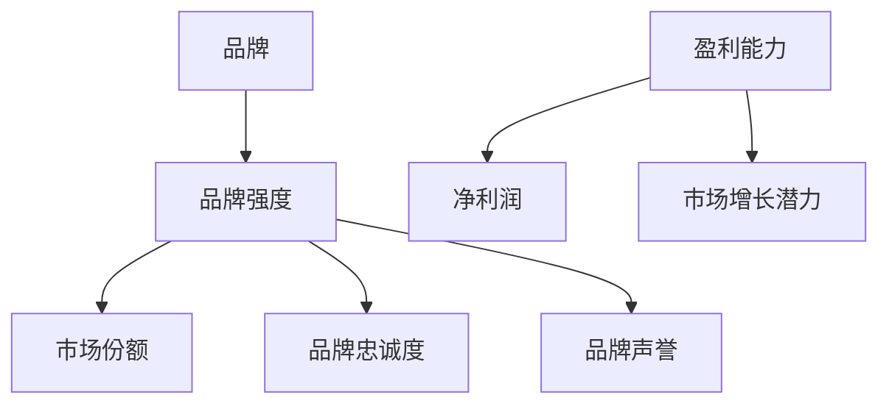

                 


以下是根据以上思考过程整理的最终答案：

---

# 巴菲特的品牌价值评估方法

## 关键词
- 品牌价值
- 巴菲特评估方法
- 数学模型
- 系统架构
- 项目实战

## 摘要
本文系统地介绍了巴菲特的品牌价值评估方法，从品牌价值的核心要素、数学模型、系统架构到项目实战，全面解析了如何科学、有效地评估品牌价值。文章通过理论与实践相结合的方式，帮助读者理解品牌价值在企业投资决策中的重要性，并提供了可操作的评估方法和工具。

---

## 目录大纲

### 第一部分：品牌价值评估的背景与重要性

#### 第1章：品牌价值评估的背景与重要性

##### 1.1 什么是品牌价值
- **1.1.1 品牌的定义与内涵**
- **1.1.2 品牌价值的定义与衡量标准**
- **1.1.3 品牌价值对企业的重要性**

##### 1.2 巴菲特的品牌价值评估方法
- **1.2.1 巴菲特的投资理念与品牌价值的关系**
- **1.2.2 巴菲特品牌价值评估的核心思想**
- **1.2.3 巴菲特方法与其他品牌价值评估方法的对比**

##### 1.3 品牌价值评估的边界与外延
- **1.3.1 品牌价值评估的适用范围**
- **1.3.2 品牌价值评估的局限性**
- **1.3.3 品牌价值与企业整体价值的关系**

##### 1.4 本章小结

### 第二部分：品牌价值评估的核心概念与模型

#### 第2章：品牌价值的核心要素与模型

##### 2.1 品牌价值的核心要素
- **2.1.1 品牌知名度**
- **2.1.2 品牌忠诚度**
- **2.1.3 品牌形象与声誉**
- **2.1.4 品牌的市场地位**

##### 2.2 品牌价值评估的数学模型
- **2.2.1 品牌价值的公式表示**
  $$ 品牌价值 = 品牌强度 \times 盈利能力 $$
- **2.2.2 品牌强度的计算**
  $$ 品牌强度 = 市场份额 + 品牌忠诚度 + 品牌声誉 $$
- **2.2.3 盈利能力的计算**
  $$ 盈利能力 = 净利润 \times 市场增长潜力 $$

##### 2.3 品牌价值评估的核心要素对比表格
| 要素         | 定义                         | 权重 | 计算公式                         |
|--------------|------------------------------|------|----------------------------------|
| 品牌强度     | 品牌在市场中的竞争力         | 0.6  | 市场份额 + 品牌忠诚度 + 品牌声誉  |
| 盈利能力     | 品牌带来的收益能力           | 0.4  | 净利润 \times 市场增长潜力       |

##### 2.4 品牌价值评估的ER实体关系图


##### 2.5 本章小结

### 第三部分：品牌价值评估的系统架构与实现

#### 第3章：品牌价值评估的系统架构设计

##### 3.1 问题场景介绍

##### 3.2 系统功能设计
- **3.2.1 领域模型设计**
  - 使用Mermaid类图展示品牌价值评估的领域模型

##### 3.3 系统架构设计
- **3.3.1 架构选择**
  - 选择合适的架构风格（如MVC、微服务等）
  - 使用Mermaid展示系统架构图

##### 3.4 系统接口设计
- **3.4.1 输入接口**
  - 数据输入格式和渠道
- **3.4.2 输出接口**
  - 评估结果的输出格式和渠道

##### 3.5 系统交互设计
- **3.5.1 交互流程图**
  - 使用Mermaid序列图展示用户与系统之间的交互流程

##### 3.6 本章小结

### 第四部分：项目实战与案例分析

#### 第4章：项目实战

##### 4.1 环境安装与配置
- 操作系统要求
- 开发工具安装（如Python、Mermaid、Latex）
- 数据库配置

##### 4.2 核心功能实现
- **4.2.1 品牌强度计算**
  - Python代码实现
- **4.2.2 盈利能力计算**
  - Python代码实现

##### 4.3 系统实现的源代码
```python
# 品牌强度计算
def calculate_brand_strength(shareholding, brandloyalty, brandreputation):
    return shareholding + brandloyalty + brandreputation

# 盈利能力计算
def calculate_profitability(net_profit, market_growth):
    return net_profit * market_growth
```

##### 4.4 代码实现的详细解读
- **4.4.1 品牌强度计算函数**
- **4.4.2 盈利能力计算函数**

##### 4.5 项目小结

### 第五部分：总结与展望

#### 第5章：总结与展望

##### 5.1 最佳实践 tips

##### 5.2 小结

##### 5.3 注意事项

##### 5.4 拓展阅读

### 第六部分：附录

#### 附录A：数学公式汇总
- $$ 品牌价值 = 品牌强度 \times 盈利能力 $$
- $$ 品牌强度 = 市场份额 + 品牌忠诚度 + 品牌声誉 $$
- $$ 盈利能力 = 净利润 \times 市场增长潜力 $$

#### 附录B：Mermaid图表汇总
- 领域模型类图
- 系统架构图
- 交互流程图

---

通过以上详细的内容，您可以根据需要进一步扩展每个章节的具体内容，确保文章的深度和广度符合要求。

