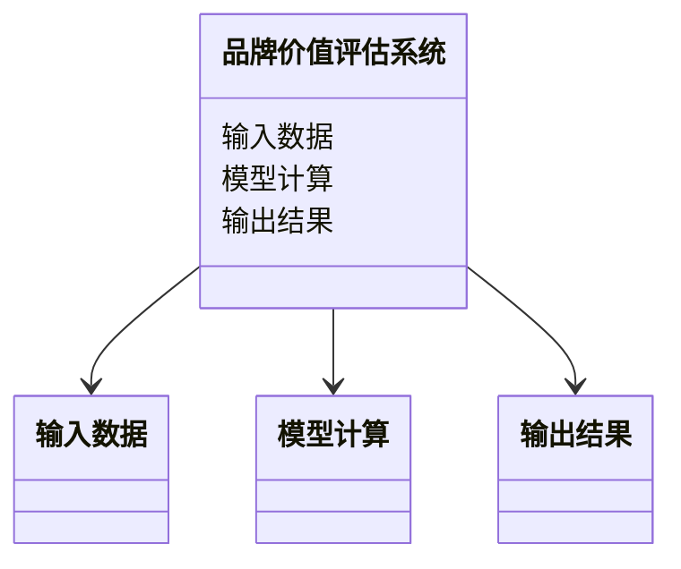
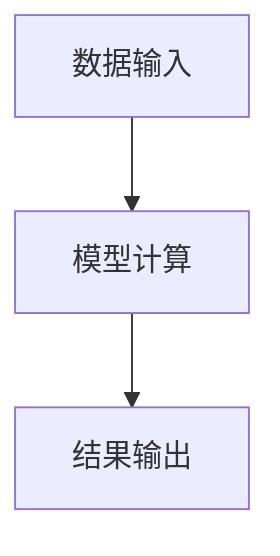
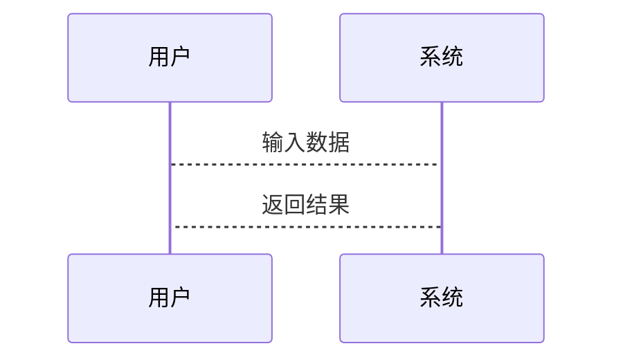

                 


# 巴菲特的品牌价值评估：无形资产在企业价值中的重要性

> 关键词：巴菲特，品牌价值评估，无形资产，企业价值，品牌资产，投资评估

> 摘要：本文深入探讨巴菲特的品牌价值评估方法，分析无形资产在企业价值中的重要性。通过背景介绍、核心概念、数学模型、系统设计、项目实战等多角度，详细阐述品牌价值的评估方法和其对企业的深远影响。

---

# 第一部分：品牌价值评估的背景与重要性

## 第1章：品牌价值评估的背景与重要性

### 1.1 品牌价值评估的定义与背景

#### 1.1.1 什么是品牌价值
品牌价值是指品牌在市场上的影响力和为企业带来的超额收益。它不仅是企业资产的一部分，也是决定企业市场地位的关键因素。

#### 1.1.2 品牌价值评估的重要性
品牌价值评估能帮助企业量化品牌资产，指导投资决策，优化资源配置。在数字时代，品牌价值的变化对企业的影响更加显著。

#### 1.1.3 巴菲特投资理念中的品牌价值
巴菲特认为品牌价值是企业长期盈利能力的关键因素。他倾向于投资具有强大品牌影响力的企业，因为这些企业具有持续竞争优势。

### 1.2 无形资产在企业价值中的地位

#### 1.2.1 无形资产的定义与分类
无形资产包括品牌、专利、商誉等，它们无法直接用物理形式表现，但对企业价值贡献显著。

#### 1.2.2 无形资产对企业价值的影响
无形资产通过提升客户忠诚度、降低市场竞争压力，为企业创造长期价值。

#### 1.2.3 巴菲特对无形资产的重视
巴菲特认为强大的无形资产（如品牌）能为企业提供定价权，从而在竞争中占据优势。

### 1.3 品牌价值评估的挑战与机遇

#### 1.3.1 品牌价值评估的复杂性
品牌价值受多种因素影响，如消费者认知、市场环境等，评估难度大。

#### 1.3.2 数字化时代品牌价值的变化
数字化使品牌传播更广泛，但同时也带来了新的挑战，如信息透明化对企业声誉的影响。

#### 1.3.3 企业如何利用品牌价值提升竞争力
通过加强品牌建设、提升品牌忠诚度，企业可以增强市场地位，创造更多价值。

### 1.4 本章小结
本章介绍了品牌价值的定义、重要性，以及巴菲特对品牌价值的重视。同时，分析了无形资产在企业价值中的作用，并探讨了品牌价值评估面临的挑战与机遇。

---

## 第2章：品牌价值的核心概念与评估方法

### 2.1 品牌价值的核心概念

#### 2.1.1 品牌的核心要素
品牌的核心要素包括品牌名称、品牌标识、品牌承诺等，这些要素共同构建了品牌的价值基础。

#### 2.1.2 品牌价值的层次结构
品牌价值可以分为品牌知名度、品牌忠诚度、品牌影响力等多个层次，不同层次相互影响，共同决定品牌价值。

#### 2.1.3 品牌价值与企业利润的关系
品牌价值的提升通常会带来企业利润的增长，因为品牌溢价能力增强，客户忠诚度提高。

### 2.2 品牌价值的评估方法

#### 2.2.1 基于财务数据的评估方法
通过分析企业的财务报表，如净利润、市场份额等，间接评估品牌价值。

#### 2.2.2 基于市场表现的评估方法
通过股票市场表现、市盈率等指标，评估品牌对企业市值的影响。

#### 2.2.3 基于消费者认知的评估方法
通过市场调研、消费者调查等，量化品牌在消费者心中的价值。

### 2.3 品牌价值评估的指标体系

#### 2.3.1 品牌知名度的测量
品牌知名度是品牌价值的重要指标，可通过市场份额、广告覆盖率等数据进行评估。

#### 2.3.2 品牌忠诚度的测量
品牌忠诚度反映了消费者对品牌的偏好程度，可通过顾客满意度调查、重复购买率等指标衡量。

#### 2.3.3 品牌影响力指数的计算
品牌影响力指数综合考虑品牌知名度、市场地位、媒体关注度等因素，通过加权计算得出。

### 2.4 巴菲特的品牌价值评估框架

#### 2.4.1 巴菲特的品牌价值评估标准
巴菲特注重品牌长期稳定性、市场领导地位和持续盈利能力，这些标准构成了他的品牌价值评估框架。

#### 2.4.2 巴菲特对品牌价值的权重分配
在企业整体价值中，品牌价值占据重要比重，巴菲特通常会赋予品牌价值较高的权重。

#### 2.4.3 巴菲特品牌价值评估的案例分析
以可口可乐为例，巴菲特认为其强大的品牌影响力和市场地位是投资价值的重要来源。

### 2.5 本章小结
本章详细阐述了品牌价值的核心概念，并介绍了多种评估方法，重点分析了巴菲特的品牌价值评估框架和实际案例。

---

## 第3章：品牌价值评估的理论基础与数学模型

### 3.1 品牌价值评估的理论基础

#### 3.1.1 资产定价模型与品牌价值
资产定价模型（如CAPM）为企业品牌价值的评估提供了理论依据，帮助确定品牌价值的合理区间。

#### 3.1.2 股权资本成本与品牌价值的关系
品牌价值与股权资本成本密切相关，强大的品牌能够降低资本成本，提升企业价值。

#### 3.1.3 市场价值与账面价值的差异
市场价值反映品牌溢价能力，账面价值仅反映有形资产，品牌价值的差异性决定了企业市场价值的波动。

### 3.2 品牌价值评估的数学模型

#### 3.2.1 基于CAPM的品牌价值评估模型
CAPM模型用于计算品牌价值时，需考虑无风险利率、市场预期回报率和贝塔系数等因素。

$$ \text{CAPM} = R_f + \beta (R_m - R_f) $$

其中，$R_f$ 是无风险利率，$R_m$ 是市场预期回报率，$\beta$ 是贝塔系数。

#### 3.2.2 品牌价值的加权计算公式
品牌价值可以通过对企业未来现金流的贴现值加权计算。

$$ \text{Bra} = \sum_{t=1}^{n} \frac{CF_t}{(1 + r)^t} $$

其中，$CF_t$ 是第$t$年的现金流，$r$ 是折现率，$n$ 是评估期。

#### 3.2.3 品牌价值与企业未来现金流的关系
品牌价值影响企业的未来现金流，强大的品牌能够带来更高的收入和利润，从而提升现金流的价值。

### 3.3 品牌价值评估的公式与案例

#### 3.3.1 CAPM模型的公式推导
CAPM模型通过考虑系统风险和非系统风险，确定资产的预期回报率，进而评估品牌价值。

$$ \text{Expected Return} = R_f + \beta (R_m - R_f) $$

#### 3.3.2 品牌价值加权公式
通过加权计算，品牌价值反映了企业未来现金流的贴现值，为投资决策提供依据。

$$ \text{Bra} = \sum_{t=1}^{n} \frac{CF_t}{(1 + r)^t} $$

#### 3.3.3 品牌价值与企业未来现金流的关系
品牌价值与企业未来现金流密切相关，强大的品牌能够提高企业的定价能力，从而增加未来现金流。

### 3.4 本章小结
本章通过数学模型和公式，详细阐述了品牌价值评估的理论基础，重点介绍了CAPM模型和加权计算公式，并通过案例分析说明了品牌价值与未来现金流的关系。

---

## 第4章：品牌价值评估的系统分析与架构设计

### 4.1 问题场景介绍

#### 4.1.1 品牌价值评估的复杂性
品牌价值受多种因素影响，如市场环境、消费者行为、企业战略等，评估过程复杂。

#### 4.1.2 品牌价值评估的目标
通过系统分析，量化品牌价值，为企业决策提供支持。

### 4.2 系统功能设计

#### 4.2.1 领域模型设计
领域模型展示了品牌价值评估的核心模块，包括数据输入、模型计算、结果输出等。



#### 4.2.2 系统架构设计
系统架构展示了各模块之间的关系，包括数据层、计算层、结果层。



#### 4.2.3 系统接口设计
系统接口包括数据输入接口、模型调用接口和结果输出接口，确保各模块协同工作。

#### 4.2.4 系统交互设计
系统交互流程展示了用户如何与系统互动，从数据输入到结果输出的全过程。



### 4.3 本章小结
本章通过系统分析，设计了品牌价值评估的系统架构和交互流程，为实际应用提供了理论支持。

---

## 第5章：品牌价值评估的项目实战

### 5.1 环境安装与配置

#### 5.1.1 安装Python环境
安装Python 3.x版本，确保环境满足后续代码运行需求。

#### 5.1.2 安装依赖库
安装必要的Python库，如numpy、pandas、scipy等，用于数据处理和计算。

#### 5.1.3 配置评估模型
准备评估模型所需的参数，如无风险利率、市场预期回报率等。

### 5.2 核心代码实现

#### 5.2.1 数据预处理
读取数据、清洗数据，确保数据质量。

```python
import pandas as pd

data = pd.read_csv('brand_data.csv')
data = data.dropna()
```

#### 5.2.2 模型计算
使用CAPM模型计算品牌价值。

```python
import numpy as np

def calculate_brand_value(data):
    Rf = 0.05
    Rm = 0.1
    beta = data['beta'].values[0]
    expected_return = Rf + beta * (Rm - Rf)
    return expected_return

brand_value = calculate_brand_value(data)
print(f"Brand Value: {brand_value}")
```

#### 5.2.3 结果解读
对计算结果进行分析，解释品牌价值对企业的影响。

### 5.3 案例分析与总结

#### 5.3.1 案例分析
以具体企业为例，展示品牌价值评估的过程和结果。

#### 5.3.2 结果分析
分析评估结果，识别品牌价值的关键驱动因素，为企业决策提供支持。

### 5.4 本章小结
本章通过项目实战，展示了品牌价值评估的具体实施过程，从环境配置到代码实现，再到案例分析，帮助读者掌握实际操作方法。

---

## 第6章：最佳实践与总结

### 6.1 最佳实践

#### 6.1.1 数据收集与处理
确保数据的准确性和完整性，选择合适的指标进行评估。

#### 6.1.2 模型选择与优化
根据实际情况选择合适的评估模型，并不断优化模型参数，提高评估精度。

#### 6.1.3 结果验证与反馈
通过实际案例验证评估结果，及时调整评估策略，确保结果的准确性。

### 6.2 小结与展望

#### 6.2.1 本章小结
总结全文，重申品牌价值评估的重要性，以及其在企业价值中的关键作用。

#### 6.2.2 未来展望
展望品牌价值评估的发展趋势，如人工智能在评估中的应用，数据驱动的品牌管理等。

### 6.3 注意事项

#### 6.3.1 数据依赖性
品牌价值评估高度依赖数据质量，数据偏差可能影响评估结果。

#### 6.3.2 模型局限性
评估模型具有局限性，需结合实际情况进行调整和优化。

### 6.4 拓展阅读

#### 6.4.1 推荐书籍
推荐相关书籍，如《巴菲特的智慧》、《品牌管理》等，帮助读者深入学习。

#### 6.4.2 在线资源
推荐相关的在线课程、论坛和博客，供读者进一步学习和交流。

### 6.5 本章小结
本章总结了品牌价值评估的最佳实践，提供了未来的发展方向，并提醒读者注意评估中的常见问题。

---

## 第7章：总结与致谢

### 7.1 总结

#### 7.1.1 品牌价值评估的重要性
品牌价值是企业核心资产之一，直接影响企业市场价值和长期盈利能力。

#### 7.1.2 无形资产的战略意义
无形资产（如品牌）在企业竞争中占据重要地位，是企业核心竞争力的关键因素。

### 7.2 致谢
感谢读者的支持和关注，感谢在撰写过程中提供帮助的团队和资源。

### 7.3 声明

#### 7.3.1 版权声明
本文版权归作者所有，转载请注明出处。

#### 7.3.2 免责声明
本文内容仅供参考，具体操作请结合实际情况，作者不承担任何责任。

---

# 结语

通过本文的详细阐述，读者可以全面了解巴菲特的品牌价值评估方法，掌握无形资产在企业价值中的重要性。希望本文能为企业的品牌管理、投资决策提供有价值的参考和指导。

--- 

感谢您的耐心阅读！如果本文对您有所帮助，欢迎关注我的技术博客，获取更多深度技术内容。

