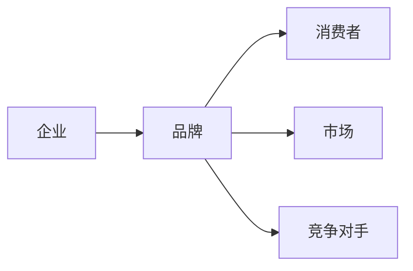
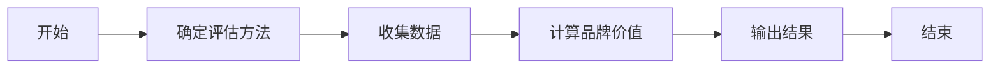
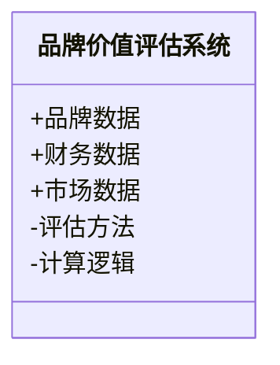
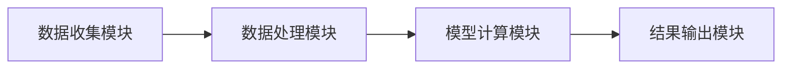
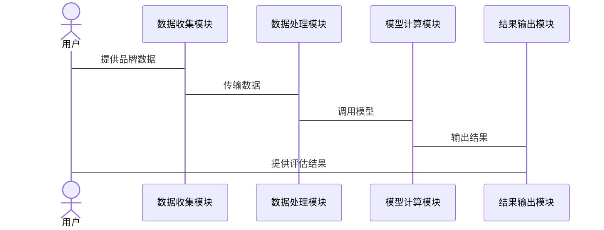

                 


# 巴菲特的品牌价值评估：无形资产的重要性

> 关键词：巴菲特，品牌价值，无形资产，价值评估，投资策略

> 摘要：本文深入探讨了巴菲特在品牌价值评估中的独特视角，重点分析了无形资产在企业估值中的重要性。通过结合技术分析和投资策略，本文详细阐述了如何从品牌忠诚度、市场影响力和企业核心竞争力等多个维度进行品牌价值评估，揭示了巴菲特投资理念中的无形资产考量。

---

## 第一部分：品牌价值评估的背景与重要性

### 第1章：品牌价值评估的背景与重要性

#### 1.1 无形资产与品牌价值的定义

##### 1.1.1 无形资产的定义与特征
无形资产是指企业拥有或控制的，没有实物形态的长期资产，包括品牌、专利、商标、客户关系、商誉等。其主要特征包括：

1. **非物质性**：无形资产没有实物形态，依赖于企业的声誉和市场认知。
2. **长期性**：无形资产的使用寿命通常较长，能够为企业带来持续的价值。
3. **可变性**：无形资产的价值可能因市场环境、竞争状况等因素而变化。

| 无形资产类型 | 特征 | 示例 |
|--------------|------|------|
| 品牌          | 可识别、依赖市场认知 | 可口可乐、苹果 |
| 专利          | 法律保护、技术独占 | 发明专利、实用新型 |
| 商誉          | 企业整体价值的组成部分 | 收购产生的商誉 |

##### 1.1.2 品牌价值的定义与构成
品牌价值是指品牌在市场中所代表的经济价值，通常表现为品牌对消费者、企业自身以及市场的影响力。品牌价值的构成包括：

1. **品牌知名度**：品牌在市场中的认知度和曝光度。
2. **品牌忠诚度**：消费者对品牌的偏好和忠诚程度。
3. **品牌关联性**：品牌与产品或服务的匹配程度。
4. **品牌声誉**：品牌在市场中的信誉和形象。

##### 1.1.3 无形资产与品牌价值的区别与联系
- **区别**：无形资产是一个更广泛的类别，包括品牌、专利、商标等；品牌价值是无形资产中的一部分，专注于品牌在市场中的经济价值。
- **联系**：品牌价值是企业整体价值的重要组成部分，无形资产的评估需要考虑品牌价值的影响。

#### 1.2 品牌价值评估的必要性

##### 1.2.1 企业价值评估的传统方法
传统的企业价值评估方法通常包括：

1. **资产基础法**：基于企业的资产和负债进行评估。
2. **收益法**：基于企业的未来现金流进行评估。
3. **市场法**：基于可比企业的市场价值进行评估。

##### 1.2.2 品牌价值对企业整体价值的贡献
品牌价值是企业整体价值的重要组成部分，尤其是在品牌忠诚度高、市场影响力大的企业中，品牌价值的贡献尤为显著。

##### 1.2.3 无形资产在企业估值中的重要性
无形资产的价值往往难以通过财务报表直接反映，但其对企业整体价值的影响不容忽视。例如，强大的品牌可以带来更高的客户忠诚度和市场占有率，从而提升企业的盈利能力。

#### 1.3 巴菲特投资理念中的品牌价值

##### 1.3.1 巴菲特的价值投资理念概述
巴菲特的价值投资理念强调以低于内在价值的价格买入优质企业。他认为，企业品牌价值是企业内在价值的重要组成部分。

##### 1.3.2 品牌价值在巴菲特投资决策中的地位
巴菲特倾向于投资那些具有强大品牌价值和市场地位的企业，例如可口可乐和IBM。他认为，强大的品牌价值能够为企业带来持续的竞争优势和盈利能力。

##### 1.3.3 巴菲特对品牌忠诚度的重视
巴菲特认为，品牌忠诚度是品牌价值的重要体现。消费者对品牌的忠诚度越高，企业的市场地位越稳固，品牌价值也越大。

---

## 第二部分：品牌价值评估的核心概念与联系

### 第2章：品牌价值评估的核心概念与联系

#### 2.1 无形资产的分类与属性特征

##### 2.1.1 无形资产的分类
无形资产可以分为以下几类：

1. **可识别无形资产**：如专利、商标、品牌等，能够单独识别。
2. **不可识别无形资产**：如商誉，无法单独识别。

##### 2.1.2 不同类型无形资产的属性对比
| 资产类型 | 可识别性 | 使用寿命 | 价值评估 |
|----------|----------|----------|----------|
| 品牌      | 可识别   | 长期     | 高       |
| 专利      | 可识别   | 法律保护 | 中       |
| 商誉      | 不可识别 | 长期     | 高       |

##### 2.1.3 品牌价值与企业其他无形资产的关系
品牌价值是企业整体价值的重要组成部分，与其他无形资产如专利、商誉等密切相关。例如，强大的品牌价值可以提升专利的市场价值，而专利的保护则有助于维护品牌的价值。

#### 2.2 品牌价值评估的实体关系图



---

## 第三部分：品牌价值评估的算法原理

### 第3章：品牌价值评估的算法原理

#### 3.1 品牌价值评估的主要方法

##### 3.1.1 基于财务指标的评估方法
基于财务指标的评估方法包括：

1. **市盈率法**：通过企业的市盈率与行业平均水平进行比较，评估品牌价值。
2. **市净率法**：通过企业的市净率与行业平均水平进行比较，评估品牌价值。

##### 3.1.2 基于市场表现的评估方法
基于市场表现的评估方法包括：

1. **市场比较法**：通过比较同类企业的市场表现，评估品牌价值。
2. **品牌倍数法**：通过品牌的市场倍数与行业平均水平进行比较，评估品牌价值。

##### 3.1.3 基于消费者认知的评估方法
基于消费者认知的评估方法包括：

1. **品牌认知度调查**：通过消费者调查，评估品牌的认知度和忠诚度。
2. **品牌资产模型**：通过品牌资产模型（如Aaker的品牌资产模型）评估品牌价值。

#### 3.2 品牌价值评估的数学模型

##### 3.2.1 品牌价值评估的加权模型

$$ 品牌价值 = \sum_{i=1}^{n} w_i \times f_i $$

其中，\( w_i \) 是第 \( i \) 个因素的权重，\( f_i \) 是第 \( i \) 个因素的评估值。

##### 3.2.2 品牌价值评估的流程图



---

## 第四部分：系统分析与架构设计

### 第4章：系统分析与架构设计

#### 4.1 问题场景介绍

##### 4.1.1 系统目标
系统的目标是基于品牌价值评估的方法，构建一个品牌价值评估系统，帮助企业准确评估品牌价值。

##### 4.1.2 系统范围
系统范围包括品牌价值评估的各个步骤，从数据收集到结果输出。

##### 4.1.3 系统功能
系统功能包括数据收集、数据处理、模型计算和结果输出。

#### 4.2 系统功能设计

##### 4.2.1 领域模型设计



##### 4.2.2 系统架构设计



##### 4.2.3 系统接口设计
系统接口包括数据输入接口、数据输出接口和模型调用接口。

##### 4.2.4 系统交互设计



---

## 第五部分：项目实战

### 第5章：项目实战

#### 5.1 环境配置

##### 5.1.1 系统环境
建议使用Python 3.8及以上版本，安装必要的库，如pandas、numpy、scikit-learn。

##### 5.1.2 数据来源
数据可以从公开的市场数据源获取，如Yahoo Finance、Google Trends等。

#### 5.2 核心实现

##### 5.2.1 数据收集
```python
import pandas as pd

# 示例代码：从Yahoo Finance获取数据
data = pd.read_csv('http://query1.finance.yahoo.com/chart/可口可乐')
print(data.head())
```

##### 5.2.2 模型训练
```python
from sklearn import linear_model

# 示例代码：线性回归模型
model = linear_model.LinearRegression()
model.fit(X, y)
```

##### 5.2.3 结果分析
```python
# 示例代码：模型预测
print(model.predict(new_data))
```

#### 5.3 实际案例分析

##### 5.3.1 案例介绍
以可口可乐为例，分析其品牌价值。

##### 5.3.2 数据分析
分析可口可乐的品牌忠诚度、市场占有率等指标。

##### 5.3.3 模型应用
应用上述模型，评估可口可乐的品牌价值。

#### 5.4 项目小结
总结项目实施过程中的关键点和经验教训。

---

## 第六部分：最佳实践与小结

### 第6章：最佳实践与小结

#### 6.1 最佳实践

##### 6.1.1 数据收集
确保数据的准确性和完整性。

##### 6.1.2 模型选择
根据具体需求选择合适的模型。

##### 6.1.3 结果解读
注重结果的可解释性和实际应用价值。

#### 6.2 小结
本文从品牌价值评估的背景、核心概念、算法原理、系统架构、项目实战和最佳实践等多个方面进行了详细阐述，揭示了无形资产在品牌价值评估中的重要性。

#### 6.3 注意事项
在实际应用中，需要注意数据的局限性和模型的适用性。

#### 6.4 拓展阅读
推荐相关书籍和论文，供读者深入学习。

---

通过本文的分析，读者可以全面理解巴菲特的品牌价值评估理念，并掌握无形资产在品牌价值评估中的重要性。希望本文能为读者提供有价值的见解和实用的知识。

