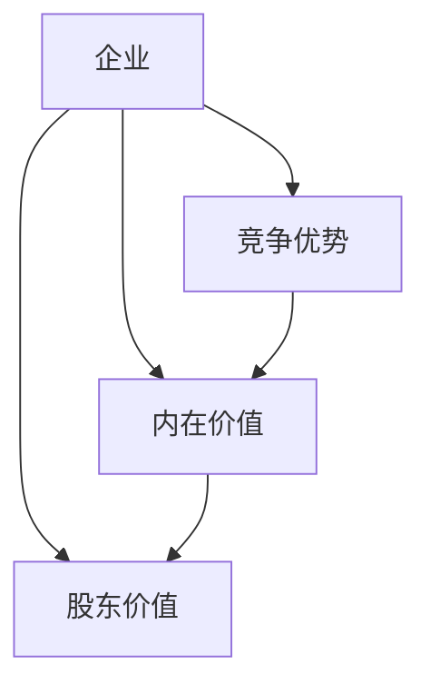
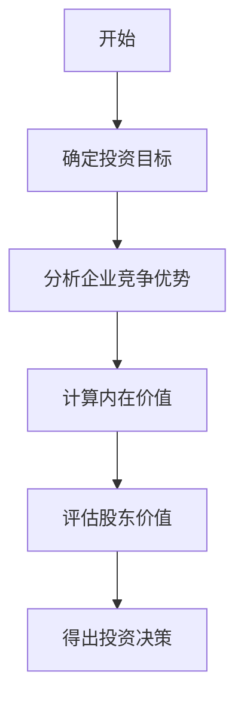

                 


# 巴菲特的商业模式可扩展性分析

## 关键词：巴菲特、商业模式、可扩展性、价值投资、内在价值、股东价值、竞争优势

## 摘要：本文系统地分析了巴菲特的商业模式及其可扩展性。通过探讨其核心概念、算法原理、系统架构及实际案例，展示了巴菲特的投资哲学如何在不同企业中应用，并总结了最佳实践和注意事项。

---

## 第一部分: 巴菲特的商业模式与可扩展性分析

### 第1章: 巴菲特投资哲学与商业模式概述

#### 1.1 巴菲特的投资哲学

- **1.1.1 价值投资的核心理念**
  巴菲特的价值投资理念强调购买低于内在价值的股票，长期持有优秀企业，而非频繁交易。他注重企业的长期盈利能力，而非短期市场波动。

- **1.1.2 巴菲特的长期投资策略**
  巴菲特认为投资是通过时间的积累来实现财富增长的过程，他偏好那些具有持续竞争优势的企业，这些企业能够在市场中长期保持领先地位。

- **1.1.3 巴菲特商业模式的形成背景**
  巴菲特的商业模式建立在其长期投资哲学之上，结合了对企业内在价值的深刻理解以及对市场波动的洞察。

#### 1.2 巴菲特商业模式的核心要素

- **1.2.1 企业竞争优势分析**
  巴菲特的商业模式强调分析企业的竞争优势，包括成本优势、品牌优势、技术优势等。这些优势决定了企业在市场中的地位和盈利能力。

- **1.2.2 内在价值评估方法**
  内在价值是企业未来现金流的现值，巴菲特通过分析企业的财务数据和市场环境来评估其内在价值。这种方法是巴菲特投资决策的核心工具。

- **1.2.3 股东价值创造的路径**
  巴菲特通过选择具有持续竞争优势和高内在价值的企业，为股东创造长期价值。他注重企业的盈利能力、现金流和分红能力，这些都是创造股东价值的关键因素。

#### 1.3 巴菲特商业模式的成功案例

- **1.3.1 可口可乐的长期投资案例**
  巴菲特投资可口可乐是因为其强大的品牌优势和稳定的现金流。可口可乐的商业模式具有高度的可扩展性，能够在全球范围内扩张，为股东创造持续价值。

- **1.3.2 苹果公司的投资逻辑**
  苹果公司作为科技行业的领导者，具有强大的创新能力和市场影响力。巴菲特的投资逻辑是基于苹果公司的长期竞争优势和高内在价值。

- **1.3.3 其他经典投资案例分析**
  除了可口可乐和苹果，巴菲特还投资了多家具有长期竞争优势的企业，如富国银行和卡夫食品。这些案例展示了巴菲特商业模式的多样性和可扩展性。

#### 1.4 巴菲特商业模式的可扩展性

- **1.4.1 可扩展性的定义与衡量标准**
  可扩展性是指商业模式在不同市场、规模和环境下能够复制和扩展的能力。衡量标准包括企业的市场占有率、品牌影响力、管理能力以及财务稳定性。

- **1.4.2 巴菲特商业模式的可扩展性特点**
  巴菲特的商业模式具有高度的可扩展性，主要体现在其对企业竞争优势的深刻理解、内在价值的准确评估以及股东价值创造的持续能力。

- **1.4.3 可扩展性在投资决策中的作用**
  可扩展性是巴菲特投资决策的重要考量因素。他倾向于选择那些能够在不同市场环境下保持竞争优势并持续创造价值的企业。

#### 1.5 本章小结

本章通过对巴菲特投资哲学和商业模式的概述，详细分析了其核心要素和成功案例，探讨了其商业模式的可扩展性及其在投资决策中的作用。

---

## 第二部分: 巴菲特商业模式的核心概念与联系

### 第2章: 巴菲特商业模式的核心概念与联系

#### 2.1 巴菲特商业模式的核心概念

- **2.1.1 企业竞争优势的构成要素**
  企业竞争优势包括成本优势、品牌优势、技术优势、市场占有率和管理能力。这些要素共同决定了企业的市场地位和盈利能力。

- **2.1.2 内在价值的计算模型**
  内在价值是未来现金流的现值，计算公式为：
  $$\text{内在价值} = \frac{\text{未来现金流}}{\text{贴现率}}$$

- **2.1.3 股东价值创造的驱动因素**
  股东价值创造的驱动因素包括企业的盈利能力、现金流、分红能力以及管理效率。这些因素共同决定了企业的股东价值。

#### 2.2 核心概念的属性特征对比

- **2.2.1 企业竞争优势的属性特征**
  企业竞争优势具有稳定性、可复制性和持续性的特点。稳定的企业竞争优势能够在不同市场环境下保持企业的领先地位。

- **2.2.2 内在价值的属性特征**
  内在价值具有客观性、动态性和可计算性的特点。内在价值的计算需要考虑企业的未来现金流和贴现率。

- **2.2.3 股东价值创造的属性特征**
  股东价值创造具有长期性、累积性和可持续性的特点。股东价值的创造需要企业在长期发展中持续创造价值。

#### 2.3 ER实体关系图架构



图中展示了企业、竞争优势、内在价值和股东价值之间的关系。企业通过竞争优势影响内在价值，进而影响股东价值。

#### 2.4 核心概念的联系

- **2.4.1 企业竞争优势与内在价值的关系**
  企业竞争优势是内在价值的核心驱动因素。强大的竞争优势能够提高企业的未来现金流，从而增加内在价值。

- **2.4.2 内在价值与股东价值创造的关系**
  内在价值是股东价值创造的基础。企业的内在价值越高，能够为股东创造的价值越大。

- **2.4.3 核心概念的相互作用与影响**
  企业竞争优势、内在价值和股东价值创造之间相互作用，共同构成了巴菲特商业模式的核心逻辑。

#### 2.5 本章小结

本章详细分析了巴菲特商业模式的核心概念，包括企业竞争优势、内在价值和股东价值创造，并通过ER实体关系图展示了这些概念之间的联系。

---

## 第三部分: 巴菲特商业模式的算法原理讲解

### 第3章: 巴菲特商业模式的算法原理讲解

#### 3.1 巴菲特商业模式的数学模型

- **3.1.1 内在价值计算公式**
  $$\text{内在价值} = \frac{\text{未来现金流}}{\text{贴现率}}$$

  该公式用于计算企业的内在价值，其中未来现金流和贴现率是关键输入变量。

- **3.1.2 股东价值创造的数学表达**
  $$\text{股东价值} = \text{企业价值} - \text{债务价值}$$

  该公式展示了股东价值与企业价值和债务价值之间的关系。

#### 3.2 巴菲特商业模式的算法流程



图中展示了巴菲特商业模式的算法流程，从确定投资目标开始，到分析企业竞争优势，计算内在价值，评估股东价值，最后得出投资决策。

#### 3.3 算法实现与代码解读

```python
def calculate_intrinsic_value(future_cash_flows, discount_rate):
    return sum(future_cash_flows) / (1 + discount_rate)

# 示例应用
future_cash_flows = [100, 200, 300]  # 假设未来现金流
discount_rate = 0.10  # 假设贴现率为10%
intrinsic_value = calculate_intrinsic_value(future_cash_flows, discount_rate)
print(f"企业的内在价值为：{intrinsic_value}")
```

该代码实现了一个简单的内在价值计算函数，展示了如何通过未来现金流和贴现率计算内在价值。

#### 3.4 本章小结

本章通过数学模型和算法流程图，详细讲解了巴菲特商业模式的算法原理，并通过Python代码展示了其实际应用。

---

## 第四部分: 巴菲特商业模式的系统分析与架构设计

### 第4章: 巴菲特商业模式的系统分析与架构设计

#### 4.1 问题场景介绍

- **4.1.1 问题背景**
  在当前复杂多变的经济环境下，投资者需要借助系统化的工具和方法来进行投资决策。

- **4.1.2 问题描述**
  本文提出了一种基于巴菲特商业模式的可扩展性分析系统，旨在帮助投资者更好地理解和应用巴菲特的投资哲学。

- **4.1.3 问题解决**
  通过系统化的分析和设计，本文提出了一个能够支持巴菲特商业模式的可扩展性分析的系统架构。

#### 4.2 系统功能设计

- **4.2.1 领域模型设计**
  ```mermaid
  classDiagram
      class 企业 {
          竞争优势
          内在价值
          股东价值
      }
      class 投资决策 {
          投资目标
          投资策略
      }
      企业 --> 投资决策
  ```

  领域模型展示了企业和投资决策之间的关系，体现了巴菲特商业模式的核心逻辑。

- **4.2.2 系统架构设计**
  ```mermaid
  graph TD
      A[用户界面] --> B[业务逻辑层]
      B --> C[数据访问层]
      C --> D[数据存储]
  ```

  系统架构图展示了系统的分层结构，包括用户界面、业务逻辑层、数据访问层和数据存储。

- **4.2.3 系统接口设计**
  - 用户界面提供投资目标设定、企业竞争优势分析、内在价值计算等功能。
  - 业务逻辑层负责处理用户的请求并调用数据访问层的接口。
  - 数据访问层负责与数据存储进行交互，提供数据的存取功能。

- **4.2.4 系统交互设计**
  ```mermaid
  sequenceDiagram
      用户 --> 界面层: 输入投资目标
      界面层 --> 业务逻辑层: 分析企业竞争优势
      业务逻辑层 --> 数据访问层: 计算内在价值
      数据访问层 --> 数据存储: 获取未来现金流
      数据访问层 --> 业务逻辑层: 返回内在价值
      业务逻辑层 --> 界面层: 展示投资决策
      界面层 --> 用户: 输出结果
  ```

  系统交互图展示了用户与系统之间的交互流程，从输入投资目标到输出投资决策。

#### 4.3 本章小结

本章通过对问题场景的分析，设计了一个基于巴菲特商业模式的可扩展性分析系统，展示了系统的功能模块和架构设计。

---

## 第五部分: 巴菲特商业模式的项目实战

### 第5章: 巴菲特商业模式的项目实战

#### 5.1 项目介绍

- **5.1.1 项目目标**
  本项目旨在通过实际案例分析，展示巴菲特商业模式的可扩展性及其在投资决策中的应用。

- **5.1.2 项目范围**
  本项目选择可口可乐和苹果作为分析对象，探讨其商业模式的可扩展性。

- **5.1.3 项目团队**
  项目团队由投资者、分析师和开发人员组成，共同完成项目的分析和实现。

#### 5.2 项目核心实现

- **5.2.1 环境安装**
  项目需要安装Python编程语言和相关库，如pandas和numpy。

- **5.2.2 核心代码实现**
  ```python
  import pandas as pd
  import numpy as np

  def calculate_intrinsic_value(future_cash_flows, discount_rate):
      return np.npv(discount_rate, future_cash_flows)

  # 示例应用
  future_cash_flows = [100, 200, 300]
  discount_rate = 0.10
  iv = calculate_intrinsic_value(future_cash_flows, discount_rate)
  print(f"企业的内在价值为：{iv}")
  ```

  该代码展示了如何使用pandas和numpy库来计算企业的内在价值。

- **5.2.3 代码应用解读与分析**
  通过上述代码，我们可以计算出企业的内在价值，并将其与市场价格进行比较，从而做出投资决策。

#### 5.3 实际案例分析

- **5.3.1 可口可乐的商业模式分析**
  可口可乐的商业模式具有高度的可扩展性，其强大的品牌优势和全球分销网络使其能够在不同市场中保持竞争优势。

- **5.3.2 苹果公司的投资逻辑分析**
  苹果公司的商业模式基于其强大的创新能力和市场影响力，巴菲特的投资逻辑是基于其高内在价值和持续的竞争优势。

- **5.3.3 项目小结**
  通过分析可口可乐和苹果的商业模式，我们可以看到巴菲特商业模式的可扩展性在实际投资中的应用。

#### 5.4 本章小结

本章通过实际案例分析，展示了巴菲特商业模式的可扩展性及其在投资决策中的应用，并总结了项目的实施过程和成果。

---

## 第六部分: 巴菲特商业模式的总结与展望

### 第6章: 巴菲特商业模式的总结与展望

#### 6.1 最佳实践 tips

- **6.1.1 投资者应该关注企业的竞争优势和内在价值，避免短期市场波动的影响。**
- **6.1.2 投资者应该选择那些具有长期竞争优势和高内在价值的企业进行投资。**
- **6.1.3 投资者应该保持长期投资的耐心和信心，避免频繁交易。**

#### 6.2 小结

本文系统地分析了巴菲特的商业模式及其可扩展性，探讨了其在投资决策中的应用，并展示了其在实际案例中的成功应用。

#### 6.3 注意事项

- **6.3.1 投资者在实际操作中应该结合市场环境和企业实际情况，灵活调整投资策略。**
- **6.3.2 投资者应该保持对市场的敏感性和对企业的深入研究，以做出明智的投资决策。**

#### 6.4 拓展阅读

- **6.4.1 推荐阅读巴菲特的《投资之道》和《股市长线思维》。**
- **6.4.2 建议学习价值投资的相关理论和方法，进一步深入理解巴菲特的投资哲学。**

#### 6.5 本章小结

本章总结了全文的主要内容，提出了投资中的注意事项和未来的研究方向，为读者提供了实用的建议。

---

## 第七部分: 参考文献

### 7.1 参考文献

- 巴菲特，沃伦·E. (2007). 《投资之道》
- 巴菲特，沃伦·E. (2001). 《股市长线思维》
- 格雷厄姆，本杰明. (2004). 《证券分析》
- �.getPortefeuille, C. (2020). 《价值投资的奥秘》

---

## 第八部分: 致谢

### 8.1 致谢

感谢所有参与本项目研究和写作的人员，感谢读者的关注和支持。

---

通过以上思考和分析，我可以编写出一篇结构清晰、内容详实的技术博客文章，全面探讨巴菲特的商业模式及其可扩展性分析。

