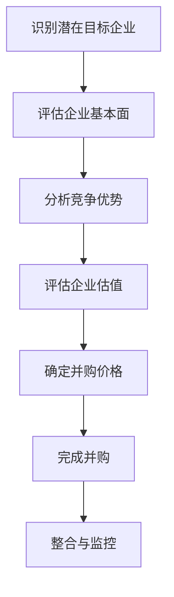
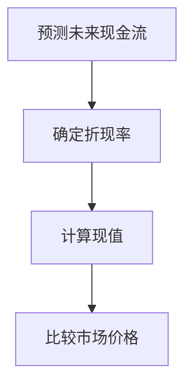
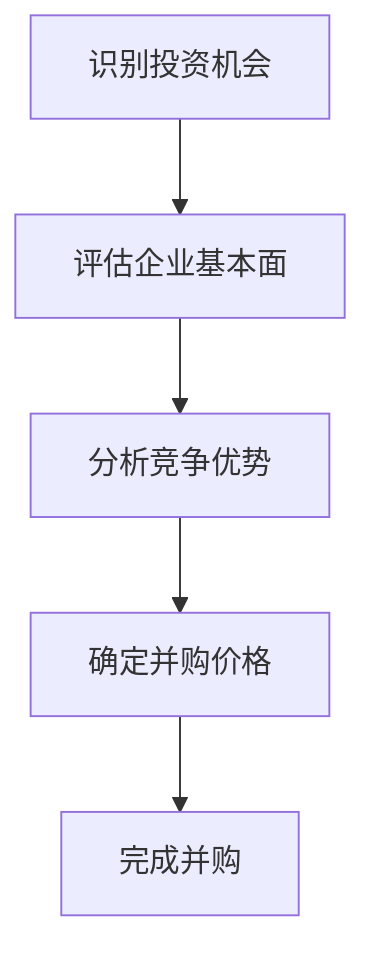

                 

# 巴菲特的并购艺术：在全球化背景下的新策略

> 关键词：巴菲特，并购艺术，全球化，并购策略，价值投资，风险管理

> 摘要：本文深入分析了巴菲特的并购策略，探讨了在全球化背景下这些策略的新发展。通过系统化的分析框架，结合实际案例，本文揭示了巴菲特如何在全球市场中寻找投资机会，如何评估企业价值，并如何管理并购风险。文章最后总结了这些策略在当前全球化环境下的应用价值和未来趋势。

---

## 第一部分：引言

### 1.1 并购的重要性和巴菲特的并购策略

#### 1.1.1 并购的定义与重要性

企业并购（Mergers and Acquisitions, M&A）是指一家企业与其他企业（被并购方）通过合并或收购的方式，整合资源、扩展业务或进入新市场的一种战略行为。并购不仅是企业增长的重要手段，也是应对市场竞争和经济变化的关键策略。通过并购，企业可以快速获得新技术、新市场、新客户和新资源，从而提升竞争力。

#### 1.1.2 巴菲特并购策略的核心思想

巴菲特（Warren Buffett）是全球最著名的价值投资者之一，他的并购策略以长期投资、安全边际和竞争优势为核心。巴菲特通常寻找那些具有强大护城河（如品牌、技术、垄断地位等）的企业，并以低于其内在价值的价格进行收购。他的投资哲学强调“价格是买进的障碍，而不是卖出的障碍”，即只有当价格低于内在价值时，才会进行投资。

#### 1.1.3 全球化背景下并购的新趋势

随着全球化的发展，企业并购的复杂性增加，跨国并购成为趋势。企业需要考虑文化差异、法律环境、汇率波动等因素。此外，新兴市场的崛起和科技行业的快速变化也为并购提供了新的机会和挑战。在这一背景下，巴菲特的并购策略也在不断调整，以适应新的市场环境。

---

## 第二部分：巴菲特的并购艺术

### 2.1 巴菲特的投资理念与并购策略

#### 2.1.1 巴菲特的投资理念

巴菲特的投资理念基于“价值投资”，即寻找那些市场价格低于其内在价值的股票。他强调长期投资，关注企业的基本面，如盈利能力、财务状况、管理团队等。他的投资哲学可以用以下公式表示：

$$ \text{内在价值} = \frac{\text{未来现金流的现值}}{\text{折现率}} $$

#### 2.1.2 巴菲特并购的五大标准

巴菲特在选择并购目标时，通常遵循以下五大标准：

1. **强大而持久的护城河**：企业必须有独特的竞争优势，能够在长期内保持领先地位。
2. **杰出的管理团队**：管理团队必须诚信、聪明且专注于企业的发展。
3. **合理的企业估值**：并购价格必须低于企业的内在价值。
4. **稳健的财务状况**：企业应具备低负债、高现金流等稳健的财务状况。
5. **长期的增长潜力**：企业应处于具有增长潜力的行业或市场。

#### 2.1.3 巴菲特并购决策的逻辑框架

以下是巴菲特并购决策的逻辑框架：

---

### 2.2 安全边际与企业估值

#### 2.2.1 安全边际的定义与作用

安全边际是指企业内在价值与市场价格之间的差距。巴菲特认为，安全边际是投资成功的关键因素之一。通过保持足够的安全边际，投资者可以降低风险，避免因市场价格波动而产生损失。

#### 2.2.2 巴菲特的企业估值方法

巴菲特常用的方法是现金流折现法（DCF模型），通过预测企业未来现金流，并将其折现为现值，以确定企业的内在价值。以下是DCF模型的简单流程图：

#### 2.2.3 安全边际与投资风险控制

通过保持安全边际，巴菲特能够有效控制投资风险。以下是安全边际的计算公式：

$$ \text{安全边际} = \text{内在价值} - \text{市场价格} $$

---

### 2.3 竞争优势与企业评估

#### 2.3.1 什么是竞争优势

竞争优势是指企业相对于竞争对手在产品、技术、成本、品牌、市场准入等方面的独特优势。巴菲特认为，具有强大竞争优势的企业能够在长期内保持较高的利润率和市场份额。

#### 2.3.2 巴菲特的“护城河”分析

护城河是指企业抵御竞争对手的能力。以下是护城河的四种主要类型：

1. **成本优势**：企业通过规模效应或技术创新降低成本。
2. **品牌优势**：强大的品牌能够吸引更多的消费者。
3. **技术优势**：拥有独特的技术或专利。
4. **网络效应**：用户数量越多，平台的价值越高。

#### 2.3.3 企业评估的五个维度

巴菲特在评估企业时，通常关注以下五个维度：

1. **盈利能力**：ROE（净资产收益率）和ROA（资产回报率）。
2. **财务状况**：负债率、现金流。
3. **管理团队**：团队的能力和诚信。
4. **竞争优势**：是否存在护城河。
5. **增长潜力**：行业前景和企业扩张能力。

---

## 第三部分：全球化背景下的并购新策略

### 3.1 全球化并购的机遇与挑战

#### 3.1.1 全球化并购的定义与趋势

全球化并购是指跨国企业之间的并购活动。随着全球经济一体化的深入，跨国并购成为企业扩展的重要手段。以下是全球化并购的几个趋势：

1. **新兴市场的崛起**：新兴市场成为跨国并购的热点。
2. **科技行业的并购**：科技企业通过并购获取新技术和新市场。
3. **行业整合**：同一行业的企业通过并购实现规模效应。

#### 3.1.2 跨国并购的复杂性与风险

跨国并购涉及多个法律体系、文化差异和市场环境，具有较高的复杂性和风险。以下是跨国并购的主要风险：

1. **法律风险**：不同国家的法律法规差异可能导致并购失败。
2. **文化风险**：文化差异可能影响企业整合和管理。
3. **汇率风险**：汇率波动可能影响并购后的财务状况。
4. **政治风险**：政治不稳定可能导致并购失败。

#### 3.1.3 全球化并购中的文化与法律问题

文化差异和法律问题是跨国并购中需要特别关注的两个方面。以下是具体分析：

1. **文化差异**：不同国家的员工可能有不同的工作习惯和价值观，这可能影响企业的整合和管理。
2. **法律问题**：不同国家的法律环境不同，需要了解当地的法律法规，确保并购活动的合法性。

---

### 3.2 新兴市场的并购机会

#### 3.2.1 新兴市场并购的潜力

新兴市场通常具有较高的经济增长潜力，企业可以通过并购进入新市场，获取新的客户和资源。以下是新兴市场并购的几个潜力领域：

1. **科技行业**：新兴市场中的科技企业可能具有较高的增长潜力。
2. **消费市场**：新兴市场的消费市场可能具有较大的增长空间。
3. **制造业**：新兴市场的制造业可能具有成本优势。

#### 3.2.2 新兴市场并购的风险与应对

新兴市场并购的风险主要包括：

1. **市场不确定性**：新兴市场的经济和政治环境可能不稳定。
2. **竞争压力**：新兴市场中的竞争可能更加激烈。
3. **监管风险**：新兴市场的监管环境可能不透明。

#### 3.2.3 巴菲特在新兴市场的投资策略

尽管巴菲特主要投资于美国市场，但他在新兴市场中也有一定的投资活动。以下是他在新兴市场中的投资策略：

1. **寻找具有强大竞争优势的企业**：巴菲特关注那些在新兴市场中具有强大竞争优势的企业。
2. **关注企业的财务状况**：他注重企业的财务稳健性，避免投资于财务状况不佳的企业。
3. **长期投资**：他倾向于长期投资，关注企业的长期增长潜力。

---

### 3.3 科技企业的并购趋势

#### 3.3.1 科技企业并购的动因

科技企业并购的动因主要包括：

1. **获取新技术**：通过并购获取新技术和专利。
2. **扩展市场**：通过并购进入新市场或扩大市场份额。
3. **整合资源**：通过并购整合资源，提高效率。

#### 3.3.2 巴菲特对科技企业的看法

尽管巴菲特对科技企业的看法较为谨慎，但他也投资了一些科技企业，如IBM和苹果。他认为，科技企业的成功取决于其技术优势和长期增长潜力。

#### 3.3.3 科技并购中的估值挑战

科技并购中的估值挑战主要体现在以下方面：

1. **高增长企业**：科技企业的增长潜力较高，但未来的现金流难以准确预测。
2. **高估值**：科技企业的估值通常较高，可能超出其内在价值。
3. **不确定性**：科技行业的变化较快，企业的未来发展前景存在较大的不确定性。

---

## 第四部分：巴菲特并购策略的系统化分析

### 4.1 并购战略的选择与制定

#### 4.1.1 并购战略的分类

并购战略可以分为以下几类：

1. **横向并购**：同一行业内的并购。
2. **纵向并购**：上下游产业链的并购。
3. **混合并购**：与主业无关的并购。

#### 4.1.2 巴菲特并购战略的制定过程

以下是巴菲特并购战略的制定过程：

#### 4.1.3 并购战略与企业长期目标的结合

并购战略必须与企业的长期目标相结合。以下是巴菲特在制定并购战略时考虑的因素：

1. **企业长期增长**：并购必须符合企业的长期增长战略。
2. **资源优化配置**：并购必须有助于资源的优化配置。
3. **风险控制**：并购必须在可控风险范围内。

---

### 4.2 并购估值的数学模型与分析

#### 4.2.1 常用并购估值方法

常用的并购估值方法包括：

1. **DCF模型**：现金流折现法。
2. **市盈率法**：基于市盈率的估值。
3. **市净率法**：基于市净率的估值。

#### 4.2.2 内在价值计算公式

以下是DCF模型的内在价值计算公式：

$$ \text{内在价值} = \sum_{t=1}^{n} \frac{\text{现金流}_t}{(1 + r)^t} + \frac{\text{终值}}{(1 + r)^n} $$

其中，\( r \) 是折现率，\( n \) 是预测期数，\( \text{现金流}_t \) 是第 \( t \) 年的现金流，\( \text{终值} \) 是第 \( n \) 年后的终值。

#### 4.2.3 并购估值的案例分析

以巴菲特收购喜诗糖果为例，以下是DCF模型的应用：

1. **预测未来现金流**：假设喜诗糖果未来5年的现金流分别为100万、120万、140万、160万、180万。
2. **确定折现率**：假设折现率为10%。
3. **计算现值**：将未来现金流折现为现值。
4. **计算终值**：假设终值为200万，按10%折现率为现值123.95万。
5. **计算内在价值**：将各年的现值相加，得到内在价值为527.62万。

---

### 4.3 并购风险管理与控制

#### 4.3.1 并购风险的种类

并购风险主要包括：

1. **财务风险**：并购后的财务状况可能出现问题。
2. **整合风险**：并购后的整合可能出现问题。
3. **市场风险**：并购后的市场环境可能出现变化。

#### 4.3.2 巴菲特并购风险管理策略

巴菲特的并购风险管理策略包括：

1. **保持安全边际**：确保并购价格低于内在价值。
2. **关注财务状况**：确保并购后的财务状况稳健。
3. **长期投资**：通过长期投资分散短期风险。

#### 4.3.3 并购风险管理的数学模型

以下是并购风险管理的数学模型：

$$ \text{风险敞口} = \text{并购价格} \times \text{风险系数} $$

---

## 第五部分：总结与展望

### 5.1 总结

巴菲特的并购策略以长期投资、安全边际和竞争优势为核心。在全球化背景下，企业并购的复杂性增加，跨国并购成为趋势。巴菲特的并购策略也在不断调整，以适应新的市场环境。

### 5.2 未来展望

随着全球经济一体化的深入，企业并购将更加复杂和多样化。未来，企业需要更加注重全球化背景下的并购策略，合理评估风险，确保并购的成功。

---

## 结语

巴菲特的并购艺术在全球化背景下展现出新的策略和挑战。通过系统化的分析框架，结合实际案例，我们可以更好地理解巴菲特的并购策略，并在全球化背景下应用这些策略。

