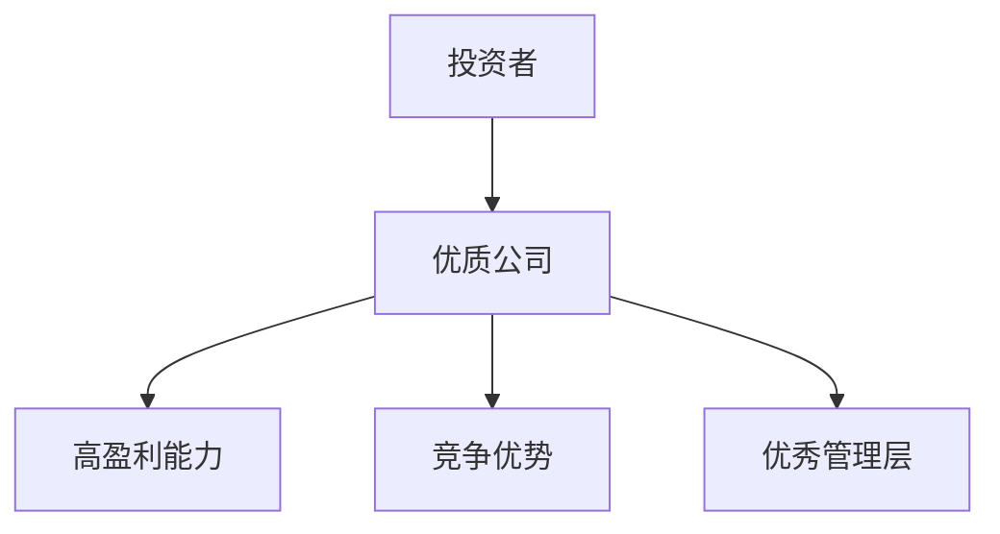
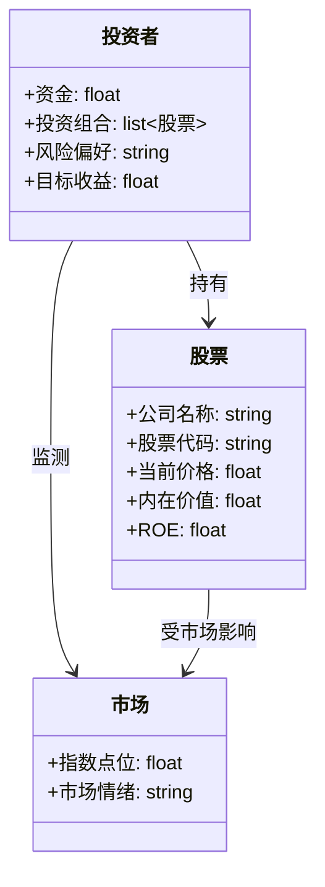

                 


# 巴菲特的成功秘诀：长期持有优质股票

## 关键词：巴菲特，长期投资，价值投资，优质股票，股票分析，投资策略

## 摘要：本文深入探讨了巴菲特的成功秘诀，特别是其长期持有优质股票的投资策略。通过分析价值投资的核心理念、股票分析的数学模型、投资组合的系统架构以及实际案例，本文揭示了巴菲特投资哲学的精髓，并提供了可操作的指导建议。

---

# 第1章 巴菲特投资理念的背景与核心概念

## 1.1 巴菲特的生平与投资哲学

### 1.1.1 巴菲特的早年经历与投资启蒙
沃伦·巴菲特（Warren Buffett）于1934年出生在美国堪萨斯州的奥马哈市。他的投资生涯始于青少年时期，当时他通过购买廉价的可口可乐股票赚取了人生的第一桶金。这段早期经历奠定了他一生的价值投资理念。

### 1.1.2 巴菲特的价值投资理念
巴菲特的投资哲学的核心是“价值投资”。他认为，市场先生（Mr. Market）是一个情绪化的存在，投资者应该利用市场的非理性来寻找被低估的股票。他强调，真正的投资是购买企业的一部分，而不是在市场中投机。

### 1.1.3 巴菲特投资哲学的核心思想
巴菲特的投资哲学可以用一句话概括：**“价格是您支付的，价值是您得到的。”** 他主张以合理的价格投资于具有强大竞争优势、优秀管理层和良好财务状况的公司。

---

## 1.2 长期持有优质股票的背景介绍

### 1.2.1 问题背景：股票投资的短期波动与长期价值
股票市场充满了短期波动，受到市场情绪、宏观经济因素和突发事件的影响。然而，优质股票的长期价值往往超越短期波动。

### 1.2.2 问题描述：市场短期波动与长期价值的关系
投资者常常陷入短期波动的陷阱，过度关注市场的短期走势而忽略了公司的长期价值。这种短视的行为往往导致投资失败。

### 1.2.3 问题解决：如何识别优质股票并长期持有
识别优质股票的关键在于分析公司的基本面，包括盈利能力、财务健康状况、竞争优势和管理层能力。一旦识别出优质股票，就应该长期持有，避免频繁交易。

### 1.2.4 边界与外延：优质股票的定义与筛选标准
优质股票的定义因投资者而异，但通常包括以下特征：
- 高ROE（净资产收益率）。
- 强大的竞争优势（如专利、品牌或成本优势）。
- 优秀的管理层。
- 健康的财务状况（低负债率、稳定的现金流）。

### 1.2.5 核心要素：公司基本面、竞争优势与管理层
- **公司基本面**：包括收入、利润、现金流等财务指标。
- **竞争优势**：公司相对于竞争对手的独特优势。
- **管理层能力**：管理层的决策能力和道德水平。

---

## 1.3 本章小结
本章介绍了巴菲特的生平及其投资哲学，重点阐述了长期持有优质股票的背景和核心概念。通过分析市场的短期波动与长期价值的关系，我们认识到优质股票的定义和筛选标准。

---

# 第2章 价值投资的核心概念与联系

## 2.1 核心概念原理

### 2.1.1 价值投资的定义与内涵
价值投资是一种投资策略，旨在以低于内在价值的价格购买优质股票。这种策略要求投资者深入分析公司的基本面，识别出被市场低估的股票。

### 2.1.2 股票的内在价值与市场价值
- **内在价值**：股票的真正价值，基于公司的基本面因素。
- **市场价值**：股票在市场上的交易价格，受市场情绪和外部因素影响。

### 2.1.3 优质公司的特征与竞争优势
优质公司通常具有以下特征：
- 高盈利能力。
- 稳定的现金流。
- 强大的竞争优势。
- 优秀的管理层。

---

## 2.2 核心概念属性对比表格

| 属性           | 优质公司特征 | 非优质公司特征 |
|----------------|--------------|----------------|
| 盈利能力       | 高            | 低              |
| 财务健康性      | 健康          | 不健康          |
| 竞争优势       | 明显          | 不明显          |
| 管理层能力      | 高            | 低              |

---

## 2.3 ER实体关系图（Mermaid流程图）



---

## 2.4 本章小结
本章详细阐述了价值投资的核心概念，包括内在价值、市场价值和优质公司的特征。通过对比表格和ER实体关系图，我们清晰地了解了优质公司的核心要素。

---

# 第3章 股票分析的数学模型与算法原理

## 3.1 股票估值的数学模型

### 3.1.1 现金流折现模型（DCF模型）
DCF模型是评估股票内在价值的核心工具之一。其公式如下：

$$DCF = \frac{CF_t}{(1+r)^t}$$

其中：
- \( CF_t \) 是第 \( t \) 年的现金流。
- \( r \) 是折现率。

### 3.1.2 市盈率（P/E）分析
市盈率（P/E）是衡量股票价值的重要指标，公式为：

$$P/E = \frac{股价}{每股收益}$$

---

## 3.2 股票分析的算法原理

### 3.2.1 基本面分析算法
基本面分析算法通过分析公司的财务报表来评估其内在价值。以下是步骤：
1. 收集公司的财务数据。
2. 计算关键指标（如ROE、净利润率）。
3. 分析公司的竞争优势和管理层能力。
4. 评估公司的内在价值。

---

## 3.3 本章小结
本章介绍了股票分析的数学模型和算法原理，包括现金流折现模型和市盈率分析。通过这些模型，投资者可以更准确地评估股票的内在价值。

---

# 第4章 系统分析与架构设计方案

## 4.1 问题场景介绍
在股票投资中，投资者需要面对复杂的投资环境和多变的市场条件。为了实现长期持有优质股票的目标，我们需要构建一个系统化的投资架构。

---

## 4.2 系统功能设计（领域模型Mermaid类图）



---

## 4.3 系统架构设计（Mermaid架构图）


---

## 4.4 本章小结
本章通过系统架构设计，展示了如何构建一个长期持有优质股票的投资系统。通过领域模型和架构图，我们明确了各模块的功能和交互关系。

---

# 第5章 项目实战：长期持有优质股票的投资策略

## 5.1 环境安装与准备
要实践长期持有优质股票的投资策略，投资者需要准备以下工具：
- 财务报表分析工具（如Excel、Python）。
- 股票筛选工具（如Morningstar、Screener）。
- 数据分析库（如Pandas、Matplotlib）。

---

## 5.2 核心实现源代码

### 5.2.1 Python实现股票筛选逻辑
以下是使用Python进行股票筛选的示例代码：

```python
import pandas as pd

# 加载财务数据
df = pd.read_csv('financial_data.csv')

# 筛选优质股票
df = df[df['ROE'] > 20]
df = df[df['净利

