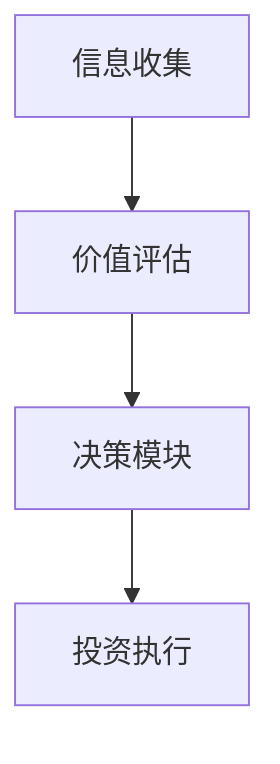
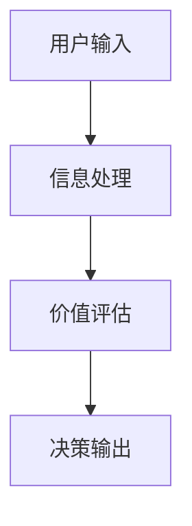

                 

# 巴菲特的投资决策框架

> 关键词：巴菲特，投资决策，价值投资，投资框架，股票分析

> 摘要：本文系统地分析了巴菲特的投资决策框架，从背景介绍到数学模型，从系统架构到项目实战，全面解读巴菲特的投资哲学和方法。通过详细讲解其核心概念、算法原理、系统设计和实际案例，为读者提供一个完整的投资决策框架。

---

# 第1章: 巴菲特投资决策框架的背景与核心概念

## 1.1 巴菲特投资决策框架的背景

### 1.1.1 投资领域的核心问题与挑战

投资领域的核心问题在于如何在不确定的市场中，找到具有持续竞争优势的企业，并以合理的价格买入。投资的挑战包括市场的波动性、信息的不对称性、以及投资者情绪的干扰。

### 1.1.2 巴菲特在投资领域的独特地位

巴菲特作为价值投资的代表人物，以其长期的投资业绩和稳健的投资理念闻名。他强调基本面分析、安全边际和长期投资，其投资决策框架为无数投资者提供了参考。

### 1.1.3 巴菲特投资决策框架的演变历程

巴菲特的投资框架从早期的“烟蒂股”策略，逐步发展为以企业内在价值为核心的价值投资策略。他的框架不断完善，强调对企业竞争优势和财务健康状况的深入分析。

## 1.2 巴菲特投资决策框架的核心概念

### 1.2.1 价值投资的定义与特征

价值投资是一种以低于内在价值的价格买入优质企业股票的投资策略。其特征包括：长期投资、基本面分析、安全边际和集中投资。

### 1.2.2 巴菲特决策框架的核心要素

1. **内在价值**：企业未来现金流的现值。
2. **竞争优势**：企业在市场中的独特优势，包括成本优势、品牌优势等。
3. **财务健康**：关注企业的盈利能力、资产负债表和现金流。
4. **安全边际**：买入价格低于内在价值，以降低风险。
5. **长期投资**：关注企业的长期价值，避免短期波动。

### 1.2.3 框架的边界与外延

巴菲特的投资框架适用于长期价值投资，但并不适合短期交易和高频交易。其外延包括企业治理、管理团队和宏观经济环境。

## 1.3 本章小结

本章从背景出发，介绍了巴菲特投资决策框架的核心概念和要素，为后续分析奠定了基础。

---

# 第2章: 巴菲特投资决策框架的数学模型与算法原理

## 2.1 价值评估的核心公式

### 2.1.1 股票的内在价值公式

$$ V = \frac{C}{r} $$

其中，$V$ 表示股票的内在价值，$C$ 表示未来现金流，$r$ 表示折现率。

### 2.1.2 股东权益的计算公式

$$ \text{股东权益} = \text{净利润} \times \text{留存比率} \times \frac{1}{r} $$

---

# 第3章: 巴菲特投资决策框架的系统分析与架构设计

## 3.1 系统功能设计

### 3.1.1 信息收集与处理模块

- 收集企业的财务数据、行业信息和市场数据。
- 处理数据，提取关键指标。

### 3.1.2 企业价值评估模块

- 计算企业的内在价值。
- 分析企业的竞争优势。

### 3.1.3 投资决策模块

- 确定买入价格。
- 评估投资组合的配置。

## 3.2 系统架构设计

### 3.2.1 分层架构图

### 3.2.2 模块交互流程图

---

# 第4章: 巴菲特投资决策框架的项目实战

## 4.1 案例分析: 可口可乐的投资决策

### 4.1.1 案例背景

可口可乐是一家具有强大品牌优势和市场地位的公司，巴菲特长期持有其股票。

### 4.1.2 投资决策过程

1. **财务分析**：分析可口可乐的盈利能力、现金流和资产负债表。
2. **竞争优势分析**：评估其品牌优势和市场地位。
3. **价值评估**：计算其内在价值，确定买入价格。
4. **投资决策**：基于安全边际，决定买入。

### 4.1.3 决策结果与分析

通过长期持有可口可乐股票，巴菲特获得了稳定的收益。

## 4.2 案例分析: 巴菲特对苹果的投资

### 4.2.1 案例背景

苹果是一家具有强大创新能力的公司，巴菲特在2016年购买了其股票。

### 4.2.2 投资决策过程

1. **财务分析**：评估苹果的盈利能力、现金流和资产负债表。
2. **竞争优势分析**：分析其创新能力和市场地位。
3. **价值评估**：计算其内在价值，确定买入价格。
4. **投资决策**：基于安全边际，决定买入。

### 4.2.3 决策结果与分析

通过投资苹果，巴菲特获得了巨大的收益。

---

# 第5章: 巴菲特投资决策框架的总结与展望

## 5.1 总结

巴菲特的投资决策框架以价值投资为核心，强调对企业内在价值、竞争优势和财务健康的深入分析。其框架在长期投资中表现优异。

## 5.2 展望

随着市场的变化，巴菲特的框架需要不断优化和调整。未来，投资者需要更加关注企业的创新能力和数字化转型。

## 5.3 小结

巴菲特的投资决策框架为投资者提供了宝贵的指导，但需要根据实际情况灵活应用。

---

# 第6章: 注意事项与最佳实践

## 6.1 注意事项

1. **避免情绪化决策**：投资需要理性，避免被市场波动干扰。
2. **长期视角**：关注企业的长期价值，避免短期交易。
3. **持续学习**：保持对市场和企业的深入理解。

## 6.2 最佳实践

1. **深入研究**：对企业进行全方位的研究，包括财务、行业和管理。
2. **分散投资**：避免过度集中，降低风险。
3. **耐心持有**：长期持有优质企业，获得稳定收益。

---

# 第7章: 拓展阅读与资源推荐

## 7.1 拓展阅读

1. **《巴菲特致股东的信》**：巴菲特的投资理念和管理智慧。
2. **《价值投资入门》**：价值投资的基本原理和方法。

## 7.2 资源推荐

1. 巴菲特股东大会演讲视频。
2. 价值投资经典书籍。

---

# 结语

巴菲特的投资决策框架是一个系统化的投资方法，它不仅提供了具体的分析工具，还强调了投资者的心态和决策过程。通过深入理解和实践，投资者可以更好地把握价值投资的本质，实现长期稳健的收益。

