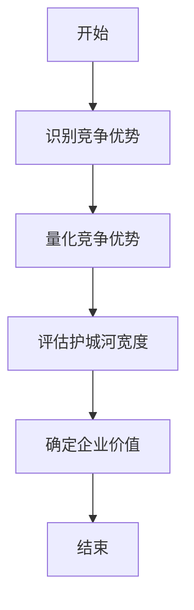
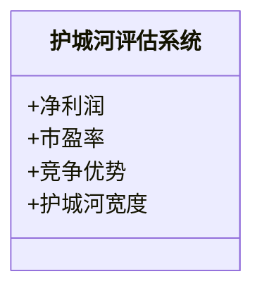
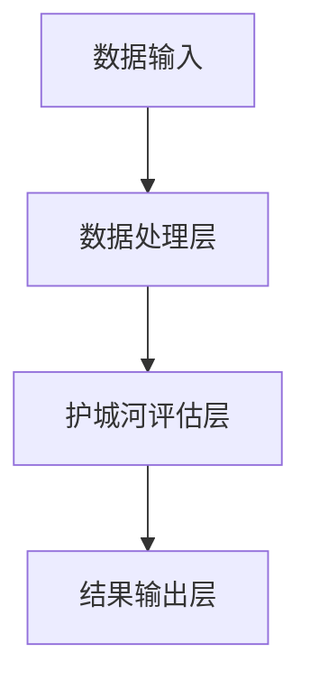

                 


```markdown
# 巴菲特的护城河理论及其应用

## 关键词
巴菲特，护城河理论，企业竞争优势，数学模型，系统架构

## 摘要
本文深入探讨巴菲特的护城河理论，分析其在企业竞争优势中的应用，结合数学模型和系统架构，提供实际案例分析，帮助读者理解如何利用护城河理论进行投资决策。

---

## 第一部分：护城河理论的背景与核心概念

### 第1章：护城河理论的背景与核心概念

#### 1.1 护城河理论的起源与核心思想

##### 1.1.1 巴菲特投资理念的形成
巴菲特的投资理念源于价值投资，他强调寻找具有持续竞争优势的企业，这种优势被称为“护城河”。

##### 1.1.2 护城河理论的定义与核心要素
护城河是指企业在行业中形成的难以被竞争对手复制或超越的竞争优势，包括成本优势、品牌优势、技术优势和网络效应。

##### 1.1.3 护城河理论与企业价值的关系
企业的护城河宽度直接影响其市场地位和盈利能力，从而影响企业价值。

#### 1.2 护城河理论的核心概念与联系

##### 1.2.1 护城河的四种类型

###### 1.2.1.1 成本优势
企业通过规模经济或流程优化降低成本，形成价格竞争优势。

###### 1.2.1.2 品牌优势
强大的品牌认知度和客户忠诚度，使企业在市场中占据优势地位。

###### 1.2.1.3 技术优势
企业通过技术创新或专利保护，保持技术领先地位，形成竞争优势。

###### 1.2.1.4 网络效应
用户数量的增加导致产品或服务的价值提升，形成正反馈循环。

##### 1.2.2 护城河类型对比分析

###### 1.2.2.1 护城河类型特征对比表

| 类型       | 特征                           |
|------------|--------------------------------|
| 成本优势   | 低成本生产，价格优势           |
| 品牌优势   | 强大的品牌认知，客户忠诚度       |
| 技术优势   | 技术领先，专利保护               |
| 网络效应   | 用户数量越多，价值越高         |

###### 1.2.2.2 护城河类型ER实体关系图
```mermaid
erd
  customer
  company
  competition
  advantage_type
 护城河类型与企业之间的关系
```

---

## 第二部分：护城河理论的数学模型与分析方法

### 第2章：护城河理论的数学模型与分析方法

#### 2.1 护城河宽度的量化分析

##### 2.1.1 护城河宽度的定义
护城河宽度是指企业竞争优势相对于行业平均水平的幅度。

##### 2.1.2 护城河宽度的数学公式
$$\text{护城河宽度} = \frac{\text{企业竞争优势}}{\text{行业平均竞争优势}}$$

##### 2.1.3 护城河宽度与企业价值的关系
企业价值与护城河宽度成正比，即护城河越宽，企业价值越高。

#### 2.2 护城河宽度与企业价值的关系

##### 2.2.1 企业价值的计算公式
$$\text{企业价值} = \text{净利润} \times \text{市盈率}$$

##### 2.2.2 护城河宽度对企业价值的影响
企业通过强大的护城河，提升净利润和市盈率，从而增加企业价值。

#### 2.3 护城河评估的算法原理

##### 2.3.1 护城河评估流程图


##### 2.3.2 护城河评估算法代码示例
```python
def calculate_h护城河_width(enterprise_advantages, industry_avg_advantages):
    return enterprise_advantages / industry_avg_advantages

enterprise_value =净利润 *市盈率
```

---

## 第三部分：护城河理论的系统分析与架构设计

### 第3章：护城河理论的系统分析与架构设计

#### 3.1 系统分析

##### 3.1.1 问题场景介绍
分析企业竞争优势，评估护城河宽度，以确定企业价值。

##### 3.1.2 系统功能设计

###### 3.1.2.1 领域模型Mermaid类图


##### 3.1.3 系统架构设计

###### 3.1.3.1 系统架构Mermaid架构图


#### 3.2 系统接口与交互

##### 3.2.1 系统接口设计
```mermaid
sequenceDiagram
用户->开始评估
用户->系统: 提供企业数据
系统->系统: 计算护城河宽度
系统->用户: 输出企业价值
用户->结束评估
```

---

## 第四部分：护城河理论的项目实战

### 第4章：护城河理论的项目实战

#### 4.1 项目实战：以亚马逊为例

##### 4.1.1 环境安装
安装Python和相关库，如Pandas、NumPy。

##### 4.1.2 数据收集
收集亚马逊的财务数据和行业数据。

##### 4.1.3 分析代码实现
```python
import pandas as pd
import numpy as np

def calculate_h护城河_width(enterprise_advantages, industry_avg_advantages):
    return enterprise_advantages / industry_avg_advantages

# 示例数据
amazon_net_profit = 100
amazon_pe_ratio = 30
industry_avg_advantages = 20

amazon_enterprise_value = amazon_net_profit * amazon_pe_ratio
amazon_h护城河_width = calculate_h护城河_width(100, industry_avg_advantages)

print(f"亚马逊企业价值: {amazon_enterprise_value}")
print(f"亚马逊护城河宽度: {amazon_h护城河_width}")
```

##### 4.1.4 结果解读
亚马逊具有强大的护城河，企业价值高，说明其竞争优势明显。

#### 4.2 项目小结
通过实际案例分析，验证了护城河理论的有效性，帮助投资者识别具有竞争优势的企业。

---

## 第五部分：总结与展望

### 第5章：总结与展望

#### 5.1 最佳实践
投资者应结合护城河理论和其他分析工具，全面评估企业价值。

#### 5.2 小结
护城河理论是巴菲特投资理念的核心，通过识别企业竞争优势，投资者可以做出更明智的投资决策。

#### 5.3 注意事项
护城河理论的应用需结合具体情况，避免单一维度的分析。

#### 5.4 拓展阅读
推荐阅读巴菲特的《巴菲特致股东的信》和《投资最重要的事情》。

---

# 附录：参考文献与工具

## 附录A：参考文献
1. 巴菲特，沃伦. 《巴菲特致股东的信》
2. 格雷厄姆，本杰明. 《投资最重要的事情》

## 附录B：工具推荐
1. Python编程语言
2. Pandas、NumPy数据处理库
3. Mermaid图表工具

---

通过以上结构，文章详细讲解了巴菲特的护城河理论，结合数学模型和实际案例，帮助读者全面理解和应用这一理论。
```

