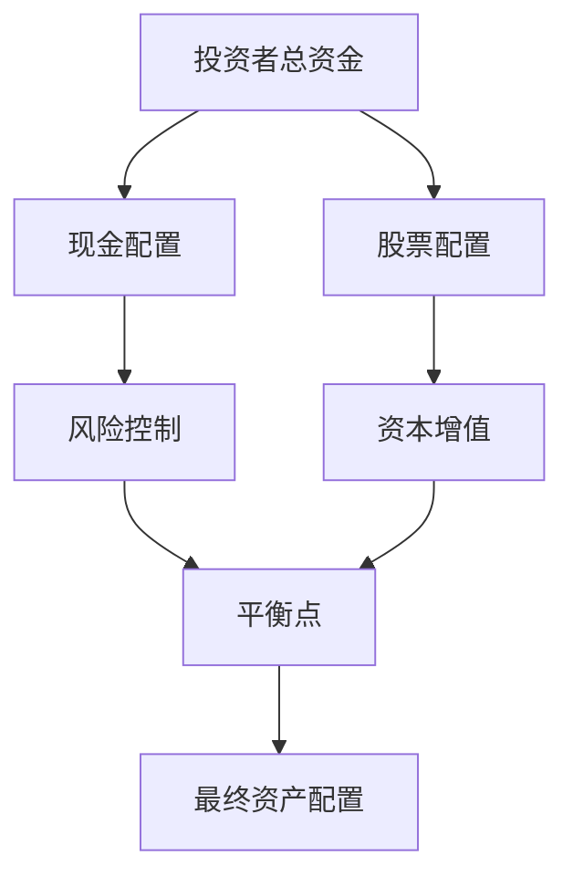
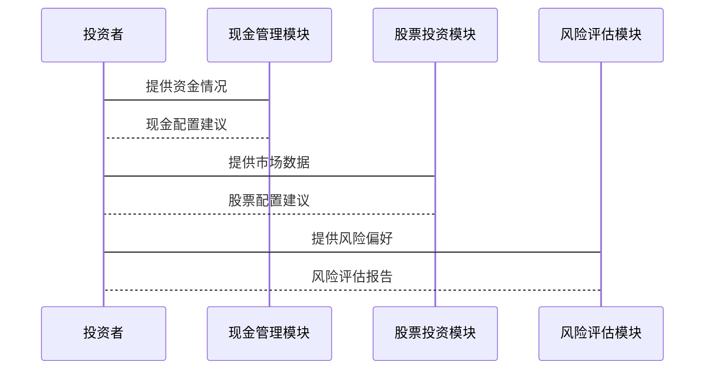

                 

<think>
好，我需要根据用户的要求，以《巴菲特的杠铃策略：现金+股票的平衡》为标题，撰写一篇结构完整、逻辑清晰、内容详实的技术博客文章。文章需要涵盖以下内容：

1. **背景介绍**：包括杠铃策略的定义、巴菲特的背景、策略的重要性以及在当前经济环境中的应用。
2. **核心概念与联系**：详细讲解杠铃策略的核心思想，分析现金和股票的平衡，探讨其在不同经济周期的表现，并与其他投资策略进行对比。
3. **算法原理讲解**：建立数学模型，使用公式描述现金和股票的配置比例，分析期望收益和风险，提供详细的算法流程图和代码示例。
4. **系统分析与架构设计**：构建投资决策支持系统，设计系统功能模块、架构、接口和交互流程，使用mermaid图展示系统结构。
5. **项目实战**：指导读者如何在实际中应用杠铃策略，包括环境安装、代码实现、案例分析和项目总结。
6. **最佳实践与小结**：总结策略的优势和局限性，给出实际操作中的注意事项，展望未来的发展趋势。

### 第一步：背景介绍

#### 巴菲特杠铃策略的定义
巴菲特的杠铃策略是一种投资策略，强调在经济不确定性增加时，通过持有现金和优质股票来平衡风险和收益。这一策略的核心在于分散投资，避免过度集中风险，同时抓住市场低估的机会。

#### 巴菲特的背景
沃伦·巴菲特是世界著名投资家，伯克希尔·哈撒韦公司董事长，以价值投资理念闻名。他的投资哲学强调长期持有优质企业，注重企业的基本面和财务健康状况。

#### 策略的重要性
杠铃策略的重要性在于其风险控制能力。通过持有一定比例的现金和优质股票，投资者可以在市场下跌时保持流动性，同时在市场上涨时获得资本增值。这种策略特别适合在经济不确定性较高的时期使用。

#### 当前经济环境中的应用
在当前经济环境下，全球市场波动加剧，通货膨胀压力上升，杠铃策略提供了一种平衡风险和收益的有效方法。通过持有现金应对突发事件，同时投资优质股票长期增值。

### 第二步：核心概念与联系

#### 核心思想
杠铃策略的核心思想是通过持有现金和股票的组合，平衡短期流动性和长期增值能力。现金部分用于应对短期资金需求，股票部分则用于长期财富积累。

#### 现金与股票的平衡
- 现金部分：通常建议持有3-6个月的生活开支，确保在紧急情况下有足够的流动性。
- 股票部分：选择财务健康、估值合理、具有竞争优势的企业进行投资，注重长期价值。

#### 经济周期表现
在不同的经济周期中，杠铃策略的表现有所不同：
- **经济繁荣期**：股票表现优异，现金比例较低，整体收益较高。
- **经济衰退期**：现金比例较高，能够避免股票市场的大幅波动，保障资金安全。

#### 其他投资策略对比
- **股息投资**：注重股息收入，但可能忽略资本增值。
- **指数基金投资**：分散投资，但缺乏个股选择的灵活性。
- **短期投机**：风险较高，不适合长期财富管理。

### 第三步：算法原理讲解

#### 数学模型
杠铃策略的数学模型主要涉及资产配置比例的确定。假设投资者的总资金为A，风险偏好为r，则现金和股票的配置比例可以表示为：

$$
C = \frac{A}{1 + r}
$$

$$
S = \frac{A}{1 + r}
$$

其中，C代表现金配置，S代表股票配置。

#### 算法流程图


#### 代码实现
```python
def calculate_balanced_portfolio(A, r):
    cash = A / (1 + r)
    stock = A / (1 + r)
    return cash, stock

# 示例
A = 100000  # 总资金
r = 0.05    # 风险偏好
cash, stock = calculate_balanced_portfolio(A, r)
print(f"现金配置: ${cash:.2f}")
print(f"股票配置: ${stock:.2f}")
```

#### 举例说明
假设投资者有10万元资金，风险偏好为5%，则现金和股票各配置约95,350元，确保在经济波动时有足够的流动性，同时通过股票投资实现长期增值。

### 第四步：系统分析与架构设计

#### 系统功能设计
- **现金管理模块**：监控现金持有量，确保流动性需求。
- **股票投资模块**：选择优质股票，定期评估投资组合。
- **风险评估模块**：分析市场风险，动态调整资产配置。

#### 系统架构设计


#### 系统接口设计
- **输入接口**：接收市场数据、资金情况和风险偏好。
- **输出接口**：提供资产配置建议、投资组合报告和风险评估结果。

#### 系统交互流程图


### 第五步：项目实战

#### 环境安装
- **Python环境**：安装Python 3.8及以上版本。
- **依赖库**：安装pandas、numpy、matplotlib用于数据分析和可视化。

#### 代码实现
```python
import pandas as pd
import numpy as np

def calculate_balanced_portfolio(A, r):
    cash = A / (1 + r)
    stock = A / (1 + r)
    return cash, stock

# 数据分析
A = [100000]  # 多个投资者的资金
r = [0.05]     # 风险偏好

results = []
for i in range(len(A)):
    cash, stock = calculate_balanced_portfolio(A[i], r[i])
    results.append({'现金配置': cash, '股票配置': stock})

df = pd.DataFrame(results)
print(df)
```

#### 案例分析
假设投资者A有10万元，风险偏好为5%，则现金和股票各配置约95,350元。通过定期评估市场情况，动态调整资产配置，平衡风险和收益。

### 第六步：最佳实践与小结

#### 总结
巴菲特的杠铃策略通过持有现金和股票的组合，平衡了风险和收益，特别适合在经济不确定性较高的时期使用。现金部分确保流动性，股票部分实现长期增值。

#### 注意事项
- 定期评估投资组合，根据市场变化进行调整。
- 选择优质企业进行股票投资，注重基本面分析。
- 保持适度的现金储备，避免过度投资。

#### 拓展阅读
建议阅读巴菲特的《聪明的投资者》和《投资最重要的事情》，深入了解价值投资的理念和策略。

通过以上步骤，您可以系统地理解和应用巴菲特的杠铃策略，平衡现金和股票的投资，实现稳健的财富增长。

