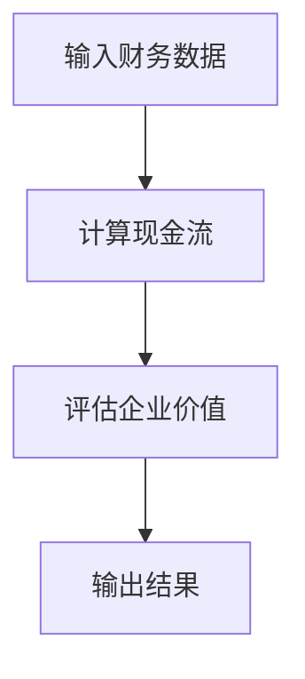

                 

# 巴菲特的现金流评估方法

> 关键词：巴菲特，现金流，投资，价值评估，自由现金流，DCF模型

> 摘要：本文详细探讨了巴菲特的现金流评估方法，从基本概念到实际应用，结合实例分析，帮助读者理解如何通过现金流评估企业价值。

---

## 第一部分：现金流的基本概念与重要性

### 第1章：现金流的基本概念

#### 1.1 什么是现金流？
现金流是指企业在一定时期内通过经营、投资和筹资活动所实际流入和流出的现金及现金等价物。现金流是衡量企业财务健康状况的重要指标。

#### 1.2 现金流的类型
- **经营活动现金流**：企业日常运营中产生的现金流入和流出。
- **投资活动现金流**：与资本支出相关的现金流入和流出。
- **筹资活动现金流**：与企业融资活动相关的现金流入和流出。

#### 1.3 现金流的重要性
现金流直接反映了企业的财务健康状况，是评估企业价值的核心指标。现金流充裕的企业能够维持运营、偿还债务、投资扩张和回馈股东。

---

### 第2章：自由现金流（FCF）的概念与计算

#### 2.1 自由现金流的定义
自由现金流是指企业在扣除资本支出后的剩余现金，可用于再投资或回馈股东。

#### 2.2 自由现金流的计算公式
$$\text{自由现金流} = \text{净利润} + \text{折旧} + \text{摊销} - \text{资本支出}$$

#### 2.3 自由现金流的重要性
自由现金流是评估企业内在价值的关键指标，因为它反映了企业实际能产生的现金流。

---

## 第二部分：现金流评估的核心方法

### 第3章：现金流贴现模型（DCF模型）

#### 3.1 DCF模型的原理
DCF模型基于未来现金流的现值计算企业内在价值。公式为：
$$\text{企业价值} = \sum_{t=1}^{n} \frac{\text{现金流}_t}{(1 + r)^t}$$
其中，r为折现率，n为预测年数。

#### 3.2 DCF模型的步骤
1. 预测未来现金流。
2. 选择合适的折现率。
3. 计算未来现金流的现值。
4. 加总现值并减去初始投资。

---

### 第4章：现金流质量的评估

#### 4.1 现金流质量的定义
现金流质量指现金流的稳定性和可持续性，反映了企业产生现金流的能力。

#### 4.2 现金流质量的评估指标
- **现金流量比率**：如经营活动现金流与净利润的比率。
- **自由现金流占收入比例**：反映企业将收入转化为现金的能力。

---

## 第三部分：现金流评估的系统分析与架构设计

### 第5章：企业现金流的系统分析

#### 5.1 现金流的流动方向与循环
- 现金流在企业内部的流动涉及经营活动、投资活动和筹资活动。

#### 5.2 现金流的健康状况评估
- 通过分析现金及现金等价物的净增加额，判断企业现金流的健康状况。

---

### 第6章：现金流评估的架构设计

#### 6.1 系统功能设计
- **数据输入**：收集财务报表数据。
- **计算现金流**：应用公式计算自由现金流。
- **评估价值**：使用DCF模型评估企业价值。

#### 6.2 系统架构图

---

## 第四部分：项目实战与案例分析

### 第7章：实际案例分析

#### 7.1 案例背景
分析某公司的财务报表，计算其自由现金流并评估其内在价值。

#### 7.2 计算过程
$$\text{自由现金流} = \text{净利润} + \text{折旧} + \text{摊销} - \text{资本支出}$$

#### 7.3 结果解读
通过计算得出自由现金流，再应用DCF模型计算企业价值。

---

## 第五部分：总结与注意事项

### 第8章：总结

#### 8.1 巴菲特现金流评估方法的优势
- 更真实反映企业价值。
- 有助于发现被低估的投资机会。

#### 8.2 局限性
- 依赖于对未来现金流的预测。
- 折现率的选择影响结果。

### 第9章：最佳实践与注意事项

#### 9.1 注意事项
- 确保现金流数据的准确性。
- 合理选择折现率。

#### 9.2 最佳实践
- 结合其他评估方法，全面分析企业价值。

---

通过以上步骤，我们可以系统地理解巴菲特的现金流评估方法，并在实际投资中应用。现金流评估不仅帮助我们发现价值企业，还提供了更深入的投资视角。

