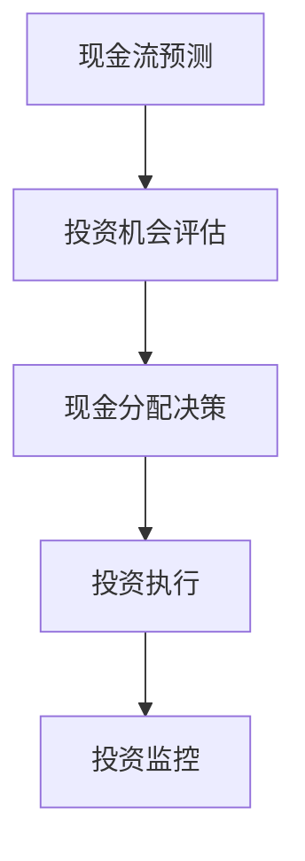

                 


# 巴菲特的现金管理哲学：机会资金的重要性

## 关键词：
- 巴菲特
- 现金管理
- 机会资金
- 投资哲学
- 财务策略
- 现金流贴现模型

## 摘要：
本文深入探讨了巴菲特的现金管理哲学，重点分析了机会资金在投资组合中的重要性。通过结合巴菲特的投资理念和实际案例，文章详细解释了机会资金的定义、特征、管理策略以及数学模型，为读者提供了系统化的现金管理方法。同时，文章还提供了基于Python的现金流贴现模型（DCF）的实现代码，帮助读者更好地理解和应用这些理论。

---

## 第一部分: 巴菲特的现金管理哲学基础

### 第1章: 巴菲特投资哲学概述

#### 1.1 巴菲特的生平与投资理念
- **1.1.1 巴菲特的生平简介**
  -沃伦·巴菲特（Warren Buffett）于1934年8月30日出生在美国堪萨斯州的奥马哈市。
  -他从小就展现出对数字和投资的兴趣，12岁时购买了第一只股票。
  -1956年，巴菲特建立了合伙公司，开始以专业投资者的身份进行投资。
  -1965年，他收购了伯克希尔哈撒韦公司（Berkshire Hathaway），并将其打造成一个多元化的投资帝国。

- **1.1.2 巴菲特的投资哲学核心**
  -价值投资：寻找市场价值低于内在价值的企业进行长期投资。
  -安全边际：在投资中留有安全边际，以保护资本不受损失。
  -分散投资：通过投资多个优质企业来降低风险。

- **1.1.3 巴菲特的价值投资原则**
  -只投资自己理解的企业。
  -关注企业的长期盈利能力。
  -耐心持有，避免频繁交易。

#### 1.2 现金管理的重要性
- **1.2.1 现金在投资组合中的角色**
  -现金是投资组合中的重要组成部分，用于抓住投资机会和应对突发事件。
  -现金被视为“干柴”，只有在合适的时机才能点燃。

- **1.2.2 现金管理的基本原则**
  -保持适度的现金储备，避免过度杠杆。
  -根据市场环境调整现金持有量。
  -在市场低迷时增加现金储备，等待投资机会。

- **1.2.3 现金管理与长期投资目标的关系**
  -现金管理是实现长期投资目标的重要手段。
  -通过合理的现金管理，投资者可以在市场波动中保持灵活性和主动性。

---

### 第2章: 机会资金的定义与特征

#### 2.1 机会资金的核心概念
- **2.1.1 机会资金的定义**
  -机会资金是指投资者在市场中发现具有显著价值低估或增长潜力的企业时，用于投资的资金。
  -这种资金的使用通常伴随着较高的风险和潜在的高回报。

- **2.1.2 机会资金的属性特征**
  -高潜力：目标企业具有较大的增长潜力或价值低估。
  -选择性：只投资于经过严格筛选的企业。
  -灵活性：可以根据市场变化进行调整。

- **2.1.3 机会资金与传统资金的区别**
  -传统资金：通常用于稳定的、低风险的投资。
  -机会资金：用于高潜力、高风险的投资机会。

#### 2.2 机会资金的特征对比
- **2.2.1 机会资金与防御性资金的对比**
  -防御性资金：用于保护投资组合的价值，避免重大损失。
  -机会资金：用于抓住市场中的投资机会，追求高回报。

- **2.2.2 机会资金与成长性资金的对比**
  -成长性资金：投资于成长型企业，注重企业的未来增长潜力。
  -机会资金：注重企业的当前价值与未来增长潜力的结合。

- **2.2.3 机会资金与周期性资金的对比**
  -周期性资金：投资于受经济周期影响较大的行业。
  -机会资金：不受经济周期限制，注重特定企业的投资机会。

---

### 第3章: 巴菲特的机会资金管理策略

#### 3.1 巴菲特的机会资金管理原则
- **3.1.1 稳健性原则**
  -避免过度杠杆，保持财务稳健。
  -在市场波动中保持冷静，避免盲目投资。

- **3.1.2 价值导向原则**
  -只投资于具有明确价值低估的企业。
  -注重企业的内在价值，而非市场情绪。

- **3.1.3 长期性原则**
  -坚持长期投资，避免短期波动的干扰。
  -耐心持有优质企业，等待价值实现。

#### 3.2 巴菲特的机会资金分配策略
- **3.2.1 行业选择标准**
  -选择具有稳定需求和较高进入壁垒的行业。
  -关注行业龙头，具有竞争优势的企业。

- **3.2.2 公司基本面分析**
  -关注企业的盈利能力、财务状况和管理团队。
  -分析企业的现金流、资产负债表和损益表。

- **3.2.3 市场时机选择**
  -在市场低迷时增加现金储备，等待投资机会。
  -在市场繁荣时保持谨慎，避免高估投资。

---

### 第4章: 巴菲特现金管理的数学模型

#### 4.1 现金流贴现模型（DCF）
- **4.1.1 DCF模型的基本公式**
  $$DCF = \sum_{t=1}^{n} \frac{CF_t}{(1+r)^t} + \frac{TV}{(1+r)^n}$$
  其中：
  -CF_t：第t年的现金流
  -r：折现率
  -TV：终值

- **4.1.2 现金流贴现模型的步骤**
  1. 估计未来现金流。
  2. 确定合适的折现率。
  3. 计算现值。
  4. 比较现值与市场价格，判断投资价值。

- **4.1.3 实际案例分析**
  假设某企业未来5年的现金流分别为100万、120万、150万、180万和200万，折现率为10%。
  计算DCF：
  $$DCF = \frac{100}{1.1} + \frac{120}{1.1^2} + \frac{150}{1.1^3} + \frac{180}{1.1^4} + \frac{200}{1.1^5}$$
  结果约为：532.53万。

---

### 第5章: 现金管理系统的架构设计

#### 5.1 系统功能设计
- **5.1.1 现金流预测模块**
  -预测未来现金流，评估企业的盈利能力。
  -使用历史数据和市场分析进行预测。

- **5.1.2 投资机会评估模块**
  -评估潜在投资机会，判断是否符合巴菲特的投资标准。
  -分析企业的基本面和行业前景。

- **5.1.3 现金分配决策模块**
  -根据现金流预测和投资机会评估结果，制定现金分配策略。
  -优化投资组合，平衡风险与回报。

#### 5.2 系统架构图


#### 5.3 系统接口设计
- **5.3.1 数据输入接口**
  -接受企业财务数据、市场数据等输入。

- **5.3.2 数据处理接口**
  -处理数据，生成现金流预测和投资机会评估结果。

---

## 第二部分: 项目实战

### 第6章: 现金流贴现模型的Python实现

#### 6.1 环境安装
- 安装Python和相关库（如numpy、pandas）。

#### 6.2 核心实现源代码
```python
import numpy as np

def calculate_dcf(cash_flows, discount_rate, terminal_value):
    dcf = 0
    for t in range(len(cash_flows)):
        cf = cash_flows[t]
        dcf += cf / (1 + discount_rate) ** t
    dcf += terminal_value / (1 + discount_rate) ** len(cash_flows)
    return dcf

# 示例
cash_flows = [100, 120, 150, 180, 200]
discount_rate = 0.1
terminal_value = 250

dcf = calculate_dcf(cash_flows, discount_rate, terminal_value)
print(f"DCF Value: {dcf:.2f}")
```

#### 6.3 代码应用解读与分析
- 上述代码实现了DCF模型的计算，输入现金流、折现率和终值，输出DCF值。
- 通过调整现金流和折现率，可以评估不同投资机会的内在价值。

#### 6.4 实际案例分析
- 使用上述代码计算某企业的DCF值，与市场价格进行对比，判断是否为投资机会。

#### 6.5 项目小结
- 通过DCF模型，投资者可以科学地评估企业的内在价值，制定合理的投资决策。

---

## 第三部分: 总结与展望

### 第7章: 总结
- 巴菲特的现金管理哲学强调稳健性、价值导向和长期性。
- 机会资金的管理需要结合企业的基本面分析和市场时机选择。
- 现金流贴现模型为投资者提供了一种科学的投资评估方法。

### 第8章: 最佳实践 tips
- 保持适度的现金储备，避免过度杠杆。
- 选择具有长期增长潜力的企业进行投资。
- 在市场低迷时增加现金储备，等待投资机会。

### 第9章: 注意事项
- 投资需谨慎，避免盲目跟风。
- 现金流贴现模型的结果仅供参考，需结合实际情况进行调整。
- 长期投资需耐心，避免短期波动的干扰。

### 第10章: 拓展阅读
- 《巴菲特致股东的信》：深入了解巴菲特的投资理念和管理策略。
- 《投资最重要的事情》：学习投资的基本原则和实用技巧。

---

通过以上分析和实践，我们可以更好地理解巴菲特的现金管理哲学，掌握机会资金的重要性，并在实际投资中应用这些理论和方法。

