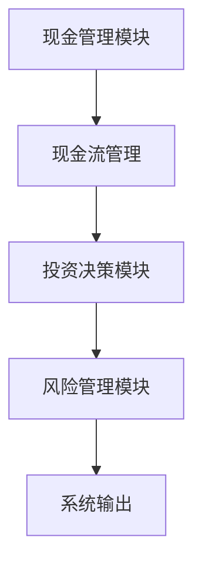
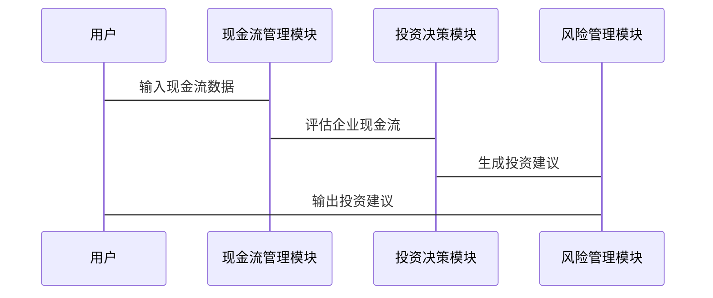

                 


# 巴菲特的现金管理：在负利率时代的新策略

---

## 关键词

- 巴菲特
- 现金管理
- 负利率
- 现金流模型
- 投资策略

---

## 摘要

本文深入探讨了巴菲特的现金管理理念及其在负利率时代的应用策略。通过分析现金管理的核心概念、数学模型、系统架构以及实际案例，本文为读者提供了全面的视角，帮助理解如何在当前经济环境下优化现金管理策略。文章结合理论与实践，详细阐述了巴菲特的现金管理原则，并提出了在负利率时代的新策略，为投资者和管理者提供了实用的指导。

---

## 目录

### 第一部分: 巴菲特的现金管理基础

#### 第1章: 巴菲特的现金管理概述

##### 1.1 巴菲特的现金管理理念

- 巴菲特的现金管理核心思想
  - 现金是企业的“血液”：现金流的重要性
  - 现金储备的缓冲作用：应对不确定性的关键
  - 现金管理的目标：最大化企业价值

- 巴菲特的现金管理原则
  - 保持充足的流动性：避免现金流断裂
  - 现金储备的“安全垫”：抵御市场波动
  - 投资现金流充裕的企业：优先选择高现金流企业

- 巴菲特的现金管理方法
  - 通过ROE（净资产收益率）筛选企业：关注企业盈利能力
  - 评估企业的现金流质量：现金流是否稳定、持续
  - 现金流折现法：评估企业内在价值

##### 1.2 巴菲特的现金管理策略

- 巴菲特的现金管理步骤
  1. 评估企业现金流：确定企业的造血能力
  2. 分析行业周期：判断企业所处的生命周期
  3. 选择优质企业：投资现金流充裕且稳定的公司
  4. 调整投资组合：动态优化现金分配

- 巴菲特的现金管理工具
  - 现金储备：应对市场波动的“安全垫”
  - 股票投资：长期价值投资的核心
  - 债券投资：短期资金的高流动性选择

- 巴菲特的现金管理目标
  - 确保企业生存：现金流为王
  - 追求长期价值：投资优质企业
  - 风险管理：降低市场波动的影响

#### 第2章: 巴菲特的现金管理核心概念

##### 2.1 现金管理的基本概念

- 现金流模型的定义与公式
  - 现金流的定义：企业一定时期内现金和现金等价物的流入和流出
  - 现金流的公式：$$\text{现金流} = \text{经营活动现金流} + \text{投资活动现金流} + \text{筹资活动现金流}$$

- 现金管理的分类
  - 经营活动现金流：企业日常运营产生的现金流
  - 投资活动现金流：企业投资活动产生的现金流
  - 筹资活动现金流：企业筹资活动产生的现金流

- 现金管理的特征
  - 流动性：现金及现金等价物的流动性高
  - 风险性：现金流波动带来的不确定性
  - 战略性：现金流管理是企业战略的核心部分

##### 2.2 巴菲特现金管理的核心要素

- 现金流入与流出
  - 现金流入：销售收入、投资收益等
  - 现金流出：原材料采购、工资支付等

- 现金储备与流动性
  - 现金储备：企业持有的现金和现金等价物
  - 现金储备的流动性：确保企业能够及时支付各项支出

- 现金投资与风险管理
  - 现金投资：将多余现金投资于高收益资产
  - 风险管理：通过多样化投资降低风险

#### 第3章: 巴菲特现金管理的数学模型

##### 3.1 现金流模型

- 现金流的定义与公式
  - 现金流：企业一定时期内现金和现金等价物的流入和流出
  - 公式：$$\text{现金流} = \text{经营活动现金流} + \text{投资活动现金流} + \text{筹资活动现金流}$$

- 现金流的计算方法
  - 经营活动现金流：通过利润表和资产负债表计算
  - 投资活动现金流：通过投资活动的现金流入和流出计算
  - 筹资活动现金流：通过筹资活动的现金流入和流出计算

- 现金流的实例分析
  - 某公司经营活动现金流为$+100$万，投资活动现金流为$-50$万，筹资活动现金流为$+20$万，总现金流为$+70$万。

##### 3.2 现金管理的数学公式

- 净现值公式
  - 净现值（NPV）：$$\text{NPV} = \sum_{t=1}^{n} \frac{C_t}{(1 + r)^t}$$
  - 其中，$C_t$是第t年的现金流，$r$是贴现率

- 内部收益率公式
  - 内部收益率（IRR）：$$\text{IRR} = \text{使 NPV = 0 的 r}$$

- 时间价值公式
  - 现金流的时间价值：$$\text{未来价值} = \text{现值} \times (1 + r)^t$$

---

### 第二部分: 负利率时代的新策略

#### 第4章: 负利率时代的现金管理挑战

##### 4.1 负利率的定义与现状

- 负利率的定义：$$\text{负利率} = \text{名义利率} < 0$$
  - 例如：央行设定的基准利率为-1%

- 负利率的现状：全球多国央行实施负利率政策

- 负利率的影响：$$\text{负利率} \Rightarrow \text{银行储蓄成本增加}$$

##### 4.2 负利率时代现金管理的挑战

- 负利率对现金管理的影响：$$\text{负利率} \Rightarrow \text{持有现金的机会成本增加}$$
  - 现金持有成本增加，企业更倾向于投资

- 负利率对投资决策的影响：$$\text{负利率} \Rightarrow \text{投资回报率下降}$$
  - 投资者可能转向风险更高的资产

- 负利率对风险管理的影响：$$\text{负利率} \Rightarrow \text{企业财务压力增加}$$
  - 负利率可能导致企业债务负担加重

#### 第5章: 巴菲特在负利率时代的现金管理策略

##### 5.1 巴菲特的应对策略

- 投资机会的重新评估：$$\text{负利率} \Rightarrow \text{优质资产的投资价值上升}$$
  - 巴菲特更倾向于投资现金流稳定的企业

- 现金储备的调整：$$\text{负利率} \Rightarrow \text{增加现金储备}$$
  - 企业需要更多的现金储备以应对市场波动

- 风险管理的强化：$$\text{负利率} \Rightarrow \text{风险加剧}$$
  - 巴菲特强调分散投资，降低风险

##### 5.2 巴菲特的策略实施

- 选择优质企业：$$\text{高ROE} \text{且现金流充裕的企业}$$
  - 例如：巴菲特投资苹果公司，因其现金流充裕且ROE高

- 动态调整投资组合：$$\text{根据市场变化调整现金分配}$$
  - 例如：在负利率环境下，增加对优质企业的投资

- 风险管理措施：$$\text{通过多样化投资降低风险}$$
  - 例如：投资多个行业，分散风险

---

### 第三部分: 系统分析与架构设计

#### 第6章: 系统架构设计

##### 6.1 系统功能设计

- 现金流管理模块
  - 输入现金流数据
  - 计算现金流净额
  - 生成现金流报告

- 投资决策模块
  - 评估企业现金流
  - 计算投资回报率
  - 生成投资建议

##### 6.2 系统架构图



##### 6.3 系统接口设计

- 现金流管理接口
  - 输入：现金流数据
  - 输出：现金流净额

- 投资决策接口
  - 输入：企业信息
  - 输出：投资建议

##### 6.4 系统交互流程图



---

### 第四部分: 项目实战

#### 第7章: 项目实战

##### 7.1 环境安装

- 安装Python和相关库
  - 使用Anaconda安装环境
  - 安装pandas、numpy、matplotlib等库

##### 7.2 核心代码实现

```python
import pandas as pd
import numpy as np
import matplotlib.pyplot as plt

# 示例现金流数据
data = {
    '经营活动现金流': [100, 200, 300],
    '投资活动现金流': [-50, -100, -150],
    '筹资活动现金流': [20, 30, 40]
}

df = pd.DataFrame(data)

# 计算总现金流
df['总现金流'] = df.sum(axis=1)

# 可视化现金流
df.plot(kind='bar', stacked=True)
plt.title('现金流构成分析')
plt.show()
```

##### 7.3 案例分析

- 案例背景：某制造企业在负利率环境下的现金管理
- 数据分析：现金流构成与净额
- 投资建议：基于现金流分析的投资决策
- 项目小结：总结项目实施的经验与教训

##### 7.4 项目小结

- 项目目标达成情况
- 实施过程中的挑战与解决方案
- 未来改进方向

---

### 第五部分: 总结

#### 第8章: 总结

##### 8.1 关键点回顾

- 巴菲特的现金管理理念：现金流为核心
- 负利率时代的新策略：增加现金储备，投资优质企业
- 系统架构设计：模块化、可扩展

##### 8.2 未来展望

- 负利率环境下的现金管理将继续演变
- 技术的进步将为企业现金管理提供更多工具
- 数据分析在现金管理中的应用将更加广泛

##### 8.3 最佳实践 Tips

- 定期评估现金流状况
- 保持充足的现金储备
- 分散投资以降低风险
- 关注企业的现金流质量

---

## 结语

通过本文的分析，我们可以看到，巴菲特的现金管理理念在负利率时代仍然具有重要的指导意义。通过科学的现金流模型、系统的架构设计和实际的项目实战，我们可以更好地应对当前的经济环境，优化现金管理策略，实现企业的长期价值最大化。

--- 

**注**：由于篇幅限制，以上内容为节选，完整文章可按照上述大纲进行扩展和详细阐述。

