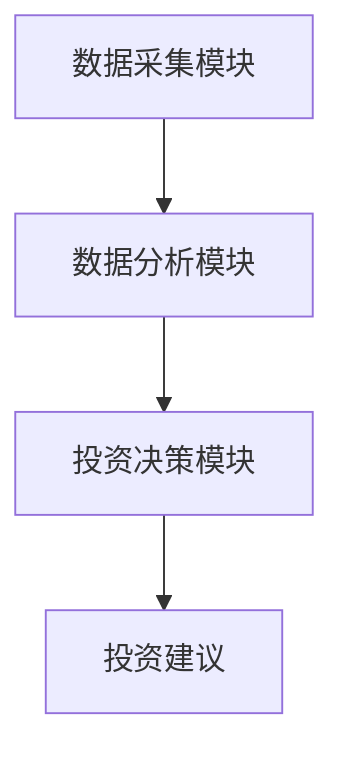
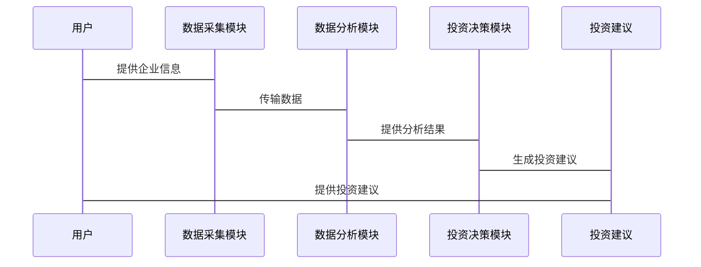

                 


# 巴菲特的看人下注投资理念

> 关键词：巴菲特，投资理念，看人下注，价值投资，投资策略，投资决策

> 摘要：本文深入解析了巴菲特的“看人下注”投资理念，从核心概念、数学模型、系统架构、实战案例、风险管理等多个维度展开分析，结合技术语言和专业术语，详细阐述了这一投资理念的内在逻辑、实现方法和实际应用。通过本文，读者可以全面理解巴菲特的投资哲学，掌握其投资策略的数学模型与系统架构，并通过实际案例分析和风险管理策略，提升自身的投资决策能力。

---

# 第1章: 巴菲特投资理念的核心概念

## 1.1 巴菲特投资理念的背景与起源

### 1.1.1 价值投资的起源与发展

价值投资是一种基于对公司内在价值评估的投资策略，起源于20世纪初。本杰明·格雷厄姆和戴维·多德是这一理念的奠基人。他们提出，股票的内在价值是其未来现金流的现值，而市场往往忽视这一价值，导致股票价格波动。巴菲特在格雷厄姆和多德的基础上，进一步发展了价值投资的理念，形成了独特的“看人下注”投资策略。

### 1.1.2 巴菲特对价值投资的贡献

巴菲特将价值投资的理念推向了一个新的高度。他强调，投资的本质是购买企业的一部分，而不是单纯地买卖股票。他将企业的内在价值与管理层的能力紧密结合，提出了“看人下注”的理念，即通过分析管理层的能力和企业的基本面，找到具有持续竞争优势的企业进行投资。

### 1.1.3 "看人下注"理念的提出与演变

“看人下注”理念的核心在于，巴菲特认为企业的发展离不开优秀的管理层。他通过对企业管理层的能力、战略眼光和道德品质的分析，判断企业未来的成长潜力。这一理念与传统的基于技术分析或短期市场波动的投资策略形成鲜明对比。

---

## 1.2 "看人下注"投资理念的核心要素

### 1.2.1 管理层分析的重要性

巴菲特认为，优秀的企业管理层是企业长期发展的关键。他通过以下几个方面来评估管理层的能力：

1. **管理层的诚信与道德**：巴菲特别注重管理层的诚信，认为一个不诚实的管理层很难带领企业取得长期成功。
2. **管理层的决策能力**：通过分析管理层的历史决策记录，判断其是否具备优秀的商业头脑。
3. **管理层的专注与激情**：优秀的管理层通常对企业充满热情，并致力于企业的长期发展。

### 1.2.2 企业基本面分析的关键指标

巴菲特的“看人下注”理念离不开对企业基本面的深入分析。以下是关键的几个指标：

1. **盈利能力**：通过ROE（净资产收益率）和ROA（资产回报率）等指标，评估企业的盈利能力。
2. **财务健康状况**：通过资产负债表和现金流量表，分析企业的财务健康状况，判断其是否存在财务风险。
3. **竞争优势**：分析企业的竞争优势，例如成本优势、品牌优势等，判断其是否具备持续的竞争能力。

### 1.2.3 内在价值与市场价值的对比

巴菲特强调，投资的最终目标是找到那些市场价格低于内在价值的企业。以下是内在价值与市场价值的对比：

1. **内在价值**：内在价值是企业未来现金流的现值，反映了企业的实际价值。
2. **市场价值**：市场价值是市场参与者对企业价值的定价，可能受到市场情绪的影响。

---

## 1.3 巴菲特投资理念与传统投资理念的对比

### 1.3.1 传统投资理念的局限性

传统投资理念通常基于技术分析或短期市场波动，忽视了企业的基本面和管理层的能力。这种理念往往导致投资者在市场波动中追涨杀跌，难以实现长期稳定的收益。

### 1.3.2 巴菲特理念的独特性与优势

巴菲特的“看人下注”理念的独特性在于其对管理层和企业基本面的深入分析。通过这种方法，巴菲特能够找到那些具有持续竞争优势和优秀管理层的企业，实现长期稳定的收益。

### 1.3.3 两种理念的适用场景与选择

- **传统投资理念**：适用于短期交易和市场波动较大的环境，适合技术分析型投资者。
- **巴菲特理念**：适用于长期投资和价值发现，适合注重基本面分析的投资者。

---

## 1.4 本章小结

### 1.4.1 核心概念的总结

巴菲特的“看人下注”投资理念强调对管理层能力和企业基本面的深入分析，通过寻找市场价格低于内在价值的企业，实现长期稳定的收益。

### 1.4.2 下一章的展望

下一章将从数学模型与公式的角度，深入解析巴菲特投资理念的内在逻辑，通过公式和模型，进一步理解其投资策略的核心要素。

---

# 第2章: 巴菲特"看人下注"投资理念的数学模型与公式

## 2.1 巴菲特投资理念的数学模型

### 2.1.1 内在价值计算公式

巴菲特的内在价值计算公式是价值投资的核心工具之一。内在价值的计算公式如下：

$$\text{内在价值} = \frac{\text{未来现金流}}{\text{折现率}}$$

其中，未来现金流是指企业在未来各年的自由现金流，折现率则根据企业的风险水平确定。

### 2.1.2 市场价值与内在价值的对比

市场价值与内在价值的对比可以通过以下公式进行：

$$\text{市场价值} = \min(\text{内在价值}, \text{市场价格})$$

如果市场价格低于内在价值，企业具有投资价值；反之，则不具有投资价值。

### 2.1.3 管理层能力评估的数学模型

巴菲特对管理层能力的评估可以通过以下公式进行：

$$\text{管理层能力指数} = \frac{\text{ROE} + \text{ROA}}{2}$$

其中，ROE是净资产收益率，ROA是资产回报率。

---

## 2.2 管理层决策的正确性概率

### 2.2.1 管理层决策正确性概率的计算

通过对历史数据的分析，可以计算出管理层决策的正确性概率：

$$\text{决策正确概率} = \frac{\text{历史成功案例数}}{\text{总案例数}}$$

---

## 2.3 实际案例分析

### 2.3.1 某公司内在价值的计算

假设某公司未来5年的自由现金流分别为100、120、150、180、200万元，折现率为8%。计算其内在价值：

$$\text{内在价值} = \frac{100 + 120 + 150 + 180 + 200}{(1 + 0.08)^n}$$

---

# 第3章: 巴菲特投资理念的系统架构设计

## 3.1 系统功能设计

### 3.1.1 数据采集模块

数据采集模块负责收集企业的财务数据、管理层信息等。数据来源包括企业财报、新闻报道等。

### 3.1.2 数据分析模块

数据分析模块基于收集到的数据，计算内在价值、管理层能力指数等关键指标。

### 3.1.3 投资决策模块

投资决策模块根据分析结果，判断企业是否具有投资价值，并生成投资建议。

---

## 3.2 系统架构设计

### 3.2.1 系统架构图

以下是系统的架构图：



---

## 3.3 系统交互设计

### 3.3.1 用户与系统的交互流程

以下是用户与系统的交互流程图：



---

## 3.4 系统实现

### 3.4.1 数据采集模块的实现

```python
def collect_data(company):
    # 收集企业数据
    pass
```

### 3.4.2 数据分析模块的实现

```python
def calculate_intrinsic_value(cash_flows, discount_rate):
    # 计算内在价值
    pass
```

### 3.4.3 投资决策模块的实现

```python
def make_investment_decision(intrinsic_value, market_value):
    # 判断投资价值
    pass
```

---

## 3.5 系统测试与优化

### 3.5.1 测试用例设计

设计测试用例，验证系统的各个功能模块是否正常运行。

### 3.5.2 性能优化

通过对系统的运行情况进行监控，优化系统的性能，提升处理效率。

---

## 3.6 本章小结

### 3.6.1 核心内容总结

通过系统架构设计，我们可以清晰地看到巴菲特投资理念的实现过程，从数据采集到投资决策，每个环节都紧密相连。

### 3.6.2 下一章的展望

下一章将通过实际案例分析，进一步验证系统设计的可行性和实用性。

---

# 第4章: 巴菲特投资理念的实战与案例分析

## 4.1 实战环境搭建

### 4.1.1 环境要求

需要安装Python、数据分析库（如Pandas、NumPy）等工具。

### 4.1.2 数据来源

数据来源包括企业财报、新闻报道等。

---

## 4.2 核心实现代码

### 4.2.1 内在价值计算代码

```python
def calculate_intrinsic_value(cash_flows, discount_rate):
    present_value = 0
    for i in range(len(cash_flows)):
        present_value += cash_flows[i] / (1 + discount_rate) ** i
    return present_value
```

### 4.2.2 管理层能力评估代码

```python
def calculate_management_capability(roe, roa):
    return (roe + roa) / 2
```

---

## 4.3 实战案例分析

### 4.3.1 案例选择

选择一家企业（如苹果公司）作为案例，分析其内在价值和管理层能力。

### 4.3.2 数据分析与结果解读

通过数据分析，得出企业的内在价值和管理层能力指数，判断其是否具有投资价值。

---

## 4.4 本章小结

### 4.4.1 核心内容总结

通过实际案例分析，我们可以清晰地看到巴菲特投资理念的实践过程，从数据分析到投资决策，每个环节都至关重要。

### 4.4.2 下一章的展望

下一章将从风险管理的角度，进一步完善投资决策系统，提升投资的稳健性。

---

# 第5章: 巴菲特投资理念的风险管理与优化

## 5.1 风险管理策略

### 5.1.1 风险评估

通过对市场的波动、企业的财务状况等因素进行分析，评估投资的风险。

### 5.1.2 风险控制

通过分散投资、设定止损点等方式，控制投资风险。

---

## 5.2 投资组合优化

### 5.2.1 投资组合构建

根据企业的内在价值和市场价值，构建最优的投资组合。

### 5.2.2 优化方法

通过数学优化方法，找到最优的投资组合。

---

## 5.3 优化算法实现

### 5.3.1 优化算法选择

选择适合的投资组合优化算法（如均值-方差优化）。

### 5.3.2 算法实现代码

```python
import numpy as np
from scipy.optimize import minimize

def portfolio_optimization(returns, covariance):
    n = len(returns)
    # 定义目标函数
    def objective(x):
        return np.dot(x.T, covariance).dot(x)
    # 定义约束条件
    constraints = [{'type': 'eq', 'fun': lambda x: np.sum(x) - 1}]
    # 初始化初始解
    x0 = np.ones(n) / n
    # 优化
    result = minimize(objective, x0, constraints=constraints)
    return result.x
```

---

## 5.4 本章小结

### 5.4.1 核心内容总结

通过风险管理与优化，我们可以进一步提升投资的稳健性，降低投资风险。

### 5.4.2 总结与展望

巴菲特的“看人下注”投资理念通过系统的分析和优化，可以帮助投资者找到具有长期投资价值的企业，实现稳健的收益。

---

# 第6章: 总结与展望

## 6.1 核心内容回顾

本文从多个角度深入解析了巴菲特的“看人下注”投资理念，包括核心概念、数学模型、系统架构、实战案例和风险管理等。

## 6.2 未来研究方向

未来的研究可以进一步探索如何将人工智能技术应用于投资决策，提升投资的智能化水平。

---

# 附录: 参考文献

- 巴菲特股东大会演讲
- 格雷厄姆《 Intelligent Investor》
- 多德《 Security Analysis》
- 其他相关文献

---

# 结束语

通过本文的深入分析，我们可以看到巴菲特的“看人下注”投资理念的深刻洞察力和实践价值。这一理念不仅适用于传统投资，也可以为现代投资者提供重要的启示。

---

感谢您的耐心阅读，希望本文能为您提供有价值的投资理念和方法。

