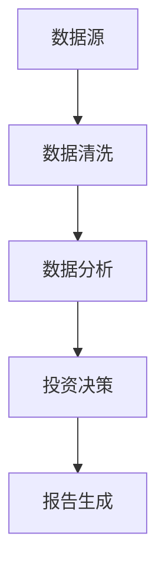

                 


# 巴菲特的石油行业投资：能源领域的机遇

## 关键词
巴菲特，石油行业，能源投资，长期价值，风险管理，能源转型

## 摘要
本文探讨了巴菲特在石油行业的投资策略，分析了能源领域的机遇与挑战。通过详细分析巴菲特的投资理念、价值评估模型、风险管理策略以及实际案例，本文揭示了如何将价值投资应用于石油行业，并展望了能源转型对投资的影响。

---

## 第一部分: 巴菲特的石油行业投资概述

### 第1章: 巴菲特的投资理念与石油行业的结合

#### 1.1 巴菲特的投资哲学
##### 1.1.1 价值投资的核心理念
价值投资是巴菲特的核心策略，强调以低于内在价值的价格购买优质资产。他寻找具有强大竞争优势、良好管理团队和稳定财务状况的公司。在石油行业，这意味着投资于拥有丰富储量、高效运营和稳定现金流的公司。

##### 1.1.2 投资中的长期思维
巴菲特主张长期投资，避免短期市场波动的干扰。他关注企业的内在价值和长期盈利能力，而不是短期股价波动。在石油行业，这意味着投资于那些能够适应周期性波动并持续创造价值的企业。

##### 1.1.3 巴菲特的投资策略在石油行业中的应用
巴菲特将价值投资应用于石油行业，寻找被市场低估的石油公司。他关注公司的财务状况、管理团队和行业地位，选择那些能够在周期性低谷中生存并发展的公司。

#### 1.2 石油行业的特点与挑战
##### 1.2.1 石油行业的周期性分析
石油行业具有明显的周期性，价格波动受供需关系、地缘政治和全球经济的影响。巴菲特通过分析行业周期，选择在低谷期投资，以获得更高的安全边际。

##### 1.2.2 石油价格波动的驱动因素
石油价格受多种因素影响，包括OPEC产量政策、地缘政治冲突、全球经济状况和技术创新。巴菲特通过分析这些因素，预测价格走势，优化投资组合。

##### 1.2.3 石油行业的风险与机遇
石油行业面临价格波动、政策风险和环境法规等风险。然而，行业整合、技术创新和能源转型也带来了投资机遇。巴菲特通过分散投资和风险管理，降低风险并捕捉机遇。

---

### 第2章: 巴菲特与石油行业的历史案例

#### 2.1 巴菲特早期的投资策略
##### 2.1.1 巴菲特早期的石油投资案例
巴菲特早期的投资案例包括购买石油公司股票，寻找那些具有稳定现金流和高分红的公司。他通过分析财务报表和行业趋势，选择具有长期增长潜力的公司。

##### 2.1.2 巴菲特对石油行业的看法演变
随着行业变化，巴菲特的投资策略也在调整。他从早期的分散投资逐步转向集中投资，选择行业龙头股，如ExxonMobil和Chevron。

#### 2.2 巴菲特对石油行业的重大投资
##### 2.2.1 投资ExxonMobil的案例分析
巴菲特在2008年全球经济危机期间投资ExxonMobil，利用市场恐慌带来的低估值，买入廉价股票。他关注公司的强大财务状况和行业领导地位。

##### 2.2.2 投资Chevron的策略与结果
巴菲特投资Chevron，看中其丰富的储量和高效运营。Chevron在行业低谷期表现稳定，为巴菲特提供了长期的股息收入和资本增值。

---

### 第3章: 巴菲特的石油投资分析框架

#### 3.1 价值评估的关键指标
##### 3.1.1 市盈率与市净率分析
市盈率（P/E）和市净率（P/B）是评估公司价值的重要指标。巴菲特寻找市盈率和市净率低于行业平均水平的公司，确保投资的安全边际。

##### 3.1.2 自由现金流的计算与重要性
自由现金流是衡量公司财务健康的重要指标。巴菲特关注公司能否产生稳定的自由现金流，确保其具备持续增长和分红的能力。

##### 3.1.3 资产负债表的健康状况
巴菲特分析公司的资产负债表，确保其债务水平合理，资产质量优良。他避免投资于高负债公司，以降低财务风险。

#### 3.2 石油行业的长期趋势分析
##### 3.2.1 全球能源需求的增长预测
全球能源需求将持续增长，尤其是发展中国家的能源需求将推动石油行业的发展。巴菲特关注这一趋势，寻找具有长期增长潜力的公司。

##### 3.2.2 可再生能源对石油行业的冲击
可再生能源的崛起对石油行业构成威胁。然而，巴菲特认为传统能源仍有市场需求，尤其是在新兴市场。他通过分散投资应对行业转型带来的风险。

##### 3.2.3 技术进步对行业的影响
技术进步，如水平钻井和页岩油开发，提高了石油开采效率，降低了成本。巴菲特关注具备技术创新能力的公司，寻找长期竞争优势。

---

### 第4章: 巴菲特的石油投资策略

#### 4.1 选择石油公司的标准
##### 4.1.1 公司的财务稳定性
巴菲特寻找财务稳定的公司，确保其能够在行业周期性波动中生存并发展。他关注公司的盈利能力、现金流和债务水平。

##### 4.1.2 管理层的质量与决策能力
巴菲特认为管理层的质量对公司的成功至关重要。他选择那些具有优秀管理团队、能够做出明智决策的公司。

##### 4.1.3 公司的市场地位与竞争优势
巴菲特投资于行业龙头公司，这些公司在市场上具有强大的竞争优势，能够长期保持领先地位。

#### 4.2 风险管理与投资组合优化
##### 4.2.1 风险分散的策略
通过分散投资，巴菲特降低单一投资的风险。他将资金分配到不同的石油公司和行业，确保投资组合的稳定性。

##### 4.2.2 投资组合的优化配置
巴菲特根据市场变化和公司情况，不断优化投资组合。他调整持仓，确保投资组合的风险和收益达到最佳平衡。

##### 4.2.3 宏观经济因素的考量
巴菲特关注宏观经济趋势，如全球经济状况、货币政策和地缘政治，这些因素对石油行业和投资组合有重要影响。

---

## 第二部分: 巴菲特石油投资的数学模型与算法

### 第5章: 石油行业投资的数学模型

#### 5.1 现金流折现模型（DCF）
##### 5.1.1 DCF模型的基本原理
现金流折现模型是评估公司价值的重要工具。巴菲特使用DCF模型，将未来现金流折现为当前价值，评估公司的内在价值。

##### 5.1.2 DCF模型的步骤
1. 估计未来现金流
2. 确定合适的折现率
3. 计算现值
4. 评估与市场价格的差异

##### 5.1.3 Python实现DCF模型
```python
def discounted_cash_flow(cash_flows, discount_rate):
    present_value = sum(cflow / (1 + discount_rate)**i for i, cflow in enumerate(cash_flows))
    return present_value

cash_flows = [100, 200, 300, 400]  # 模拟未来现金流
discount_rate = 0.08  # 折现率
intrinsic_value = discounted_cash_flow(cash_flows, discount_rate)
print(f"内 在 价 值: {intrinsic_value}")
```

#### 5.2 石油价格预测模型
##### 5.2.1 线性回归模型
使用线性回归预测石油价格，考虑历史价格数据和相关因素。

##### 5.2.2 时间序列分析
使用ARIMA模型预测未来石油价格，捕捉价格波动的周期性特征。

##### 5.2.3 Python实现价格预测模型
```python
import pandas as pd
from statsmodels.tsa.arima_model import ARIMA

data = pd.read_csv('oil_prices.csv')
model = ARIMA(data['Price'], order=(1, 1, 1))
model_fit = model.fit()

forecast = model_fit.forecast(steps=5)
print(f"未来5天的石油价格预测: {forecast}")
```

---

## 第三部分: 巴菲特石油投资的系统架构

### 第6章: 石油行业投资系统架构

#### 6.1 系统功能设计
##### 6.1.1 数据收集模块
从多个数据源收集石油行业的数据，包括价格、产量、公司财务数据等。

##### 6.1.2 数据分析模块
使用统计分析和机器学习算法，评估公司的内在价值和投资风险。

##### 6.1.3 决策模块
根据分析结果，生成投资建议，包括买入、卖出或持有。

#### 6.2 系统架构设计
##### 6.2.1 数据流图
```
输入数据 -> 数据清洗 -> 数据分析 -> 投资决策 -> 输出报告
```

##### 6.2.2 系统架构图


---

## 第四部分: 项目实战与案例分析

### 第7章: 巴菲特石油投资的实战案例

#### 7.1 项目环境与工具安装
##### 7.1.1 安装必要的Python库
安装pandas、numpy、statsmodels等库，用于数据分析和建模。

#### 7.2 核心实现与代码分析
##### 7.2.1 数据清洗与预处理
使用pandas处理数据，填充缺失值，处理异常值。

##### 7.2.2 模型实现与评估
实现DCF模型和ARIMA模型，评估模型的准确性和稳定性。

#### 7.3 案例分析与结果解读
##### 7.3.1 投资决策过程
根据模型结果，评估某石油公司的内在价值，做出买入或卖出的决策。

##### 7.3.2 投资结果与经验总结
分析投资结果，总结经验教训，优化投资策略。

---

## 第五部分: 最佳实践与小结

### 第8章: 最佳实践与注意事项

#### 8.1 投资注意事项
##### 8.1.1 风险管理的重要性
分散投资，避免过度集中在单一行业或公司。

##### 8.1.2 长期投资的耐心与智慧
保持耐心，避免短期波动的干扰，关注长期价值。

#### 8.2 小结与未来展望
巴菲特的投资理念在石油行业依然适用，但需要结合行业特点和变化趋势。未来，随着能源转型，投资者需要更加关注可持续发展和技术创新。

### 第9章: 拓展阅读与深入学习

#### 9.1 拓展阅读
推荐阅读巴菲特的著作和相关投资书籍，深入学习价值投资理论。

#### 9.2 深入学习方向
研究石油行业的技术进步和市场趋势，探索新的投资机会。

---

## 结语
巴菲特的石油投资策略为投资者提供了宝贵的借鉴。通过价值投资、风险管理和技术分析，投资者可以在能源领域抓住机遇，实现长期稳健的投资回报。未来，随着能源转型的推进，投资者需要不断学习和适应变化，抓住新的投资机会。

