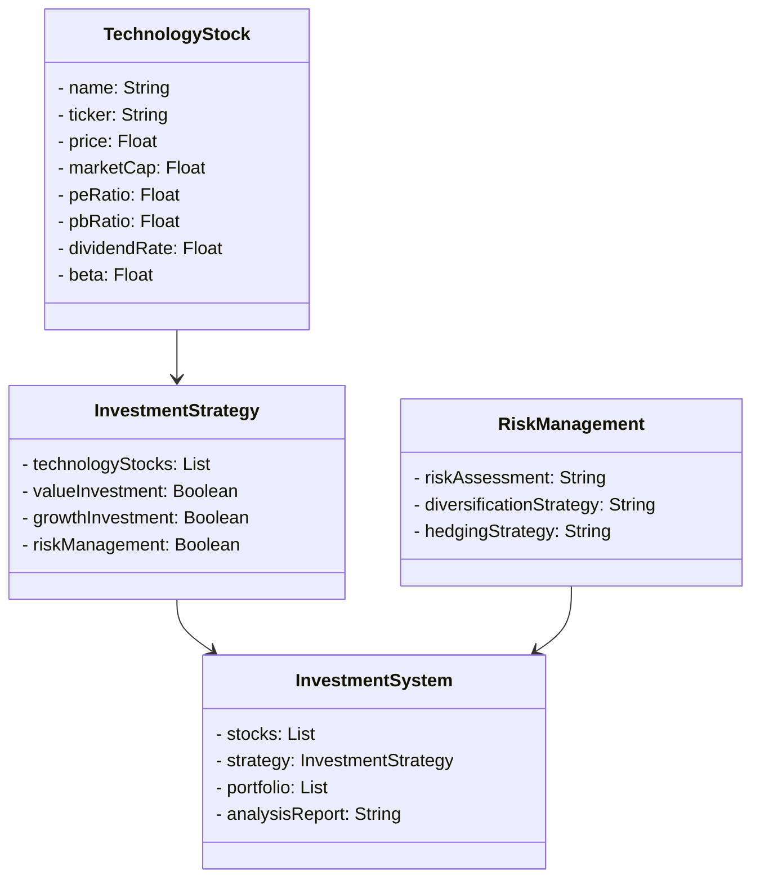

                 


# 巴菲特的科技股投资转变：与时俱进的智慧

## 关键词：巴菲特，科技股，投资策略，价值投资，风险管理，投资模型

## 摘要：
本文深入分析了巴菲特从传统价值投资转向科技股投资的转变过程，探讨了科技股的特点、投资逻辑、数学模型和风险管理策略。通过具体案例分析，揭示了巴菲特科技股投资的成功经验，并为读者提供了系统的投资决策模型和最佳实践建议。

---

# 第一部分: 巴菲特投资理念的演变

## 第1章: 巴菲特的投资理念演变

### 1.1 巴菲特早期的投资理念

#### 1.1.1 价值投资的定义与核心原则
价值投资是一种基于对公司内在价值的分析的投资策略，核心原则包括：
- **安全边际**：以低于内在价值的价格买入股票。
- **长期视角**：关注公司的长期盈利能力。
- **基本面分析**：通过财务报表分析公司的真实价值。

#### 1.1.2 巴菲特早期的成功案例
- **可口可乐**：巴菲特通过对其商业模式和财务状况的深入分析，以合理价格买入并长期持有。
- **美国运通**：通过对其竞争优势和市场地位的分析，巴菲特成功投资于这家信用卡公司。

#### 1.1.3 巴菲特投资理念的局限性
- 价值投资在传统行业（如制造业、零售业）中表现优异，但在科技行业的高增长性和不确定性下显得力不从心。
- 科技行业的快速变化和创新使得传统价值评估方法难以直接应用。

---

### 1.2 科技股的崛起与巴菲特的转变

#### 1.2.1 科技股在现代投资中的重要性
- 科技行业成为全球经济的主要驱动力。
- 科技股在标普500指数中的权重不断增加，成为不可忽视的投资领域。

#### 1.2.2 巴菲特对科技股的最初态度
- **怀疑与谨慎**：巴菲特早期认为科技行业缺乏长期的可预测性，且科技公司的财务杠杆较高。
- **案例**：巴菲特错过投资谷歌和亚马逊，但投资了IBM和卡夫亨氏（部分涉及科技）。

#### 1.2.3 巴菲特投资理念的转变
- **科技股的长期价值**：巴菲特意识到科技公司在数字化转型中的核心地位。
- **案例**：巴菲特投资苹果公司，成为其最大的单一股票持仓。

---

## 第2章: 科技股的特点与投资逻辑

### 2.1 科技股的核心特征

#### 2.1.1 科技股的高成长性
- 科技行业的边际成本低，具有快速扩展的潜力。
- **案例**：苹果的iPhone和iPad销量的快速增长。

#### 2.1.2 科技股的高波动性
- 科技股受市场情绪影响较大，价格波动剧烈。
- **风险**：短期波动可能导致价值投资者的短期亏损。

#### 2.1.3 科技股的创新性与风险
- 创新是科技行业的核心驱动力，但也带来了不确定性。
- **风险管理**：通过分散投资和长期持有降低风险。

---

### 2.2 巴菲特科技股投资的逻辑

#### 2.2.1 从基本面分析到科技股的转变
- **核心逻辑**：选择具有强大护城河（moat）的科技公司。
- **护城河分析**：技术优势、品牌影响力、网络效应等。

#### 2.2.2 巴菲特对科技股的独特理解
- **长期视角**：关注科技公司的长期盈利能力。
- **案例**：巴菲特投资苹果的原因在于其强大的生态系统和持续的创新能力。

#### 2.2.3 科技股投资的长期性与稳定性
- **长期持有**：巴菲特强调长期投资，避免短期波动的干扰。
- **稳定性**：选择那些具有稳定现金流和强大财务状况的科技公司。

---

## 第3章: 巴菲特科技股投资策略的调整

### 3.1 传统投资策略与科技股的结合

#### 3.1.1 价值投资与科技股的结合
- **内在价值评估**：科技公司的内在价值需要考虑其未来的现金流和技术创新能力。
- **动态调整**：科技行业的变化速度快，需要动态调整估值模型。

#### 3.1.2 市场趋势分析与科技股投资
- **行业趋势**：关注人工智能、云计算、5G等领域的投资机会。
- **案例**：微软在云计算领域的成功。

#### 3.1.3 风险管理在科技股投资中的重要性
- **分散投资**：通过投资多个科技公司降低风险。
- **止损策略**：设定止损点以避免重大损失。

---

### 3.2 巴菲特科技股投资的核心策略

#### 3.2.1 长期投资与科技股的契合
- **时间的朋友**：科技公司的价值往往需要时间来体现。
- **案例**：巴菲特对苹果的投资长期表现优异。

#### 3.2.2 优质企业筛选标准
- **财务健康**：关注公司的盈利能力、现金流和债务水平。
- **竞争优势**：选择具有强大护城河的公司。
- **管理团队**：关注管理层的素质和战略眼光。

#### 3.2.3 科技股投资的组合管理
- **资产配置**：科技股在投资组合中的合理配置。
- **动态调整**：根据市场变化和公司基本面调整持仓。

---

## 第4章: 巴菲特科技股投资的经典案例分析

### 4.1 苹果公司投资案例

#### 4.1.1 苹果公司的基本面分析
- **财务表现**：苹果具有强大的盈利能力，现金流充裕。
- **竞争优势**：苹果拥有强大的品牌影响力和生态系统。
- **创新能力**：苹果在产品创新方面持续领先。

#### 4.1.2 巴菲特对苹果的投资逻辑
- **长期看好**：巴菲特认为苹果具有持续的盈利能力。
- **价值评估**：苹果的内在价值高于市场价。

#### 4.1.3 投资结果与经验总结
- **收益**：巴菲特投资苹果取得了显著收益。
- **经验**：选择具有强大护城河的科技公司，长期持有。

---

### 4.2 微软公司投资案例

#### 4.2.1 微软公司的战略转型
- **云计算**：微软Azure成为全球领先的云服务提供商。
- **收购策略**：通过收购GitHub和LinkedIn扩展业务。

#### 4.2.2 巴菲特对微软的投资逻辑
- **行业地位**：微软在软件和云服务领域的领先地位。
- **财务健康**：微软具有强大的现金流和盈利能力。
- **管理层**：Satya Nadella的领导被认为是一个重要因素。

#### 4.2.3 投资结果与经验总结
- **收益**：微软的投资回报显著。
- **经验**：关注科技公司的战略转型和管理层素质。

---

## 第5章: 巴菲特科技股投资的数学模型与算法分析

### 5.1 价值评估模型

#### 5.1.1 市盈率与市净率分析
- **市盈率（P/E）**：市盈率 = 股价 / 每股净利润。
- **市净率（P/B）**：市净率 = 股价 / 每股净资产。
- **案例**：苹果的市盈率和市净率分析。

#### 5.1.2 股息率与投资回报预测
- **股息率**：股息率 = 每股股息 / 股价。
- **投资回报预测**：基于股息率和股价增长预测未来的回报。

#### 5.1.3 现金流折现模型
- **自由现金流**：自由现金流 = 营业现金流入 - 营业现金流出。
- **折现率**：使用加权平均资本成本（WACC）作为折现率。
- **公式**：
  $$
  \text{企业价值} = \sum_{t=1}^{n} \frac{\text{自由现金流}_t}{(1 + r)^t} + \frac{\text{终值}}{(1 + r)^n}
  $$
- **案例**：使用现金流折现模型评估苹果的内在价值。

---

### 5.2 风险管理策略

#### 5.2.1 风险评估与量化
- **波动率**：通过历史波动率评估科技股的风险。
- **贝塔系数**：贝塔系数衡量股票相对于市场的波动性。

#### 5.2.2 多因素模型
- **CAPM模型**：资本资产定价模型用于评估股票的期望收益。
  $$
  \text{期望收益} = r_f + \beta \times (r_m - r_f)
  $$
- **风险管理策略**：通过分散投资和对冲策略降低风险。

---

## 第6章: 巴菲特科技股投资的系统分析与架构设计

### 6.1 问题场景介绍
- **问题背景**：科技股投资涉及复杂的市场环境和多种风险因素。
- **目标**：构建一个基于巴菲特投资理念的科技股投资系统。

### 6.2 系统功能设计

#### 6.2.1 领域模型（Mermaid 类图）


---

### 6.3 系统架构设计

#### 6.3.1 系统架构（Mermaid 架构图）
```mermaid
archimate
title Investment System Architecture
systems InvestmentSystem
systems TechnologyStockDatabase
systems MarketDataAPI
systems RiskManagementModule
systems PortfolioOptimizer
systems PerformanceAnalyzer

InvestmentSystem ↔ TechnologyStockDatabase
InvestmentSystem ↔ MarketDataAPI
InvestmentSystem ↔ RiskManagementModule
InvestmentSystem ↔ PortfolioOptimizer
InvestmentSystem ↔ PerformanceAnalyzer
```

---

### 6.4 系统接口设计

#### 6.4.1 投资策略接口
- **输入**：科技股列表、投资策略参数（如价值投资、成长投资）。
- **输出**：优化后的投资组合。

#### 6.4.2 风险管理接口
- **输入**：投资组合、风险参数（如波动率、贝塔系数）。
- **输出**：风险评估报告、对冲策略建议。

---

## 第7章: 巴菲特科技股投资的项目实战

### 7.1 环境安装

#### 7.1.1 投资分析工具
- **Python**：用于数据处理和建模。
- **Pandas** 和 **NumPy**：用于数据分析。
- **Matplotlib** 和 **Seaborn**：用于数据可视化。

#### 7.1.2 数据来源
- **Yahoo Finance API**：获取科技股的历史数据。
- **Financial Modeling**：使用Excel或Python进行财务分析。

---

### 7.2 系统核心实现源代码

#### 7.2.1 价值评估模型代码
```python
import pandas as pd
import numpy as np

def calculate_intrinsic_value(stocks, growth_rate, discount_rate):
    intrinsic_values = []
    for stock in stocks:
        # 假设使用自由现金流折现模型
        fcfs = stock['free_cash_flow']
        n = len(fcfs)
        terminal_value = fcfs[-1] * (1 + growth_rate)
        tv = terminal_value / (discount_rate - growth_rate)
        present_value = 0
        for i in range(n):
            present_value += fcfs[i] / (1 + discount_rate) ** i
        total_intrinsic_value = present_value + tv / (1 + discount_rate) ** n
        intrinsic_values.append(total_intrinsic_value)
    return intrinsic_values

stocks = pd.read_csv('technology_stocks.csv')
growth_rate = 0.05
discount_rate = 0.10
intrinsic_values = calculate_intrinsic_value(stocks, growth_rate, discount_rate)
print(intrinsic_values)
```

#### 7.2.2 风险管理策略代码
```python
import pandas as pd
import numpy as np

def calculate_risk(stocks, market_return, risk_free_rate):
    betas = []
    for stock in stocks:
        covariance = np.cov(stock['returns'], market_return)
        variance_market = np.var(market_return)
        beta = covariance / variance_market
        betas.append(beta)
    return betas

market_return = 0.12
risk_free_rate = 0.05
stocks = pd.read_csv('technology_stocks.csv')
betas = calculate_risk(stocks, market_return, risk_free_rate)
print(betas)
```

---

### 7.3 代码应用解读与分析

#### 7.3.1 价值评估模型
- **输入**：科技股的自由现金流数据。
- **输出**：每只股票的内在价值。
- **应用**：通过比较内在价值和市场价格，决定是否买入或卖出。

#### 7.3.2 风险管理策略
- **输入**：股票的历史收益率和市场收益率。
- **输出**：每只股票的贝塔系数。
- **应用**：通过贝塔系数评估股票的系统性风险。

---

### 7.4 实际案例分析

#### 7.4.1 苹果公司的价值评估
- **自由现金流**：苹果的自由现金流数据。
- **折现率**：使用WACC作为折现率。
- **计算结果**：苹果的内在价值高于市场价格。

#### 7.4.2 微软公司的风险管理
- **贝塔系数**：微软的贝塔系数低于行业平均水平。
- **风险评估**：微软的风险较低，适合保守型投资者。

---

### 7.5 项目小结

#### 7.5.1 成功经验总结
- **价值评估**：通过数学模型评估科技股的内在价值。
- **风险管理**：通过贝塔系数和对冲策略降低投资风险。

#### 7.5.2 投资策略优化
- **动态调整**：根据市场变化和公司基本面动态调整投资组合。
- **长期持有**：选择具有强大护城河的科技公司长期持有。

---

## 第8章: 巴菲特科技股投资的最佳实践与小结

### 8.1 最佳实践 tips

#### 8.1.1 长期投资的重要性
- 避免短期波动的干扰，关注公司的长期价值。
- **案例**：巴菲特对苹果和微软的长期投资。

#### 8.1.2 风险管理的关键作用
- 通过分散投资和对冲策略降低风险。
- **工具**：使用数学模型和数据分析工具进行风险评估。

#### 8.1.3 持续学习与适应
- 科技行业变化快，投资者需要不断学习和适应。
- **资源**：阅读行业报告和公司财报，关注行业趋势。

---

### 8.2 小结

#### 8.2.1 总结
- 巴菲特的投资理念从传统价值投资向科技股投资的转变，体现了他对市场变化的敏锐洞察。
- 科技股的投资需要结合长期视角和风险管理策略。

#### 8.2.2 展望
- 随着科技行业的持续发展，科技股的投资将变得更加重要。
- 投资者需要不断学习和适应，以抓住科技行业的投资机会。

---

## 第9章: 巴菲特科技股投资的风险提示与注意事项

### 9.1 风险提示

#### 9.1.1 市场风险
- 科技股价格波动较大，市场风险较高。
- **应对策略**：通过分散投资和对冲策略降低风险。

#### 9.1.2 创新风险
- 科技行业的创新不确定性较高。
- **应对策略**：选择具有强大护城河的公司。

#### 9.1.3 泡沫风险
- 科技股可能出现泡沫，导致价格大幅下跌。
- **应对策略**：关注公司的基本面，避免盲目跟风。

---

### 9.2 注意事项

#### 9.2.1 投资者的认知水平
- 投资者需要具备一定的科技行业知识和投资能力。
- **建议**：通过学习和培训提升自己的认知水平。

#### 9.2.2 投资的分散性
- 避免过度集中于某一只科技股。
- **建议**：构建多元化的投资组合。

#### 9.2.3 定期复盘与调整
- 定期评估投资组合的表现，根据市场变化进行调整。
- **建议**：每年至少进行一次投资组合的复盘和调整。

---

## 第10章: 巴菲特科技股投资的拓展阅读与进一步思考

### 10.1 拓展阅读

#### 10.1.1 推荐书籍
- 《巴菲特传》：了解巴菲特的投资理念和人生经历。
- 《科技股投资指南》：深入探讨科技股的投资策略和分析方法。

#### 10.1.2 推荐文章
- 巴菲特的股东大会演讲：了解巴菲特对科技股的最新看法。
- 科技行业的趋势分析：关注人工智能、云计算等领域的投资机会。

---

### 10.2 进一步思考

#### 10.2.1 科技股投资的未来趋势
- 随着科技行业的不断发展，科技股的投资机会将更加多元化。
- **未来趋势**：人工智能、5G、物联网等领域的投资潜力巨大。

#### 10.2.2 巴菲特投资理念的启示
- 巴菲特的成功证明了价值投资在科技股领域的可行性。
- **启示**：投资者需要结合科技行业的特点，灵活调整投资策略。

---

## 第11章: 巴菲特科技股投资的总结与感悟

### 11.1 总结

#### 11.1.1 巴菲特科技股投资的核心思想
- **长期视角**：选择具有强大护城河的科技公司。
- **价值评估**：结合基本面分析和数学模型评估内在价值。
- **风险管理**：通过分散投资和对冲策略降低风险。

#### 11.1.2 科技股投资的未来展望
- 科技行业的持续发展将为投资者带来更多的机会。
- **未来展望**：人工智能、云计算等领域的投资潜力巨大。

---

### 11.2 感悟

#### 11.2.1 投资者的成长
- 巴菲特的投资理念转变启示投资者需要不断学习和适应。
- **感悟**：投资不仅是金钱的游戏，更是智慧和耐心的较量。

#### 11.2.2 投资的价值
- 投资的最终目的是实现财富的增值，同时为社会创造价值。
- **感悟**：选择具有社会责任感的公司进行投资，实现个人与社会的双赢。

---

## 第12章: 巴菲特科技股投资的下一步行动指南

### 12.1 行动步骤

#### 12.1.1 学习与准备
- **学习科技行业知识**：了解人工智能、云计算等领域的基本概念。
- **学习投资工具**：掌握数据分析工具和数学模型的使用方法。

#### 12.1.2 投资组合构建
- **选择优质科技公司**：根据巴菲特的投资理念筛选科技股。
- **构建多元化投资组合**：避免过度集中风险。

#### 12.1.3 风险管理与监控
- **设定止损点**：避免重大损失。
- **定期复盘与调整**：根据市场变化动态调整投资组合。

---

### 12.2 成功的关键因素

#### 12.2.1 长期视角
- 投资者需要具备长期投资的耐心和信心。
- **关键因素**：选择具有强大护城河的科技公司。

#### 12.2.2 风险管理
- 通过分散投资和对冲策略降低风险。
- **关键因素**：持续关注市场变化和公司基本面。

---

## 第13章: 巴菲特科技股投资的常见问题与解答

### 13.1 常见问题

#### 13.1.1 为什么巴菲特转向科技股投资？
- **答案**：科技行业的崛起和其在经济中的重要性增加，使得科技股成为不可忽视的投资领域。

#### 13.1.2 科技股投资的风险高吗？
- **答案**：科技股的波动性较高，但通过风险管理策略可以有效降低风险。

#### 13.1.3 巴菲特的投资理念是否适合普通投资者？
- **答案**：巴菲特的投资理念适合长期投资者，但需要结合自身的知识和能力进行调整。

---

### 13.2 解答

#### 13.2.1 如何选择优质的科技公司？
- **方法**：关注公司的财务状况、竞争优势和管理层素质。
- **工具**：使用价值评估模型和风险管理模型进行分析。

#### 13.2.2 科技股投资的未来趋势如何？
- **趋势**：人工智能、5G、物联网等领域具有较大的投资潜力。

#### 13.2.3 如何避免科技股投资的误区？
- **误区**：盲目跟风和过度集中投资。
- **方法**：通过基本面分析和风险管理策略避免误区。

---

## 第14章: 巴菲特科技股投资的未来展望与总结

### 14.1 未来展望

#### 14.1.1 科技行业的演变
- **趋势**：人工智能、云计算、5G等领域的快速发展。
- **影响**：科技行业将继续成为全球经济的主要驱动力。

#### 14.1.2 投资者的角色
- **角色**：投资者需要不断学习和适应，抓住科技行业的投资机会。
- **未来展望**：科技股的投资将更加重要，投资者需要具备更强的科技行业知识和投资能力。

---

### 14.2 总结

#### 14.2.1 巴菲特科技股投资的核心思想
- **长期视角**：选择具有强大护城河的科技公司。
- **价值评估**：结合基本面分析和数学模型评估内在价值。
- **风险管理**：通过分散投资和对冲策略降低风险。

#### 14.2.2 科技股投资的未来展望
- **趋势**：人工智能、5G等领域的投资潜力巨大。
- **角色**：投资者需要具备科技行业知识和投资能力，抓住科技行业的投资机会。

---

## 第15章: 巴菲特科技股投资的最终总结与反思

### 15.1 最终总结

#### 15.1.1 巴菲特科技股投资的成功经验
- **经验**：选择具有强大护城河的科技公司，长期持有。
- **经验**：结合价值投资理念和科技行业特点，灵活调整投资策略。

#### 15.1.2 投资者的成长
- **成长**：投资者需要不断学习和适应，提升自己的知识和能力。
- **成长**：通过长期投资实现财富的增值，同时为社会创造价值。

---

### 15.2 反思

#### 15.2.1 投资理念的局限性
- **局限性**：科技行业的快速变化和创新使得传统价值评估方法难以直接应用。
- **反思**：投资者需要结合科技行业的特点，灵活调整投资策略。

#### 15.2.2 风险管理的重要性
- **重要性**：通过分散投资和对冲策略降低风险。
- **反思**：风险管理是投资成功的重要保障，投资者需要高度重视。

---

## 结语

巴菲特的科技股投资转变不仅是其投资理念的演变，更是对时代变化的积极响应。科技行业的快速发展和其在经济中的重要性使得科技股成为不可忽视的投资领域。通过本文的分析，读者可以深入了解巴菲特的科技股投资策略，并结合自身的实际情况，制定适合自己的投资计划。

