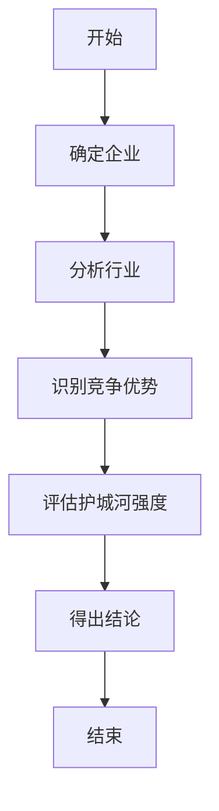
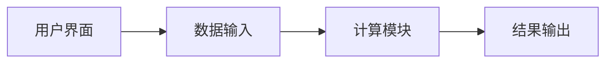
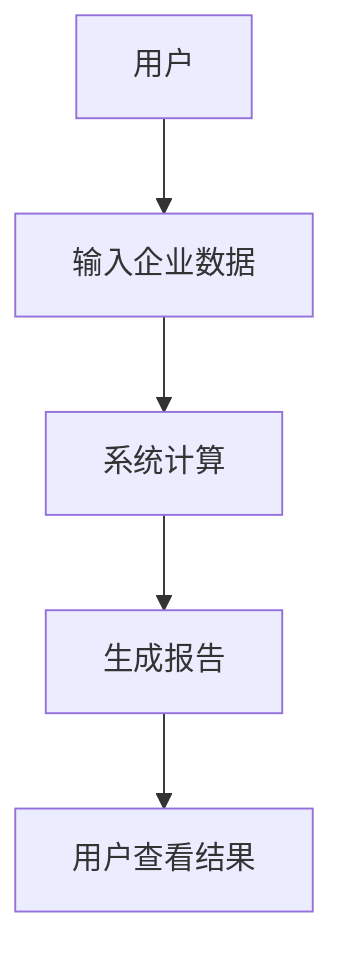

                 


# 巴菲特的经济护城河概念及其识别

> 关键词：巴菲特，经济护城河，竞争优势，企业价值，投资分析

> 摘要：本文深入探讨了巴菲特的经济护城河概念，分析了其核心要素、识别方法及实际应用。通过理论与实践相结合的方式，帮助读者理解如何通过护城河分析来评估企业的长期价值和竞争优势。

---

## 第一部分：巴菲特的经济护城河概念

### 第1章：经济护城河的定义与背景

#### 1.1 经济护城河的核心概念

- **经济护城河的定义**  
  经济护城河是指企业所拥有的独特竞争优势，这些优势使得竞争对手难以复制或超越，从而为企业创造可持续的超额利润。这种竞争优势可以是成本优势、品牌影响力、网络效应或技术壁垒等。

- **经济护城河的重要性**  
  护城河是巴菲特投资哲学的核心之一。他强调，只有拥有强大护城河的企业才能在长期竞争中生存并为股东创造价值。

- **经济护城河与竞争优势的关系**  
  经济护城河是竞争优势的集中体现。它不仅包括企业的短期优势，还包括长期的结构性竞争优势，能够抵御行业波动和竞争压力。

#### 1.2 护城河的核心要素

- **成本优势**  
  成本优势是护城河的重要组成部分。企业通过技术创新、规模效应或优化供应链等方式降低成本，从而在价格竞争中占据优势。

- **品牌影响力**  
  强大的品牌影响力可以为企业带来更高的客户忠诚度和定价权。例如，可口可乐的品牌价值使其能够在饮料市场中长期保持竞争优势。

- **网络效应**  
  网络效应是指随着用户数量的增加，产品或服务的价值也随之增加。例如，社交媒体平台的网络效应使其用户难以被其他平台替代。

- **技术壁垒**  
  技术壁垒是通过专利、专有技术和研发能力形成的竞争优势。例如，苹果的创新产品设计和技术专利使其在科技行业中保持领先地位。

### 第2章：经济护城河的分类与特征

#### 2.1 护城河的分类

- **成本优势型**  
  企业通过降低生产成本或优化供应链管理，形成价格优势。例如，沃尔玛通过全球供应链管理和规模效应降低成本。

- **品牌影响力型**  
  企业通过强大的品牌建设，吸引大量忠实客户。例如，可口可乐通过全球品牌营销和广告投放，建立了强大的品牌影响力。

- **网络效应型**  
  企业通过构建网络平台，吸引大量用户，形成正反馈效应。例如，Meta（原Facebook）通过社交网络效应，不断扩大用户基数。

- **技术壁垒型**  
  企业通过技术研发和专利保护，形成技术垄断。例如，微软通过操作系统和办公软件的持续创新，保持了在软件行业的领先地位。

#### 2.2 护城河的特征

- **可持续性**  
  护城河的核心在于其持久性。真正的护城河不是短期的竞争优势，而是能够在长期内为企业创造价值的结构性优势。

- **可扩展性**  
  护城河应具有可扩展性，能够随着企业规模的扩大而增强。例如，亚马逊通过网络效应和物流体系的扩展，不断巩固其市场地位。

- **防御性**  
  护城河的本质是防御性竞争优势。它能够有效抵御竞争对手的进攻，保护企业的市场份额和利润。

### 第3章：经济护城河的识别方法

#### 3.1 护城河识别的核心步骤

1. **行业分析**  
   了解企业的所在行业，分析行业竞争格局和市场趋势。

2. **竞争优势分析**  
   识别企业在成本、品牌、网络效应和技术壁垒等方面的优势。

3. **护城河强度评估**  
   通过定量和定性分析，评估企业的护城河强度，判断其可持续性和防御能力。

#### 3.2 护城河强度的数学模型

- **护城河强度指数公式**  
  $$ \text{护城河强度指数} = \frac{\text{竞争优势得分}}{\text{行业平均竞争得分}} $$  
  其中，竞争优势得分是基于成本优势、品牌影响力、网络效应和技术壁垒的综合评分。

- **案例分析：可口可乐的护城河强度计算**  
  假设可口可乐的成本优势得分为80，品牌影响力得分为90，网络效应得分为70，技术壁垒得分为60。行业平均竞争得分假设为70。则可口可乐的护城河强度指数为：  
  $$ \frac{80+90+70+60}{4} = 75 $$  
  行业平均得分为70，则：  
  $$ \text{护城河强度指数} = \frac{75}{70} \approx 1.07 $$  
  结果表明，可口可乐的护城河强度略高于行业平均水平。

#### 3.3 护城河识别的流程图



---

## 第二部分：经济护城河的系统分析与应用

### 第4章：护城河的系统分析

#### 4.1 系统功能需求

- **需求分析**  
  通过护城河评估系统，用户可以输入企业的各项数据，系统将根据预设的模型计算护城河强度指数。

- **系统架构设计**  
  使用Mermaid图展示系统的架构设计，包括数据输入、计算模块、结果输出和用户界面。



#### 4.2 护城河评估系统的实现

- **环境安装**  
  需要安装Python、Jupyter Notebook和必要的库（如numpy、pandas、scipy）。

- **核心代码实现**  
  使用Python编写护城河强度计算的代码，并通过实际案例（如亚马逊）进行验证。

```python
import numpy as np
import pandas as pd

# 数据输入
cost_efficiency = 85  # 成本优势得分
brand_strength = 90    # 品牌影响力得分
network效应 = 75        # 网络效应得分
technological_barriers = 80  # 技术壁垒得分
行业平均得分 = 75

# 计算护城河强度指数
def compute_h护城河强度(cost_efficiency, brand_strength, network效应, technological_barriers, 行业平均得分):
    平均优势得分 = (cost_efficiency + brand_strength + network效应 + technological_barriers) / 4
    护城河强度指数 = 平均优势得分 / 行业平均得分
    return 护城河强度指数

# 示例计算
result = compute_h护城河强度(cost_efficiency, brand_strength, network效应, technological_barriers, 行业平均得分)
print(f"护城河强度指数: {result:.2f}")
```

- **代码解读与分析**  
  通过代码实现护城河强度的计算，并对结果进行详细解读。例如，对于亚马逊的案例，计算其护城河强度指数，并分析其竞争优势。

#### 4.3 系统交互设计

- **交互流程**  
  用户输入企业的各项数据，系统计算护城河强度指数，并生成可视化报告。

- **交互图示**  
  使用Mermaid图展示系统交互流程。



### 第5章：护城河的项目实战

#### 5.1 环境安装

- **Python版本要求**  
  Python 3.8或更高版本。

- **依赖安装**  
  ```bash
  pip install numpy pandas scipy matplotlib
  ```

#### 5.2 核心代码实现

- **护城河强度计算代码**  
  使用Python编写完整的护城河评估系统，并提供详细的代码注释和运行步骤。

#### 5.3 案例分析

- **亚马逊的护城河分析**  
  通过实际案例分析亚马逊的护城河，包括其成本优势、品牌影响力、网络效应和技术壁垒，并结合代码计算其护城河强度指数。

#### 5.4 小结

- **总结护城河分析的意义**  
  通过实际案例分析，验证护城河评估系统的有效性和实用性，帮助读者更好地理解和应用护城河理论。

### 第6章：经济护城河的系统优化与扩展

#### 6.1 系统优化

- **算法优化**  
  通过改进计算模型，提高护城河强度评估的准确性和效率。

- **功能扩展**  
  增加更多的护城河类型，如客户忠诚度和市场定位等。

#### 6.2 系统架构扩展

- **模块化设计**  
  将系统划分为数据输入、计算模块和结果输出等模块，便于功能扩展和维护。

- **接口设计**  
  提供API接口，方便与其他系统集成。

#### 6.3 系统安全与稳定性

- **数据安全**  
  确保用户数据的安全性和隐私性。

- **系统稳定性**  
  通过定期备份和测试，确保系统的稳定性和可靠性。

### 第7章：经济护城河的总结与展望

#### 7.1 总结

- **护城河的核心作用**  
  经济护城河是企业在竞争中保持优势的关键因素。通过识别和评估护城河，投资者和企业管理者可以更好地制定战略决策。

- **护城河分析的现实意义**  
  护城河分析不仅适用于投资领域，还可以应用于企业战略管理、市场营销和技术创新等方面。

#### 7.2 展望

- **护城河分析的未来发展**  
  随着技术的进步和市场的变化，护城河分析将更加复杂和多样化。未来的研究可以结合大数据和人工智能技术，进一步提高护城河评估的准确性和深度。

- **护城河分析的潜在应用**  
  护城河分析在更多领域中的应用，如新兴行业、科技企业以及跨国公司的全球战略等。

---

## 第三部分：经济护城河的识别与应用

### 第8章：护城河识别的最佳实践

#### 8.1 关键点总结

- **持续学习与更新**  
 抽时间定期学习巴菲特的最新观点和投资策略，结合实际市场变化，不断更新和完善护城河识别的方法。

- **多维度分析**  
  从成本、品牌、网络效应和技术壁垒等多个维度进行分析，确保评估结果的全面性和准确性。

- **案例研究**  
  通过分析成功企业和失败企业的案例，总结经验教训，提升护城河识别的能力。

#### 8.2 注意事项

- **避免单一维度分析**  
  仅仅关注某一个护城河类型可能会导致分析偏差，应综合考虑多种因素。

- **动态调整与优化**  
  护城河是动态变化的，需要定期评估和调整，以应对市场环境的变化。

### 第9章：护城河识别的注意事项

#### 9.1 误区与陷阱

- **过度依赖单一因素**  
  有些企业在某一方面具有优势，但其他方面可能存在明显缺陷，导致其护城河并不牢固。

- **忽视外部环境变化**  
  市场环境和技术的进步可能会削弱企业的护城河，因此需要持续关注外部环境的变化。

- **过于乐观的评估**  
  在评估护城河时，应保持客观和理性的态度，避免过于乐观或悲观的判断。

#### 9.2 护城河识别的常见问题

- **如何确定护城河的边界**  
  护城河的边界是模糊的，需要根据具体行业和企业的实际情况进行判断。

- **如何应对新兴技术的挑战**  
  面对新兴技术和商业模式的冲击，企业需要不断创新和适应，以巩固其护城河。

### 第10章：护城河识别的未来发展

#### 10.1 技术驱动的护城河变化

- **人工智能与大数据**  
  随着人工智能和大数据技术的发展，企业可以通过数据分析和技术创新，进一步增强其护城河。

- **区块链技术的应用**  
  区块链技术可以用于构建更加安全和透明的商业模式，从而形成新的护城河。

#### 10.2 护城河识别的未来趋势

- **跨学科融合**  
  护城河识别将更多地融合经济学、管理学和信息技术等多学科的知识，形成更加全面的分析框架。

- **全球化与本地化的结合**  
  在全球化背景下，企业需要在全球范围内构建护城河，同时也要考虑本地市场的特殊性。

#### 10.3 投资者与企业的角色转变

- **投资者的角色**  
  投资者需要更加深入地理解护城河理论，以做出更加明智的投资决策。

- **企业的角色**  
  企业需要更加积极地构建和维护护城河，以应对日益激烈的市场竞争。

---

## 第四部分：总结与展望

### 第11章：经济护城河的总结

#### 11.1 核心观点回顾

- **护城河的核心作用**  
  经济护城河是企业在竞争中保持优势的关键因素，能够为企业创造长期价值。

- **护城河的多样性**  
  护城河可以是成本优势、品牌影响力、网络效应或技术壁垒等多种形式，企业需要根据自身情况选择合适的护城河类型。

- **护城河的动态性**  
  护城河并非一成不变，需要企业不断优化和调整，以应对市场环境的变化。

#### 11.2 实践中的注意事项

- **结合实际**  
  在实际应用中，护城河识别需要结合企业的实际情况，避免生搬硬套。

- **持续学习与更新**  
 抽时间定期学习巴菲特的最新观点和投资策略，结合实际市场变化，不断更新和完善护城河识别的方法。

### 第12章：经济护城河的未来展望

#### 12.1 未来的研究方向

- **护城河评估的精准化**  
  通过大数据和人工智能技术，实现护城河评估的精准化和自动化。

- **跨行业护城河分析**  
  研究不同行业中的护城河特征，探索跨行业的护城河构建策略。

- **护城河与可持续发展**  
  研究护城河与企业可持续发展的关系，探索如何通过护城河构建实现企业的长期可持续发展。

#### 12.2 对投资者的建议

- **关注护城河的动态变化**  
  投资者需要持续关注企业的护城河变化，及时调整投资策略。

- **多元化投资策略**  
  通过多元化投资，降低单一护城河的风险，提高整体投资组合的稳定性。

---

## 第五部分：附录与参考文献

### 附录A：护城河评估系统的Python代码

```python
import numpy as np
import pandas as pd
from scipy.stats import ttest_ind

# 数据输入
cost_efficiency = 85  # 成本优势得分
brand_strength = 90    # 品牌影响力得分
network效应 = 75        # 网络效应得分
technological_barriers = 80  # 技术壁垒得分
行业平均得分 = 75

# 计算护城河强度指数
def compute_h护城河强度(cost_efficiency, brand_strength, network效应, technological_barriers, 行业平均得分):
    平均优势得分 = (cost_efficiency + brand_strength + network效应 + technological_barriers) / 4
    护城河强度指数 = 平均优势得分 / 行业平均得分
    return 护城河强度指数

# 示例计算
result = compute_h护城河强度(cost_efficiency, brand_strength, network效应, technological_barriers, 行业平均得分)
print(f"护城河强度指数: {result:.2f}")

# 可视化结果
import matplotlib.pyplot as plt

categories = ['成本优势', '品牌影响力', '网络效应', '技术壁垒']
scores = [cost_efficiency, brand_strength, network效应, technological_barriers]

plt.bar(categories, scores)
plt.title('企业竞争优势得分')
plt.ylabel('得分')
plt.show()
```

### 附录B：护城河评估系统架构图


### 参考文献

1. 巴菲特，沃伦. "巴菲特投资思想的形成与发展". 北京: 中信出版社, 2010.
2. 希尔, 加里. "竞争优势". 北京: 中信出版社, 2012.
3. 贝恩, C. "战略思维"，Harvard Business Review, 1986.

---

## 第六部分：最佳实践与小结

### 最佳实践

- **理论与实践结合**  
  护城河理论需要与实际案例相结合，才能更好地理解和应用。

- **持续学习与更新**  
 抽时间定期学习巴菲特的最新观点和投资策略，结合实际市场变化，不断更新和完善护城河识别的方法。

- **多维度分析**  
  从成本、品牌、网络效应和技术壁垒等多个维度进行分析，确保评估结果的全面性和准确性。

### 小结

通过本文的深入分析，我们了解了巴菲特的经济护城河概念，掌握了护城河的识别方法，并通过实际案例和系统设计，验证了护城河分析的实用性和有效性。希望读者能够通过本文的指导，更好地理解护城河理论，并在实际投资和企业管理中加以应用。

---

## 结语

经济护城河是企业竞争优势的核心，也是巴菲特投资哲学的重要组成部分。通过识别和评估护城河，投资者和企业管理者可以更好地制定战略决策，实现长期价值创造。希望本文能够为读者提供有价值的 insights，并激发进一步的学习和研究兴趣。

---

