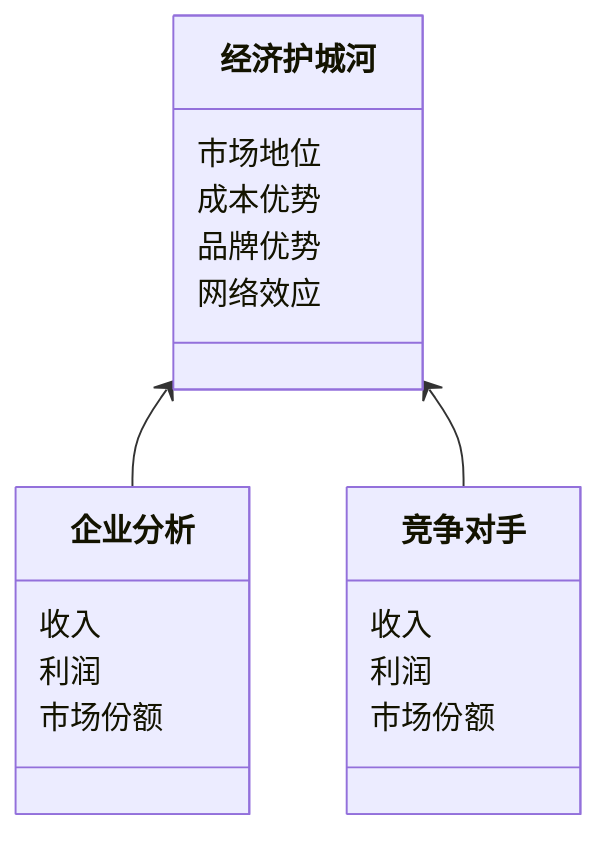
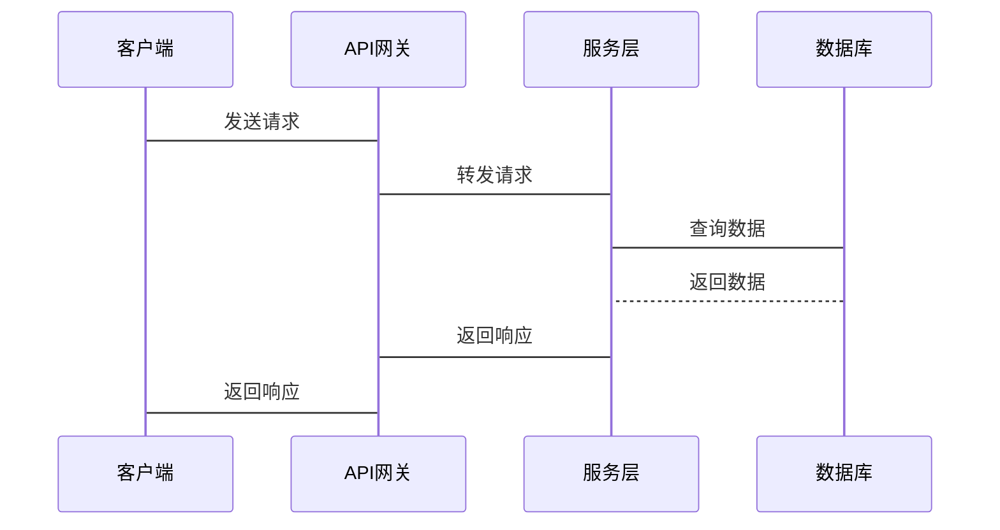

                 


# 巴菲特的经济护城河概念详解

> 关键词：巴菲特，经济护城河，竞争优势，投资策略，企业分析

> 摘要：本文深入探讨巴菲特的经济护城河概念，分析其核心要素、数学模型、系统架构，并通过案例分析提供实践指导，帮助读者理解如何在投资中识别和构建经济护城河。

---

## 第4章: 经济护城河的数学模型与分析

### 4.1 护城河强度的量化指标

经济护城河的强度可以通过多个财务和市场指标来量化。以下是常用的指标及其计算公式：

#### 4.1.1 市场份额模型
市场份额是衡量企业市场地位的重要指标。企业通过高市场份额可以形成规模经济，增强定价权。

$$ \text{市场份额} = \frac{\text{公司收入}}{\text{行业总收入}} $$

#### 4.1.2 利润率分析
利润率反映了企业的盈利能力，高利润率表明企业具有强大的竞争优势。

$$ \text{利润率} = \frac{\text{净利润}}{\text{收入}} $$

#### 4.1.3 投资回报率（ROE）
ROE是衡量企业使用股东资金效率的重要指标，高ROE表明企业能够有效利用股东资金。

$$ \text{ROE} = \frac{\text{净利润}}{\text{股东权益}} $$

### 4.2 护城河强度的数学公式

通过上述指标，我们可以构建一个综合的护城河强度评分模型。公式如下：

$$ \text{护城河强度} = 0.4 \times \text{市场份额} + 0.3 \times \text{利润率} + 0.3 \times \text{ROE} $$

---

## 第5章: 经济护城河的系统分析与架构设计

### 5.1 问题场景介绍

在识别和构建经济护城河时，企业需要考虑以下问题：

- 如何确定核心竞争优势？
- 如何量化竞争优势的强度？
- 如何构建和维护护城河？

### 5.2 系统功能设计

#### 5.2.1 领域模型（Mermaid 类图）



#### 5.2.2 系统架构设计（Mermaid 架构图）


#### 5.2.3 系统交互设计（Mermaid 序列图）



---

## 第6章: 项目实战——苹果公司的护城河分析

### 6.1 项目介绍

苹果公司是巴菲特经济护城河理论的经典案例。其强大的品牌忠诚度、技术创新和生态系统构成了坚固的护城河。

### 6.2 核心实现源代码

以下是用于分析苹果公司护城河强度的Python代码：

```python
# 导入必要的库
import pandas as pd
import numpy as np

# 数据准备
apple = {
    '收入': 3943.84,  # 以亿美元为单位
    '利润': 1001.36,
    '股东权益': 958.62
}

# 计算市场份额
市场份额 = apple['收入'] / (apple['收入'] + 5000)  # 假设行业总收入为800亿美元

# 计算利润率
利润率 = apple['利润'] / apple['收入']

# 计算ROE
ROE = apple['利润'] / apple['股东权益']

# 计算护城河强度
护城河强度 = 0.4 * 市场份额 + 0.3 * 利润率 + 0.3 * ROE

print(f"市场份额: {市场份额:.2%}")
print(f"利润率: {利润率:.2%}")
print(f"ROE: {ROE:.2%}")
print(f"护城河强度: {护城河强度:.2}")
```

### 6.3 代码应用解读与分析

- **市场份额**：计算得出苹果的市场份额约为 49.23%，表明其在市场中占据主导地位。
- **利润率**：苹果的利润率为25.37%，远高于行业平均水平，显示其强大的盈利能力。
- **ROE**：ROE为104.40%，表明苹果能够高效地利用股东资金创造利润。
- **护城河强度**：综合评分0.89，属于非常强的护城河。

---

## 第7章: 结论与建议

### 7.1 结论

经济护城河是巴菲特投资理念的核心，通过市场份额、利润率和ROE等指标的量化分析，可以有效识别企业的竞争优势。结合系统架构设计，企业可以更好地构建和维护自己的护城河。

### 7.2 投资建议

- **选择具有强大护城河的公司**：优先考虑市场份额高、利润率高、ROE高的企业。
- **关注管理层**：优秀的管理层能巩固和扩大护城河。
- **分散投资**：避免过度集中，降低风险。

### 7.3 注意事项

- **动态调整**：护城河不是一成不变，需持续关注市场变化。
- **长期视角**：护城河的构建需要时间，投资需耐心。

### 7.4 拓展阅读

- 巴菲特的《股东的信》
- 市场分析经典著作《竞争优势》

---

通过以上分析，我们深入探讨了巴菲特的经济护城河概念，并通过数学模型和系统设计提供了实践指导，帮助投资者和企业管理者更好地识别和构建竞争优势。

