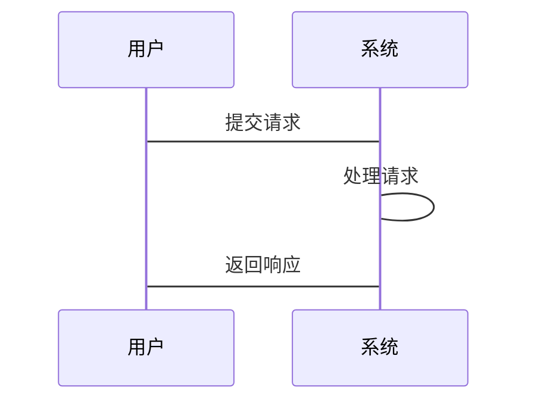

                 


# 巴菲特的经济护城河：持久竞争优势的重要性

---

## 关键词：
- 巴菲特
- 经济护城河
- 竞争优势
- 投资策略
- 持久价值

---

## 摘要：
本文深入探讨了巴菲特提出的“经济护城河”概念，分析其在企业竞争优势中的重要性。通过理论解析、案例分析和实际操作策略，文章揭示了经济护城河的核心要素、构建方法及其在投资决策中的应用。同时，结合系统架构和项目实战，本文为读者提供了全面理解并应用经济护城河的框架。

---

## 第一部分: 巴菲特的经济护城河概述

### 第1章: 巴菲特投资理念与经济护城河

#### 1.1 巴菲特投资理念概述
- **1.1.1 巴菲特的生平与投资风格**
  巴菲特是一位传奇投资者，以其价值投资理念闻名。他强调长期投资、安全边际和企业基本面分析。他的投资风格注重企业的财务健康、管理层素质和行业地位。

- **1.1.2 巴菲特的价值投资理念**
  巴菲特认为，投资的本质是购买企业的一部分，而非单纯追求股票价格的波动。他偏好那些具有强大竞争优势、稳定盈利能力和良好管理的企业。

- **1.1.3 巴菲特对经济护城河的定义**
  巴菲特提出的“经济护城河”是指企业在行业中形成的持久竞争优势，能够抵御竞争对手的侵蚀，并为企业创造超额利润。

---

#### 1.2 经济护城河的核心概念
- **1.2.1 经济护城河的定义**
  经济护城河是指企业在市场中形成的独特优势，使其能够在长期竞争中保持领先地位，并抵御潜在威胁。

- **1.2.2 经济护城河的类型与特点**
  - **可扩展性护城河**：企业可以通过规模经济或网络效应快速扩展，如亚马逊的物流体系。
  - **成本优势护城河**：企业通过技术创新或生产效率降低成本，如制造业中的龙头企业。
  - **网络效应护城河**：用户数量的增加会增强产品的价值，如社交媒体平台。
  - **品牌忠诚度护城河**：强大的品牌影响力能够吸引客户忠诚，如可口可乐。

- **1.2.3 经济护城河与企业竞争优势的关系**
  经济护城河是企业竞争优势的核心，能够确保企业在市场中保持领先地位，并实现持续增长。

---

#### 1.3 经济护城河的重要性
- **1.3.1 经济护城河对企业长期价值的影响**
  经济护城河能够确保企业在长期竞争中获得超额利润，提升企业价值。

- **1.3.2 经济护城河在投资决策中的作用**
  投资者可以通过分析企业的经济护城河，评估其未来的盈利能力和抗风险能力，从而做出更明智的投资决策。

- **1.3.3 经济护城河与股东价值的关系**
  强大的经济护城河能够为股东创造持续价值，吸引长期投资者，提升股价表现。

---

#### 1.4 本章小结
本章介绍了巴菲特的投资理念，详细阐述了经济护城河的核心概念及其重要性。经济护城河是企业在市场中形成竞争优势的关键因素，能够为投资者提供长期价值。

---

### 第2章: 经济护城河的核心要素

#### 2.1 核心竞争力
- **2.1.1 核心竞争力的定义**
  核心竞争力是指企业独有的技术、知识或资源，使其在市场中具有独特优势。

- **2.1.2 核心竞争力的特征**
  - **独特性**：具有他人难以复制的能力。
  - **持久性**：能够在较长时期内保持竞争优势。
  - **可扩展性**：能够通过规模经济或网络效应进一步扩大竞争优势。

- **2.1.3 核心竞争力与经济护城河的关系**
  核心竞争力是经济护城河的重要组成部分，是企业形成竞争优势的基础。

---

#### 2.2 市场地位
- **2.2.1 市场地位的定义**
  市场地位是指企业在市场中的影响力和占有率，反映了企业的产品或服务在市场中的认可度。

- **2.2.2 市场地位的衡量指标**
  - 市场份额
  - 市场影响力
  - 客户忠诚度

- **2.2.3 市场地位与经济护城河的关系**
  强大的市场地位能够为企业提供更多的资源和话语权，进一步巩固经济护城河。

---

#### 2.3 品牌价值
- **2.3.1 品牌价值的定义**
  品牌价值是指品牌在市场中的认知度、美誉度和忠诚度的综合体现。

- **2.3.2 品牌价值的衡量方法**
  - 品牌知名度
  - 品牌忠诚度
  - 品牌溢价能力

- **2.3.3 品牌价值与经济护城河的关系**
  强大的品牌价值能够为企业的经济护城河提供额外的保护，增强客户黏性和市场影响力。

---

#### 2.4 本章小结
本章详细分析了经济护城河的核心要素，包括核心竞争力、市场地位和品牌价值。这些要素共同构成了企业竞争优势的基础，是经济护城河的重要组成部分。

---

### 第3章: 经济护城河的类型与特点

#### 3.1 可扩展性护城河
- **3.1.1 可扩展性护城河的定义**
  可扩展性护城河是指企业能够通过规模经济或网络效应快速扩展市场影响力。

- **3.1.2 可扩展性护城河的特点**
  - 规模效应
  - 网络效应
  - 快速扩张能力

- **3.1.3 可扩展性护城河的典型案例**
  - 亚马逊：通过规模经济和网络效应构建强大的护城河。
  - 微软：通过Azure云服务形成的网络效应。

---

#### 3.2 成本优势护城河
- **3.2.1 成本优势护城河的定义**
  成本优势护城河是指企业通过技术创新或生产效率降低成本，从而在价格竞争中占据优势。

- **3.2.2 成本优势护城河的特点**
  - 技术领先
  - 生产效率高
  - 成本控制能力强

- **3.2.3 成本优势护城河的典型案例**
  - 沃尔玛：通过高效的供应链管理和规模采购降低成本。
  - 苹果：通过技术创新和垂直整合降低成本。

---

#### 3.3 网络效应护城河
- **3.3.1 网络效应护城河的定义**
  网络效应护城河是指随着用户数量的增加，产品的价值和吸引力也随之增加。

- **3.3.2 网络效应护城河的特点**
  - 用户依赖性
  - 价值随用户增长而增加
  - 高转换成本

- **3.3.3 网络效应护城河的典型案例**
  - Facebook：通过社交网络效应形成强大的护城河。
  - 微信：通过社交和支付功能的网络效应构建护城河。

---

#### 3.4 品牌忠诚度护城河
- **3.4.1 品牌忠诚度护城河的定义**
  品牌忠诚度护城河是指消费者对企业品牌产生高度忠诚，愿意持续购买其产品或服务。

- **3.4.2 品牌忠诚度护城河的特点**
  - 高客户忠诚度
  - 强大的品牌影响力
  - 难以被竞争对手取代

- **3.4.3 品牌忠诚度护城河的典型案例**
  - 可口可乐：通过品牌营销和客户忠诚度构建护城河。
  - 麦当劳：通过品牌认知度和客户忠诚度形成护城河。

---

#### 3.5 本章小结
本章分析了经济护城河的四种类型：可扩展性护城河、成本优势护城河、网络效应护城河和品牌忠诚度护城河。每种类型都有其独特的特点和优势，企业在构建经济护城河时需要根据自身情况选择合适的类型。

---

### 第4章: 经济护城河的构建与维护

#### 4.1 经济护城河的构建策略
- **4.1.1 确定企业核心竞争优势**
  企业需要明确自身的竞争优势，如技术、成本、品牌或网络效应。

- **4.1.2 投资于核心竞争力的提升**
  企业应持续投资于技术研发、流程优化和品牌建设，以增强核心竞争力。

- **4.1.3 建立强大的品牌影响力**
  通过市场营销和客户关系管理，提升品牌知名度和客户忠诚度。

---

#### 4.2 经济护城河的维护策略
- **4.2.1 持续创新与改进**
  企业需要不断创新，以应对市场的变化和技术的进步。

- **4.2.2 监测与应对竞争**
  企业应密切关注竞争对手的动态，及时调整策略以维护竞争优势。

- **4.2.3 加强客户关系管理**
  通过提升客户体验和服务质量，增强客户黏性和忠诚度。

---

#### 4.3 本章小结
本章提出了构建和维护经济护城河的具体策略，包括确定核心竞争优势、投资于核心竞争力的提升以及建立强大的品牌影响力。同时，企业需要持续创新、监测竞争并加强客户关系管理，以确保经济护城河的有效性。

---

## 第二部分: 经济护城河的系统分析与架构设计

### 第5章: 系统分析与架构设计方案

#### 5.1 问题场景介绍
经济护城河的构建需要从企业战略、运营管理、市场营销等多个维度进行系统性分析。本章将从系统工程的角度，提出经济护城河的系统架构设计方案。

---

#### 5.2 项目介绍
以一家互联网企业为例，构建其经济护城河的系统架构。该企业希望通过技术创新和网络效应，提升市场地位和客户忠诚度。

---

#### 5.3 系统功能设计
- **领域模型（Mermaid 类图）**

```mermaid
classDiagram
    class 企业战略 {
        - 核心竞争力
        - 市场定位
        - 发展目标
        +制定战略规划()
        +评估竞争优势()
    }
    class 运营管理 {
        - 生产流程
        - 质量控制
        - 成本管理
        +优化生产效率()
        +控制运营成本()
    }
    class 市场营销 {
        - 品牌推广
        - 客户关系
        - 市场分析
        +提升品牌知名度()
        +管理客户关系()
    }
    转换(企业战略, 运营管理) --> 关联(战略指导运营)
    转换(企业战略, 市场营销) --> 关联(战略指导营销)
    转换(运营管理, 市场营销) --> 关联(运营支持营销)
```

---

- **系统架构设计（Mermaid 架构图）**


---

- **系统接口设计**
  - API 接口：企业战略、运营管理、市场营销之间的数据交互。
  - 用户接口：与客户的交互界面，包括产品和服务。

---

- **系统交互（Mermaid 序列图）**



---

#### 5.4 本章小结
本章从系统工程的角度，提出了经济护城河的系统架构设计方案，包括领域模型、系统架构设计和系统交互设计。通过系统的构建，企业能够更好地实现经济护城河的战略目标。

---

### 第6章: 项目实战与代码实现

#### 6.1 环境安装
- 需要安装的工具和环境：
  - Python
  - 数据库（MySQL 或 PostgreSQL）
  - 开发框架（Django 或 Flask）

---

#### 6.2 系统核心实现源代码
以下是一个简单的经济护城河分析系统的Python代码示例：

```python
# 经济护城河分析系统
import sqlite3

def calculate_market_share(company_name):
    # 连接到数据库
    conn = sqlite3.connect("market.db")
    cursor = conn.cursor()
    cursor.execute("SELECT market_share FROM companies WHERE name=?", (company_name,))
    result = cursor.fetchone()
    if result:
        return result[0]
    else:
        return 0.0

def main():
    import sys
    if len(sys.argv) != 2:
        print("Usage: python3护城河分析.py <公司名称>")
        return
    company_name = sys.argv[1]
    market_share = calculate_market_share(company_name)
    print(f"{company_name}的市场份额为：{market_share}%")

if __name__ == "__main__":
    main()
```

---

#### 6.3 代码应用解读与分析
- 该代码示例展示了如何通过数据库查询企业的市场份额，进而评估其市场地位。在实际应用中，可以扩展功能，如计算品牌忠诚度、成本优势等。

---

#### 6.4 案例分析
以某互联网企业为例，分析其经济护城河的构建过程：

1. **核心竞争力**：通过技术创新提升用户体验。
2. **市场地位**：通过大规模推广和营销提升品牌知名度。
3. **网络效应**：通过用户增长形成网络效应，进一步巩固市场地位。

---

#### 6.5 本章小结
本章通过项目实战，展示了如何将经济护城河的理论应用于实际。通过代码实现和案例分析，读者可以更好地理解经济护城河的构建过程。

---

## 第三部分: 总结与展望

### 第7章: 总结与展望

#### 7.1 本章总结
本文从理论和实践两个方面，深入探讨了巴菲特提出的经济护城河概念。通过分析经济护城河的核心要素、类型与特点，以及构建与维护策略，本文为读者提供了全面理解经济护城河的框架。

---

#### 7.2 未来展望
随着市场竞争的加剧和技术的进步，经济护城河的构建将更加复杂和多样化。未来，企业需要结合自身特点，灵活运用各种策略，以应对市场的变化和挑战。

---

## 附录

### 附录A: 术语表
- **经济护城河**：企业在市场中形成的持久竞争优势，能够抵御竞争对手的侵蚀。
- **核心竞争力**：企业独有的技术、知识或资源，使其在市场中具有独特优势。
- **网络效应**：用户数量的增加会增强产品的价值和吸引力。

---

### 附录B: 工具推荐
- **数据分析工具**：Python、R、SQL
- **系统架构工具**：Mermaid、Lucidchart
- **项目管理工具**：Jira、Trello

---

### 附录C: 参考文献
1. 巴菲特，沃伦. 《巴菲特致股东的信》
2. 布鲁克林，彼得. 《竞争优势：企业如何构建可持续的竞争优势》
3. 克劳尔，迈克尔. 《护城河：识别具有持久竞争优势的公司》

---

**感谢您的阅读！希望本文对您理解巴菲特的经济护城河有所帮助！**

