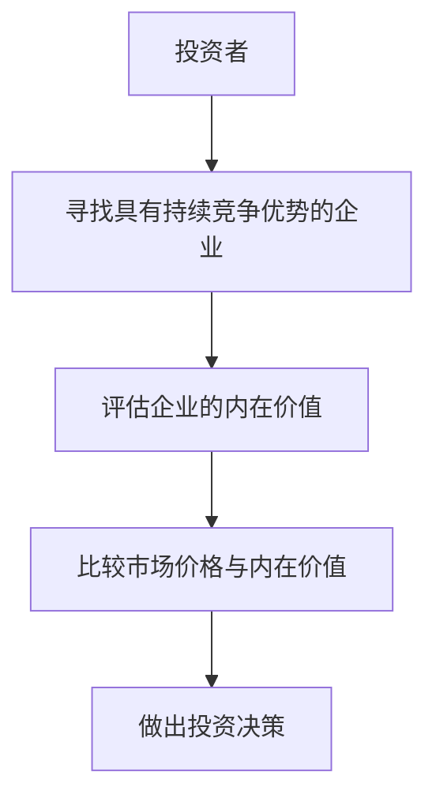
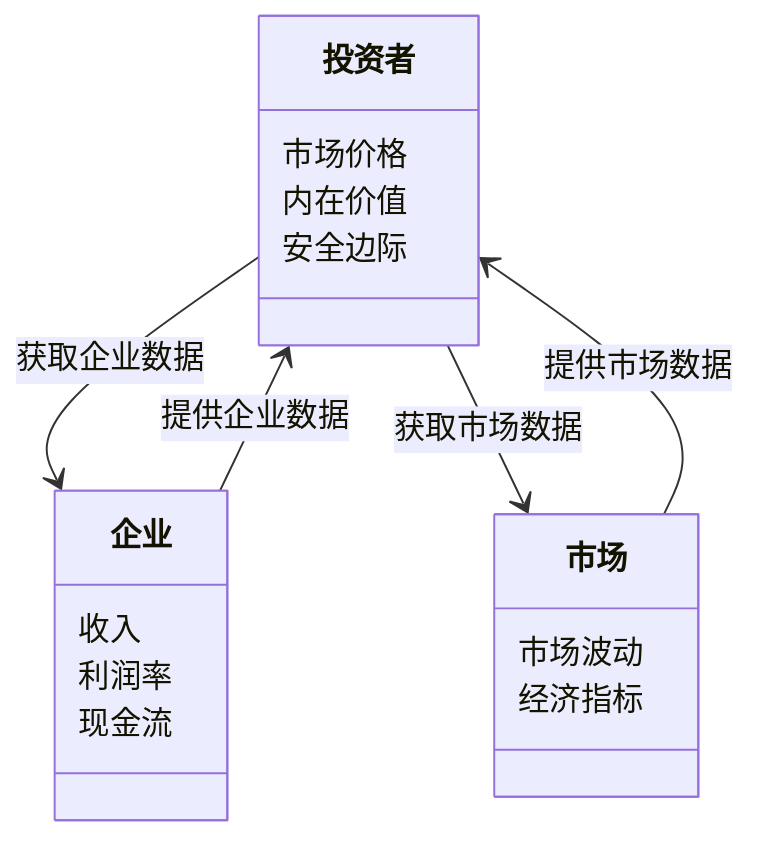
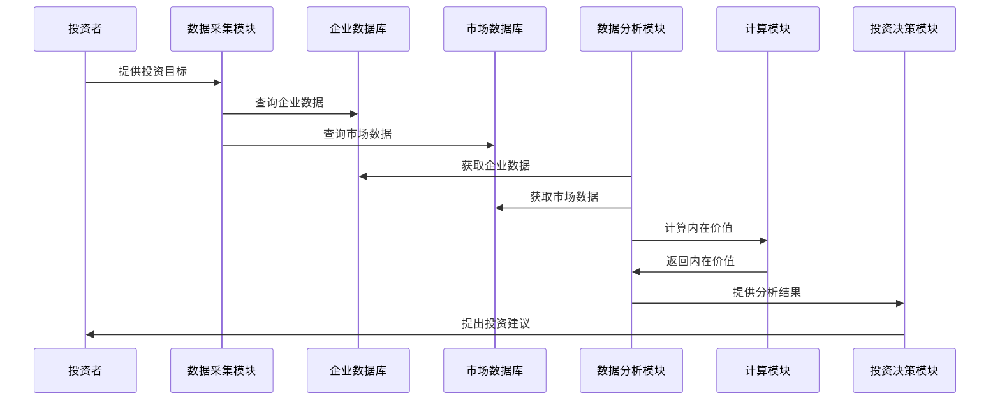

                 


```markdown
# 巴菲特的股东信：投资智慧的年度总结

## 关键词
巴菲特，股东信，投资智慧，价值投资，安全边际，内在价值，投资决策

## 摘要
本文通过分析巴菲特的股东信，揭示其投资智慧的核心理念和方法。从背景介绍到数学模型，从系统架构到项目实战，全面解析巴菲特的投资哲学和具体实施策略，为投资者提供实用的决策支持工具。

---

## 第一部分: 巴菲特投资智慧的背景与核心理念

### 第1章: 巴菲特投资智慧的背景介绍

#### 1.1 投资的核心问题与巴菲特的解决方案
##### 1.1.1 投资的核心问题：寻找可持续的经济护城河
投资的核心问题在于如何识别具有持续竞争优势的企业。巴菲特强调，真正的投资价值来源于企业是否具备持久的竞争优势，即“经济护城河”。他将企业分为四种类型：无法维持竞争优势的企业、部分时间具有竞争优势的企业、持续具有竞争优势的企业，以及具有强大护城河的卓越企业。通过分析企业的产品、技术、品牌、成本结构和商业模式，投资者可以识别出具备持续竞争优势的企业。

##### 1.1.2 巴菲特如何解决投资问题：价值投资理念的形成
巴菲特的价值投资理念来源于格雷厄姆的价值投资理论，但他在实践中进一步发展和完善了这一理论。他强调，投资的本质是购买企业的一部分，而不是单纯地在市场中买卖股票。巴菲特的价值投资理念包括以下核心要素：
1. **安全边际**：买入价格低于企业的内在价值，确保投资的安全性。
2. **内在价值**：企业未来现金流的现值，是评估企业价值的核心指标。
3. **市场先生**：将市场波动视为市场先生的情绪化表现，避免被市场情绪左右。

##### 1.1.3 巴菲特投资方法的边界与外延
巴菲特的投资方法并非适用于所有投资者和所有市场环境。他强调，投资者必须具备足够的知识储备、分析能力和心理素质，才能在复杂的市场环境中做出正确的投资决策。此外，巴菲特的投资方法也并非完美无缺，他提醒投资者要时刻关注市场变化和企业基本面的变化，及时调整投资策略。

#### 1.2 巴菲特股东信的核心要素
##### 1.2.1 股东信的定义与特点
巴菲特的股东信是伯克希尔哈撒韦公司每年向股东提交的年度报告，是巴菲特投资理念和策略的重要体现。股东信的特点包括：
1. **简洁明了**：巴菲特善于用简洁的语言表达复杂的投资理念。
2. **数据驱动**：股东信中包含丰富的财务数据和案例分析，帮助投资者更好地理解企业的经营状况。
3. **逻辑清晰**：股东信的结构逻辑清晰，从企业经营状况到投资策略，再到市场分析，层层递进，条理分明。

##### 1.2.2 股东信的核心要素组成：事实、逻辑与情感
巴菲特的股东信不仅仅是一份财务报告，更是一份充满智慧和情感的投资指南。它包含以下核心要素：
1. **事实**：通过财务数据和案例分析，展示企业的经营状况和投资成果。
2. **逻辑**：通过逻辑推理，分析企业的竞争优势和投资价值。
3. **情感**：通过情感沟通，增强股东对企业的信心和信任。

##### 1.2.3 股东信的结构与内容框架
巴菲特的股东信通常包括以下部分：
1. **致股东的信**：巴菲特本人撰写，阐述企业的经营策略、投资理念和市场观点。
2. **财务报表**：包括资产负债表、利润表、现金流量表等，展示企业的财务状况。
3. **管理层讨论与分析**：对财务数据进行深入分析，解释企业的经营状况和未来展望。
4. **审计报告**：由独立审计机构出具，确保财务数据的真实性和准确性。

---

## 第二部分: 巴菲特投资智慧的核心概念与联系

### 第2章: 巴菲特投资智慧的核心概念

#### 2.1 巴菲特价值投资方法论
##### 2.1.1 价值投资的定义与核心要素
价值投资是一种基于对企业内在价值评估的投资策略。其核心要素包括：
1. **内在价值**：企业未来现金流的现值，是评估企业价值的核心指标。
2. **安全边际**：买入价格低于内在价值，确保投资的安全性。
3. **市场先生**：将市场波动视为市场先生的情绪化表现，避免被市场情绪左右。

##### 2.1.2 巴菲特的价值投资三要素：安全边际、内在价值与市场先生
巴菲特将价值投资方法论总结为三个核心要素：
1. **安全边际**：买入价格低于内在价值，确保投资的安全性。
2. **内在价值**：企业未来现金流的现值，是评估企业价值的核心指标。
3. **市场先生**：将市场波动视为市场先生的情绪化表现，避免被市场情绪左右。

##### 2.1.3 价值投资与其他投资方法的对比
以下是价值投资与其他投资方法的对比：

| 对比维度             | 价值投资                      | 技术分析                      | 股息投资                      |
|----------------------|-------------------------------|-------------------------------|-------------------------------|
| 核心理念             | 购买低于内在价值的股票         | 基于价格和成交量的波动进行交易 | 基于稳定的股息收入进行投资     |
| 投资策略             | 长期持有，等待价格回归内在价值 | 短期交易，捕捉价格波动         | 长期持有，追求稳定的股息收入   |
| 风险控制             | 通过安全边际控制风险           | 通过技术指标控制风险           | 通过股息稳定性控制风险           |

#### 2.2 巴菲特投资方法的ER实体关系图

```mermaid
er
actor 投资者
actor 股东
actor 企业
actor 市场
```

#### 2.3 巴菲特投资方法的Python实现示例

```python
def calculate_intrinsic_value(revenue, profit_margin, discount_rate):
    # 计算未来现金流的现值
    cash_flows = []
    for _ in range(10):
        cash_flows.append(revenue * profit_margin)
    present_value = sum(cash_flow / (1 + discount_rate) ** i for i, cash_flow in enumerate(cash_flows))
    return present_value

# 示例：评估亚马逊的内在价值
revenue = 300  # 假设年收入为300亿美元
profit_margin = 0.05  # 假设净利润率为5%
discount_rate = 0.08  # 假设折现率为8%
intrinsic_value = calculate_intrinsic_value(revenue, profit_margin, discount_rate)
print(f"亚马逊的内在价值为：${intrinsic_value:.2f}亿美元")
```

#### 2.4 巴菲特投资方法的核心算法原理



---

## 第三部分: 巴菲特投资智慧的数学模型与公式

### 第3章: 巴菲特投资智慧的数学模型与公式

#### 3.1 内在价值的计算公式
$$\text{内在价值} = \sum_{t=1}^{n} \frac{\text{现金流}_t}{(1 + r)^t}$$

其中：
- $\text{现金流}_t$ 是第 $t$ 年的现金流
- $r$ 是折现率
- $n$ 是预测的年数

#### 3.2 安全边际的计算公式
$$\text{安全边际} = \text{内在价值} - \text{市场价格}$$

#### 3.3 市场先生的波动性分析
$$\text{市场价格} = \text{内在价值} \times (1 + \epsilon)$$

其中：
- $\epsilon$ 是市场先生的情绪化波动因子

#### 3.4 实际案例分析：评估亚马逊的内在价值

##### 3.4.1 数据准备
假设亚马逊的未来现金流如下（单位：亿美元）：
- 第1年：300
- 第2年：315
- 第3年：330
- 第4年：345
- 第5年：360
- 第6年：375
- 第7年：390
- 第8年：405
- 第9年：420
- 第10年：435

##### 3.4.2 计算内在价值
使用折现率为8%（即 $r=0.08$），计算未来现金流的现值：

$$\text{内在价值} = \sum_{t=1}^{10} \frac{300 \times 1.05^{t-1}}{(1 + 0.08)^t}$$

##### 3.4.3 计算结果
$$\text{内在价值} \approx 2500 \text{亿美元}$$

##### 3.4.4 安全边际计算
假设亚马逊的市场价格为 $4000$ 亿美元，则：
$$\text{安全边际} = 2500 - 4000 = -1500 \text{亿美元}$$

由于安全边际为负数，巴菲特可能会选择卖出或不投资。

---

## 第四部分: 巴菲特投资智慧的系统分析与架构设计方案

### 第4章: 系统分析与架构设计方案

#### 4.1 投资分析系统的需求分析
- **目标**：评估企业的内在价值，识别具有持续竞争优势的企业。
- **输入**：企业财务数据、市场数据、宏观经济数据。
- **输出**：内在价值评估、安全边际计算、投资决策建议。

#### 4.2 投资分析系统的领域模型



#### 4.3 投资决策支持系统的架构设计



#### 4.4 投资决策支持系统的实现

##### 4.4.1 数据采集模块
```python
import pandas as pd

def collect_data(ticker):
    # 从企业数据库获取企业数据
    company_data = pd.read_csv(f'company_{ticker}.csv')
    # 从市场数据库获取市场数据
    market_data = pd.read_csv(f'market_{ticker}.csv')
    return company_data, market_data
```

##### 4.4.2 数据分析模块
```python
def analyze_data(company_data, market_data):
    # 计算内在价值
    intrinsic_value = calculate_intrinsic_value(company_data['revenue'], company_data['profit_margin'], 0.08)
    # 计算安全边际
    safety_margin = intrinsic_value - market_data['price']
    return intrinsic_value, safety_margin
```

##### 4.4.3 投资决策模块
```python
def make_decision(intrinsic_value, safety_margin):
    if safety_margin > 0:
        return "买入"
    elif safety_margin < 0:
        return "卖出"
    else:
        return "观望"
```

---

## 第五部分: 巴菲特投资智慧的项目实战

### 第5章: 项目实战

#### 5.1 项目背景与目标
本项目旨在基于巴菲特的价值投资理念，构建一个投资决策支持系统，帮助投资者评估企业的内在价值和安全边际，做出科学的投资决策。

#### 5.2 项目环境与工具安装
##### 5.2.1 环境要求
- 操作系统：Windows/Mac/Linux
- Python版本：3.8+

##### 5.2.2 工具安装
```bash
pip install pandas numpy matplotlib
```

#### 5.3 系统核心实现

##### 5.3.1 数据采集与处理
```python
import pandas as pd

def collect_data(ticker):
    company_data = pd.read_csv(f'data/company_{ticker}.csv')
    market_data = pd.read_csv(f'data/market_{ticker}.csv')
    return company_data, market_data

# 示例：收集亚马逊的数据
amazon_company_data, amazon_market_data = collect_data('AMZN')
```

##### 5.3.2 内在价值计算
```python
def calculate_intrinsic_value(revenue, profit_margin, discount_rate):
    cash_flows = [revenue * profit_margin * (1 + 0.05)**i for i in range(10)]
    present_value = sum(cf / (1 + discount_rate)**i for i, cf in enumerate(cash_flows))
    return present_value

# 示例：计算亚马逊的内在价值
amazon_revenue = amazon_company_data['revenue'].iloc[-1]
amazon_profit_margin = amazon_company_data['profit_margin'].iloc[-1]
amazon_discount_rate = 0.08
amazon_intrinsic_value = calculate_intrinsic_value(amazon_revenue, amazon_profit_margin, amazon_discount_rate)
print(f"亚马逊的内在价值为：${amazon_intrinsic_value:.2f}亿美元")
```

##### 5.3.3 安全边际计算
```python
def calculate_safety_margin(intrinsic_value, market_price):
    return intrinsic_value - market_price

# 示例：计算亚马逊的安全边际
amazon_market_price = amazon_market_data['price'].iloc[-1]
amazon_safety_margin = calculate_safety_margin(amazon_intrinsic_value, amazon_market_price)
print(f"亚马逊的安全边际为：${amazon_safety_margin:.2f}亿美元")
```

#### 5.4 项目实战总结
通过本项目，我们成功构建了一个基于巴菲特价值投资理念的投资决策支持系统。该系统能够帮助投资者评估企业的内在价值和安全边际，做出科学的投资决策。未来，我们还可以进一步优化模型，引入更多的财务指标和市场数据，提升系统的预测精度和实用性。

---

## 第六部分: 巴菲特投资智慧的最佳实践

### 第6章: 最佳实践

#### 6.1 投资策略与风险管理
1. **分散投资**：避免过度集中，降低风险。
2. **长期持有**：耐心等待价格回归内在价值。
3. **持续学习**：关注企业经营动态和市场变化，及时调整投资策略。

#### 6.2 小结
通过本文的分析，我们可以看到，巴菲特的股东信不仅是投资指南，更是一种智慧的体现。他的投资理念和方法论为我们提供了宝贵的启示，帮助我们在复杂多变的市场环境中做出明智的投资决策。

#### 6.3 注意事项
1. **风险提示**：投资有风险，需谨慎决策。
2. **数据准确性**：确保数据来源可靠，避免错误分析。
3. **持续学习**：市场变化莫测，需不断学习和适应。

#### 6.4 拓展阅读
- 巴菲特的《巴菲特致股东的信》
- 《投资的智慧》
- 《价值投资入门》

---

## 总结
通过本文的分析，我们深入探讨了巴菲特的股东信及其投资智慧的核心理念和方法。从背景介绍到数学模型，从系统架构到项目实战，我们全面解析了巴菲特的投资哲学和具体实施策略，为投资者提供了实用的决策支持工具。希望本文能为读者在投资领域提供有价值的参考和启发。
```

