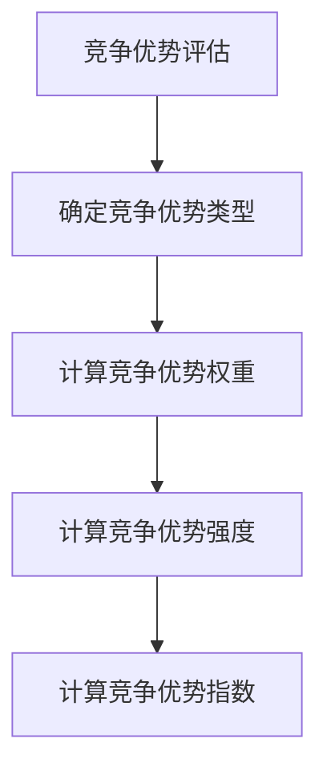
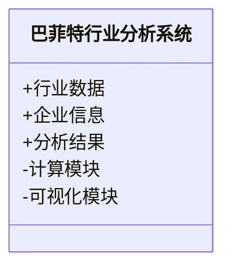

                 


# 巴菲特的行业分析方法：了解商业模式

## 关键词：巴菲特，行业分析，商业模式，竞争优势，经济护城河，投资分析，系统架构

## 摘要：本文将详细探讨巴菲特的行业分析方法，结合技术博客的风格，从背景介绍、核心概念、数学模型、系统架构到项目实战，逐步分析巴菲特如何通过了解商业模式来评估投资机会。文章通过详细的案例分析和系统设计，展示如何将巴菲特的分析方法应用于实际投资决策中，帮助读者掌握这一经典的投资策略。

---

## 第一部分：巴菲特的行业分析方法概述

### 第1章：巴菲特投资理念与行业分析基础

#### 1.1 巴菲特投资理念概述

##### 1.1.1 巴菲特的生平与投资哲学

沃伦·巴菲特（Warren Buffett）是全球最著名的投资者之一，他的投资哲学以价值投资为核心。巴菲特出生于1934年，毕业于哥伦比亚大学，师从本杰明·格雷厄姆（Benjamin Graham），创立了伯克希尔·哈撒韦公司（Berkshire Hathaway），并将其打造成一个投资帝国。

巴菲特的投资理念强调长期价值，而非短期市场波动。他认为市场的短期波动是噪声，而企业的内在价值才是决定投资价值的关键。他的投资策略注重企业基本面分析，尤其是企业的商业模式和竞争优势。

##### 1.1.2 巴菲特投资理念的核心思想

巴菲特的核心投资思想可以总结为以下几点：

1. **价值投资**：寻找那些具有持续竞争优势、良好管理团队和合理估值的企业。
2. **安全边际**：以低于内在价值的价格买入优质资产，确保投资的安全性。
3. **长期主义**：关注企业的长期发展趋势，而非短期市场波动。
4. **集中投资**：将资金集中在少数具有竞争优势的企业上，以降低风险并提高收益。

##### 1.1.3 巴菲特行业分析的重要性

在巴菲特的投资哲学中，行业分析是评估企业内在价值的重要组成部分。他认为，企业的商业模式和所在行业的竞争结构直接决定了企业的长期盈利能力。因此，对行业进行深入分析是投资决策的前提。

---

#### 1.2 行业分析的基本概念

##### 1.2.1 行业分析的定义与作用

行业分析是指对某一行业内部结构、竞争状况、市场趋势和潜在风险进行系统性研究的过程。其作用在于帮助企业或投资者更好地理解行业环境，识别投资机会和风险。

##### 1.2.2 行业分析的核心要素

行业分析的核心要素包括：

1. **行业规模与增长**：行业的市场规模、增长率及其驱动因素。
2. **竞争结构**：行业内的主要竞争者、市场集中度、进入壁垒等。
3. **市场趋势**：行业的技术进步、消费者需求变化、政策法规等。
4. **关键成功因素**：行业内企业成功运营的关键要素。

##### 1.2.3 巴菲特行业分析的独特视角

巴菲特的行业分析方法具有以下独特视角：

1. **经济护城河**：关注企业的竞争优势是否能持续产生超额利润。
2. **行业生命周期**：分析行业所处的生命周期阶段（如导入期、成长期、成熟期、衰退期）。
3. **管理层质量**：重视企业管理层的能力和决策水平。

---

#### 1.3 巴菲特行业分析框架

##### 1.3.1 行业分析的五要素模型

巴菲特的行业分析框架可以归纳为“五要素模型”，包括：

1. **经济护城河**：企业是否具有可持续的竞争优势。
2. **管理层质量**：管理层是否具备优秀的能力和道德标准。
3. **财务状况**：企业的财务健康状况，包括资产负债表和利润表。
4. **行业前景**：行业的未来发展趋势和潜在机会。
5. **市场价格**：企业的市场价格是否低于其内在价值。

##### 1.3.2 巴菲特的“经济护城河”概念

经济护城河是指企业能够长期保持竞争优势的能力。这种优势可以来自多种因素，包括：

1. **成本优势**：企业能够以更低的成本生产产品或服务。
2. **差异化优势**：企业的产品或服务具有独特的市场定位。
3. **网络效应**：用户数量的增加会增强产品的价值。
4. **专利或技术壁垒**：企业拥有独特的技术或专利。

##### 1.3.3 行业生命周期与投资机会

行业的生命周期分为四个阶段：

1. **导入期**：行业刚刚起步，市场潜力大，但竞争激烈。
2. **成长期**：行业快速增长，企业规模扩大。
3. **成熟期**：行业增长放缓，竞争格局稳定。
4. **衰退期**：行业需求下降，企业面临转型压力。

---

### 第2章：巴菲特行业分析的核心概念与联系

#### 2.1 核心概念原理

##### 2.1.1 经济护城河的数学模型

经济护城河的强度可以通过以下公式量化：

$$ \text{经济护城河强度} = \frac{\text{竞争优势强度}}{\text{行业竞争程度}} $$

其中，竞争优势强度包括成本优势、差异化优势等；行业竞争程度可以通过市场份额集中度来衡量。

##### 2.1.2 竞争优势的定义与分类

竞争优势是指企业在市场上相对于竞争对手的独特优势。常见的竞争优势包括：

1. **成本优势**：以更低的成本生产产品。
2. **差异化优势**：提供独特的产品或服务。
3. **网络效应**：用户数量增加带来的价值提升。
4. **品牌优势**：强大的品牌影响力。

##### 2.1.3 行业集中度与市场结构分析

行业集中度是指行业内主要企业的市场份额总和。高集中度的行业通常具有更强的定价能力，而低集中度的行业则面临更多的竞争压力。

---

#### 2.2 核心概念属性特征对比表格

##### 2.2.1 不同竞争优势类型的对比分析

| 竞争优势类型 | 定义 | 优势 | 劣势 |
|--------------|------|------|------|
| 成本优势      | 以更低的成本生产产品 | 提高利润率，增强价格竞争力 | 需要持续降低成本 |
| 差异化优势    | 提供独特的产品或服务 | 建立品牌忠诚度，吸引高端客户 | 需要更高的投资 |
| 网络效应      | 用户数量增加带来价值提升 | 确立市场主导地位 | 需要初期用户积累 |

##### 2.2.2 行业生命周期阶段的特征对比

| 生命周期阶段 | 市场需求 | 竞争状况 | 投资机会 |
|--------------|----------|----------|----------|
| 导入期        | 增长快   | 竞争激烈 | 适合创新型企业 |
| 成长期        | 增长稳定 | 竞争加剧 | 适合扩张型企业 |
| 成熟期        | 增长放缓 | 竞争稳定 | 适合成本领先型企业 |
| 衰退期        | 下降     | 竞争减少 | 适合转型或退出 |

##### 2.2.3 市场结构对投资决策的影响

市场结构主要分为完全竞争、垄断竞争、寡头垄断和完全垄断四种类型。不同的市场结构对企业利润和投资机会的影响如下：

- **完全竞争**：企业利润微薄，竞争激烈。
- **垄断竞争**：企业可以通过差异化获得超额利润。
- **寡头垄断**：市场由少数几家大企业控制，具有定价权。
- **完全垄断**：市场由一家企业独家控制，利润丰厚但风险较高。

---

#### 2.3 ER实体关系图架构

```mermaid
er
    巴菲特行业分析
    -------
    经济护城河
    -------
    竞争优势
    -------
    行业生命周期
    -------
    市场结构
```

---

### 第3章：巴菲特行业分析的数学模型与算法原理

#### 3.1 经济护城河的数学模型

##### 3.1.1 经济护城河强度的计算公式

$$ \text{经济护城河强度} = \frac{\text{竞争优势强度}}{\text{行业竞争程度}} $$

其中，竞争优势强度可以通过以下因素评估：

1. 成本优势：企业的单位成本与行业平均成本的差距。
2. 差异化优势：产品或服务的差异化程度。
3. 网络效应：用户数量与产品价值的关系。

行业竞争程度可以通过市场份额集中度（CR4或CR8）来衡量，例如：

$$ \text{CR4} = \sum_{i=1}^{4} \text{市场份额}_i $$

##### 3.1.2 市场份额与利润率的关系分析

市场份额与利润率之间存在正相关关系，但并非线性关系。企业可以通过扩大市场份额来提高利润率，但过度竞争可能导致利润率下降。

$$ \text{利润率} = \text{收入} - \text{成本} $$

---

#### 3.2 竞争优势的评估算法

##### 3.2.1 竞争优势指数的计算

竞争优势指数可以通过以下步骤计算：

1. 确定企业的竞争优势类型（如成本优势、差异化优势）。
2. 计算每种竞争优势的强度（例如，成本优势强度为 $C$，差异化优势强度为 $D$）。
3. 计算竞争优势指数：

$$ \text{竞争优势指数} = C \times \alpha + D \times \beta $$

其中，$\alpha$ 和 $\beta$ 是成本优势和差异化优势的权重，通常根据行业特点确定。

##### 3.2.2 优势对比的流程图



---

### 第4章：巴菲特行业分析的系统架构与设计方案

#### 4.1 系统分析与架构设计

##### 4.1.1 行业分析系统的功能模块

1. **数据收集模块**：收集行业数据，包括市场规模、竞争结构、企业财务数据等。
2. **分析模块**：计算经济护城河强度、竞争优势指数等关键指标。
3. **可视化模块**：生成图表和报告，帮助用户直观理解分析结果。
4. **决策支持模块**：提供基于分析结果的投资建议。

##### 4.1.2 系统架构的分层设计

- **数据层**：存储行业数据和企业信息。
- **业务逻辑层**：实现数据分析和计算功能。
- **用户界面层**：提供直观的操作界面。

##### 4.1.3 系统接口的标准化设计

- **输入接口**：接收行业数据和用户输入。
- **输出接口**：生成分析报告和投资建议。

---

#### 4.2 领域模型与架构图

##### 4.2.1 领域模型的类图



---

## 第二部分：项目实战与最佳实践

### 第5章：项目实战

#### 5.1 环境安装与系统核心实现

##### 5.1.1 环境安装

为了实现巴菲特行业分析系统，我们需要以下工具：

1. **Python**：用于数据分析和计算。
2. **Jupyter Notebook**：用于数据可视化和报告生成。
3. **Pandas**：用于数据处理。
4. **Matplotlib/Seaborn**：用于数据可视化。

##### 5.1.2 核心实现代码

以下是一个简单的竞争优势指数计算代码示例：

```python
import pandas as pd
import matplotlib.pyplot as plt

# 假设我们有一个行业数据 DataFrame
df = pd.DataFrame({
    '企业': ['企业A', '企业B', '企业C'],
    '成本优势': [0.8, 0.6, 0.7],
    '差异化优势': [0.9, 0.5, 0.8],
})

# 计算竞争优势指数
alpha = 0.6  # 成本优势的权重
beta = 0.4    # 差异化优势的权重
df['竞争优势指数'] = df['成本优势'] * alpha + df['差异化优势'] * beta

# 可视化
plt.bar(df['企业'], df['竞争优势指数'])
plt.title('竞争优势指数')
plt.xlabel('企业')
plt.ylabel('指数')
plt.show()
```

---

#### 5.2 实际案例分析与解读

##### 5.2.1 案例：零售业的商业模式分析

以零售业为例，我们可以分析以下方面：

1. **行业规模与增长**：零售业的市场规模和增长率。
2. **竞争结构**：主要竞争对手和市场集中度。
3. **经济护城河**：成本优势和品牌优势。
4. **管理层质量**：零售企业的管理团队能力。

##### 5.2.2 分析过程与结果解读

通过上述分析，我们可以得出结论：某零售企业具备较强的成本优势和品牌优势，但在行业竞争中面临较大的价格压力。因此，建议投资者关注该企业的成本控制能力。

---

### 第6章：总结与最佳实践

#### 6.1 小结

本文详细探讨了巴菲特的行业分析方法，从背景介绍、核心概念、数学模型到系统架构和项目实战，帮助读者全面理解如何通过行业分析来评估商业模式。通过实际案例分析，我们展示了如何将巴菲特的分析方法应用于实际投资决策。

#### 6.2 注意事项

1. **数据准确性**：行业分析需要基于可靠的数据来源。
2. **模型适用性**：数学模型需要根据实际情况进行调整。
3. **长期视角**：投资决策应以长期价值为导向。

#### 6.3 拓展阅读

1. 《巴菲特传》：了解巴菲特的投资哲学。
2. 《竞争优势》：深入学习竞争优势的分析方法。
3. 《行业分析实战》：学习更多行业分析的案例和技巧。

---

## 结语

巴菲特的行业分析方法为我们提供了一个独特的视角来理解商业模式和投资机会。通过本文的分析，读者可以掌握如何利用经济护城河、竞争优势和行业生命周期等概念来评估企业价值。希望本文能为投资者和企业战略管理者提供有价值的参考。

