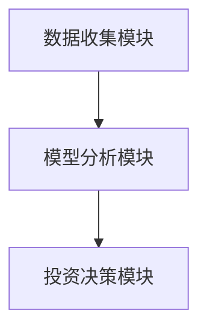

                 


# 巴菲特的跨界投资：从纺织到科技的转变

## 关键词：巴菲特，价值投资，跨行业投资，科技行业，投资策略

## 摘要：  
本文深入探讨了巴菲特从纺织业转向科技投资的策略与哲学。通过分析其投资理念、跨行业决策逻辑、科技行业的独特价值以及经典投资案例，揭示了巴菲特如何成功实现投资领域的跨界转型，并为科技行业的投资提供了深刻见解。

---

## 第1章：巴菲特的投资哲学与价值评估

### 1.1 巴菲特的价值投资理念

#### 1.1.1 价值投资的核心思想  
巴菲特的价值投资理念强调寻找具有长期竞争优势的企业，重点关注企业的内在价值。内在价值的计算公式为：

$$
\text{内在价值} = \frac{\text{未来现金流的现值}}{\text{折现率}}
$$

#### 1.1.2 财务指标分析  
巴菲特通过分析企业的盈利能力、成长性和财务稳定性来评估其内在价值。常用的财务指标包括：

- 净利润率：$$ \text{净利润率} = \frac{\text{净利润}}{\text{营业收入}} $$
- 资产负债率：$$ \text{资产负债率} = \frac{\text{总负债}}{\text{总资产}} $$
- 现金流：$$ \text{现金流} = \text{营业收入} - \text{运营成本} $$

#### 1.1.3 安全边际的重要性  
巴菲特强调安全边际，即买入价格低于内在价值，以确保投资的安全性。安全边际公式为：

$$
\text{安全边际} = \text{内在价值} - \text{买入价格}
$$

### 1.2 从纺织到科技的哲学转变

#### 1.2.1 纺织行业的局限性  
纺织行业面临市场竞争激烈、利润率低、技术门槛不高等问题，巴菲特逐渐意识到纺织行业的增长潜力有限。

#### 1.2.2 科技行业的核心优势  
科技行业具有高增长潜力、高利润率和长期竞争优势。巴菲特通过分析科技行业的技术壁垒、市场需求和创新能力，逐步转向科技投资。

---

## 第2章：跨行业投资的逻辑与策略

### 2.1 跨行业投资的背景与动机

#### 2.1.1 跨行业投资的背景分析  
随着全球经济的变化，传统行业如纺织业逐渐失去增长动力，而科技行业成为经济增长的新引擎。

#### 2.1.2 跨行业投资的动机与目标  
巴菲特希望通过跨行业投资 diversify风险并寻找新的增长点。

### 2.2 巴菲特的跨行业投资策略

#### 2.2.1 行业选择标准  
巴菲特选择具有长期竞争优势、高壁垒和稳定现金流的行业。

#### 2.2.2 股票筛选流程  
1. **行业分析**：选择高增长潜力的行业。
2. **财务评估**：分析企业的盈利能力、现金流和资产负债表。
3. **管理层评估**：考察管理层的诚信和能力。
4. **市场估值**：比较市盈率、市净率等指标。

---

## 第3章：科技行业的投资逻辑与案例分析

### 3.1 科技行业的独特价值

#### 3.1.1 科技行业的市场结构  
科技行业以技术创新为核心，具有高壁垒和高回报潜力。

#### 3.1.2 科技行业的长期趋势  
随着技术进步，科技行业将继续保持高增长。

### 3.2 巴菲特的科技投资案例

#### 3.2.1 苹果公司：案例分析  
巴菲特投资苹果公司是因为其强大的技术壁垒和持续的创新能力。苹果的现金流和利润率表现优异。

#### 3.2.2 可口可乐：案例分析  
可口可乐作为巴菲特的“cola投资”，展现了其在消费领域的长期优势。

---

## 第4章：系统架构与投资模型

### 4.1 投资决策的系统架构

#### 4.1.1 系统功能设计  
- 数据收集模块：收集企业的财务数据和市场信息。
- 模型分析模块：计算内在价值和安全边际。
- 投资决策模块：基于模型结果做出投资决策。

#### 4.1.2 系统架构设计  
使用Mermaid图展示系统架构：



---

## 第5章：算法实现与代码解读

### 5.1 价值评估算法

#### 5.1.1 算法流程  
1. 收集企业的财务数据。
2. 计算内在价值。
3. 比较买入价格与内在价值。
4. 确定安全边际。

#### 5.1.2 Python代码实现  

```python
def calculate_intrinsic_value(revenue, cost, discount_rate):
    cash_flow = revenue - cost
    intrinsic_value = cash_flow / (1 + discount_rate)
    return intrinsic_value

# 示例数据
revenue = 100000000
cost = 60000000
discount_rate = 0.1

iv = calculate_intrinsic_value(revenue, cost, discount_rate)
print(f"内 在 价 值: {iv}")
```

---

## 第6章：总结与展望

### 6.1 总结  
巴菲特的跨界投资成功在于其对价值投资的坚守和对行业趋势的精准判断。

### 6.2 展望  
未来，科技行业将继续成为投资的重点领域，巴菲特的投资策略为科技行业的投资提供了重要启示。

---

## 小结：  
通过分析巴菲特的跨行业投资策略，我们可以看到价值投资的核心在于长期竞争优势和企业内在价值的评估。科技行业的高增长潜力为投资者提供了丰富的投资机会，但同时也要求投资者具备敏锐的行业洞察力和长期战略眼光。

