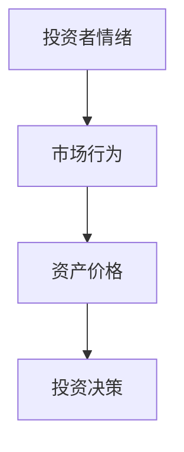

                 


### 第一部分: 巴菲特逆向投资心理学概述

#### 第1章: 逆向投资的起源与核心理念

##### 1.1 逆向投资的起源
- **1.1.1 传统投资与逆向投资的对比**
  - 传统投资：基于基本面分析，寻找低估资产。
  - 逆向投资：在市场恐慌时买入，贪婪时卖出。
- **1.1.2 巴菲特投资理念的核心思想**
  - 价值投资：购买被低估的资产，长期持有。
  - 逆向思维：在市场低谷时投资，高点时卖出。
- **1.1.3 逆向投资在现代金融中的地位**
  - 逆向投资是价值投资的核心策略。
  - 在市场波动中，逆向投资能带来超额收益。

##### 1.2 巴菲特的投资策略
- **1.2.1 价值投资的定义与特点**
  - 价值投资：寻找市场低估的资产，长期持有。
  - 特点：注重内在价值，忽略短期波动。
- **1.2.2 逆向投资的三大原则**
  - 原则一：在恐慌中买入。
  - 原则二：在贪婪中卖出。
  - 原则三：长期持有优质资产。
- **1.2.3 巴菲特投资组合的构成与分析**
  - 主要投资于优质企业，如 Coca-Cola、可口可乐、苹果等。
  - 重仓股分析：集中投资于少数优质资产。

##### 1.3 市场恐慌与贪婪的周期性
- **1.3.1 市场情绪的波动周期**
  - 市场情绪周期：恐慌 → 谨慎 → 贪婪 → 抛售 → 低谷。
  - 周期长度：长期波动，但具有一定的周期性。
- **1.3.2 股市恐慌指数的定义与计算**
  - 定义：衡量市场恐慌程度的指标，如VIX指数。
  - 计算：基于市场波动率，反映投资者情绪。
- **1.3.3 逆向投资与市场周期的关系**
  - 在市场低谷时买入，在市场高点卖出。
  - 逆向投资与市场周期高度相关。

##### 1.4 逆向投资的心理学基础
- **1.4.1 投资者行为偏差的分析**
  - 心理偏差：从众心理、过度自信、损失厌恶等。
  - 行为偏差：贪婪与恐惧导致的非理性决策。
- **1.4.2 心理账户理论与投资决策**
  - 心理账户：投资者将资金划分到不同账户，影响决策。
  - 应用：在恐慌时，投资者更倾向于卖出，导致价格低估。
- **1.4.3 羊群效应与市场泡沫**
  - 羊群效应：投资者跟随市场趋势，导致价格偏离价值。
  - 市场泡沫：羊群效应加剧，导致资产价格虚高。

##### 1.5 本章小结
- 逆向投资的核心是利用市场恐慌和贪婪的情绪，寻找低估资产。
- 巴菲特的投资理念强调价值和长期持有。
- 市场情绪周期为逆向投资提供了时间窗口。

### 第二部分: 逆向投资的核心概念与联系

#### 第2章: 逆向投资的心理机制

##### 2.1 逆向思维的定义与特征
- **2.1.1 逆向思维的定义**
  - 逆向思维：与市场主流观点相反的思考方式。
  - 在市场恐慌时买入，贪婪时卖出。
- **2.1.2 逆向思维的核心特征**
  - 反向性：与市场情绪相反。
  - 独立性：基于基本面分析，不随波逐流。
  - 坚持性：长期持有，不因短期波动改变决策。

##### 2.2 逆向投资的心理学模型
- **2.2.1 投资者情绪的分类与分析**
  - 惶恐慌：极端担忧，导致卖出。
  - 贪婪：极度乐观，导致买入。
  - 谨慎：理性分析，保持观望。
- **2.2.2 逆向投资的心理决策模型**
  - 模型：恐慌 → 买入，贪婪 → 卖出。
  - 机制：利用市场情绪的极端化，寻找价格偏离价值的机会。
- **2.2.3 投资者心理与市场行为的关系**
  - 心理影响行为：投资者情绪影响市场供需。
  - 行为反映心理：市场走势反映投资者情绪。

##### 2.3 逆向投资的核心概念对比
- **2.3.1 投资者心理与市场情绪对比表**
  | 投资者心理 | 市场情绪 |
  |------------|----------|
  | 恐慌       | 抛售     |
  | 谨慎       | 观望     |
  | 贪婪       | 追涨     |
- **2.3.2 逆向投资与套利机会的关系**
  - 逆向投资：在市场低估时买入，高估时卖出。
  - 套利机会：利用价格差异，赚取无风险收益。
- **2.3.3 逆向投资与风险管理的联系**
  - 风险管理：控制仓位，设置止损。
  - 逆向投资：在高风险时寻找机会，降低风险敞口。

##### 2.4 逆向投资的ER实体关系图


##### 2.5 本章小结
- 逆向投资基于市场情绪的极端化，利用恐慌和贪婪寻找投资机会。
- 心理因素和市场行为相互影响，构成投资决策的基础。
- 逆向投资与套利机会、风险管理密切相关。

### 第三部分: 逆向投资的算法原理

#### 第3章: 逆向投资的算法实现

##### 3.1 基于恐慌与贪婪的市场分析算法
- **3.1.1 算法原理**
  - 输入：市场数据（如价格、成交量、情绪指标）。
  - 输出：投资信号（买入、卖出、持有）。
  - 原理：通过情绪指标判断市场是否处于恐慌或贪婪状态，发出相应信号。

##### 3.2 市场恐慌与贪婪指数的计算
- **3.2.1 恐慌指数计算**
  - 公式：恐慌指数 = 函数（市场波动率，成交量变化，价格变化）。
  - 示例：使用VIX指数衡量市场恐慌程度。
- **3.2.2 贪婪指数计算**
  - 公式：贪婪指数 = 函数（市场上涨幅度，成交量变化，价格变化）。
  - 示例：使用相对强弱指数（RSI）判断市场是否超买。

##### 3.3 基于情绪的交易策略
- **3.3.1 策略逻辑**
  - 当恐慌指数高于阈值时，买入。
  - 当贪婪指数高于阈值时，卖出。
  - 其他情况，保持观望。
- **3.3.2 策略实现**
  - 使用Python编写算法，计算情绪指标，发出交易信号。

##### 3.4 算法优化与改进
- **3.4.1 参数优化**
  - 调整恐慌和贪婪指数的阈值。
  - 优化计算公式，提高准确性。
- **3.4.2 策略回测**
  - 回测历史数据，验证策略的有效性。
  - 分析胜率、收益风险比等指标。

##### 3.5 本章小结
- 逆向投资算法通过情绪指标判断市场状态，发出交易信号。
- 惶恐慌和贪婪指数是关键指标，用于指导投资决策。
- 算法优化和回测是确保策略有效性的关键步骤。

### 第四部分: 逆向投资的数学模型

#### 第4章: 数学模型与应用

##### 4.1 惶恐慌指数的数学模型
- **4.1.1 模型公式**
  - 恐慌指数 = a * 市场波动率 + b * 成交量变化 + c * 价格变化。
  - 参数a、b、c根据市场情况调整。
- **4.1.2 模型应用**
  - 计算恐慌指数，判断市场状态。
  - 当恐慌指数超过阈值时，发出买入信号。

##### 4.2 贪婪指数的数学模型
- **4.2.1 模型公式**
  - 贪婪指数 = d * 市场上涨幅度 + e * 成交量变化 + f * 价格变化。
  - 参数d、e、f根据市场情况调整。
- **4.2.2 模型应用**
  - 计算贪婪指数，判断市场状态。
  - 当贪婪指数超过阈值时，发出卖出信号。

##### 4.3 市场情绪指数的综合模型
- **4.3.1 综合模型公式**
  - 市场情绪指数 = g * 恐慌指数 + h * 贪婪指数。
  - 参数g和h根据市场情况调整。
- **4.3.2 模型应用**
  - 综合判断市场情绪，发出投资信号。

##### 4.4 模型的验证与调整
- **4.4.1 数据验证**
  - 使用历史数据验证模型准确性。
  - 分析模型的预测能力。
- **4.4.2 模型调整**
  - 根据回测结果调整参数。
  - 改进模型结构，提高预测精度。

##### 4.5 本章小结
- 数学模型是逆向投资算法的核心工具。
- 惶恐慌和贪婪指数的数学模型帮助判断市场情绪。
- 模型验证和调整是确保策略有效性的关键步骤。

### 第五部分: 逆向投资的系统分析

#### 第5章: 逆向投资决策支持系统

##### 5.1 系统功能设计
- **5.1.1 功能模块**
  - 数据采集：获取市场数据和情绪指标。
  - 惶恐慌与贪婪指数计算：计算市场情绪指数。
  - 投资决策：基于情绪指数发出交易信号。
  - 系统监控：实时监控市场状态和投资组合表现。
- **5.1.2 功能流程**
  - 数据采集 → 惶恐慌与贪婪指数计算 → 投资决策 → 系统监控。

##### 5.2 系统架构设计
- **5.2.1 架构设计**
  - 数据层：存储市场数据和情绪指标。
  - 业务逻辑层：计算情绪指数，发出交易信号。
  - 界面层：展示市场状态和投资决策。

##### 5.3 系统接口设计
- **5.3.1 数据接口**
  - 数据采集接口：获取市场数据。
  - 数据存储接口：存储情绪指数和交易信号。
- **5.3.2 用户接口**
  - 用户界面：展示市场状态和投资决策。
  - 交易接口：执行交易指令。

##### 5.4 系统交互流程
- **5.4.1 交互流程**
  - 用户输入：选择投资策略。
  - 系统计算：计算市场情绪指数。
  - 发出信号：根据情绪指数发出交易信号。
  - 用户确认：确认交易指令。
  - 执行交易：系统执行交易指令。

##### 5.5 系统优化与改进
- **5.5.1 系统优化**
  - 提高计算效率，优化数据存储结构。
  - 改善用户界面，提高用户体验。
- **5.5.2 系统改进**
  - 增加更多情绪指标，丰富系统功能。
  - 支持多市场分析，扩展系统应用范围。

##### 5.6 本章小结
- 逆向投资决策支持系统是实现逆向投资策略的重要工具。
- 系统功能设计、架构设计和交互流程是确保系统高效运行的关键。
- 系统优化和改进是提高系统性能和用户体验的重要步骤。

### 第六部分: 逆向投资的项目实战

#### 第6章: 逆向投资的Python实现

##### 6.1 环境安装
- **6.1.1 安装Python**
  - 安装Python 3.x版本。
  - 安装必要的库：numpy、pandas、scipy、matplotlib。
- **6.1.2 安装依赖库**
  - 使用pip安装必要的库。
  - 示例：pip install numpy pandas matplotlib。

##### 6.2 核心代码实现
- **6.2.1 数据采集代码**
  ```python
  import pandas as pd
  import numpy as np
  import matplotlib.pyplot as plt

  # 采集市场数据
  data = pd.read_csv('market_data.csv')
  data['date'] = pd.to_datetime(data['date'])
  data.set_index('date', inplace=True)
  ```

- **6.2.2 惶恐慌指数计算代码**
  ```python
  # 计算市场波动率
  data['return'] = data['close'].pct_change()
  data['volatility'] = data['return'].std()

  # 计算成交量变化
  data['volume_change'] = data['volume'].pct_change()

  # 计算恐慌指数
  def calculate_fear_index(data):
      fear_index = data['volatility'] * data['volume_change']
      return fear_index

  fear_index = calculate_fear_index(data)
  ```

- **6.2.3 贪婪指数计算代码**
  ```python
  # 计算市场上涨幅度
  data['upside'] = data['close'].diff()

  # 计算贪婪指数
  def calculate_greed_index(data):
      greed_index = data['upside'].mean() * data['volume_change']
      return greed_index

  greed_index = calculate_greed_index(data)
  ```

- **6.2.4 投资决策代码**
  ```python
  # 设置阈值
  fear_threshold = 0.5
  greed_threshold = 0.3

  # 发出交易信号
  data['signal'] = np.where(fear_index > fear_threshold, 'buy', 
                             np.where(greed_index > greed_threshold, 'sell', 'hold'))
  ```

##### 6.3 代码应用解读
- **6.3.1 数据采集与预处理**
  - 从CSV文件读取市场数据。
  - 转换日期为索引，便于后续分析。
- **6.3.2 惶恐慌指数计算**
  - 计算每日收益率和波动率。
  - 计算成交量变化，作为恐慌指数的组成部分。
- **6.3.3 贪婪指数计算**
  - 计算市场上涨幅度，反映市场乐观程度。
  - 结合成交量变化，计算贪婪指数。
- **6.3.4 投资决策**
  - 设置阈值，判断市场情绪。
  - 根据情绪指数发出买入、卖出或持有信号。

##### 6.4 实际案例分析
- **6.4.1 案例背景**
  - 选取2020年疫情时期的数据，分析市场情绪。
  - 计算恐慌指数和贪婪指数，判断投资信号。
- **6.4.2 数据分析**
  - 绘制恐慌指数和贪婪指数的时序图。
  - 分析市场情绪变化，判断交易信号。
- **6.4.3 投资结果**
  - 根据交易信号执行交易，计算投资收益。
  - 对比市场基准，评估策略的有效性。

##### 6.5 系统小结
- 逆向投资的Python实现为投资者提供了强大的工具。
- 数据采集、预处理、情绪指数计算和投资决策是实现逆向投资策略的关键步骤。
- 实际案例分析验证了策略的有效性，为投资者提供了参考。

### 第七部分: 逆向投资的最佳实践

#### 第7章: 逆向投资的实践总结

##### 7.1 逆向投资的关键点
- **7.1.1 风险管理**
  - 设置止损点，控制仓位。
  - 分散投资，降低风险敞口。
- **7.1.2 心理因素**
  - 克服贪婪与恐惧，保持理性。
  - 坚持长期投资，避免短期波动干扰。
- **7.1.3 长期视角**
  - 逆向投资需要耐心等待市场反转。
  - 长期持有优质资产，获得复利效应。
- **7.1.4 持续学习**
  - 关注市场动态，学习新的投资理念。
  - 不断优化投资策略，适应市场变化。

##### 7.2 实践中的注意事项
- **7.2.1 市场波动**
  - 市场波动剧烈时，恐慌指数可能失真。
  - 需要结合其他指标，综合判断市场情绪。
- **7.2.2 数据质量**
  - 数据源的选择影响情绪指数计算。
  - 需要确保数据准确性和完整性。
- **7.2.3 策略调整**
  - 根据市场变化，及时调整策略参数。
  - 定期回测策略，评估有效性。

##### 7.3 拓展阅读
- **7.3.1 推荐书籍**
  - 《巴菲特传》：了解巴菲特的投资理念。
  - 《逆向思考的艺术》：深入探讨逆向思维的应用。
- **7.3.2 相关论文**
  - 《市场情绪与投资决策》：分析市场情绪对投资决策的影响。
  - 《恐慌与贪婪指数的应用》：探讨恐慌和贪婪指数在投资中的应用。

##### 7.4 本章小结
- 逆向投资的成功取决于风险管理、心理因素、长期视角和持续学习。
- 实践中需要注意市场波动、数据质量和策略调整。
- 拓展阅读和学习是提高逆向投资能力的重要途径。

### 附录

#### 附录A: 逆向投资的Python代码实现
- 数据采集代码
- 惶恐慌指数计算代码
- 贪婪指数计算代码
- 投资决策代码

#### 附录B: 市场情绪指数的公式
- 恐慌指数公式
- 贪婪指数公式
- 市场情绪指数综合公式

#### 附录C: 逆向投资的系统架构图
- 系统功能模块图
- 系统架构设计图
- 系统交互流程图

#### 附录D: 参考文献
- 巴菲特定著书籍
- 相关学术论文
- 其他参考资料

### 结语

逆向投资是一种基于市场情绪的高级投资策略，通过在市场恐慌时买入，市场贪婪时卖出，实现超额收益。巴菲特的投资理念为逆向投资提供了理论基础，而数学模型和算法实现为逆向投资提供了实践工具。通过本课程的学习，读者可以掌握逆向投资的核心概念、算法原理和系统实现，能够在实际投资中应用逆向思维，做出更理性的投资决策。

