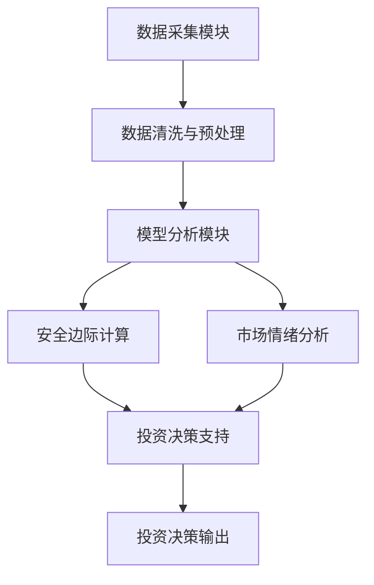

                 


# 巴菲特的逆向投资思维：贪婪与恐惧

> 关键词：巴菲特，逆向投资，价值投资，市场心理，安全边际，投资策略

> 摘要：本文深入探讨了巴菲特的逆向投资思维，分析了贪婪与恐惧在投资中的作用，结合数学模型和系统架构，为投资者提供了科学的投资策略和实战技巧。

---

# 第一部分: 巴菲特的逆向投资思维概述

## 第1章: 巴菲特投资理念的核心思想

### 1.1 巴菲特投资理念的起源与演变

#### 1.1.1 从格雷厄姆的价值投资到巴菲特的创新

格雷厄姆的价值投资理论强调以低于内在价值的价格购买股票，注重安全边际。巴菲特继承了这一理念，但加入了对企业的长期竞争优势和管理团队的关注。他的投资哲学不仅仅是购买股票，而是购买企业。

#### 1.1.2 巴菲特投资理念的核心要素

- **安全边际**：购买价格低于内在价值，确保投资的安全性。
- **长期思维**：关注企业的长期盈利能力，而非短期市场波动。
- **竞争优势**：投资具有持续竞争优势的企业，确保企业的长期生存能力。

#### 1.1.3 逆向投资思维的定义与特征

逆向投资是指在市场恐慌时买入，市场狂热时卖出。其特征包括：
- **反周期性**：在市场低谷时投资，高点时退出。
- **逆人性**：与市场情绪相反，需要强大的纪律和心理素质。

### 1.2 逆向投资思维的哲学基础

#### 1.2.1 价值投资与市场周期的关系

价值投资的核心是寻找价格低于内在价值的股票。市场周期波动为逆向投资者提供了机会，尤其是在市场恐慌时，优质资产的价格被低估。

#### 1.2.2 逆向思维在投资中的优势

逆向思维能够帮助投资者避免情绪化决策，抓住市场恐慌带来的廉价买入机会，以及市场狂热带来的高价卖出机会。

---

## 第2章: 逆向投资思维的背景与意义

### 2.1 股市波动与投资者心理

#### 2.1.1 市场情绪周期分析

市场情绪周期包括四个阶段：
1. **乐观阶段**：投资者情绪高涨，市场出现泡沫。
2. **恐慌阶段**：市场下跌，投资者恐慌性抛售。
3. **绝望阶段**：市场底部，投资者极度悲观。
4. **回升阶段**：市场逐渐恢复，投资者信心回升。

#### 2.1.2 贪婪与恐惧的双重影响

- **贪婪**：市场高位时，投资者过度乐观，追求高收益，忽视风险。
- **恐惧**：市场低位时，投资者过度悲观，忽视潜在机会。

### 2.2 逆向投资的哲学基础

#### 2.2.1 价值投资与市场周期的关系

价值投资强调内在价值，逆向投资则关注市场周期波动中的机会。两者结合，能够在市场底部抓住廉价买入机会。

#### 2.2.2 逆向思维在投资中的优势

逆向思维能够帮助投资者在市场恐慌时买入优质资产，在市场狂热时卖出，避免重大损失。

### 2.3 逆向投资的现实意义

#### 2.3.1 帮助投资者避免情绪化决策

逆向投资需要纪律和耐心，避免跟随市场情绪做出错误决策。

#### 2.3.2 提高投资决策的科学性与稳定性

通过系统分析和数学模型，逆向投资能够提高决策的科学性和稳定性。

---

## 第3章: 逆向投资思维的核心策略

### 3.1 价值投资的基本原则

#### 3.1.1 购买企业而非股票

巴菲特定位为企业的所有者，而非市场的参与者。他关注企业的长期盈利能力，而非短期股价波动。

#### 3.1.2 长期投资与复利效应

长期投资能够充分利用复利效应，实现财富的稳步增长。

### 3.2 安全边际的概念与应用

#### 3.2.1 安全边际的定义

安全边际是指购买价格低于内在价值的部分，确保投资的安全性。

#### 3.2.2 安全边际的计算方法

$$ \text{安全边际} = \frac{\text{内在价值} - \text{市场价格}}{\text{市场价格}} $$

### 3.3 逆向投资的时机选择

#### 3.3.1 市场恐慌时的买入机会

市场恐慌时，优质资产的价格被低估，为逆向投资者提供了买入机会。

#### 3.3.2 市场疯狂时的卖出信号

市场狂热时，资产价格被高估，为逆向投资者提供了卖出信号。

---

## 第4章: 逆向投资思维的数学模型与公式

### 4.1 投资回报的数学模型

#### 4.1.1 复利公式

$$ FV = PV \times (1 + r)^n $$

其中，FV为终值，PV为现值，r为年化收益率，n为投资年数。

#### 4.1.2 内部收益率（IRR）公式

$$ IRR = \sum_{t=0}^{n} \frac{CF_t}{(1 + r)^t} $$

其中，CF_t为第t年的现金流，r为IRR。

### 4.2 市场情绪分析的数学模型

#### 4.2.1 市场恐慌指数（VIX）的计算

$$ VIX = \sqrt{252} \times \sum_{i=1}^{n} \frac{p_i}{n} $$

其中，p_i为第i个市场的波动率，n为市场数量。

---

## 第5章: 逆向投资思维的系统架构设计

### 5.1 投资决策系统的模块划分

#### 5.1.1 数据采集模块

- 收集市场数据，包括股票价格、财务报表等。
- 数据清洗与预处理。

#### 5.1.2 模型分析模块

- 计算内在价值和安全边际。
- 分析市场情绪，生成买入或卖出信号。

#### 5.1.3 决策支持模块

- 根据模型分析结果，生成投资决策。

### 5.2 系统架构的mermai



---

## 第6章: 逆向投资思维的项目实战

### 6.1 环境安装

- 安装Python和相关库（如Pandas、NumPy、Scikit-learn）。

### 6.2 核心实现源代码

```python
import pandas as pd
import numpy as np

def calculate_intrinsic_value(stock_price, eps, growth_rate):
    return stock_price * (1 + growth_rate) ** 10

def calculate_margin_of_safety(intrinsic_value, market_price):
    return (intrinsic_value - market_price) / market_price

# 示例数据
stock_price = 100
eps = 10
growth_rate = 0.05
market_price = 80

intrinsic_value = calculate_intrinsic_value(stock_price, eps, growth_rate)
margin_of_safety = calculate_margin_of_safety(intrinsic_value, market_price)

print(f"内在价值: {intrinsic_value}")
print(f"安全边际: {margin_of_safety}")
```

---

## 第7章: 逆向投资思维的风险管理

### 7.1 投资风险管理

- 分散投资：避免过度集中。
- 定期审视：根据市场变化调整投资组合。

### 7.2 常见错误与注意事项

- 过度自信：避免低估市场的不可预测性。
- 忽视风险：安全边际是投资决策的重要因素。

---

## 第8章: 总结与展望

### 8.1 总结

巴菲特的逆向投资思维强调在市场恐慌时买入，在市场狂热时卖出。通过安全边际和长期投资，投资者能够实现财富的稳健增长。

### 8.2 展望

未来，逆向投资思维将继续在投资领域中发挥重要作用。结合人工智能和大数据分析，逆向投资将更加科学和精准。

---

通过本文的系统分析，读者可以深入了解巴菲特的逆向投资思维，并将其应用于实际投资中，实现稳健的财富增长。

