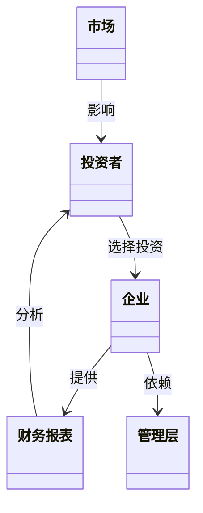
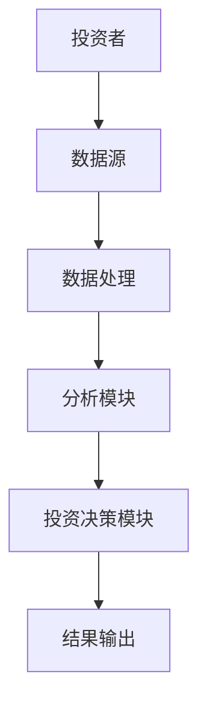

                 

# 巴菲特的集中投资策略：高确信度机会的重要性

## 关键词：巴菲特，投资策略，集中投资，高确信度，内在价值，长期投资

## 摘要：  
本文深入探讨了巴菲特的集中投资策略，分析了高确信度机会的重要性，结合数学模型和系统架构，展示了如何通过精选少数优质企业实现长期投资收益最大化。文章详细解析了巴菲特的投资哲学、选股标准、内在价值评估方法，并通过实战案例和系统设计，为投资者提供了可操作的指导。

---

# 目录

1. [投资的基本概念与巴菲特的投资哲学](#投资的基本概念与巴菲特的投资哲学)
   - 1.1 投资的基本概念
     - 1.1.1 投资的定义与分类
     - 1.1.2 投资的基本原则
     - 1.1.3 巴菲特的投资哲学概述
   - 1.2 巴菲特的投资策略
     - 1.2.1 长期投资的重要性
     - 1.2.2 集中投资的核心思想
     - 1.2.3 高确信度机会的定义与特征
   - 1.3 巴菲特投资策略的背景
     - 1.3.1 现金流与内在价值的概念
     - 1.3.2 市场波动与投资机会的关系
     - 1.3.3 集中投资的历史案例

2. [集中投资策略的核心概念](#集中投资策略的核心概念)
   - 2.1 集中投资的原理
     - 2.1.1 集中投资的定义
     - 2.1.2 集中投资的优缺点
     - 2.1.3 集中投资与分散投资的对比
   - 2.2 高确信度机会的特征
     - 2.2.1 高质量企业的定义
     - 2.2.2 高ROE（净资产收益率）的重要性
     - 2.2.3 高壁垒行业的选择
   - 2.3 巴菲特投资模型的核心要素
     - 2.3.1 企业竞争优势分析
     - 2.3.2 财务健康状况评估
     - 2.3.3 管理层诚信与能力

3. [巴菲特投资策略的数学模型](#巴菲特投资策略的数学模型)
   - 3.1 内在价值的计算公式
     - 3.1.1 内在价值的定义
     - 3.1.2 内在价值的计算公式
     - 3.1.3 现金流的预测方法
   - 3.2 股票估值的模型
     - 3.2.1 DCF模型的步骤
     - 3.2.2 市盈率与市净率的比较
     - 3.2.3 市场价值与内在价值的差异
   - 3.3 风险与收益的数学关系
     - 3.3.1 风险-收益天平的定义
     - 3.3.2 风险调整后的收益计算
     - 3.3.3 非系统性风险的控制方法

4. [巴菲特投资策略的系统架构](#巴菲特投资策略的系统架构)
   - 4.1 投资决策框架
     - 4.1.1 问题场景分析
     - 4.1.2 领域模型的类图
   - 4.2 系统架构设计
     - 4.2.1 系统功能设计
     - 4.2.2 系统架构图
   - 4.3 系统接口设计
     - 4.3.1 数据接口
     - 4.3.2 交互接口
   - 4.4 系统交互设计
     - 4.4.1 投资者与系统的交互
     - 4.4.2 系统与市场的交互

5. [项目实战](#项目实战)
   - 5.1 模拟投资组合的构建
     - 5.1.1 投资目标的设定
     - 5.1.2 资产配置的策略
     - 5.1.3 投资组合的优化
   - 5.2 投资策略的实现
     - 5.2.1 数据获取与清洗
     - 5.2.2 企业基本面分析
     - 5.2.3 投资决策的制定
   - 5.3 投资组合的监控与调整
     - 5.3.1 绩效评估方法
     - 5.3.2 风险监控策略
     - 5.3.3 投资组合的再平衡

6. [总结与最佳实践](#总结与最佳实践)
   - 6.1 集中投资的注意事项
     - 6.1.1 风险管理的重要性
     - 6.1.2 投资者心态的控制
     - 6.1.3 长期投资的坚持
   - 6.2 小结
     - 6.2.1 核心思想回顾
     - 6.2.2 未来展望
   - 6.3 最佳实践 tips
     - 6.3.1 投资心态管理
     - 6.3.2 长期价值投资的重要性
     - 6.3.3 知识更新与学习

---

### 1.1 投资的基本概念与巴菲特的投资哲学

#### 1.1.1 投资的定义与分类
投资是指将资金投入到能够产生收益的资产中，以实现资产增值的过程。投资可以分为短期投资和长期投资，也可以分为股票、债券、房地产等多种形式。巴菲特的投资哲学强调长期投资和价值投资，认为市场波动是投资的敌人，而不是朋友。

#### 1.1.2 投资的基本原则
- 分散投资与集中投资的对比：分散投资通过多样化降低风险，但可能无法获得超额收益；集中投资通过精选优质资产，可能获得更高的收益，但风险也更大。
- 长期投资的重要性：市场短期波动无法预测，但长期趋势可以通过企业基本面分析来把握。
- 价值投资的核心：寻找市场价低于内在价值的企业进行投资。

#### 1.1.3 巴菲特的投资哲学概述
巴菲特的投资哲学基于价值投资，强调寻找具有强大竞争优势、良好财务状况和优秀管理层的企业。他相信市场先生（市场波动）是投资的朋友，而不是敌人，并通过长期持有优质股票实现财富增长。

---

### 1.2 巴菲特的投资策略

#### 1.2.1 长期投资的重要性
长期投资允许投资者忽略短期市场波动，专注于企业的长期价值。通过持有优质企业，投资者能够分享企业的成长收益。

#### 1.2.2 集中投资的核心思想
集中投资要求投资者将大部分资金投入到少数具有高确信度的优质企业中，而不是分散投资于多个低质量企业。这种方法要求投资者对所选企业有深刻的理解和高度的信心。

#### 1.2.3 高确信度机会的定义与特征
高确信度机会是指投资者对企业的内在价值、竞争优势和长期前景有高度信心的投资机会。这些企业通常具有强大的护城河、稳定的现金流和优秀的管理层。

---

### 1.3 巴菲特投资策略的背景

#### 1.3.1 现金流与内在价值的概念
现金流是企业在一定时期内的现金流入和流出，是评估企业财务健康状况的重要指标。内在价值是企业未来现金流的现值，是价值投资的核心概念。

#### 1.3.2 市场波动与投资机会的关系
市场波动为投资者提供了低位买入优质资产的机会，但需要投资者具备独立思考和判断能力，避免被市场情绪左右。

#### 1.3.3 集中投资的历史案例
巴菲特投资可口可乐和苹果的成功案例展示了集中投资策略的有效性。这些投资不仅为巴菲特带来了丰厚的回报，也验证了他选股标准的科学性。

---

### 2.1 集中投资的原理

#### 2.1.1 集中投资的定义
集中投资是指将大部分资金投入到少数具有高度竞争优势的企业中，通过长期持有实现超额收益。

#### 2.1.2 集中投资的优缺点
- 优点：能够专注于优质企业，获得更高的收益；降低交易成本和时间成本。
- 缺点：风险较高，市场波动可能导致短期亏损；需要较高的研究能力和信心。

#### 2.1.3 集中投资与分散投资的对比
- 分散投资：通过多样化降低风险，但可能无法获得超额收益。
- 集中投资：通过精选优质企业，可能获得超额收益，但需要承担更高的风险。

---

### 2.2 高确信度机会的特征

#### 2.2.1 高质量企业的定义
高质量企业具有强大的竞争优势、稳定的现金流和优秀的管理层。这些企业能够在市场中长期保持领先地位。

#### 2.2.2 高ROE（净资产收益率）的重要性
ROE是衡量企业盈利能力的重要指标，高ROE表明企业能够有效利用股东资金创造利润。

#### 2.2.3 高壁垒行业的选择
高壁垒行业具有较高的进入门槛，竞争对手难以轻易进入，从而保证了企业的长期竞争优势。

---

### 2.3 巴菲特投资模型的核心要素

#### 2.3.1 企业竞争优势分析
竞争优势包括成本优势、品牌优势、技术优势等，是企业长期盈利能力的关键因素。

#### 2.3.2 财务健康状况评估
财务健康状况包括资产负债表、利润表和现金流等，是评估企业财务风险的重要依据。

#### 2.3.3 管理层诚信与能力
管理层的诚信和能力直接影响企业的长期发展，巴菲特非常重视这一点。

---

### 3.1 内在价值的计算公式

#### 3.1.1 内在价值的定义
内在价值是企业未来现金流的现值，是价值投资的核心概念。

#### 3.1.2 内在价值的计算公式
$$
\text{内在价值} = \sum_{t=1}^{\infty} \frac{\text{现金流}_t}{(1 + r)^t}
$$

其中，现金流是企业在未来各期的现金流，r是折现率。

#### 3.1.3 现金流的预测方法
现金流预测需要考虑企业的业务模式、行业前景和宏观经济环境等因素。

---

### 3.2 股票估值的模型

#### 3.2.1 DCF模型的步骤
- 确定企业未来自由现金流
- 选择合适的折现率
- 计算未来现金流的现值
- 加上终值，得出企业内在价值

#### 3.2.2 市盈率与市净率的比较
- 市盈率（P/E）= 股价 / 每股净利润
- 市净率（P/B）= 股价 / 每股净资产

---

### 3.3 风险与收益的数学关系

#### 3.3.1 风险-收益天平的定义
风险与收益成正比，高风险可能带来高收益，但也可能带来更大的损失。

#### 3.3.2 风险调整后的收益计算
风险调整后的收益 = 预期收益 - 风险调整值

#### 3.3.3 非系统性风险的控制方法
通过分散投资和选择优质企业降低非系统性风险。

---

### 4.1 投资决策框架

#### 4.1.1 问题场景分析
- 投资者需要选择优质企业进行长期投资
- 市场波动可能影响投资组合的表现
- 如何通过集中投资实现收益最大化

#### 4.1.2 领域模型的类图

---

### 4.2 系统架构设计

#### 4.2.1 系统功能设计
- 数据采集与处理
- 企业基本面分析
- 投资组合管理
- 风险评估与监控

#### 4.2.2 系统架构图

---

### 4.3 系统接口设计

#### 4.3.1 数据接口
- 数据源：股票数据、财务报表等
- 数据接口：API接口

#### 4.3.2 交互接口
- 投资者与系统的交互界面
- 系统与市场的交互接口

---

### 4.4 系统交互设计

#### 4.4.1 投资者与系统的交互
- 投资者输入投资需求
- 系统返回投资建议

#### 4.4.2 系统与市场的交互
- 系统获取市场数据
- 系统分析市场趋势

---

### 5.1 模拟投资组合的构建

#### 5.1.1 投资目标的设定
- 确定投资期限、风险承受能力和收益目标
- 选择具有高确信度的优质企业

#### 5.1.2 资产配置的策略
- 集中投资于少数优质企业
- 通过长期持有实现收益

#### 5.1.3 投资组合的优化
- 定期评估投资组合的表现
- 根据市场变化进行调整

---

### 5.2 投资策略的实现

#### 5.2.1 数据获取与清洗
- 使用Python的pandas库获取和清洗数据
- 数据清洗步骤：去除缺失值、处理异常值等

#### 5.2.2 企业基本面分析
- 使用财务指标（如ROE、毛利率等）评估企业基本面
- 编写Python代码进行自动化分析

#### 5.2.3 投资决策的制定
- 根据分析结果制定投资决策
- 编写代码生成投资组合建议

---

### 5.3 投资组合的监控与调整

#### 5.3.1 绩效评估方法
- 使用夏普比率、最大回撤等指标评估投资组合的绩效
- 编写Python代码计算绩效指标

#### 5.3.2 风险监控策略
- 监控市场波动对投资组合的影响
- 定期评估投资组合的风险水平

#### 5.3.3 投资组合的再平衡
- 根据市场变化和企业基本面调整投资组合
- 编写代码实现投资组合的再平衡

---

### 6.1 集中投资的注意事项

#### 6.1.1 风险管理的重要性
- 集中投资需要严格控制风险
- 通过分散投资降低风险

#### 6.1.2 投资者心态的控制
- 避免被市场波动影响
- 保持长期投资的耐心

#### 6.1.3 长期投资的坚持
- 长期持有优质企业
- 忽略短期市场波动

---

### 6.2 小结

#### 6.2.1 核心思想回顾
- 巴菲特的集中投资策略强调高确信度机会
- 通过长期持有优质企业实现财富增长

#### 6.2.2 未来展望
- 集中投资策略在AI和大数据时代的应用
- 投资者的教育与风险管理的重要性

---

### 6.3 最佳实践 tips

#### 6.3.1 投资心态管理
- 保持冷静和耐心，避免情绪化决策
- 长期投资需要坚持和信心

#### 6.3.2 长期价值投资的重要性
- 选择具有强大竞争优势的企业
- 长期持有优质企业

#### 6.3.3 知识更新与学习
- 持续学习投资知识，提升分析能力
- 关注行业动态和企业变化

---

通过以上步骤，您可以系统地了解和应用巴菲特的集中投资策略。从基本概念到数学模型，再到系统架构和实战案例，本文为您提供了一个全面的学习框架。希望这些内容能够帮助您在投资道路上走得更远、更稳。

