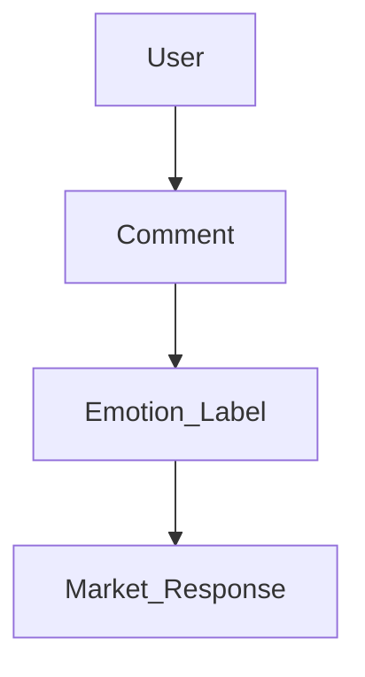
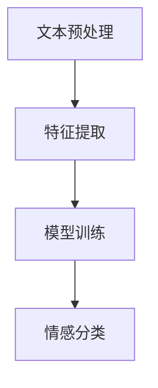
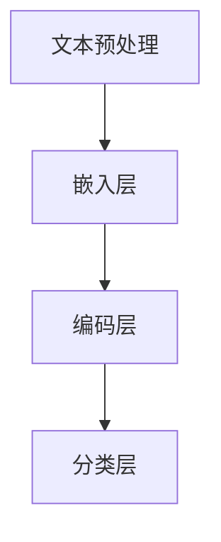
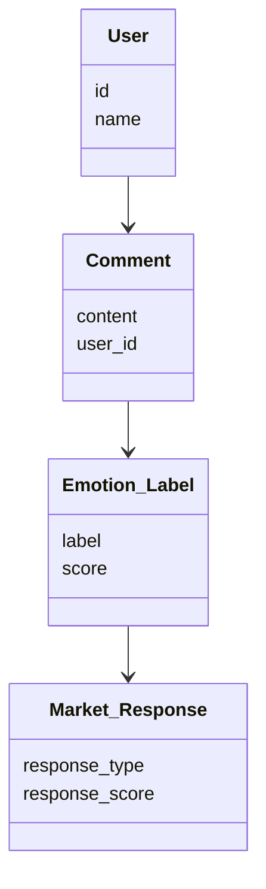
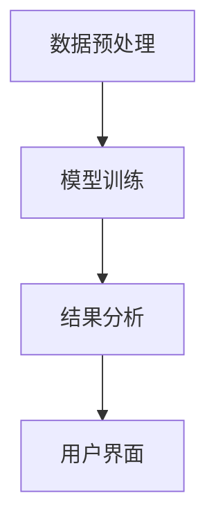
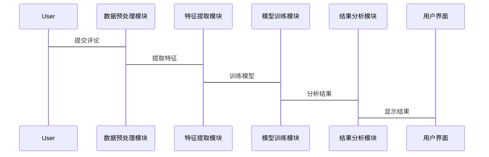

                 


# 市场情绪分析

## 关键词：
- 市场情绪分析
- 情感分类
- 自然语言处理
- 金融市场
- 机器学习

## 摘要：
市场情绪分析是结合自然语言处理和金融市场分析的新兴领域，旨在通过分析文本数据来预测市场趋势。本文详细探讨了市场情绪分析的背景、核心概念、算法原理、系统架构设计、项目实战以及最佳实践，帮助读者全面理解该领域的技术细节和应用价值。

---

# 第一部分: 市场情绪分析背景与核心概念

## 第1章: 市场情绪分析的定义与背景

### 1.1 市场情绪分析的定义与背景

#### 1.1.1 什么是市场情绪分析
市场情绪分析是指通过分析文本数据（如社交媒体评论、新闻报道等），量化市场参与者的情感倾向，从而预测市场行为和趋势的过程。它结合了自然语言处理（NLP）和金融市场分析技术。

#### 1.1.2 市场情绪分析的背景与重要性
随着社交媒体和金融数据的爆炸式增长，市场情绪分析变得越来越重要。投资者、企业和机构可以通过分析市场情绪，做出更明智的决策。例如，社交媒体上的投资者情绪可以影响股票价格，及时的情绪分析可以帮助投资者抓住市场机会或规避风险。

#### 1.1.3 市场情绪分析的应用领域
- **股票市场**：通过分析社交媒体评论预测股票价格走势。
- **加密货币市场**：通过分析社区讨论预测币价波动。
- **新闻媒体**：通过分析新闻报道的情绪倾向预测市场反应。
- **客户反馈**：通过分析客户评论评估企业形象和产品声誉。

### 1.2 市场情绪分析的核心概念

#### 1.2.1 情感分类与情感强度分析
- **情感分类**：将文本分为正面、负面或中性情绪。
- **情感强度分析**：量化情绪的强度，例如从0到1的强度值。

#### 1.2.2 市场情绪分析与自然语言处理的关系
市场情绪分析依赖于NLP技术，如分词、情感词典、句法分析等。NLP帮助提取文本中的情感信息，而市场情绪分析则将这些信息转化为可操作的市场信号。

#### 1.2.3 市场情绪分析与金融市场分析的结合
市场情绪分析结合了金融市场的行为分析，例如利用投资者情绪预测市场波动、评估风险等。

### 1.3 市场情绪分析的挑战与技术难点

#### 1.3.1 数据质量与多样性问题
- 数据可能存在噪声、歧义和主观性，影响分析结果。
- 数据来源多样化，如社交媒体、新闻、评论等，需要统一处理。

#### 1.3.2 情感分析的模糊性与复杂性
- 情感表达可能隐含、间接或含蓄，增加了分析难度。
- 市场情绪受多种因素影响，如宏观经济指标、政策变化等，增加了分析的复杂性。

#### 1.3.3 实时分析与延迟问题
- 市场情绪需要实时分析，以捕捉短期波动。
- 数据处理和分析过程可能引入延迟，影响实时性。

### 1.4 市场情绪分析的数据来源

#### 1.4.1 社交媒体数据
- 来源：Twitter、Reddit、Facebook等。
- 特点：数据量大，实时性强，但噪声多。

#### 1.4.2 新闻与财经报道
- 来源：新闻网站、财经媒体。
- 特点：信息权威，但可能滞后。

#### 1.4.3 机构投资者观点与评论
- 来源：机构报告、投资者访谈。
- 特点：专业性强，但获取难度大。

### 1.5 本章小结
本章介绍了市场情绪分析的定义、背景、应用领域、核心概念和数据来源，为后续分析奠定了基础。

---

## 第2章: 市场情绪分析的核心概念与联系

### 2.1 市场情绪分析的核心原理

#### 2.1.1 情感分析的基本原理
- 使用情感词典或机器学习模型对文本进行情感分类。
- 例如，将“这个股票表现很好”分类为正面情绪。

#### 2.1.2 市场情绪分析的特征提取
- 提取文本中的关键词、情感词汇、语气助词等。
- 例如，从评论中提取与股票相关的关键词。

#### 2.1.3 情感传播与市场反应
- 情感传播：正面情绪在市场中的扩散影响价格。
- 市场反应：情绪变化导致交易量和价格波动。

### 2.2 市场情绪分析的核心概念对比

#### 2.2.1 情感分类与主题分类的对比
| 对比维度 | 情感分类 | 主题分类 |
|----------|----------|----------|
| 目标     | 判断情感倾向 | 判断主题类别 |
| 数据     | 文本情感特征 | 主题关键词 |
| 应用     | 投资决策 | 内容管理 |

#### 2.2.2 不同情感分析模型的优缺点对比
| 模型类型 | 优点 | 缺点 |
|----------|------|------|
| 基于规则 | 简单易实现 | 需手动维护规则库 |
| 统计方法 | 考虑上下文 | 特征工程复杂 |
| 机器学习 | 高准确性 | 数据依赖性高 |
| 深度学习 | 自然语言处理能力强 | 计算资源需求高 |

#### 2.2.3 市场情绪分析与舆情监控的联系
- 舆情监控：监测市场舆论动态。
- 市场情绪分析：量化舆论对市场的影响。

### 2.3 市场情绪分析的ER实体关系图



### 2.4 本章小结
本章探讨了市场情绪分析的核心原理、概念对比和实体关系，帮助读者理解其技术基础。

---

## 第3章: 市场情绪分析的算法原理

### 3.1 基于规则的情感分析算法

#### 3.1.1 规则的基础
- 使用情感词典，如AFINN、Vader等。
- 例如，使用正向词汇表判断文本情感。

#### 3.1.2 规则的情感计算
- 将文本中的情感词汇映射到情感值。
- 例如，使用加权方法计算整体情感得分。

#### 3.1.3 规则的优缺点
- 优点：简单易实现，适用于规则明确的场景。
- 缺点：难以处理复杂和模糊的文本。

### 3.2 统计方法情感分析算法

#### 3.2.1 统计方法的情感计算
- 使用Naive Bayes、SVM等传统机器学习算法。
- 例如，使用TF-IDF特征提取进行分类。

#### 3.2.2 统计方法的情感分类流程


#### 3.2.3 统计方法的优缺点
- 优点：考虑上下文信息，准确性较高。
- 缺点：特征工程复杂，计算资源需求较高。

### 3.3 机器学习情感分析算法

#### 3.3.1 机器学习的情感分类流程


#### 3.3.2 常见的机器学习模型
- Naive Bayes、SVM、随机森林等。

### 3.4 深度学习情感分析算法

#### 3.4.1 深度学习的情感分类流程


#### 3.4.2 常见的深度学习模型
- RNN、LSTM、Transformer等。

#### 3.4.3 深度学习的优势
- 自然语言处理能力强，能够捕捉复杂的语义信息。

### 3.5 情感分析的数学模型

#### 3.5.1 情感分类的损失函数
$$ \text{损失函数} = -\frac{1}{N}\sum_{i=1}^{N} \text{log}(P(y_i|\mathbf{x}_i)) $$
其中，$P(y_i|\mathbf{x}_i)$是模型预测的条件概率。

#### 3.5.2 准确率与召回率的计算
$$ \text{准确率} = \frac{\text{正确预测数}}{\text{总预测数}} $$
$$ \text{召回率} = \frac{\text{正确预测数}}{\text{实际正例数}} $$
$$ \text{F1值} = \frac{2 \cdot \text{准确率} \cdot \text{召回率}}{\text{准确率} + \text{召回率}} $$

### 3.6 本章小结
本章详细讲解了不同情感分析算法的原理、流程和优缺点，为后续实现提供了理论基础。

---

## 第4章: 市场情绪分析的系统架构设计

### 4.1 问题场景介绍

#### 4.1.1 系统需求
- 实时分析社交媒体评论。
- 提供情感分析结果和市场反应预测。

#### 4.1.2 项目介绍
- 开发一个实时市场情绪监控系统，帮助投资者做出决策。

### 4.2 系统功能设计

#### 4.2.1 领域模型类图


#### 4.2.2 系统架构图


#### 4.2.3 系统接口设计
- 数据接口：接收评论数据。
- 情感分析接口：返回情感标签。
- 市场反应接口：返回市场反应预测。

#### 4.2.4 系统交互流程


### 4.3 本章小结
本章设计了一个完整的市场情绪分析系统架构，包括数据预处理、模型训练和结果分析模块。

---

## 第5章: 市场情绪分析的项目实战

### 5.1 环境安装与配置

#### 5.1.1 环境需求
- Python 3.8+
- 计算库：numpy、pandas
- 机器学习库：scikit-learn、xgboost
- 自然语言处理库：nltk、spaCy

#### 5.1.2 安装步骤
```bash
pip install numpy pandas scikit-learn nltk spacy
```

### 5.2 系统核心实现源代码

#### 5.2.1 数据预处理
```python
import pandas as pd
import nltk
from sklearn.feature_extraction.text import TfidfVectorizer

def preprocess(text):
    # 分词
    words = nltk.word_tokenize(text.lower())
    # 去停用词
    stop_words = set(nltk.corpus.stopwords.words('english'))
    filtered_words = [word for word in words if word not in stop_words]
    return ' '.join(filtered_words)

# 示例数据
data = {
    'comment': ['This stock is great!', 'I am worried about its future.'],
    'label': [1, 0]
}

df = pd.DataFrame(data)
df['processed_comment'] = df['comment'].apply(preprocess)
```

#### 5.2.2 特征提取与模型训练
```python
from sklearn.model_selection import train_test_split
from sklearn.naive_bayes import MultinomialNB
from sklearn.metrics import accuracy_score, recall_score

vectorizer = TfidfVectorizer()
X = vectorizer.fit_transform(df['processed_comment'])
y = df['label']

X_train, X_test, y_train, y_test = train_test_split(X, y, test_size=0.2)

model = MultinomialNB()
model.fit(X_train, y_train)

y_pred = model.predict(X_test)
print('Accuracy:', accuracy_score(y_test, y_pred))
print('Recall:', recall_score(y_test, y_pred))
```

#### 5.2.3 结果分析与可视化
```python
import matplotlib.pyplot as plt

# 示例结果
results = pd.DataFrame({
    'comment': ['This stock is great!', 'I am worried about its future.'],
    'predicted_label': [1, 0],
    'probability': [0.8, 0.7]
})

plt.bar(results['comment'], results['predicted_label'])
plt.xticks(rotation=45)
plt.title('Predicted Labels')
plt.show()
```

### 5.3 项目小结
本章通过一个具体案例展示了市场情绪分析的实现过程，包括数据预处理、特征提取、模型训练和结果分析。

---

## 第6章: 市场情绪分析的挑战与未来方向

### 6.1 市场情绪分析的挑战

#### 6.1.1 数据质量与多样性
- 数据可能包含噪声和歧义，影响分析准确性。

#### 6.1.2 情感分析的复杂性
- 市场情绪受多种因素影响，如宏观经济指标和政策变化。

#### 6.1.3 实时分析的延迟问题
- 实时分析需要快速处理数据，但计算资源有限。

### 6.2 市场情绪分析的未来方向

#### 6.2.1 多模态分析
- 结合图像、视频等多模态数据进行情绪分析。

#### 6.2.2 领域自适应
- 根据不同市场领域调整分析模型。

#### 6.2.3 可解释性增强
- 提供更透明的分析结果，帮助用户理解模型决策。

### 6.3 最佳实践 Tips

#### 6.3.1 数据处理
- 使用高质量、多样化的数据来源。
- 进行数据清洗和增强。

#### 6.3.2 模型调优
- 使用交叉验证优化模型参数。
- 尝试不同的特征工程方法。

#### 6.3.3 实时分析
- 优化数据处理流程，减少延迟。
- 使用分布式计算框架加速处理。

### 6.4 本章小结
本章总结了市场情绪分析的挑战，并展望了未来的发展方向，同时提供了实用的建议。

---

## 第7章: 总结与展望

### 7.1 本文章总结
- 本文详细介绍了市场情绪分析的背景、核心概念、算法原理、系统架构设计和项目实战。
- 帮助读者全面理解市场情绪分析的技术细节和应用价值。

### 7.2 对未来发展的展望
- 随着NLP和机器学习技术的进步，市场情绪分析将更加智能化和多样化。
- 更多领域自适应和多模态分析的应用将推动该领域的发展。

---

## 参考文献
- [1] 情感分析的经典论文。
- [2] 市场情绪分析的相关研究。
- [3] 自然语言处理的最新进展。

---

## 附录
- 附录A: 详细代码实现
- 附录B: 数据集说明
- 附录C: 模型评估指标

---

# 结语
市场情绪分析是一个充满挑战和机遇的领域，随着技术的进步，其应用将越来越广泛。希望本文能为读者提供有价值的技术指导和启发。

