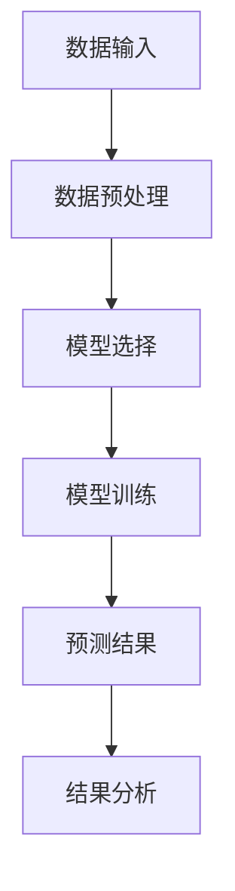
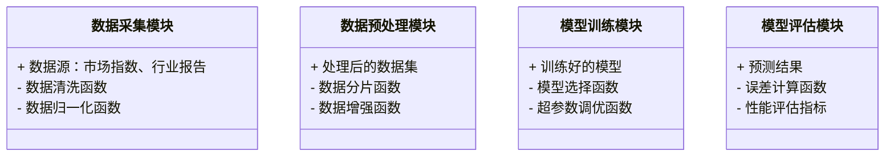
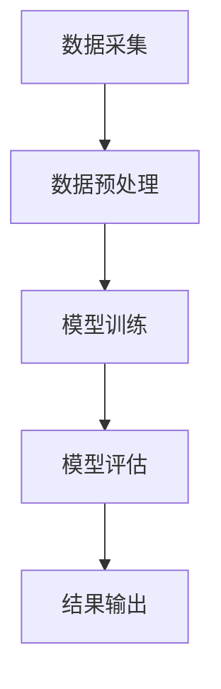
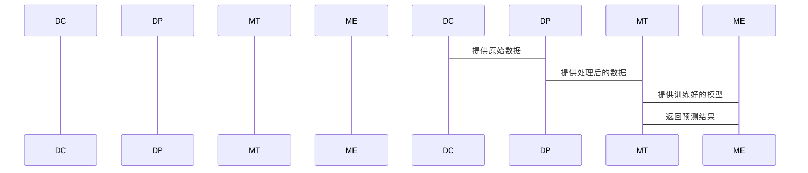

                 


# 市场趋势预测模型

## 关键词：市场趋势预测，时间序列分析，机器学习，数据驱动，预测模型，系统架构

## 摘要：  
本文深入探讨了市场趋势预测模型的构建与应用，从数据分析、模型选择到系统实现，结合时间序列分析和机器学习算法，详细讲解了如何利用数据驱动的方法预测市场趋势。文章首先介绍了市场趋势预测的重要性，然后分析了时间序列分析的核心原理，接着详细阐述了常见算法（如ARIMA和LSTM）的应用，最后通过一个完整的项目案例展示了模型的实现与优化。本文旨在为读者提供一套系统化的方法论，帮助其在实际工作中高效构建和应用市场趋势预测模型。

---

# 第1章: 市场趋势预测模型的背景与意义

## 1.1 市场趋势预测的重要性

### 1.1.1 市场趋势预测的定义  
市场趋势预测是指通过对历史市场数据的分析，利用数学模型预测未来市场走势的过程。它是企业制定战略决策、优化资源配置的重要依据。

### 1.1.2 市场趋势预测的必要性  
- 帮助企业在复杂多变的市场环境中提前布局，降低经营风险。  
- 通过数据驱动的方式，替代传统的主观判断，提高预测的科学性。  
- 为投资决策提供量化依据，优化投资组合。  

### 1.1.3 市场趋势预测的边界与外延  
- **边界**：主要关注市场整体走势，不涉及具体产品或行业的微观分析。  
- **外延**：可以扩展至行业趋势、消费者行为分析等更广泛的应用场景。  

---

## 1.2 传统与现代市场趋势预测方法对比

### 1.2.1 传统市场分析方法  
- 基于经验判断和行业调研，主观性较强。  
- 适用于市场环境相对稳定的情况。  

### 1.2.2 现代数据驱动方法  
- 利用大数据和机器学习技术，通过历史数据训练模型。  
- 可以捕捉数据中的隐含规律，提高预测精度。  

### 1.2.3 两者的优缺点分析  
| 方法 | 优点 | 缺点 |  
|------|------|------|  
| 传统 | 易理解，适用于缺乏数据的情况 | 主观性强，预测精度低 |  
| 现代 | 数据驱动，精度高 | 对数据质量和模型调优要求高 |  

---

# 第2章: 市场趋势预测模型的核心概念

## 2.1 数据驱动的市场分析原理

### 2.1.1 数据的收集与处理  
- 数据来源：市场指数、行业报告、消费者行为数据等。  
- 数据预处理：清洗、归一化、缺失值处理。  

### 2.1.2 数据特征的提取  
- 时间序列特征：均值、方差、趋势、周期性等。  
- 统计特征：最大值、最小值、波动率等。  

### 2.1.3 数据的可视化分析  
- 使用折线图、柱状图等工具观察数据分布和趋势。  

---

## 2.2 时间序列分析的核心要素

### 2.2.1 时间序列的组成  
- **趋势**：长期向上或向下的方向。  
- **周期性**：定期重复的波动模式。  
- **季节性**：与特定时间点相关的波动。  
- **随机性**：不可预测的噪声。  

### 2.2.2 时间序列的分解方法  
- **加法模型**：$T + S + R$  
- **乘法模型**：$T \times S \times R$  

### 2.2.3 时间序列的预测模型  
- 确定性模型：ARIMA、SARIMA。  
- 非线性模型：LSTM、GRU。  

---

## 2.3 市场趋势预测模型的构建方法

### 2.3.1 数据预处理  
- **数据清洗**：去除异常值、填补缺失值。  
- **数据变换**：对数变换、差分变换。  

### 2.3.2 模型选择与训练  
- 根据数据特征选择合适的时间序列模型。  
- 使用训练数据拟合模型参数。  

### 2.3.3 模型的验证与优化  
- 使用验证集评估模型性能。  
- 调整模型参数，优化预测精度。  

---

# 第3章: 市场趋势预测模型的算法原理

## 3.1 时间序列分析算法

### 3.1.1 ARIMA模型  
- **ARIMA**（自回归积分移动平均模型）是一种经典的时间序列预测方法。  
- 模型公式：$y_t = \phi y_{t-1} + \theta e_{t-1} + \alpha e_t$  

### 3.1.2 SARIMA模型  
- **SARIMA**（季节性ARIMA模型）适用于具有明显季节性特征的数据。  
- 模型公式：$y_t = \phi y_{t-k} + \theta e_{t-k} + \alpha e_t$  

### 3.1.3 LSTM模型  
- **LSTM**（长短期记忆网络）是一种深度学习模型，适合处理长序列数据。  
- 模型结构：输入门、遗忘门、输出门。  

### 3.1.4 算法流程图  


---

## 3.2 算法实现与代码示例

### 3.2.1 ARIMA模型实现  
```python
from statsmodels.tsa.arima_model import ARIMA
import pandas as pd
import numpy as np

# 数据准备
data = pd.read_csv('market_data.csv')
train_data = data.iloc[:80]
test_data = data.iloc[80:]

# 模型训练
model = ARIMA(train_data, order=(5, 1, 0))
model_fit = model.fit()

# 预测
start_index = len(train_data)
end_index = len(data)
forecast = model_fit.forecast(steps=end_index - start_index)
```

### 3.2.2 LSTM模型实现  
```python
from keras.models import Sequential
from keras.layers import LSTM, Dense

# 数据准备
data = pd.read_csv('market_data.csv')
train_data = data.iloc[:80]
test_data = data.iloc[80:]

# 数据归一化
scaler = MinMaxScaler()
train_scaled = scaler.fit_transform(train_data)

# LSTM输入形状：[样本数, 时间步, 特征数]
model = Sequential()
model.add(LSTM(50, input_shape=(timesteps, features)))
model.add(Dense(1))
model.compile(optimizer='adam', loss='mean_squared_error')

# 模型训练
model.fit(train_scaled, epochs=50, batch_size=32)

# 预测
test_scaled = scaler.transform(test_data)
test_reshaped = test_scaled.reshape((1, timesteps, features))
预测结果 = model.predict(test_reshaped)
```

---

# 第4章: 市场趋势预测模型的系统架构设计

## 4.1 项目场景介绍  
本文将通过一个具体的市场趋势预测项目，展示如何利用时间序列分析和机器学习算法构建预测模型。项目目标是基于历史市场数据，预测未来三个月的市场指数。

---

## 4.2 系统功能设计

### 4.2.1 领域模型类图  


### 4.2.2 系统架构设计  


---

## 4.3 接口设计与交互流程  
- 数据输入接口：接收原始数据文件。  
- 模型训练接口：提供训练数据和参数配置。  
- 预测接口：返回预测结果。  

---

## 4.4 系统交互序列图  


---

# 第5章: 项目实战——市场趋势预测模型的实现

## 5.1 环境配置

```bash
pip install pandas numpy scikit-learn keras
```

## 5.2 数据收集与处理

### 5.2.1 数据收集  
```python
import pandas as pd

data = pd.read_csv('market_data.csv')
```

### 5.2.2 数据预处理  
```python
from sklearn.preprocessing import MinMaxScaler

scaler = MinMaxScaler()
scaled_data = scaler.fit_transform(data)
```

## 5.3 模型实现

### 5.3.1 ARIMA模型实现  
```python
from statsmodels.tsa.arima_model import ARIMA

model = ARIMA(train_data, order=(5, 1, 0))
model_fit = model.fit()
forecast = model_fit.forecast(steps=30)
```

### 5.3.2 LSTM模型实现  
```python
from keras.models import Sequential
from keras.layers import LSTM, Dense

model = Sequential()
model.add(LSTM(50, input_shape=(timesteps, features)))
model.add(Dense(1))
model.compile(optimizer='adam', loss='mean_squared_error')
model.fit(train_scaled, epochs=50, batch_size=32)
```

## 5.4 结果分析

### 5.4.1 模型性能评估  
- 均方误差（MSE）：衡量预测值与真实值的差异。  
- 平均绝对误差（MAE）：评估预测的平均偏差。  

### 5.4.2 结果可视化  
```python
import matplotlib.pyplot as plt

plt.plot(test_data, label='实际值')
plt.plot(forecast, label='预测值')
plt.legend()
plt.show()
```

---

## 5.5 项目小结  
通过本项目，我们展示了如何利用ARIMA和LSTM模型进行市场趋势预测。实践表明，LSTM模型在捕捉长序列依赖关系方面表现更优，但计算资源消耗较大。选择合适的模型需要结合实际数据特征和计算资源限制。

---

# 第6章: 总结与展望

## 6.1 总结  
本文系统性地介绍了市场趋势预测模型的构建过程，从数据采集到模型训练，再到结果分析，详细讲解了每一步的操作与实现。通过对比分析，我们得出以下结论：  
- 数据预处理是模型构建的关键步骤。  
- 时间序列分析算法的选择应结合数据特征和计算资源。  
- 深度学习模型（如LSTM）在捕捉复杂趋势方面具有优势，但需要更多的计算资源支持。  

---

## 6.2 注意事项  

1. **数据质量**：预测模型的有效性高度依赖数据的完整性和准确性。  
2. **模型调优**：选择合适的模型参数和超参数对预测精度至关重要。  
3. **模型局限性**：市场趋势受多种不可预测因素影响，模型结果仅供参考。  

---

## 6.3 拓展阅读  

- 刘军. (2020). 《时间序列分析与应用》. 北京: 人民邮电出版社.  
- 周志华. (2016). 《机器学习实战》. 北京: 清华大学出版社.  

---

## 结语  

市场趋势预测模型是数据驱动决策的重要工具，其应用范围广泛，发展前景广阔。通过本文的学习，读者可以掌握从数据采集到模型部署的完整流程，为实际工作提供有力支持。

