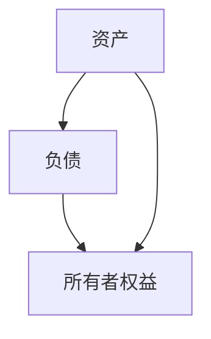

                 


# 布鲁斯·格林沃尔德的资产负债表深度分析

> 关键词：财务报表分析，资产负债表，资产，负债，所有者权益，财务分析，财务比率

> 摘要：本文深入分析了布鲁斯·格林沃尔德在资产负债表分析领域的研究成果，从核心概念、分析方法到系统架构，结合实际案例，全面解析了资产负债表的构成与应用。通过详细阐述资产、负债和所有者权益的关系，结合实际的Python代码实现和财务比率分析，为读者提供了从理论到实践的完整指南。

---

# 第一部分: 资产负债表的基本概念与分析框架

## 第1章: 资产负债表概述

### 1.1 资产负债表的基本概念

#### 1.1.1 什么是资产负债表
资产负债表是企业在某一特定日期内资产、负债和所有者权益的全面反映。它是企业财务健康状况的晴雨表，通过分析资产负债表，可以评估企业的偿债能力、资本结构和财务稳定性。

#### 1.1.2 资产负债表的结构与内容
资产负债表通常分为资产、负债和所有者权益三个主要部分：
1. **资产**：企业拥有的资源，包括流动资产（如现金、应收账款）和非流动资产（如固定资产、无形资产）。
2. **负债**：企业承担的债务，包括流动负债（如应付账款、短期借款）和非流动负债（如长期借款）。
3. **所有者权益**：企业的净资产，等于资产减去负债。

#### 1.1.3 资产负债表的重要性
- 为投资者和债权人提供企业财务状况的评估依据。
- 帮助企业管理层优化资本结构，改善财务健康状况。
- 是企业税务申报和审计的重要依据。

---

## 第2章: 资产负债表的核心要素

### 2.1 资产

#### 2.1.1 资产的定义与分类
资产是企业拥有或控制的资源，预期能为企业带来经济利益。资产可以分为流动资产和非流动资产：
- **流动资产**：可以在一年内变现或消耗的资产，如现金、应收账款、存货。
- **非流动资产**：无法在一年内变现的资产，如固定资产、无形资产。

#### 2.1.2 流动资产与非流动资产
流动资产的流动性高，但风险也较高；非流动资产的风险较低，但流动性差。企业需要在流动资产和非流动资产之间找到平衡。

#### 2.1.3 资产的计量与评估
资产的计量通常采用历史成本法，但公允价值法在某些情况下也适用。例如，金融资产可以按照公允价值计量。

---

### 2.2 负债

#### 2.2.1 负债的定义与分类
负债是企业承担的债务，包括流动负债和非流动负债：
- **流动负债**：如应付账款、短期借款、应付职工薪酬。
- **非流动负债**：如长期借款、债券发行。

#### 2.2.2 流动负债与非流动负债
流动负债需要企业在一年内偿还，非流动负债的偿还期限较长。合理的负债结构有助于企业降低偿债压力。

#### 2.2.3 负债的计量与评估
负债通常按照面值计量，但在某些情况下（如债券发行折溢价）需要进行调整。

---

### 2.3 所有者权益

#### 2.3.1 所有者权益的定义与分类
所有者权益是企业在扣除负债后的净资产，包括实收资本、资本公积、盈余公积和未分配利润。

#### 2.3.2 所有者权益的来源与变化
所有者权益的变化主要来源于企业的盈利或亏损，以及所有者对企业的投资或撤资。

#### 2.3.3 所有者权益的计量与评估
所有者权益通常按照历史成本和公允价值进行双重计量，以确保财务报表的准确性和透明性。

---

## 第3章: 资产负债表的核心概念与联系

### 3.1 资产、负债与所有者权益的关系

#### 3.1.1 资产 = 负债 + 所有者权益
这是资产负债表的基本公式，体现了企业财务状况的平衡关系。

$$资产 = 负债 + 所有者权益$$

#### 3.1.2 资产负债表的基本公式
通过这个公式，企业可以评估其偿债能力、资本结构和财务健康状况。

#### 3.1.3 资产负债表的平衡关系
任何企业的财务状况都必须满足这个平衡关系，否则财务报表可能存在错误。

---

### 3.2 资产负债表的ER实体关系图



---

### 3.3 资产负债表的属性特征对比表

| 概念 | 定义 | 分类 | 计量方式 |
|------|------|------|----------|
| 资产 | 企业拥有的资源 | 流动资产、非流动资产 | 历史成本法、公允价值法 |
| 负债 | 企业承担的债务 | 流动负债、非流动负债 | 面值法、折现法 |
| 所有者权益 | 企业净资产 | 实收资本、留存收益 | 历史成本法、公允价值法 |

---

## 第4章: 资产负债表的分析方法

### 4.1 资产负债表分析的步骤

#### 4.1.1 收集与整理数据
获取企业的财务报表数据，确保数据的准确性和完整性。

#### 4.1.2 核对与验证数据
通过交叉核对，确保资产、负债和所有者权益的平衡关系正确。

#### 4.1.3 计算与评估指标
计算流动比率、速动比率等财务比率，评估企业的偿债能力和财务健康状况。

---

### 4.2 资产负债表分析的指标

#### 4.2.1 流动比率
$$流动比率 = \frac{流动资产}{流动负债}$$
流动比率越高，企业的偿债能力越强。

#### 4.2.2 速动比率
$$速动比率 = \frac{速动资产}{流动负债}$$
速动资产是流动资产减去存货，速动比率更能反映企业的短期偿债能力。

#### 4.2.3 负债比率
$$负债比率 = \frac{负债}{资产}$$
负债比率越高，企业的财务杠杆越高，风险也越大。

#### 4.2.4 所有者权益比率
$$所有者权益比率 = \frac{所有者权益}{资产}$$
所有者权益比率越高，企业的资本结构越健康。

---

### 4.3 资产负债表分析的流程图


---

## 第5章: 资产负债表分析的实战应用

### 5.1 环境安装与数据准备

#### 5.1.1 Python环境安装
安装Python和必要的库，如Pandas、NumPy。

#### 5.1.2 数据准备
获取企业的财务报表数据，将其整理为CSV格式。

---

### 5.2 核心代码实现

#### 5.2.1 资产负债表数据读取

```python
import pandas as pd

# 读取资产负债表数据
df = pd.read_csv('balance_sheet.csv')
```

#### 5.2.2 流动比率计算

```python
流动资产 = df['流动资产'].sum()
流动负债 = df['流动负债'].sum()
流动比率 =流动资产 /流动负债
print(f"流动比率 = {流动比率}")
```

---

### 5.3 实际案例分析

#### 5.3.1 案例背景
以某制造企业为例，分析其资产负债表。

#### 5.3.2 数据分析
通过计算流动比率、速动比率等指标，评估企业的偿债能力和财务健康状况。

#### 5.3.3 结论与建议
根据分析结果，提出优化资本结构和改善财务状况的建议。

---

## 第6章: 资产负债表分析的最佳实践

### 6.1 小结
通过本文的分析，读者可以掌握资产负债表的核心概念和分析方法。

### 6.2 注意事项
- 数据来源的可靠性
- 指标的适用性
- 结果的可解释性

### 6.3 拓展阅读
建议读者进一步阅读《财务报表分析》等相关书籍，深入理解财务分析的技巧和方法。

---

## 第7章: 附录

### 7.1 数据表格
提供资产负债表数据的详细表格，方便读者参考。

### 7.2 代码示例
提供完整的Python代码示例，帮助读者实现资产负债表分析。

---

通过本文的详细分析，读者可以全面掌握资产负债表的核心概念、分析方法和实战技巧，为企业财务分析提供有力支持。

