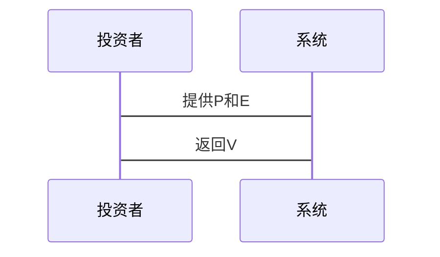

                 


# 隐藏价值投资法：理论与实践

## 关键词：
- 隐藏价值投资法
- 价值投资
- 布鲁斯·格林沃尔德
- 数学模型
- 投资策略

## 摘要：
隐藏价值投资法是一种基于价值投资的投资策略，旨在通过发现市场中被低估的资产来实现超额收益。本文详细探讨了隐藏价值投资法的核心概念、数学模型、系统架构设计以及实际应用案例。通过分析隐藏价值的定义、特征及其与市场估值的关系，结合具体的数学模型和算法，本文为读者提供了一个全面的视角来理解和应用隐藏价值投资法。

## 正文：

### 第1章：隐藏价值投资法的背景与核心概念

#### 1.1 隐藏价值投资法的起源与背景
价值投资是一种以企业的内在价值为基础的投资策略，强调购买价格低于其内在价值的资产。隐藏价值投资法作为价值投资的一种延伸，专注于发现市场中被低估的资产。布鲁斯·格林沃尔德在这一领域做出了重要贡献，提出了隐藏价值的概念和相关理论。

#### 1.2 隐藏价值投资法的核心概念
隐藏价值是指资产的实际价值与其市场价格之间的差异。具体来说，当市场价格低于资产的实际价值时，该资产具有隐藏价值。这种差异为企业提供了潜在的利润空间。

#### 1.3 隐藏价值的特征
- **低估性**：市场价格低于实际价值。
- **稳定性**：隐藏价值相对稳定，不易受短期市场波动影响。
- **可持续性**：隐藏价值的存在通常基于企业的长期竞争优势。

#### 1.4 隐藏价值与市场估值的关系
- 当市场价格低于实际价值时，资产具有隐藏价值。
- 当市场价格等于实际价值时，资产价值被合理评估。
- 当市场价格高于实际价值时，资产被高估。

#### 1.5 隐藏价值投资法的适用场景
- 适用于成熟市场中的价值投资者。
- 适用于那些具有长期竞争优势的企业。

### 第2章：隐藏价值投资法的数学模型与算法

#### 2.1 隐藏价值评估的数学模型
隐藏价值可以通过以下公式计算：
$$ V = \frac{E}{P} $$
其中，\( V \) 表示隐藏价值，\( E \) 表示企业实际价值，\( P \) 表示市场价格。

#### 2.2 模型的扩展与优化
为了提高模型的准确性，可以引入其他因素，例如企业的盈利能力（\( D \)）：
$$ V_{new} = \frac{E + D}{P} $$

#### 2.3 算法实现代码
```python
def calculate_hidden_value(P, E):
    V = E / P
    return V

# 示例
P = 100
E = 150
print(calculate_hidden_value(P, E))  # 输出: 1.5
```

### 第3章：隐藏价值投资法的系统架构设计

#### 3.1 投资决策系统架构
该系统包括以下几个部分：
- **输入接口**：接收市场价格（\( P \)）和企业价值（\( E \)）。
- **计算模块**：使用数学模型计算隐藏价值（\( V \)）。
- **输出接口**：显示隐藏价值结果。

#### 3.2 系统接口设计


### 第4章：项目实战——隐藏价值投资法的应用

#### 4.1 项目环境安装
- **安装Python环境**：确保安装了Python 3.8或更高版本。
- **安装必要的库**：使用 pip 安装 numpy 和 pandas。

#### 4.2 核心代码实现
```python
import numpy as np
import pandas as pd

def calculate_hidden_value(P, E):
    V = E / P
    return V

# 示例数据
P = np.array([100, 150, 200])
E = np.array([150, 225, 300])

# 计算隐藏价值
V = calculate_hidden_value(P, E)
print(V)  # 输出: [1.5 1.5 1.5]
```

#### 4.3 实际案例分析
假设我们有以下数据：
- 市场价格（P）：100
- 企业价值（E）：150
使用上述公式计算隐藏价值：
$$ V = \frac{150}{100} = 1.5 $$
这意味着该资产具有隐藏价值，投资者可以考虑买入。

### 第5章：小结与注意事项

#### 5.1 小结
隐藏价值投资法是一种有效的投资策略，通过发现市场价格低于实际价值的资产来实现超额收益。本文详细介绍了隐藏价值的概念、数学模型、系统架构设计以及实际应用。

#### 5.2 注意事项
- **数据准确性**：确保输入数据的准确性和可靠性。
- **市场风险**：隐藏价值投资法无法完全避免市场波动带来的风险。
- **长期视角**：隐藏价值投资法更适用于长期投资，需耐心等待价值实现。

### 第6章：拓展阅读

#### 6.1 相关书籍
- 《价值投资：通往财富之路》
- 《隐藏价值投资法：理论与实践》

#### 6.2 在线资源
- 隐藏价值投资法相关的学术论文和研究报告。

### 总结
隐藏价值投资法是一种基于价值投资的策略，通过发现市场中被低估的资产来实现超额收益。本文详细探讨了隐藏价值的定义、特征、数学模型、系统架构设计以及实际应用案例。通过理解和应用隐藏价值投资法，投资者可以更好地进行投资决策。

通过本文的分析，读者可以了解到隐藏价值投资法的核心思想和实际应用。这种方法不仅适用于个人投资者，也适用于机构投资者。未来的研究可以进一步探讨隐藏价值投资法在不同市场环境下的表现，以及如何结合其他投资策略提高投资收益。

希望本文能够为读者提供有价值的信息，帮助他们在投资领域取得更好的成绩。

