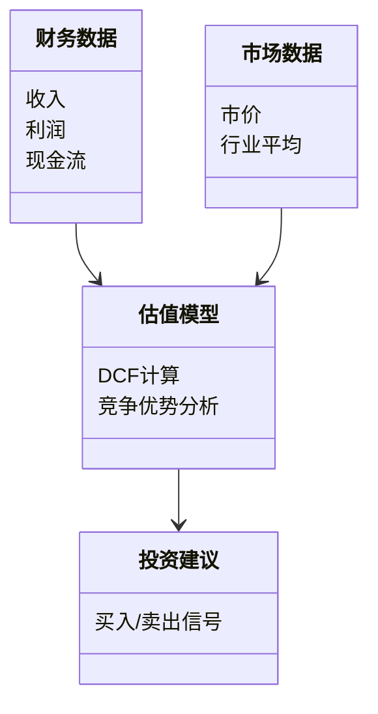

                 


# 布鲁斯·格林沃尔德的隐藏价值投资策略

> 关键词：隐藏价值、投资策略、价值投资、企业估值、数学模型

> 摘要：本文深入分析了布鲁斯·格林沃尔德的隐藏价值投资策略，从其核心概念、识别方法、评估模型到系统架构与实战案例，结合技术语言和专业分析，帮助读者全面理解这一投资策略的精髓。

---

# 第1章: 隐藏价值投资的背景与核心理念

## 1.1 价值投资的基本概念

价值投资是一种以低于内在价值的价格购买优质资产的投资策略。其核心在于识别市场定价偏差，寻找被低估的投资标的。

$$\text{内在价值} = \frac{\text{现金流}}{\text{折现率}}$$

### 1.1.1 价值投资的基本概念
- **内在价值**：资产的真实价值，与市场价格可能不同。
- **市场价格**：由市场供需决定，可能偏离内在价值。
- **安全边际**：买入价格与内在价值的差距，提供风险缓冲。

### 1.1.2 格林沃尔德的学术贡献
格林沃尔德通过研究市场无效性，提出了隐藏价值的概念，强调在市场价格与内在价值之间寻找投资机会。

## 1.2 隐藏价值的定义与特征

隐藏价值是指企业的真实价值未被市场充分认知的部分，通常表现为市场价格低于内在价值。

### 1.2.1 隐藏价值的定义
- **核心要素**：企业未来现金流的折现值高于当前市场价格。
- **主要特征**：竞争优势明显，但市场认知不足。

### 1.2.2 隐藏价值的识别
- **方法**：通过基本面分析和量化模型发现市场定价偏差。

## 1.3 隐藏价值投资的背景与现状

### 1.3.1 当前市场环境对隐藏价值的影响
- **市场波动**：提供隐藏价值被发现的机会。
- **信息不对称**：部分投资者能够提前发现隐藏价值。

### 1.3.2 隐藏价值投资的现状与趋势
- **技术驱动**：大数据和AI在发现隐藏价值中的应用。

---

# 第2章: 隐藏价值的识别与评估

## 2.1 隐藏价值的识别方法

### 2.1.1 市场定价偏差的识别
- **相对估值法**：对比市盈率、市净率等指标。
- **DCF模型**：通过现金流折现计算内在价值。

### 2.1.2 企业基本面分析
- **财务指标**：ROE、ROA、净利率等。
- **竞争优势分析**：成本优势、品牌壁垒。

### 2.1.3 行业竞争结构分析
- **五力模型**：波特的行业竞争分析框架。

## 2.2 隐藏价值的评估模型

### 2.2.1 市净率与市盈率分析
- **市净率公式**：$P/B = \text{股价}/\text{每股净资产}$。
- **市盈率公式**：$P/E = \text{股价}/\text{每股收益}$。

### 2.2.2 现金流折现模型（DCF）

$$\text{DCF} = \frac{\text{CF}}{(r - g)}$$

其中，CF为现金流，r为折现率，g为增长率。

### 2.2.3 企业价值公式与应用
$$\text{企业价值} = \text{息税折旧及摊销前利润} \times \text{EV/EBITDA倍数}$$

## 2.3 隐藏价值的量化评估

### 2.3.1 估值指标的计算与对比
- **对比表格**：列出企业与行业平均的估值指标。

### 2.3.2 企业隐含价值的计算公式
$$\text{隐含价值} = \text{当前股价} \times \text{潜在增长率}$$

### 2.3.3 估值误差的分析与调整
- **误差来源**：市场情绪、短期波动。

---

# 第3章: 隐藏价值投资的核心算法与数学模型

## 3.1 隐藏价值评估的数学模型

### 3.1.1 DCF模型的数学推导

$$\text{DCF} = \frac{\text{CF}_1}{(1+r)^1} + \frac{\text{CF}_2}{(1+r)^2} + \cdots + \frac{\text{CF}_n}{(1+r)^n}$$

### 3.1.2 竞争优势分析的数学模型

$$\text{竞争优势} = \frac{\text{市场份额} \times \text{利润率}}{\text{行业平均利润率}}$$

## 3.2 隐藏价值投资的算法实现

### 3.2.1 Python代码实现DCF模型

```python
def calculate_dcf(cash_flows, discount_rate, terminal_value):
    dcf = 0
    for i in range(len(cash_flows)):
        dcf += cash_flows[i] / (1 + discount_rate) ** i
    return dcf
```

### 3.2.2 竞争优势分析的算法实现

```python
def calculate_competitive_advantage(share, margin, industry_margin):
    return (share * margin) / industry_margin
```

---

# 第4章: 系统分析与架构设计方案

## 4.1 问题场景介绍

### 4.1.1 投资决策系统的需求分析
- **目标**：识别隐藏价值。
- **输入**：财务数据、市场数据。
- **输出**：投资建议。

## 4.2 系统功能设计

### 4.2.1 领域模型设计（Mermaid类图）



## 4.3 系统架构设计

### 4.3.1 系统架构图（Mermaid架构图）


---

# 第5章: 项目实战与案例分析

## 5.1 环境安装

### 5.1.1 安装Python和相关库

```bash
pip install numpy pandas matplotlib
```

## 5.2 核心实现

### 5.2.1 DCF模型实现

```python
import numpy as np

def calculate_dcf(cash_flows, discount_rate, terminal_value, num_years):
    dcf = 0
    for i in range(num_years):
        dcf += cash_flows[i] / (1 + discount_rate) ** i
    dcf += terminal_value / (1 + discount_rate) ** num_years
    return dcf
```

## 5.3 案例分析

### 5.3.1 某公司隐藏价值分析

- **数据收集**：收入、利润、现金流。
- **分析步骤**：计算DCF，对比市盈率。

---

# 第6章: 最佳实践与总结

## 6.1 投资策略的注意事项

### 6.1.1 风险管理
- **分散投资**：降低单一投资风险。
- **持续监控**：市场变化及时调整。

## 6.2 项目小结

隐藏价值投资需要结合理论与实践，通过数学模型和系统化方法提高投资效率。

## 6.3 拓展阅读

建议阅读格林沃尔德的《价值投资的秘密》深入理解隐藏价值策略。

---

# 附录: 参考文献与工具

## 附录A: 参考文献

- 格林沃尔德的学术论文。
- 价值投资经典书籍。

## 附录B: 工具推荐

- Python编程语言。
- Pandas和NumPy数据处理库。

---

以上是《布鲁斯·格林沃尔德的隐藏价值投资策略》的技术博客文章大纲和内容框架，确保文章逻辑清晰，内容详实，结合技术语言和专业分析，帮助读者全面理解这一投资策略的精髓。

