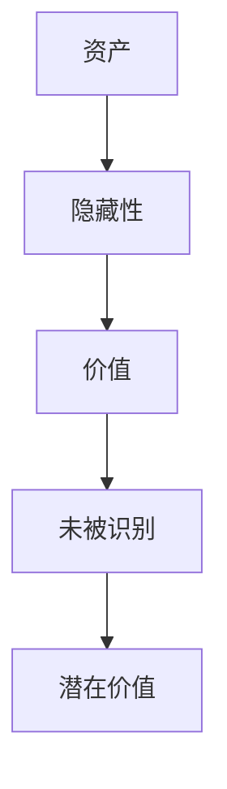
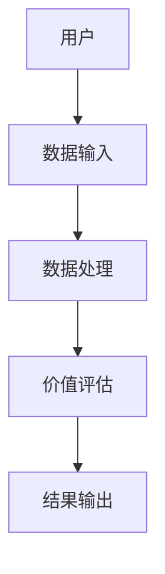

                 


# 布鲁斯·贝克威斯的隐藏资产价值发掘

## 关键词：隐藏资产、价值评估、数据挖掘、算法原理、系统架构

## 摘要：  
隐藏资产是指那些未被充分识别或评估的资源，它们可能存在于企业内部或外部环境中，具有潜在的高价值。本文将深入探讨隐藏资产的定义、特征、发现方法及价值评估策略。通过分析布鲁斯·贝克威斯的方法，结合数据挖掘和机器学习算法，系统性地揭示隐藏资产的价值，并提供实际案例分析，帮助读者更好地理解和应用这些方法。

---

# 第一部分：隐藏资产的定义与背景

## 第1章：隐藏资产的定义与背景

### 1.1 隐藏资产的概念与背景  
隐藏资产是指那些未被企业或组织正式记录、识别或充分利用的资源。这些资产可能包括数据、知识、技术、客户关系等无形资产，也可能是未被充分利用的有形资产。隐藏资产的存在往往被忽视，但它们的价值可能远超表面所见。

#### 1.1.1 隐藏资产的定义  
- 隐藏资产是未被正式识别或记录的资产。  
- 它们可能存在于企业内部或外部环境中。  
- 隐藏资产具有潜在的高价值，但未被充分挖掘。  

#### 1.1.2 隐藏资产的背景与现状  
- 随着数字化转型的推进，数据成为企业的重要资产。  
- 隐藏资产的发现需要结合数据分析和专业知识。  
- 许多企业尚未意识到隐藏资产的价值，导致资源浪费。  

#### 1.1.3 隐藏资产的价值与意义  
- 隐藏资产能够为企业创造额外价值。  
- 发现隐藏资产有助于优化资源配置。  
- 隐藏资产的挖掘是企业竞争力的重要来源。  

---

### 1.2 隐藏资产的核心概念  

#### 1.2.1 核心概念的背景  
- 隐藏资产的发现依赖于数据挖掘和分析技术。  
- 需要结合企业的实际业务场景。  

#### 1.2.2 核心概念的属性特征对比  
下表展示了隐藏资产与非隐藏资产的关键区别：  

| 属性 | 隐藏资产 | 非隐藏资产 |
|------|----------|------------|
| 可见性 | 难以发现 | 易于识别    |
| 价值 | 高       | 中或低     |
| 利用程度 | 低      | 高         |
| 管理 | 缺乏系统性 | 系统化      |

#### 1.2.3 隐藏资产的实体关系图  
通过Mermaid图展示隐藏资产的实体关系：  


---

### 1.3 隐藏资产的价值评估  

#### 1.3.1 隐藏资产的评估方法  
- 定性评估：通过专家判断和业务分析进行评估。  
- 定量评估：利用数据分析技术量化资产价值。  

#### 1.3.2 隐藏资产的评估模型  
- 简单线性模型：  
  $$ \text{资产价值} = a \cdot \text{可见性} + b \cdot \text{潜在价值} $$  
- 加权模型：综合考虑多个因素，例如：  
  $$ \text{资产价值} = \sum_{i=1}^{n} w_i \cdot x_i $$  

#### 1.3.3 隐藏资产的评估挑战  
- 数据不足：难以获取足够的数据支持评估。  
- 模型选择：需要根据具体情况选择合适的评估方法。  
- 实施难度：需要结合企业的实际业务场景。  

---

### 1.4 隐藏资产的发现与识别  

#### 1.4.1 隐藏资产的发现过程  
- 数据收集：通过多种渠道获取相关数据。  
- 数据清洗：去除噪声数据，确保数据质量。  
- 数据分析：利用数据分析技术发现隐藏资产。  

#### 1.4.2 隐藏资产的识别方法  
- 基于数据挖掘的识别：使用聚类分析、分类算法等技术。  
- 基于专家判断的识别：结合领域知识进行识别。  

#### 1.4.3 隐藏资产的识别工具与技术  
- 数据挖掘工具：Python的scikit-learn、TensorFlow。  
- 可视化工具：Tableau、Power BI。  

---

## 1.5 本章小结  
本章详细介绍了隐藏资产的定义、背景、核心概念及其价值评估方法。通过对比分析，明确了隐藏资产与非隐藏资产的区别，并提出了初步的评估模型和识别方法。

---

# 第二部分：隐藏资产价值发掘的算法原理

## 第2章：数据挖掘与隐藏资产发现  

### 2.1 数据挖掘的基本概念  

#### 2.1.1 数据挖掘的定义  
数据挖掘是从大量数据中提取隐含信息的过程。  

#### 2.1.2 数据挖掘的核心技术  
- 聚类分析：将数据分成相似的组别。  
- 分类算法：根据特征预测类别。  
- 关联规则挖掘：发现数据中的关联性。  

#### 2.1.3 数据挖掘的应用领域  
- 金融：欺诈检测。  
- 零售：客户行为分析。  

---

### 2.2 隐藏资产发现的算法原理  

#### 2.2.1 数据预处理  
- 数据清洗：去除噪声数据。  
- 数据转换：将数据转换为适合算法的形式。  

#### 2.2.2 数据特征提取  
- 提取关键特征：如客户行为特征、产品特征。  
- 使用主成分分析（PCA）减少维度。  

#### 2.2.3 数据特征提取的代码示例  
```python
import numpy as np
from sklearn.decomposition import PCA

# 示例数据
X = np.array([[2.5, 2.4],
              [4.2, 5.5],
              [1.8, 1.6],
              [6.7, 7.0]])

# PCA降维
pca = PCA(n_components=1)
principal_components = pca.fit_transform(X)

print(principal_components)
```

---

### 2.3 隐藏资产发现的数学模型  

#### 2.3.1 数据挖掘的数学模型  
- 聚类分析模型：  
  $$ x_i \sim N(\mu, \sigma^2) $$  
- 分类算法模型：  
  $$ y = \sum_{i=1}^{n} w_i x_i + b $$  

#### 2.3.2 隐藏资产发现的公式推导  
通过K-means算法实现聚类：  
$$ \text{目标函数} = \sum_{i=1}^{k} \sum_{j=1}^{n_i} ||x_j - c_i||^2 $$  

---

### 2.4 隐藏资产发现的算法实现  

#### 2.4.1 算法实现的步骤  
1. 数据预处理。  
2. 选择合适的算法（如K-means）。  
3. 训练模型并进行预测。  
4. 可视化结果。  

#### 2.4.2 算法实现的代码示例  
```python
from sklearn.cluster import KMeans

# 示例数据
X = np.array([[2.5, 2.4],
              [4.2, 5.5],
              [1.8, 1.6],
              [6.7, 7.0]])

# K-means聚类
kmeans = KMeans(n_clusters=2, random_state=0)
kmeans.fit(X)

print("聚类中心：", kmeans.cluster_centers_)
print("聚类结果：", kmeans.labels_)
```

---

## 2.5 本章小结  
本章通过数据挖掘技术，详细讲解了隐藏资产发现的算法原理，包括数据预处理、特征提取、聚类分析等步骤，并通过代码示例展示了如何实现这些算法。

---

# 第三部分：隐藏资产价值发掘的系统架构设计

## 第3章：系统架构与功能设计  

### 3.1 系统架构设计  

#### 3.1.1 系统架构的概述  
- 采用分层架构：数据采集层、处理层、应用层。  

#### 3.1.2 系统架构的组成部分  
- 数据采集模块：负责采集隐藏资产数据。  
- 数据处理模块：对数据进行清洗、转换和分析。  
- 应用模块：输出分析结果并提供决策支持。  

#### 3.1.3 系统架构的优缺点  
- 优点：模块化设计，易于扩展。  
- 缺点：初期开发成本较高。  

---

### 3.2 系统功能设计  

#### 3.2.1 系统功能模块划分  
- 数据采集模块：数据输入接口。  
- 数据处理模块：数据清洗、特征提取。  
- 数据分析模块：聚类分析、分类分析。  
- 结果展示模块：可视化结果输出。  

#### 3.2.2 系统功能模块的交互设计  
- 用户输入数据。  
- 系统处理数据并进行分析。  
- 系统输出分析结果。  

#### 3.2.3 系统功能模块的实现细节  
- 数据采集模块：支持多种数据格式。  
- 数据处理模块：集成多种数据处理工具。  
- 数据分析模块：支持多种算法模型。  

---

### 3.3 系统架构的Mermaid图  

#### 3.3.1 系统架构图  


---

### 3.4 系统接口设计  

#### 3.4.1 系统接口的定义  
- 数据输入接口：支持CSV、Excel格式。  
- 数据输出接口：支持JSON、XML格式。  

#### 3.4.2 系统接口的实现  
- 使用RESTful API实现接口通信。  
- 接口文档：详细说明接口参数和返回结果。  

---

## 3.5 本章小结  
本章详细设计了隐藏资产价值发掘系统的架构，包括模块划分、交互流程和系统接口设计，并通过Mermaid图展示了系统的整体架构。

---

# 第四部分：隐藏资产价值发掘的项目实战

## 第4章：项目实战与案例分析  

### 4.1 项目背景与目标  

#### 4.1.1 项目背景  
- 某企业希望通过数据分析发现隐藏资产。  

#### 4.1.2 项目目标  
- 发现企业内部隐藏资产。  
- 评估隐藏资产的价值。  

---

### 4.2 项目环境与工具  

#### 4.2.1 环境安装  
- 操作系统：Windows 10或更高版本。  
- Python：3.8及以上版本。  
- 数据分析工具：P

