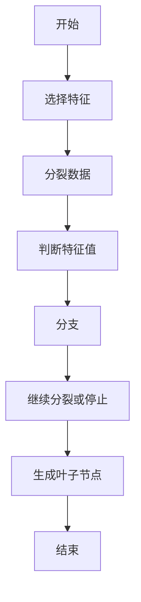
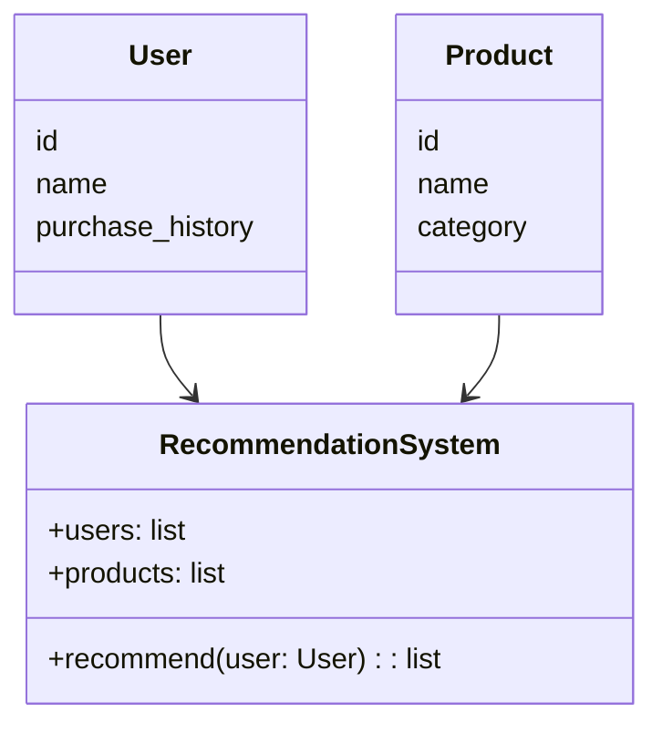
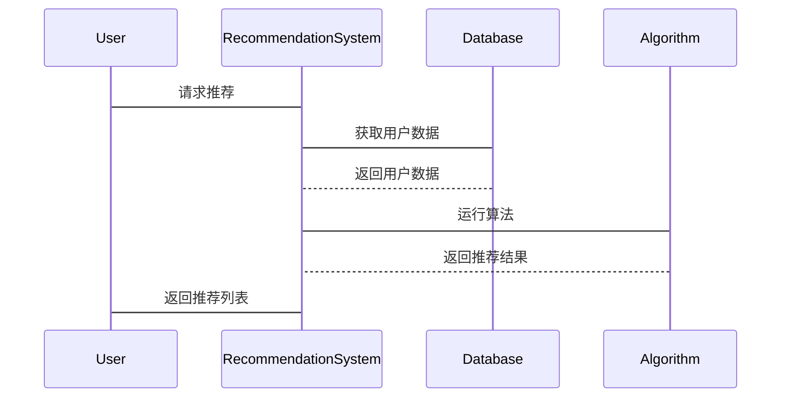

                 


# 常见挑战与解决方案

## 关键词：
- 技术挑战
- 解决方案
- 问题分析
- 算法原理
- 系统设计
- 项目实战

## 摘要：
在技术领域，我们经常会遇到各种复杂的挑战。本文将系统地分析这些常见挑战，探讨其本质，并提供切实可行的解决方案。通过结合理论分析、算法原理、系统设计和项目实战，本文旨在帮助读者深入了解问题，掌握解决问题的方法和技巧。

---

## 正文：

### 第一部分：背景介绍

#### 第1章：问题背景

##### 1.1 问题的来源
在技术领域，挑战的来源多种多样。它们可能来自于技术本身的局限性，也可能来自于外部环境的变化。例如，随着技术的进步，旧有的系统可能无法满足新的需求，或者新的问题（如数据量的激增）可能超出现有解决方案的处理能力。

##### 1.2 问题的影响
这些问题可能会导致系统性能下降、用户体验变差，甚至引发严重的业务问题。例如，数据处理延迟可能导致用户流失，或者系统崩溃可能导致业务中断。

##### 1.3 解决问题的意义
解决这些挑战不仅能够提升系统的性能和用户体验，还能为企业创造更大的价值。通过解决问题，我们可以优化资源利用，提高效率，并为未来的创新打下坚实的基础。

---

### 第二部分：核心概念与联系

#### 第2章：核心概念与联系

##### 2.1 核心概念
- **挑战**：指在技术或业务过程中遇到的困难或障碍。
- **解决方案**：指为克服这些困难而采取的具体方法或策略。

##### 2.2 概念属性对比
| 属性       | 挑战                   | 解决方案                 |
|------------|------------------------|--------------------------|
| 目标       | 导致问题               | 解决问题                 |
| 方法       | 识别问题               | 提供具体策略             |
| 结果       | 系统性能下降           | 系统性能提升             |

##### 2.3 ER图展示
```mermaid
erd
    title 挑战与解决方案的关系
    challenge Challenger
    solution Solution
    Challenger --> Solution
```

---

### 第三部分：算法原理讲解

#### 第3章：算法原理

##### 3.1 选择算法
以决策树算法为例，它是一种常用的分类算法，适用于解决分类问题。

##### 3.2 算法流程图


##### 3.3 数学公式
决策树的分裂标准之一是信息增益，公式如下：
$$ \text{信息增益} = \text{熵}(S) - \sum \text{权重} \times \text{熵}(S_i) $$

##### 3.4 代码实现
```python
class DecisionTree:
    def __init__(self):
        self.tree = {}

    def fit(self, data, labels):
        # 构建决策树
        pass

    def predict(self, data):
        # 预测
        pass
```

---

### 第四部分：系统分析与架构设计

#### 第4章：系统分析与架构设计

##### 4.1 问题场景
假设我们有一个电商系统，面临用户推荐的问题。

##### 4.2 系统功能设计


##### 4.3 系统架构设计


##### 4.4 接口设计
- **输入接口**：用户信息、产品信息
- **输出接口**：推荐列表

##### 4.5 交互流程


---

### 第五部分：项目实战

#### 第5章：项目实战

##### 5.1 环境安装
- 安装Python和必要的库（如scikit-learn）

##### 5.2 核心代码实现
```python
from sklearn.tree import DecisionTreeClassifier

# 数据预处理
data = ...  # 输入数据
labels = ...  # 输入标签

# 训练模型
model = DecisionTreeClassifier()
model.fit(data, labels)

# 预测
predictions = model.predict(new_data)
```

##### 5.3 案例分析
以电商推荐系统为例，通过数据预处理、模型训练和预测，生成用户推荐列表。

##### 5.4 项目小结
通过本项目，我们学会了如何利用决策树算法解决实际问题，并掌握了从数据预处理到模型部署的全过程。

---

### 第六部分：总结与最佳实践

#### 第6章：总结

##### 6.1 最佳实践
- 明确问题目标
- 选择合适的算法
- 重视数据预处理
- 持续优化模型

##### 6.2 注意事项
- 确保数据质量
- 避免过拟合
- 定期监控系统性能

##### 6.3 拓展阅读
- 探索其他机器学习算法
- 学习系统架构设计

---

通过以上内容，我们系统地分析了常见挑战，并提供了具体的解决方案。希望读者能够从中受益，并在实际工作中应用这些方法和技巧。

