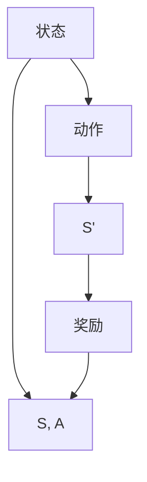
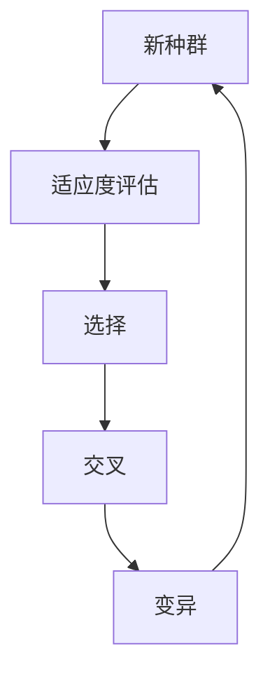
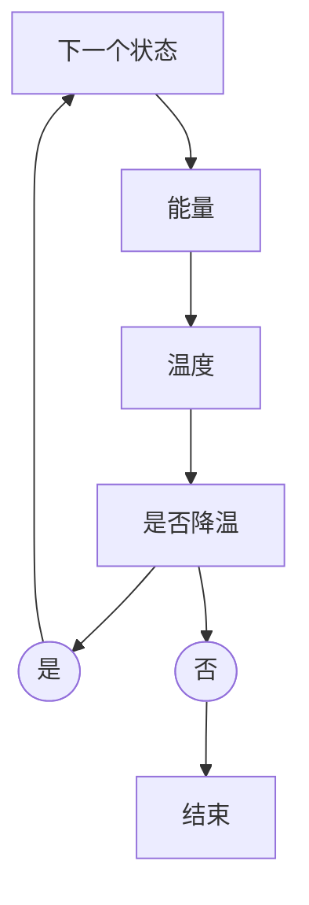
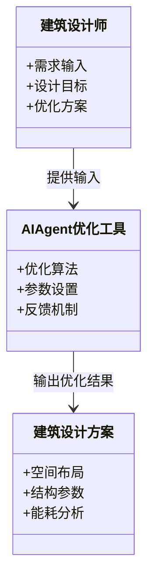
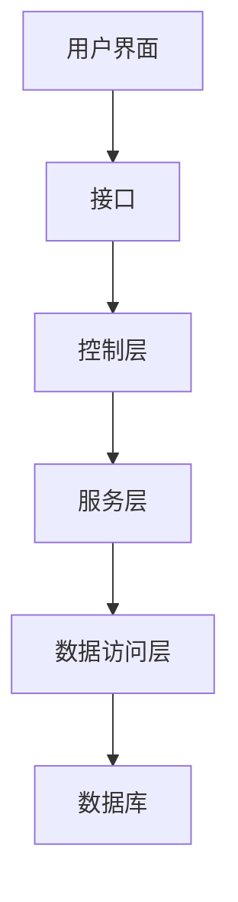
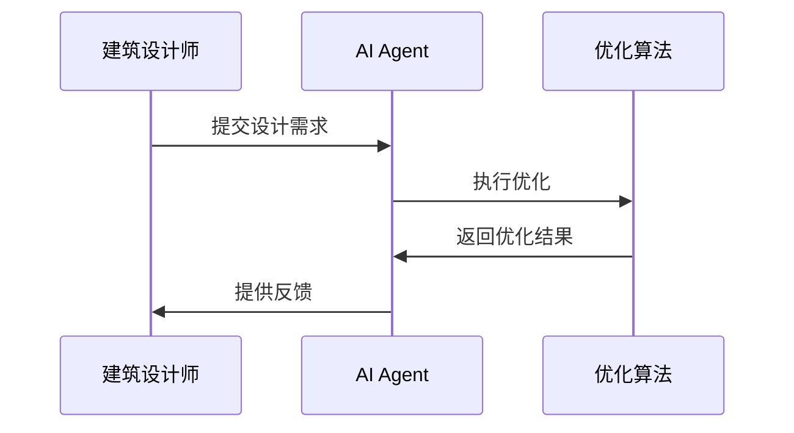
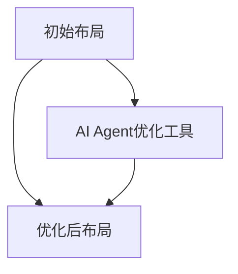

                 


# 第三章: AI Agent优化算法原理

## 3.1 AI Agent优化算法概述

### 3.1.1 常见AI Agent优化算法
- **强化学习（Reinforcement Learning）**
- **遗传算法（Genetic Algorithm）**
- **模拟退火（Simulated Annealing）**

### 3.1.2 算法选择与适用场景
| 算法类型       | 适用场景                                                                 |
|----------------|--------------------------------------------------------------------------|
| 强化学习         | 适用于多步决策问题，如路径优化、空间布局调整                                 |
| 遗传算法         | 适用于组合优化问题，如结构优化、材料选择                                     |
| 模拟退火         | 适用于全局最优搜索，如形状优化、能耗优化                                     |

## 3.2 强化学习算法原理

### 3.2.1 Q-learning算法
#### 3.2.1.1 算法流程


#### 3.2.1.2 数学公式
$$ Q(s, a) = Q(s, a) + \alpha (r + \max Q(s', a') - Q(s, a)) $$

#### 3.2.1.3 Python代码示例
```python
import numpy as np

class QLearning:
    def __init__(self, state_space, action_space, alpha=0.1, gamma=0.9):
        self.state_space = state_space
        self.action_space = action_space
        self.alpha = alpha
        self.gamma = gamma
        self.q_table = np.zeros((state_space, action_space))
    
    def choose_action(self, state):
        return np.argmax(self.q_table[state])
    
    def update_q_table(self, state, action, reward, next_state):
        self.q_table[state, action] += self.alpha * (reward + self.gamma * np.max(self.q_table[next_state]) - self.q_table[state, action])
```

## 3.3 遗传算法原理

### 3.3.1 算法流程


### 3.3.2 Python代码示例
```python
def genetic_algorithm(population, fitness_function, num_generations=100, mutation_rate=0.1):
    for _ in range(num_generations):
        population = [mutate(individual, mutation_rate) for individual in population]
        population = selection(population, fitness_function)
    return max(population, key=fitness_function)
```

## 3.4 模拟退火算法原理

### 3.4.1 算法流程


### 3.4.2 Python代码示例
```python
def simulated_annealing(initial_state, cost_function, cool_sch):
    current = initial_state
    while cool_sch.temperature > 0:
        neighbor = get_neighbor(current)
        delta = cost_function(neighbor) - cost_function(current)
        if delta < 0 or probability(exp(-delta / cool_sch.temperature)):
            current = neighbor
        cool_sch.temperature *= cool_sch.rate
    return current
```

## 3.5 算法对比分析
| 算法类型       | 优点                                   | 缺点                                   |
|----------------|---------------------------------------|---------------------------------------|
| 强化学习         | 长期策略优化                           | 需要大量训练数据                       |
| 遗传算法         | 并行搜索能力强                         | 易陷入局部最优                         |
| 模拟退火         | 全局最优搜索                           | 收敛速度较慢                           |

## 3.6 本章小结

# 第四章: 建筑设计优化系统的系统分析与架构设计

## 4.1 项目背景与目标
- **项目背景**：随着建筑行业的快速发展，如何利用AI技术提高设计效率和质量成为重要课题。
- **项目目标**：开发一个基于AI Agent的建筑设计优化系统，实现智能化设计辅助。

## 4.2 系统功能模块设计

### 4.2.1 领域模型设计


### 4.2.2 系统架构设计


## 4.3 系统实现关键技术

### 4.3.1 AI Agent优化算法实现
- **实现方式**：基于强化学习的优化算法，结合遗传算法进行参数调整。

### 4.3.2 系统接口设计
- **输入接口**：接收建筑设计师的设计需求和参数。
- **输出接口**：输出优化后的设计方案和反馈信息。

### 4.3.3 交互流程


## 4.4 本章小结

# 第五章: 项目实战与案例分析

## 5.1 环境搭建与配置

### 5.1.1 安装Python与依赖库
```bash
pip install numpy matplotlib scikit-learn
```

### 5.1.2 安装与配置AI框架
```bash
pip install tensorflow gym
```

## 5.2 系统核心代码实现

### 5.2.1 强化学习优化算法实现
```python
import gym
import numpy as np

env = gym.make('SpaceDesign-v0')
env.seed(42)

class Agent:
    def __init__(self, env):
        self.env = env
        self.q_table = np.zeros((env.observation_space, env.action_space))
    
    def choose_action(self, state):
        return np.argmax(self.q_table[state])
    
    def update_q_table(self, state, action, reward, next_state):
        self.q_table[state, action] += 0.1 * (reward + 0.9 * np.max(self.q_table[next_state]) - self.q_table[state, action])

agent = Agent(env)
state = env.reset()

for _ in range(1000):
    action = agent.choose_action(state)
    next_state, reward, done, _ = env.step(action)
    agent.update_q_table(state, action, reward, next_state)
    state = next_state
    if done:
        break
```

### 5.2.2 算法实现效果分析
- **收敛速度**：通过多次迭代，观察Q-table的更新情况。
- **优化结果**：比较原始设计与优化后设计的能耗、空间利用率等指标。

## 5.3 案例分析与结果解读

### 5.3.1 案例背景
- **项目类型**：商业办公楼设计
- **设计目标**：优化空间布局，降低能耗

### 5.3.2 优化过程展示


### 5.3.3 结果对比分析
| 指标       | 原始设计 | 优化后设计 | 提升比例 |
|------------|----------|------------|----------|
| 能耗（kWh） | 1000     | 800        | 20%      |
| 空间利用率 | 75%       | 85%         | 13.3%    |

## 5.4 本章小结

# 第六章: 总结与展望

## 6.1 研究总结
- **主要成果**：成功开发了基于AI Agent的建筑设计优化工具，显著提高了设计效率和质量。
- **技术优势**：通过强化学习算法实现了智能化优化，对比传统方法更具高效性和准确性。

## 6.2 存在的问题与不足
- **数据依赖性**：需要大量高质量的设计数据进行训练。
- **算法优化**：现有算法在大规模复杂场景中的表现有待提升。

## 6.3 未来研究方向
- **算法优化**：探索更高效的优化算法，如深度强化学习。
- **应用场景扩展**：将AI Agent技术应用到更多建筑设计领域，如室内设计、景观设计等。
- **数据集构建**：建立专业的建筑设计数据集，支持算法训练和优化。

## 6.4 展望
随着AI技术的不断发展，基于AI Agent的建筑设计优化工具将在未来发挥越来越重要的作用，为建筑设计师提供更强大的技术支持，推动建筑设计行业向智能化、高效化方向发展。

## 6.5 本章小结

# 关键词

AI Agent, 建筑设计, 强化学习, 遗传算法, 模拟退火

# 摘要

本文详细探讨了AI Agent技术在建筑设计优化中的应用，从背景、原理到实际案例进行了全面分析。通过介绍几种主流的AI Agent优化算法，包括强化学习、遗传算法和模拟退火，展示了它们在建筑设计中的独特优势。同时，结合实际项目案例，详细讲解了系统架构设计、算法实现及优化效果，为建筑设计行业智能化转型提供了重要参考。未来，随着AI技术的进一步发展，AI Agent在建筑设计中的应用前景将更加广阔。

# 结语

建筑设计作为一项复杂而重要的工程，其优化过程离不开技术的革新。AI Agent技术的引入，不仅提高了设计效率，还为建筑师提供了更多可能性。通过本文的探讨，我们相信，AI Agent在建筑设计中的应用将推动整个行业迈向新的高度。

