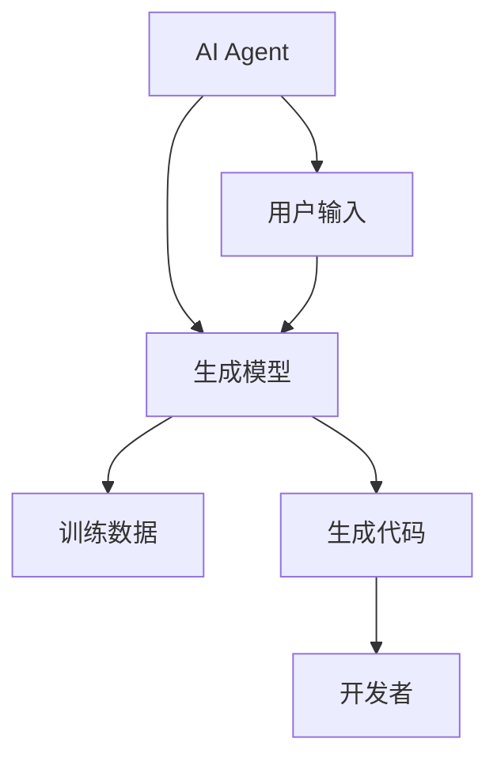
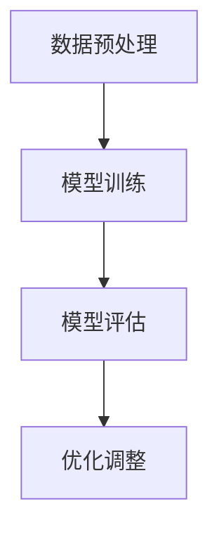
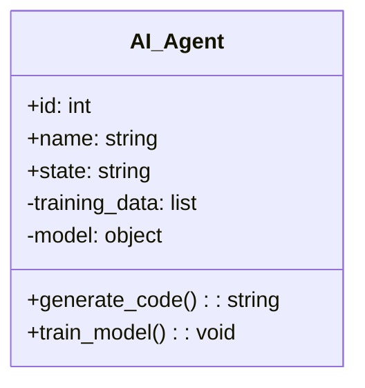
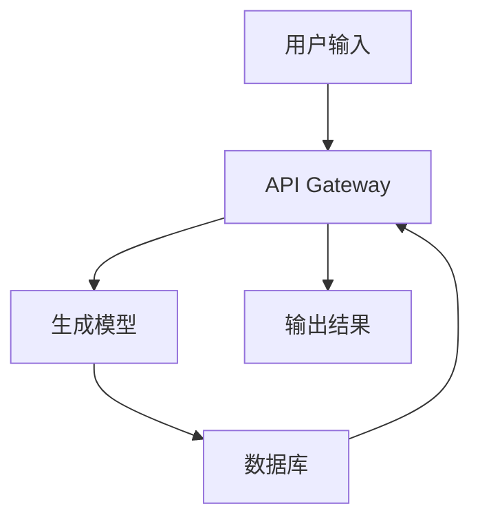
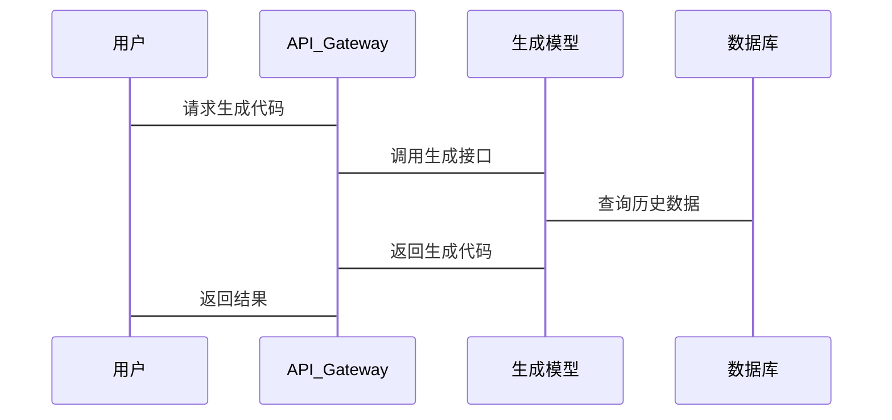

                 

# 《开发AI Agent支持的智能代码生成系统》

## 关键词：
AI Agent, 智能代码生成, 系统架构, 算法原理, 项目实战

## 摘要：
本文将详细探讨如何开发一个基于AI Agent的智能代码生成系统。首先，我们从背景和问题出发，分析传统代码生成工具的局限性，引出AI Agent在其中的作用。接着，我们深入讲解AI Agent与智能代码生成系统的原理和核心概念，包括系统的架构设计和算法实现。随后，通过实际项目案例，展示如何实现一个完整的智能代码生成系统，并分析其应用场景和优化方向。最后，总结开发经验，并提出未来研究的可能方向。

---

## 目录大纲

### 第一部分：背景介绍

#### 第1章：AI Agent与智能代码生成系统概述

##### 1.1 问题背景
- 1.1.1 软件开发的效率问题
- 1.1.2 代码生成工具的局限性
- 1.1.3 引入AI Agent的必要性

##### 1.2 问题描述
- 1.2.1 开发者的需求与痛点
- 1.2.2 传统代码生成工具的不足
- 1.2.3 智能代码生成系统的目标

##### 1.3 问题解决思路
- 1.3.1 AI Agent的核心作用
- 1.3.2 系统的整体架构设计
- 1.3.3 核心功能与优势对比

##### 1.4 系统的边界与外延
- 1.4.1 系统的功能边界
- 1.4.2 系统与外部系统的交互
- 1.4.3 系统的扩展性与可维护性

##### 1.5 概念结构与核心要素
- 1.5.1 系统的核心组成模块
- 1.5.2 各模块之间的关系
- 1.5.3 核心要素的特征与作用

---

### 第二部分：核心概念与联系

#### 第2章：AI Agent与智能代码生成系统的核心概念

##### 2.1 AI Agent的原理与特征
- 2.1.1 AI Agent的基本原理
- 2.1.2 AI Agent的核心特征对比表
- 2.1.3 AI Agent与传统代码生成工具的对比

##### 2.2 智能代码生成系统的原理
- 2.2.1 系统的整体架构
- 2.2.2 系统的核心算法与模型
- 2.2.3 系统的输入输出流程

##### 2.3 AI Agent与代码生成系统的联系
- 2.3.1 AI Agent在代码生成中的作用
- 2.3.2 系统的核心功能与AI Agent的关系
- 2.3.3 代码生成系统的优化方向

##### 2.4 实体关系图（ER图）

---

### 第三部分：算法原理讲解

#### 第3章：生成模型的算法原理

##### 3.1 生成模型的训练流程
- 3.1.1 数据预处理
- 3.1.2 模型训练
- 3.1.3 模型评估与优化

##### 3.2 算法实现
- 3.2.1 基于Transformer的生成模型
- 3.2.2 编码器-解码器结构
- 3.2.3 注意力机制的实现

##### 3.3 算法流程图

##### 3.4 生成模型的数学模型
- 3.4.1 概率分布模型
- 3.4.2 损失函数
- 3.4.3 优化算法

##### 3.5 案例分析
- 3.5.1 示例代码生成过程
- 3.5.2 生成模型的训练实例

---

### 第四部分：系统分析与架构设计

#### 第4章：系统架构设计

##### 4.1 问题场景介绍
- 4.1.1 系统的应用场景
- 4.1.2 系统的用户需求
- 4.1.3 系统的性能要求

##### 4.2 系统功能设计
- 4.2.1 领域模型设计

##### 4.3 系统架构设计

##### 4.4 接口设计与交互流程
- 4.4.1 系统接口设计
- 4.4.2 系统交互流程

---

### 第五部分：项目实战

#### 第5章：智能代码生成系统实现

##### 5.1 环境安装
- 5.1.1 安装Python环境
- 5.1.2 安装依赖库
- 5.1.3 配置开发环境

##### 5.2 系统核心实现
- 5.2.1 AI Agent模块实现
- 5.2.2 生成模型的实现
- 5.2.3 系统接口的实现

##### 5.3 代码实现与解读
- 5.3.1 Python源代码实现
- 5.3.2 代码功能解读
- 5.3.3 系统运行流程

##### 5.4 案例分析与优化
- 5.4.1 实际案例分析
- 5.4.2 系统优化方向
- 5.4.3 开发经验总结

---

### 第六部分：最佳实践与总结

#### 第6章：开发经验总结

##### 6.1 开发过程中的注意事项
- 6.1.1 数据质量的重要性
- 6.1.2 模型优化的技巧
- 6.1.3 系统维护的注意事项

##### 6.2 小结
- 6.2.1 本文的核心内容回顾
- 6.2.2 系统开发的关键点总结

##### 6.3 未来研究方向
- 6.3.1 系统的优化与扩展
- 6.3.2 AI Agent的进一步研究
- 6.3.3 更多应用场景的探索

---

## 附录：拓展阅读

- 附录A：AI Agent的相关论文推荐
- 附录B：智能代码生成系统的开源项目
- 附录C：Python代码生成工具的使用指南

--- 

希望这个目录大纲能满足您的需求！如果需要进一步修改或补充，请随时告诉我！

