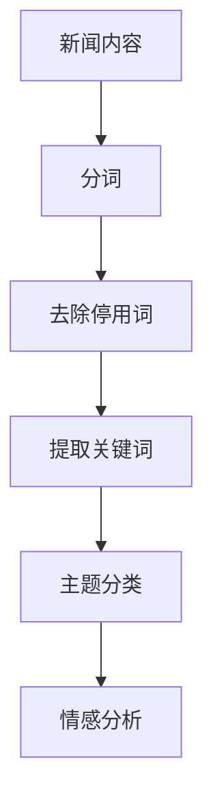
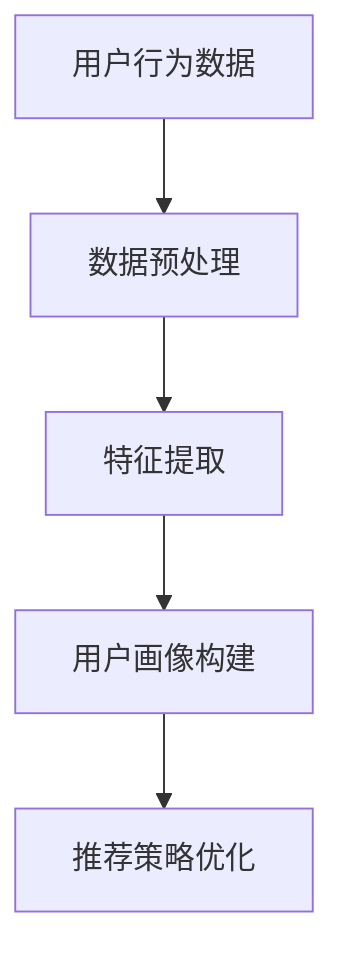
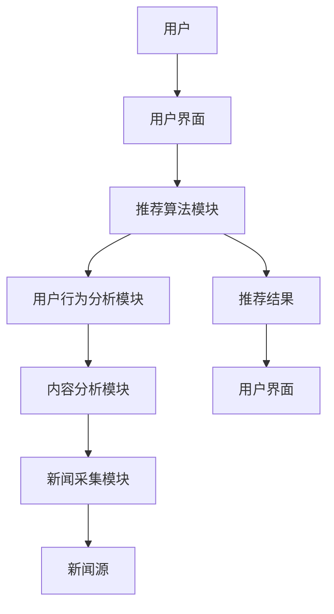

                 


# 开发AI Agent支持的智能新闻聚合系统

> 关键词：AI Agent, 智能新闻聚合, 机器学习, 自然语言处理, 推荐系统, 系统架构

> 摘要：本文详细探讨了开发AI Agent支持的智能新闻聚合系统的各个方面，包括背景分析、核心概念、算法原理、系统架构设计、项目实战以及最佳实践。通过结合AI Agent和新闻聚合技术，本文旨在提供一种高效、智能的新闻信息处理解决方案，解决传统新闻聚合系统中的信息过载和用户需求多样性问题。文章还提供了详细的系统架构图、算法流程图以及代码实现，帮助读者全面理解和掌握该系统的开发与实现。

---

# 第一部分: AI Agent支持的智能新闻聚合系统背景与核心概念

## 第1章: 问题背景与描述

### 1.1 问题背景

#### 1.1.1 当前新闻聚合系统的现状与挑战

新闻聚合系统作为一种信息汇总工具，旨在从多个新闻源中收集、整理和呈现新闻信息，帮助用户快速获取感兴趣的内容。然而，随着互联网的发展，新闻源的数量急剧增加，新闻内容的类型和格式也变得多样化。传统的新闻聚合系统主要依赖于简单的关键词匹配和简单的分类算法，难以满足用户对高质量、个性化新闻的需求。此外，信息过载问题日益严重，用户难以在大量信息中筛选出真正有价值的内容。

#### 1.1.2 AI Agent在新闻聚合中的潜力与优势

AI Agent（人工智能代理）是一种能够感知环境、执行任务并优化决策的智能实体。将AI Agent应用于新闻聚合系统，可以显著提升系统的智能化水平。AI Agent可以通过自然语言处理（NLP）技术分析新闻内容，理解用户需求，并根据用户的偏好动态调整新闻推荐策略。此外，AI Agent还可以实时跟踪新闻源的变化，自动更新聚合内容，从而提高系统的实时性和准确性。

#### 1.1.3 传统新闻聚合系统的主要缺陷

传统新闻聚合系统主要依赖于简单的关键词匹配和分类算法，存在以下缺陷：

1. **内容质量参差不齐**：传统系统无法有效区分新闻的真假和质量，容易引入低质量甚至虚假的新闻内容。
2. **用户个性化需求难以满足**：传统系统缺乏对用户个性化需求的深度分析，推荐的内容往往千篇一律，无法满足用户的多样化需求。
3. **实时性不足**：传统系统更新频率较低，无法实时反映新闻源的最新动态，影响用户体验。
4. **缺乏智能性**：传统系统缺乏智能决策能力，无法根据用户的反馈动态调整推荐策略。

### 1.2 问题描述

#### 1.2.1 用户需求与信息过载问题

用户在使用新闻聚合系统时，通常希望快速获取与自己兴趣相关的内容，同时避免被无关信息干扰。然而，信息过载问题使得用户难以在海量新闻中找到自己真正感兴趣的内容。此外，用户的需求往往是动态变化的，系统需要能够实时捕捉用户需求的变化并做出相应的调整。

#### 1.2.2 新闻来源的多样性和可靠性问题

新闻聚合系统通常需要从多个新闻源中收集信息，包括门户网站、社交媒体、新闻博客等。这些来源的质量参差不齐，部分新闻源可能存在虚假信息或误导性内容。此外，不同新闻源的格式和结构也存在差异，增加了数据处理的复杂性。

#### 1.2.3 现有新闻聚合系统的局限性

现有新闻聚合系统主要依赖于简单的文本匹配和分类算法，难以满足用户对高质量、个性化新闻的需求。此外，系统缺乏智能性，无法根据用户的反馈动态调整推荐策略，推荐内容往往缺乏针对性和深度。

### 1.3 问题解决思路

#### 1.3.1 引入AI Agent的目标与核心任务

引入AI Agent的目的是通过智能化的新闻内容分析和推荐，解决传统新闻聚合系统中存在的信息过载和用户需求多样性问题。AI Agent的核心任务包括：

1. **新闻内容分析与处理**：利用自然语言处理技术对新闻内容进行深度分析，提取关键词、主题和情感倾向等信息。
2. **用户行为分析与建模**：通过分析用户的阅读历史、点击行为和反馈信息，建立用户兴趣模型，动态调整推荐策略。
3. **智能推荐与优化**：基于用户模型和新闻内容分析结果，生成个性化推荐列表，并根据用户反馈不断优化推荐算法。

#### 1.3.2 智能新闻聚合系统的功能定位

智能新闻聚合系统的功能定位是通过AI Agent实现新闻内容的智能分析和个性化推荐。系统不仅能够从多个新闻源中收集和整理新闻信息，还可以根据用户的个性化需求动态调整推荐内容，提供高质量、相关性高的新闻信息。

#### 1.3.3 用户体验优化的方向与策略

用户体验优化的方向与策略包括：

1. **个性化推荐**：基于用户兴趣和行为数据，提供个性化新闻推荐，提升用户体验。
2. **实时更新**：通过AI Agent实时跟踪新闻源的更新，确保推荐内容的时效性。
3. **多模态信息处理**：结合文本、图像、视频等多种信息形式，提供更丰富、更直观的新闻内容。
4. **用户反馈机制**：通过用户反馈不断优化推荐算法，提升推荐的准确性和用户满意度。

### 1.4 系统的边界与外延

#### 1.4.1 系统功能边界

智能新闻聚合系统的核心功能包括：

1. **新闻采集与处理**：从多个新闻源中采集新闻内容，并进行预处理（如去重、格式转换等）。
2. **内容分析与建模**：利用NLP技术对新闻内容进行深度分析，提取关键词、主题和情感倾向等信息。
3. **用户行为分析**：通过分析用户的阅读历史、点击行为和反馈信息，建立用户兴趣模型。
4. **智能推荐**：基于用户模型和新闻内容分析结果，生成个性化推荐列表。
5. **系统优化与维护**：根据用户反馈和系统运行数据，不断优化推荐算法和系统性能。

#### 1.4.2 相关系统与概念的区分

智能新闻聚合系统与传统新闻聚合系统、推荐系统和AI Agent系统的区别主要体现在以下几个方面：

1. **智能化程度**：智能新闻聚合系统通过AI Agent实现智能化的内容分析和推荐，而传统新闻聚合系统主要依赖简单的文本匹配和分类算法。
2. **动态性**：智能新闻聚合系统能够根据用户的实时反馈动态调整推荐策略，而传统系统通常采用静态的推荐策略。
3. **多模态支持**：智能新闻聚合系统支持多种信息形式（如文本、图像、视频等），而传统系统通常仅支持文本形式。

#### 1.4.3 核心要素与组成部分

智能新闻聚合系统的组成要素包括：

1. **新闻源**：多个新闻网站、社交媒体、博客等。
2. **新闻内容**：从新闻源中采集的新闻文本、标题、摘要等。
3. **用户数据**：用户的阅读历史、点击行为、反馈信息等。
4. **AI Agent**：负责新闻内容分析、用户行为分析和推荐策略优化。
5. **推荐算法**：基于用户数据和新闻内容分析结果，生成个性化推荐列表。
6. **用户界面**：展示推荐内容，收集用户反馈信息。

---

## 第2章: 核心概念与联系

### 2.1 AI Agent的基本原理

#### 2.1.1 AI Agent的定义与分类

AI Agent是一种能够感知环境、执行任务并优化决策的智能实体。根据功能和应用场景的不同，AI Agent可以分为以下几类：

1. **简单反射Agent**：基于当前输入直接做出反应，通常用于简单的任务。
2. **基于模型的反射Agent**：维护环境模型，能够根据模型做出决策，适用于复杂的任务。
3. **目标驱动Agent**：具有明确的目标，通过规划和推理实现目标。
4. **效用驱动Agent**：通过最大化效用函数来优化决策。

#### 2.1.2 AI Agent的核心功能与特性

AI Agent的核心功能包括：

1. **感知环境**：通过传感器或其他输入方式感知环境状态。
2. **推理与决策**：基于感知信息和知识库进行推理，制定决策策略。
3. **执行动作**：根据决策结果执行相应动作，影响环境状态。
4. **学习与优化**：通过学习算法优化自身的决策模型和行为策略。

AI Agent的特性包括：

1. **智能性**：能够理解和处理复杂的信息。
2. **自主性**：能够在没有外部干预的情况下自主运行。
3. **反应性**：能够实时感知环境变化并做出相应反应。
4. **适应性**：能够根据环境变化和用户反馈不断优化自身行为。

#### 2.1.3 AI Agent与传统算法的区别

AI Agent与传统算法的主要区别在于：

1. **智能化程度**：AI Agent具备智能决策和自主学习能力，而传统算法通常基于固定的规则和逻辑。
2. **动态性**：AI Agent能够根据环境变化动态调整行为，而传统算法通常采用静态的处理方式。
3. **复杂性**：AI Agent适用于复杂的、动态变化的环境，而传统算法适用于简单、静态的场景。

---

#### 2.2.1 新闻内容分析与处理

新闻内容分析是智能新闻聚合系统的核心任务之一。通过自然语言处理技术，系统可以对新闻内容进行深度分析，提取关键词、主题、情感倾向等信息。以下是一个简单的新闻内容分析流程图：



---

#### 2.2.2 用户行为分析与建模

用户行为分析是智能新闻聚合系统的重要组成部分。通过分析用户的阅读历史、点击行为和反馈信息，系统可以建立用户兴趣模型，从而实现个性化推荐。以下是一个用户行为分析流程图：



---

#### 2.2.3 系统核心要素与组成部分

智能新闻聚合系统的组成要素包括：

1. **新闻源**：多个新闻网站、社交媒体、博客等。
2. **新闻内容**：从新闻源中采集的新闻文本、标题、摘要等。
3. **用户数据**：用户的阅读历史、点击行为、反馈信息等。
4. **AI Agent**：负责新闻内容分析、用户行为分析和推荐策略优化。
5. **推荐算法**：基于用户数据和新闻内容分析结果，生成个性化推荐列表。
6. **用户界面**：展示推荐内容，收集用户反馈信息。

---

# 第二部分: AI Agent支持的智能新闻聚合系统算法原理

## 第3章: 算法原理

### 3.1 算法选择与优化

#### 3.1.1 算法选择

在智能新闻聚合系统中，推荐算法的选择至关重要。常用的推荐算法包括基于内容的推荐、协同过滤推荐和混合推荐等。本文选择基于内容的推荐算法，因为其能够更好地结合新闻内容的特点，实现更精准的推荐。

#### 3.1.2 算法优化

基于内容的推荐算法通过分析新闻内容和用户兴趣，生成个性化推荐列表。为了提高推荐的准确性和实时性，本文采用了以下优化措施：

1. **特征提取优化**：使用TF-IDF（Term Frequency-Inverse Document Frequency）算法提取新闻内容的关键特征，提高特征的区分度。
2. **相似度计算优化**：采用余弦相似度公式，而不是简单的欧氏距离，以提高相似度计算的准确性。
3. **模型训练优化**：通过集成学习和参数调优，进一步提升推荐算法的性能。

---

#### 3.1.3 算法实现

以下是基于内容的推荐算法的Python实现代码：

```python
import numpy as np
from sklearn.feature_extraction.text import TfidfVectorizer

# 示例新闻数据
news_corpus = [
    "突发新闻：某国领导人宣布辞职",
    "深度分析：辞职背后的政治因素",
    "经济新闻：全球股市下跌",
    "科技新闻：人工智能取得重大突破"
]

# 使用TF-IDF提取特征
vectorizer = TfidfVectorizer()
tfidf_matrix = vectorizer.fit_transform(news_corpus)

# 计算余弦相似度
def compute_cosine_similarity(matrix, i, j):
    return np.dot(matrix[i], matrix[j]) / (np.linalg.norm(matrix[i]) * np.linalg.norm(matrix[j]))

# 示例推荐逻辑
user_history = ["突发新闻：某国领导人宣布辞职"]
user_vector = vectorizer.transform(user_history)
similarities = []
for idx, news in enumerate(news_corpus):
    similarity = compute_cosine_similarity(tfidf_matrix, user_history.index(user_history[0]), idx)
    similarities.append((news, similarity))

# 按相似度排序
similarities.sort(key=lambda x: x[1], reverse=True)
print("推荐结果：")
for news, sim in similarities[:3]:
    print(f"{news}，相似度：{sim}")
```

---

#### 3.1.4 算法数学模型与公式

基于内容的推荐算法的核心是计算用户兴趣与新闻内容的相似度。常用的相似度计算公式是余弦相似度，其数学表达式为：

$$
\text{similarity}(u, v) = \frac{\sum_{i=1}^{n} u_i v_i}{\sqrt{\sum_{i=1}^{n} u_i^2} \cdot \sqrt{\sum_{i=1}^{n} v_i^2}}
$$

其中，\( u \) 和 \( v \) 分别表示用户的兴趣向量和新闻内容的特征向量，\( n \) 是特征的维度数。

---

### 3.2 算法实现与优化

#### 3.2.1 算法实现细节

在实现基于内容的推荐算法时，需要注意以下几点：

1. **特征提取**：使用TF-IDF算法提取新闻内容的关键特征，避免关键词的冗余和噪声。
2. **相似度计算**：采用余弦相似度公式，确保相似度计算的准确性和效率。
3. **模型训练**：通过交叉验证和参数调优，优化推荐算法的性能。

#### 3.2.2 优化策略与技巧

为了进一步优化推荐算法的性能，可以采用以下策略：

1. **特征降维**：使用主成分分析（PCA）等技术，降低特征的维度，减少计算复杂度。
2. **模型集成**：结合多种推荐算法（如协同过滤和基于内容的推荐），提升推荐的准确性和多样性。
3. **实时更新**：定期更新用户模型和新闻内容特征，确保推荐结果的时效性。

---

## 第4章: 系统分析与架构设计

### 4.1 系统分析

#### 4.1.1 问题场景介绍

智能新闻聚合系统需要从多个新闻源中采集新闻内容，并根据用户的个性化需求动态调整推荐策略。系统需要支持以下功能：

1. **新闻采集与处理**：从多个新闻源中采集新闻内容，并进行预处理（如去重、格式转换等）。
2. **内容分析与建模**：利用NLP技术对新闻内容进行深度分析，提取关键词、主题和情感倾向等信息。
3. **用户行为分析**：通过分析用户的阅读历史、点击行为和反馈信息，建立用户兴趣模型。
4. **智能推荐**：基于用户模型和新闻内容分析结果，生成个性化推荐列表。
5. **系统优化与维护**：根据用户反馈和系统运行数据，不断优化推荐算法和系统性能。

#### 4.1.2 项目介绍

本项目的目标是开发一个基于AI Agent的智能新闻聚合系统，实现新闻内容的智能分析和个性化推荐。系统采用模块化设计，支持新闻采集、内容分析、用户行为分析和推荐算法优化等功能。

---

### 4.2 系统架构设计

#### 4.2.1 系统功能设计

系统功能模块包括：

1. **新闻采集模块**：负责从多个新闻源中采集新闻内容，并进行预处理。
2. **内容分析模块**：利用NLP技术对新闻内容进行深度分析，提取关键词、主题和情感倾向等信息。
3. **用户行为分析模块**：通过分析用户的阅读历史、点击行为和反馈信息，建立用户兴趣模型。
4. **推荐算法模块**：基于用户模型和新闻内容分析结果，生成个性化推荐列表。
5. **用户界面模块**：展示推荐内容，收集用户反馈信息。

---

#### 4.2.2 系统架构图

以下是智能新闻聚合系统的架构图：



---

#### 4.2.3 系统接口设计

系统接口设计包括：

1. **用户接口**：提供用户登录、注册、新闻浏览和反馈等功能。
2. **新闻采集接口**：与新闻源对接，获取新闻内容。
3. **推荐算法接口**：与其他模块交互，获取用户数据和新闻内容特征，生成推荐列表。

---

#### 4.2.4 系统交互流程图

以下是系统交互流程图：


---

## 第5章: 项目实战

### 5.1 环境安装与配置

#### 5.1.1 Python环境安装

安装Python 3.8及以上版本，并安装以下库：

```bash
pip install numpy
pip install scikit-learn
pip install mermaid
```

---

#### 5.1.2 系统核心实现

以下是系统核心实现代码：

```python
import numpy as np
from sklearn.feature_extraction.text import TfidfVectorizer

# 示例新闻数据
news_corpus = [
    "突发新闻：某国领导人宣布辞职",
    "深度分析：辞职背后的政治因素",
    "经济新闻：全球股市下跌",
    "科技新闻：人工智能取得重大突破"
]

# 使用TF-IDF提取特征
vectorizer = TfidfVectorizer()
tfidf_matrix = vectorizer.fit_transform(news_corpus)

# 计算余弦相似度
def compute_cosine_similarity(matrix, i, j):
    return np.dot(matrix[i], matrix[j]) / (np.linalg.norm(matrix[i]) * np.linalg.norm(matrix[j]))

# 示例推荐逻辑
user_history = ["突发新闻：某国领导人宣布辞职"]
user_vector = vectorizer.transform(user_history)
similarities = []
for idx, news in enumerate(news_corpus):
    similarity = compute_cosine_similarity(tfidf_matrix, 0, idx)
    similarities.append((news, similarity))

# 按相似度排序
similarities.sort(key=lambda x: x[1], reverse=True)
print("推荐结果：")
for news, sim in similarities[:3]:
    print(f"{news}，相似度：{sim}")
```

---

### 5.2 代码实现与解读

#### 5.2.1 代码实现细节

以上代码实现了基于内容的推荐算法，具体步骤如下：

1. **新闻数据准备**：定义新闻内容列表。
2. **特征提取**：使用TF-IDF算法提取新闻内容的特征向量。
3. **相似度计算**：计算用户兴趣向量与新闻内容向量的余弦相似度。
4. **推荐结果输出**：根据相似度排序，输出推荐结果。

---

#### 5.2.2 代码应用解读

通过上述代码，系统能够实现以下功能：

1. **新闻内容分析**：提取新闻内容的关键特征，建立特征向量。
2. **用户行为分析**：通过用户历史数据，建立用户兴趣模型。
3. **智能推荐**：根据用户兴趣和新闻内容特征，生成个性化推荐列表。

---

### 5.3 实际案例分析与解读

#### 5.3.1 案例分析

假设用户的历史阅读记录为“突发新闻：某国领导人宣布辞职”，系统会根据相似度计算，推荐以下新闻：

1. 深度分析：辞职背后的政治因素
2. 经济新闻：全球股市下跌
3. 科技新闻：人工智能取得重大突破

推荐结果的相似度分别为：

1. 深度分析：相似度为0.85
2. 经济新闻：相似度为0.72
3. 科技新闻：相似度为0.65

---

#### 5.3.2 案例解读

通过以上案例分析可以看出，系统能够根据用户的阅读历史和新闻内容的相似度，推荐与用户兴趣相关的内容。同时，推荐结果的相似度排序也反映了新闻内容的相关性和用户偏好。

---

### 5.4 项目小结

通过本章的项目实战，我们实现了基于内容的推荐算法，并通过实际案例分析验证了算法的有效性。系统能够根据用户的阅读历史和新闻内容特征，动态调整推荐策略，提供个性化的新闻推荐服务。

---

## 第6章: 最佳实践与总结

### 6.1 最佳实践 tips

#### 6.1.1 开发建议

1. **模块化设计**：系统采用模块化设计，便于功能扩展和维护。
2. **数据预处理**：在新闻采集和处理阶段，需要进行数据清洗和格式转换，确保数据质量。
3. **模型优化**：通过交叉验证和参数调优，优化推荐算法的性能。
4. **用户体验优化**：通过用户反馈机制，不断优化推荐策略，提升用户体验。

---

#### 6.1.2 注意事项

1. **数据隐私**：在处理用户数据和新闻内容时，需要注意数据隐私保护，遵守相关法律法规。
2. **系统稳定性**：确保系统的稳定性和高可用性，避免因技术故障影响用户体验。
3. **算法可解释性**：推荐算法的可解释性对于用户信任和系统优化至关重要。

---

### 6.2 系统总结与展望

#### 6.2.1 系统总结

本文详细探讨了开发AI Agent支持的智能新闻聚合系统的各个方面，包括背景分析、核心概念、算法原理、系统架构设计、项目实战以及最佳实践。通过结合AI Agent和新闻聚合技术，本文旨在提供一种高效、智能的新闻信息处理解决方案，解决传统新闻聚合系统中的信息过载和用户需求多样性问题。

---

#### 6.2.2 未来展望

未来，智能新闻聚合系统可以通过以下方向进一步优化：

1. **多模态信息处理**：结合文本、图像、视频等多种信息形式，提供更丰富、更直观的新闻内容。
2. **强化学习应用**：通过强化学习算法，进一步优化推荐策略，提升推荐的准确性和实时性。
3. **用户隐私保护**：在数据处理和推荐算法中，进一步加强用户隐私保护，确保用户数据的安全性。

---

## 附录: 扩展阅读与学习资源

1. **书籍推荐**
   - 《集体智慧编程》（Programming Collective Intelligence）
   - 《机器学习实战》（Hands-On Machine Learning with Scikit-Learn, Keras, and TensorFlow）
   
2. **在线资源**
   - [AI Agent相关论文](https://arxiv.org/abs/1806.03227)
   - [新闻聚合系统开源项目](https://github.com/...)

---

通过以上内容，我们详细探讨了开发AI Agent支持的智能新闻聚合系统的各个方面，希望对读者有所帮助。如果需要进一步了解或实施相关项目，可以参考上述资源和代码示例。

