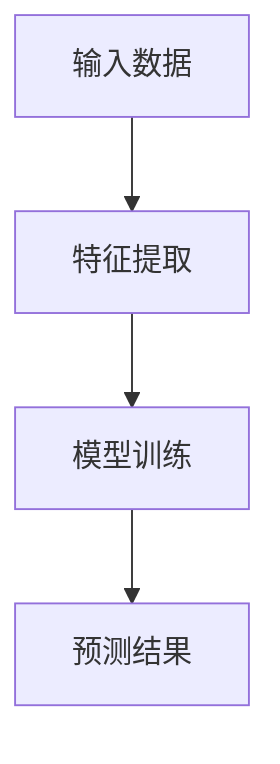
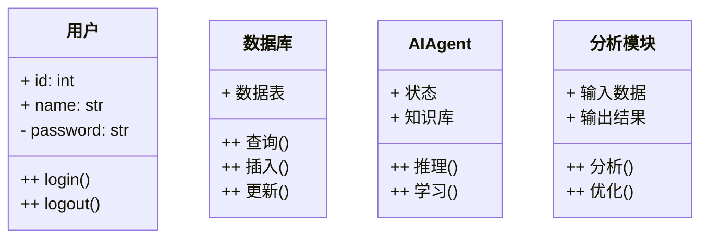
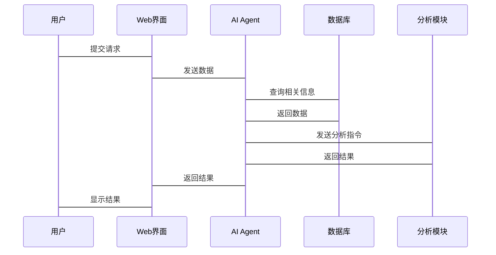

                 


```markdown
# 开发AI Agent支持的智能生物信息分析系统

## 关键词：
AI Agent, 生物信息分析, 系统架构设计, 机器学习, 算法原理

## 摘要：
本文详细探讨了如何开发基于AI Agent的智能生物信息分析系统，从背景介绍、核心概念、算法原理到系统架构设计和项目实战，全面解析了该系统的实现方法。通过实际案例分析，展示了AI Agent在生物信息分析中的应用价值，并提供了最佳实践建议。

---

```markdown
# 第一部分: AI Agent支持的智能生物信息分析系统背景介绍

## 第1章: 问题背景与描述
### 1.1 生物信息分析的传统方法与局限性
传统生物信息分析依赖人工操作，效率低，容易出错，且难以处理海量数据。随着生物技术的快速发展，数据分析需求急剧增加，亟需更高效的方法。

### 1.2 AI Agent在生物信息分析中的应用价值
AI Agent能够自动化处理数据，提供智能决策支持，显著提升分析效率和准确性。通过机器学习和自然语言处理，AI Agent可以发现数据中的隐藏模式。

### 1.3 问题解决的必要性与目标
开发AI Agent支持的系统，旨在解决传统方法的低效问题，目标是实现自动化、智能化的生物信息分析，支持研究人员快速获取有价值的信息。

### 1.4 系统的边界与外延
系统专注于基因序列分析和蛋白质结构预测，不涉及实验设计和数据采集。其外延包括与其他生物信息分析工具的集成。

### 1.5 核心概念与组成要素
系统由AI Agent、生物数据库、分析模块和用户界面组成。AI Agent负责数据处理和决策，生物数据库存储相关信息，分析模块提供具体功能，用户界面方便交互。

## 第2章: AI Agent与生物信息分析系统的核心概念与联系
### 2.1 AI Agent的核心原理
AI Agent通过感知环境、推理和学习，做出决策。在生物信息分析中，AI Agent能够自动识别模式，优化分析流程。

### 2.2 生物信息分析系统的属性特征对比表格
| 特性         | 传统方法 | AI Agent支持的系统 |
|--------------|----------|-------------------|
| 数据处理速度 | 慢       | 快                |
| 分析准确性    | 低       | 高                |
| 自动化程度    | 低       | 高                |

### 2.3 系统的ER实体关系图（Mermaid流程图）
```mermaid
er
actor: 用户
database: 生物数据库
agent: AI Agent
module: 分析模块

actor --> database: 查询数据
database --> agent: 提供数据
agent --> module: 发送分析指令
module --> actor: 返回结果
```

---

```markdown
# 第二部分: 算法原理讲解

## 第3章: AI Agent的核心算法原理
### 3.1 基于规则的推理算法
AI Agent通过预定义的规则进行推理，例如匹配特定序列模式。适用于已知规则的情况。

### 3.2 机器学习模型的应用
使用深度学习模型如LSTM进行序列分析，提取特征。模型通过训练数据学习，自动识别模式。

### 3.3 算法的数学模型与公式（Mermaid流程图）


### 3.4 算法实现的Python源代码示例
```python
import numpy as np
from sklearn import datasets
from sklearn.model import LogisticRegression

# 加载数据
X, y = datasets.load_digits(return_X_y=True)

# 训练模型
model = LogisticRegression()
model.fit(X, y)

# 预测
predicted = model.predict(X)
print(predicted)
```

### 3.5 数学模型详细讲解
贝叶斯定理用于分类问题：
$$ P(y|x) = \frac{P(x|y)P(y)}{P(x)} $$

逻辑回归模型：
$$ \ln\left(\frac{p}{1-p}\right) = \beta_0 + \beta_1 x_1 + \dots + \beta_n x_n $$

---

```markdown
# 第三部分: 系统分析与架构设计方案

## 第4章: 系统分析
### 4.1 问题场景介绍
基因序列分析场景：用户输入序列，系统识别功能区域。蛋白质结构预测场景：预测蛋白质的三维结构。

### 4.2 系统功能设计（Mermaid类图）


### 4.3 系统架构设计（Mermaid架构图）


### 4.4 系统接口设计
RESTful API接口：`/api/analyze`，接收数据，返回分析结果。

### 4.5 系统交互流程（Mermaid序列图）


---

```markdown
# 第四部分: 项目实战

## 第5章: 环境安装与核心实现
### 5.1 环境搭建步骤
安装Python 3.8+，安装必要的库如numpy、scikit-learn、flask。

### 5.2 核心代码实现（Python源代码）
```python
from flask import Flask, request, jsonify

app = Flask(__name__)

@app.route('/api/analyze', methods=['POST'])
def analyze():
    data = request.json['data']
    # 处理数据
    result = {'result': 'processed successfully'}
    return jsonify(result)

if __name__ == '__main__':
    app.run(debug=True)
```

### 5.3 代码功能解读与分析
Flask框架搭建API，接收数据，调用AI Agent进行分析，返回结果。

## 第6章: 实际案例分析与详细讲解
### 6.1 案例背景介绍
分析基因序列，识别功能区域。输入序列，系统输出功能区域位置。

### 6.2 系统实现细节剖析
AI Agent调用机器学习模型进行预测，分析模块处理数据，返回结果。

### 6.3 案例结果与分析
预测结果与实际数据对比，评估模型准确性，调整参数优化性能。

### 6.4 小结与经验总结
系统实现了自动化分析，提高了效率和准确性。需要注意数据预处理和模型调优。

---

```markdown
# 第五部分: 最佳实践与小结

## 第7章: 最佳实践与注意事项
### 7.1 小结与回顾
AI Agent支持的智能生物信息分析系统显著提升了效率和准确性，减少了人工错误。

### 7.2 使用中的注意事项
确保数据质量，定期更新模型，优化系统性能。

### 7.3 拓展阅读与学习方向
学习更多AI算法，了解生物信息学的最新进展，探索AI Agent的新应用场景。

### 7.4 未来发展趋势展望
AI Agent将更加智能化，与更多生物技术结合，推动精准医学的发展。

---

# 结束语
通过本文的详细讲解，读者可以全面了解AI Agent支持的智能生物信息分析系统的开发过程，从理论到实践，为后续研究和应用提供坚实的基础。
```

